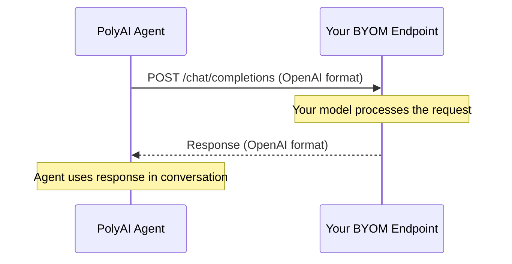

Choose the language model that powers your agent, or connect your own model service.

## Available models

<Tabs>
  <Tab title="PolyAI" icon="brain">
    Our default, proprietary models optimized for voice AI.

    | Model | Best for |
    |-------|----------|
    | **Raven V2** | Battle-tested for live voice conversations with highly accurate knowledge matching |
    | **Raven V3** | Improved grounding, paraphrasing, and robustness for enterprise voice use cases |
    | **Raven V3.5** | All the capabilities of Raven V3, now also tuned for chat interactions |

    <Note>
      Raven V2 and V3 are purpose-built for conversational voice AI and can only be selected in [Voice configuration](/voice/voice-configuration). **Raven V3.5** is also tuned for chat and can be selected in both [Voice configuration](/voice/voice-configuration) and [Chat configuration](/webchat/chat-configuration).
    </Note>
  </Tab>
  <Tab title="OpenAI" icon="wand-magic-sparkles">
    | Model | Best for |
    |-------|----------|
    | **GPT-5.2** | High-quality interactions requiring nuance and strong reasoning |
    | **GPT-5.2 chat** | Extended dialogue and conversational stability |
    | **GPT-5 mini** | Lower latency and reduced cost for mid-complexity use cases |
    | **GPT-5 nano** | Simple tasks and fast-response workloads |
    | **GPT-4o** | Versatile balance of reasoning, speed, and cost |
    | **GPT-4o mini** | Everyday queries and high-volume deployments |
    | **GPT-4.1** | Strong reasoning with improved cross-task performance |
    | **GPT-4.1 mini** | Cost-effective, latency-focused for lighter workloads |
    | **GPT-4.1 nano** | Minimal compute and high throughput |

    See [OpenAI model documentation](https://platform.openai.com/docs/models) for detailed specifications.
  </Tab>
  <Tab title="Amazon Bedrock" icon="aws">
    | Model | Best for |
    |-------|----------|
    | **Claude 3.5 Haiku** | Simple, predictable tasks with strong safety alignment |
    | **Nova Micro** | Efficiency with strong general-purpose performance |

    See [Anthropic Claude docs](https://docs.anthropic.com/) and [Amazon Nova docs](https://docs.aws.amazon.com/ai/responsible-ai/nova-micro-lite-pro/overview.html) for more details.
  </Tab>
</Tabs>

## Configuring the model


<Steps>
  <Step title="Open model settings">
    Navigate to **Channels > Voice > [Voice configuration](/voice/voice-configuration)** or **Channels > Chat > [Chat configuration](/webchat/chat-configuration)** to select the model for each channel.
  </Step>
  <Step title="Select a model">
    Choose the desired model from the dropdown.
  </Step>
  <Step title="Save changes">
    Click **Save** to apply your changes.
  </Step>
</Steps>

<Columns cols={3}>
  <Card title="OpenAI models" icon="link" href="https://platform.openai.com/docs/models">
    Official OpenAI model reference
  </Card>
  <Card title="Anthropic Claude" icon="link" href="https://docs.anthropic.com/">
    Claude model documentation
  </Card>
  <Card title="Amazon Nova" icon="link" href="https://docs.aws.amazon.com/ai/responsible-ai/nova-micro-lite-pro/overview.html">
    Amazon Bedrock model details
  </Card>
</Columns>

## Bring your own model (BYOM)

PolyAI supports **bring-your-own-model (BYOM)** with a simple API integration. If you run your own LLM, expose an endpoint that follows the OpenAI [`chat/completions`](https://platform.openai.com/docs/api-reference/chat/create) schema and PolyAI will treat it like any other provider.



### Overview

<Steps>
  <Step title="Expose an API endpoint">
    Accept and return data in the OpenAI `chat/completions` format.
  </Step>
  <Step title="Configure authentication">
    PolyAI can send either an `x-api-key` header **or** a Bearer token.
  </Step>
  <Step title="Enable streaming (optional)">
    Support streaming responses using `stream: true` for lower latency.
  </Step>
</Steps>

### API endpoint

<Tabs>
  <Tab title="Request format">
    ```json
    {
      "model": "your-model-id",
      "messages": [
        { "role": "system", "content": "You are a helpful assistant." },
        { "role": "user", "content": "What's the weather today?" }
      ],
      "temperature": 0.7,
      "top_p": 1.0,
      "stream": false
    }
    ```

    <Note>
      You might receive extra OpenAI-style fields such as `frequency_penalty`, `presence_penalty`, etc.
    </Note>
  </Tab>
  <Tab title="Response format">
    ```json
    {
      "id": "chatcmpl-abc123",
      "object": "chat.completion",
      "created": 1712345678,
      "model": "your-model-id",
      "choices": [
        {
          "index": 0,
          "message": {
            "role": "assistant",
            "content": "It's sunny today in London."
          },
          "finish_reason": "stop"
        }
      ]
    }
    ```
  </Tab>
  <Tab title="Streaming (SSE)">
    If `stream` is `true`, send Server-Sent Events (SSE) mirroring OpenAI's format:

    ```json
    data: {
      "id": "...",
      "object": "chat.completion.chunk",
      "choices": [{
        "delta": { "content": "Hello" },
        "index": 0,
        "finish_reason": null
      }]
    }

    data: {
      "choices": [{
        "delta": {},
        "index": 0,
        "finish_reason": "stop"
      }]
    }

    data: [DONE]
    ```
  </Tab>
</Tabs>

### Authentication

| Method | Header sent by PolyAI |
|--------|------------------------|
| **API Key** | `x-api-key: YOUR_API_KEY` |
| **Bearer** | `Authorization: Bearer YOUR_TOKEN` |

Configure your server to accept **one** of the above.

### Sample implementation (Python / Flask)

```python
from flask import Flask, request, jsonify
import time, uuid

app = Flask(__name__)

@app.route('/chat/completions', methods=['POST'])
def chat_completions():
    data = request.json
    messages = data.get('messages', [])
    user_input = messages[-1]['content'] if messages else ''

    # TODO: insert your model inference here
    reply = f'You said: {user_input}'

    return jsonify({
        'id': f'chatcmpl-{uuid.uuid4().hex}',
        'object': 'chat.completion',
        'created': int(time.time()),
        'model': 'my-llm',
        'choices': [{
            'index': 0,
            'message': { 'role': 'assistant', 'content': reply },
            'finish_reason': 'stop'
        }]
    })
```

### Final checklist

<Warning>
  Before going live, verify all of the following:
</Warning>

- [ ] Endpoint reachable with **POST**.
- [ ] Request/response match **OpenAI `chat/completions`** schema.
- [ ] Authentication header configured (API Key **or** Bearer token).
- [ ] (Optional) Streaming supported if needed.

**Send to your PolyAI contact:**

- **Endpoint URL**
- **Model ID**
- **Auth method & credential**
