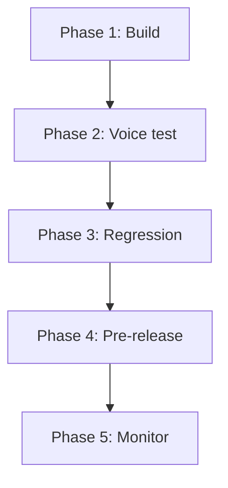

By the end of this page, you will know which testing method to use at each stage of development — from first draft to production monitoring — and how to build a regression safety net using test cases and test sets.

## Testing methods

PolyAI offers four testing methods. Each serves a different purpose in your development workflow.

| Method | Best for | Environment | Code required | Speed |
|---|---|---|---|---|
| **Webchat** | Rapid topic iteration, action debugging | Draft / Sandbox | No | Fastest |
| **In-browser call** | Voice flow testing, TTS tuning, barge-in behavior | Draft / Sandbox | No | Fast |
| **Phone call** | Production-like end-to-end testing | Sandbox / Pre-release | No | Moderate |
| **Test suite** | Automated regression testing across changes | Draft / Sandbox | No | Batch |

### Webchat

Open the webchat panel from the agent main page. Type messages to test topic retrieval, action triggers, and function calls. The chat panel shows tool calls and topic citations alongside the conversation.

**When to use:** Every time you edit a managed topic, rule, or function. This is your fastest feedback loop.

### In-browser call

Click the phone icon in the top-right corner of Agent Studio. Select an environment and start speaking. This tests the full voice pipeline: ASR, LLM, and TTS.

**When to use:** After webchat testing passes, before committing to a phone test. Test voice-specific concerns like pronunciation, barge-in, and response pacing.

### Phone call

Assign a phone number to your Sandbox or Pre-release environment (see [Numbers](/telephony/introduction)) and call it. This tests the complete production path including telephony routing.

**When to use:** Before promoting to Live. This catches issues that only appear over a real phone connection — audio quality, latency under load, and SIP routing.

### Test suite

Save conversations as test cases, group them into test sets, and re-run them automatically against Draft or Sandbox. Results show pass/fail counts and trend charts.

**When to use:** After every significant change. Test suites catch regressions that manual testing misses — a fix to one topic silently breaking another.

## Recommended workflow

Follow this phased approach as you develop and maintain your agent:

### Phase 1: Build and iterate (webchat)

Use webchat after every change to managed topics, rules, or functions.

<Steps>
  <Step title="Edit a topic, rule, or function">
    Make your change in Agent Studio.
  </Step>
  <Step title="Test in webchat">
    Open the chat panel and test the specific change. Check topic citations and tool calls in the diagnosis panel.
  </Step>
  <Step title="Test adjacent topics">
    Verify that similar topics still retrieve correctly — overlapping sample questions are a common source of regressions.
  </Step>
</Steps>

### Phase 2: Voice testing (in-browser call)

Once webchat tests pass, test the voice experience.

- Verify pronunciation of key terms and brand names
- Test barge-in behavior — can callers interrupt the agent mid-sentence?
- Check response pacing — are answers too long to listen to comfortably?
- Test with different accents and speaking styles if your agent serves diverse callers

### Phase 3: Regression testing (test suite)

Build a test suite that covers your critical paths.

<Steps>
  <Step title="Save test cases from real conversations">
    In [conversation review](/analytics/conversations/review), click the test-tube icon to save a conversation as a test case. Name it descriptively (e.g., "Caller cancels booking" not "Test 1").
  </Step>
  <Step title="Group cases into focused sets">
    Create test sets by feature area: "Payments," "Shipping," "Escalations." A case can belong to multiple sets.
  </Step>
  <Step title="Run sets after every change">
    Go to **Build > Test suite > Test Sets**, select a set, and run it against Draft or Sandbox. Review pass/fail counts and investigate failures.
  </Step>
</Steps>

<Tip>
Start with 5-10 test cases covering your most important flows. Expand the suite over time by saving cases from conversations where the agent behaved incorrectly — this turns real bugs into permanent regression tests.
</Tip>

### Phase 4: Pre-release validation (phone call)

Before promoting to Live:

1. Call your Pre-release phone number and run through the full conversation paths
2. Test failure cases — what happens when an API is down, a lookup returns no results, or the caller asks something unexpected?
3. Test handoffs — verify calls route correctly and the receiving agent gets the right context
4. Run your complete test suite one final time against the Pre-release version

### Phase 5: Production monitoring

After promoting to Live, monitor ongoing quality:

- Review conversations in [conversation review](/analytics/conversations/review) — focus on low-scoring calls and handoff reasons
- Track metrics in [dashboards](/analytics/dashboards/introduction) — containment rate, latency, handoff rate
- Use [Smart Analyst](/smart-analyst/introduction) to investigate trends across hundreds of conversations
- Set up [alerts](/api-reference/alerts/introduction) for latency spikes, function errors, and call crashes
- Save failing conversations as new test cases to expand your regression suite

## Creating and managing test cases

### Save from a conversation

Click the **Create test** button (test-tube icon) in the chat panel or from a transcript in [conversation review](/analytics/conversations/introduction). Name the case and save it.

### Edit parameters

Each test case stores the function call values from the original conversation. Edit these to test variations without creating a new case — for example, change a date, customer ID, or party size.

### Create test sets

Go to **Build > Test suite > Test Sets** and select **New set**. Give it a name and add cases from the picker. A case can belong to more than one set.

### Run tests

<Tabs>
  <Tab title="Single case">
    1. Open the case in **Test Cases**
    2. Choose **Draft** or **Sandbox**
    3. Select **Run**

    
  </Tab>
  <Tab title="Test set">
    1. Open the set in **Test Sets** and select **Run set**
    2. Choose **Draft** or **Sandbox**
    3. Start the run

    The set displays pass/fail counts and trend charts.

    
  </Tab>
</Tabs>

### Review results

After a run, each case shows **Outcome** and **Last run**. For sets, check **pass/fail counts** and **trend charts** across multiple runs to spot regressions over time.

If a previously passing test fails, review the transcript. Common causes:
- Knowledge base topic changes that altered routing
- Function logic updates that changed return values
- Flow modifications that skipped or reordered steps

## Best practices

- **Name cases descriptively** — "Caller cancels booking" not "Test 1"
- **Create focused sets** — group by feature area so failures point to the right place
- **Cover happy paths and edge cases** — include success flows and failure scenarios
- **Re-run after knowledge base changes** — topic edits can silently break other flows
- **Save cases from real conversations** — turn real bugs into permanent regression tests
- **Run before every promotion** — test in Draft first, then Sandbox, then Pre-release

## Related pages

<CardGroup cols={3}>
  <Card title="Conversation review" icon="magnifying-glass" href="/analytics/conversations/review">
    Save test cases directly from transcripts
  </Card>
  <Card title="Conversation diagnosis" icon="stethoscope" href="/analytics/conversations/diagnosis">
    Debug function calls, latency, and topic retrieval
  </Card>
  <Card title="Alerts API" icon="bell" href="/api-reference/alerts/introduction">
    Automated monitoring for latency, errors, and volume
  </Card>
</CardGroup>
