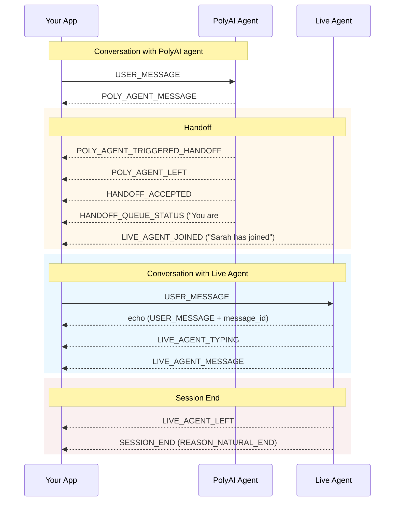
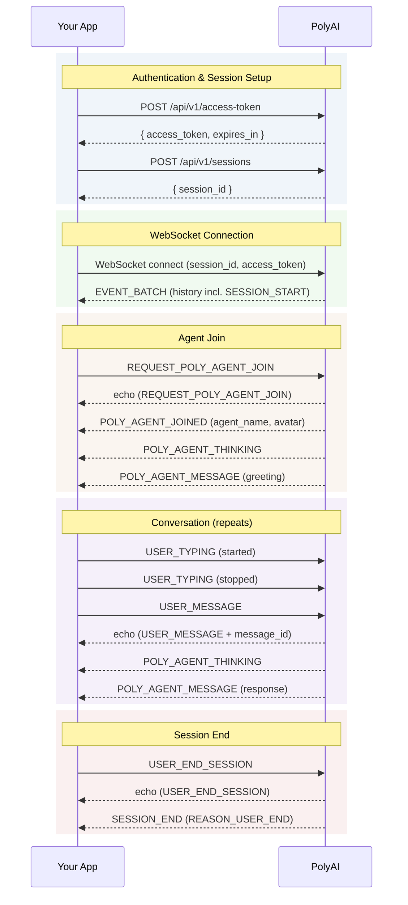

A handoff transfers the conversation from the PolyAI agent to a human agent. This happens automatically when the PolyAI agent determines it cannot handle the user's request.

There are two handoff modes: **server-managed** (PolyAI handles routing internally) and **client-managed** (your app handles routing).

## Server-managed handoff

In the typical flow, PolyAI manages the handoff internally:

```
  ← POLY_AGENT_TRIGGERED_HANDOFF     The agent wants to hand off
  ← POLY_AGENT_LEFT                  The agent leaves the session
  ← HANDOFF_ACCEPTED                 The live agent system accepted the request
  ← HANDOFF_QUEUE_STATUS             (periodic) User is #3 in the queue
  ← LIVE_AGENT_JOINED                A human agent has connected
     ... user and human agent chat ...
  ← LIVE_AGENT_LEFT                  The human agent leaves
  ← SESSION_END                      Session is over
```

During the handoff, the user continues to send `EVENT_TYPE_USER_MESSAGE` events — the messages are routed to the live agent instead of the PolyAI agent.



## Client-managed handoff

In some configurations, the server cannot handle the handoff and asks your client to do it:

```
  ← POLY_AGENT_TRIGGERED_HANDOFF     The agent wants to hand off
  ← CLIENT_HANDOFF_REQUIRED          Your client needs to handle this
  ← POLY_AGENT_LEFT                  The agent leaves the session
```

When you receive `CLIENT_HANDOFF_REQUIRED`, redirect the user to the appropriate support channel (e.g. open a Zendesk widget, redirect to a phone number). The `reason` and `queue_name` fields give context for routing.

| Field | Description |
|-------|-------------|
| `reason` | `COMPLEX_QUERY`, `AGENT_DECISION`, or `POLICY` |
| `queue_name` | Suggested routing destination |

## Failed handoffs

| Event | Meaning | What to do |
|-------|---------|------------|
| `EVENT_TYPE_HANDOFF_FAILED` | The live agent system rejected or could not complete the handoff | Show an error and let the user try again or end the session |
| `EVENT_TYPE_HANDOFF_TIMEOUT` | The user waited too long in the queue | Show a timeout message and offer alternative support channels |

See [Server events → Handoff events](/api-reference/messaging/events-receive#handoff-events) for the full event payloads.

## Conversation flow (full session)


