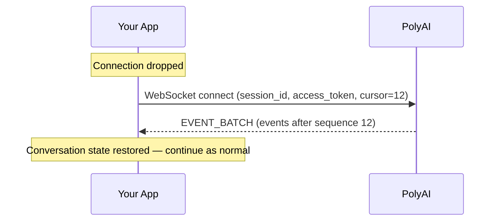

This page lists every event in order for a complete session — what your client sends and what it receives.

## Connection and agent join

| Step | Direction | Event | What to do |
|------|-----------|-------|------------|
| 1 | ← Server | `EVENT_TYPE_EVENT_BATCH` | History replay. Flatten the `events` array. Contains at least `SESSION_START`. |
| 2 | | ↳ `EVENT_TYPE_SESSION_START` | Read `capabilities` (streaming, heartbeat interval). |
| 3 | Client → | `EVENT_TYPE_REQUEST_POLY_AGENT_JOIN` | Send to start the conversation. **New sessions only** — skip on reconnect if agent already joined. |
| 4 | ← Server | `EVENT_TYPE_REQUEST_POLY_AGENT_JOIN` | Echo of your join request. |
| 5 | ← Server | `EVENT_TYPE_POLY_AGENT_JOINED` | Agent has joined. Read `agent_name` and `agent_avatar_url` for your UI. |
| 6 | ← Server | `EVENT_TYPE_POLY_AGENT_THINKING` | Show a typing indicator. |
| 7 | ← Server | `EVENT_TYPE_POLY_AGENT_MESSAGE` | The agent's greeting. (If streaming: `POLY_AGENT_MESSAGE_CHUNK` events instead.) |

## Conversation turn (repeats)

| Step | Direction | Event | What to do |
|------|-----------|-------|------------|
| 8 | Client → | `EVENT_TYPE_USER_TYPING` (`STARTED`) | Optional. Send when the user begins typing. |
| 9 | Client → | `EVENT_TYPE_USER_TYPING` (`STOPPED`) | Optional. Send when the user stops typing. |
| 10 | Client → | `EVENT_TYPE_USER_MESSAGE` | Send the user's message. |
| 11 | ← Server | `EVENT_TYPE_USER_MESSAGE` | Echo with server-assigned `message_id`. Confirms receipt. |
| 12 | ← Server | `EVENT_TYPE_POLY_AGENT_THINKING` | Show typing indicator. |
| 13 | ← Server | `EVENT_TYPE_POLY_AGENT_MESSAGE` | The agent's response. (If streaming: `POLY_AGENT_MESSAGE_CHUNK` events instead.) |

## Handoff to live agent (if triggered)

| Step | Direction | Event | What to do |
|------|-----------|-------|------------|
| 14 | ← Server | `EVENT_TYPE_POLY_AGENT_TRIGGERED_HANDOFF` | Inform the user they're being connected to a human. |
| 15 | ← Server | `EVENT_TYPE_POLY_AGENT_LEFT` | The PolyAI agent has left. |
| 16 | ← Server | `EVENT_TYPE_HANDOFF_ACCEPTED` | The live agent system accepted the request. |
| 17 | ← Server | `EVENT_TYPE_HANDOFF_QUEUE_STATUS` | Periodic. Show queue position (e.g. "You're #3 in line"). |
| 18 | ← Server | `EVENT_TYPE_LIVE_AGENT_JOINED` | A human agent has connected. Show their name. |
| 19 | Client → | `EVENT_TYPE_USER_MESSAGE` | User messages are now routed to the human agent. |
| 20 | ← Server | `EVENT_TYPE_LIVE_AGENT_TYPING` | Show typing indicator. |
| 21 | ← Server | `EVENT_TYPE_LIVE_AGENT_MESSAGE` | Message from the human agent. |
| 22 | ← Server | `EVENT_TYPE_LIVE_AGENT_LEFT` | The human agent has left. |

## Session end

| Direction | Event | What to do |
|-----------|-------|------------|
| Client → | `EVENT_TYPE_USER_END_SESSION` | User clicks "Leave". |
| ← Server | `EVENT_TYPE_USER_END_SESSION` | Echo confirming receipt. |
| ← Server | `EVENT_TYPE_SESSION_END` (`REASON_USER_END`) | Session over. Disable input, close WebSocket. |

## Alternative endings

| Scenario | What happens |
|----------|--------------|
| **User closes browser** | No more heartbeats → session times out after ~10 minutes → `SESSION_END` with `REASON_USER_ABANDONED` |
| **Conversation completes naturally** | Agent finishes → `SESSION_END` with `REASON_NATURAL_END` |
| **Client-managed handoff** | Server sends `CLIENT_HANDOFF_REQUIRED` instead of `HANDOFF_ACCEPTED` — your app routes the user to an alternative channel |
| **Handoff fails** | `HANDOFF_FAILED` or `HANDOFF_TIMEOUT` — show an error and let the user try again or end the session |
| **Connection drops** | Reconnect with `cursor=<last_sequence>` using the same `session_id` and `access_token` |

## Background (send throughout)

| Direction | Event | Frequency |
|-----------|-------|-----------|
| Client → | `EVENT_TYPE_HEARTBEAT` | Every 30 seconds (or per `capabilities.heartbeat_interval_seconds`) |
| ← Server | `EVENT_TYPE_HEARTBEAT` | Echo of your heartbeat |

## Reconnection flow

