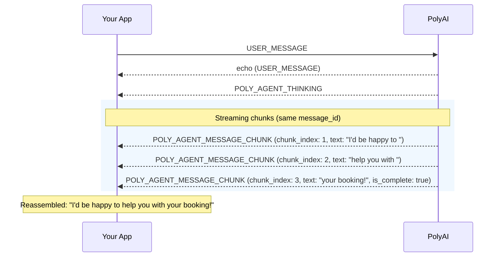

When `streaming_enabled` is `true` on session creation, agent responses arrive incrementally as `EVENT_TYPE_POLY_AGENT_MESSAGE_CHUNK` events instead of a single `EVENT_TYPE_POLY_AGENT_MESSAGE`. This lets you display the response as it's generated.

## Chunk format

```json
{
  "type": "EVENT_TYPE_POLY_AGENT_MESSAGE_CHUNK",
  "payload": {
    "message_id": "msg_abc123",
    "text": "I'd be happy to ",
    "attachments": [],
    "response_suggestions": [],
    "chunk_index": 1,
    "is_complete": false
  }
}
```

| Field | Type | Description |
|-------|------|-------------|
| `message_id` | string | Same across all chunks of one message — use this to group them |
| `text` | string | A fragment of text to append to the message |
| `attachments` | array | Attachment(s) to append to the attachment list |
| `response_suggestions` | array | Suggestion(s) to append to the suggestions list |
| `chunk_index` | integer | 1-based index. Process chunks in this order. |
| `is_complete` | boolean | `true` on the final chunk — the message is now complete |

## Reassembling chunks

To reconstruct the full message, concatenate `text` and append `attachments` / `response_suggestions` from each chunk in order:

| Chunk | Received | Accumulated message |
|-------|----------|---------------------|
| 1 | `text: "Hello "`, `attachments: [A1]`, `suggestions: [S1]` | `text: "Hello "`, `attachments: [A1]`, `suggestions: [S1]` |
| 2 | `text: "there, "`, `attachments: []`, `suggestions: []` | `text: "Hello there, "`, `attachments: [A1]`, `suggestions: [S1]` |
| 3 | `text: "how can I help?"`, `is_complete: true` | `text: "Hello there, how can I help?"`, `attachments: [A1]`, `suggestions: [S1]` |

<Note>
The final chunk (`is_complete: true`) may have empty `text`. It signals that the message is complete and may carry attachments or response suggestions that were only available after the full response was generated.
</Note>

## Example: handling chunks in JavaScript

```javascript
const streamingMessages = {};

function handleChunk(payload) {
  const { message_id, text, attachments, response_suggestions, chunk_index, is_complete } = payload;

  if (!streamingMessages[message_id]) {
    streamingMessages[message_id] = { text: "", attachments: [], suggestions: [] };
  }

  const msg = streamingMessages[message_id];
  msg.text += text;
  msg.attachments.push(...attachments);
  msg.suggestions.push(...response_suggestions);

  updateMessageInUI(message_id, msg);

  if (is_complete) {
    finalizeMessageInUI(message_id, msg);
    delete streamingMessages[message_id];
  }
}
```

## Streaming flow


