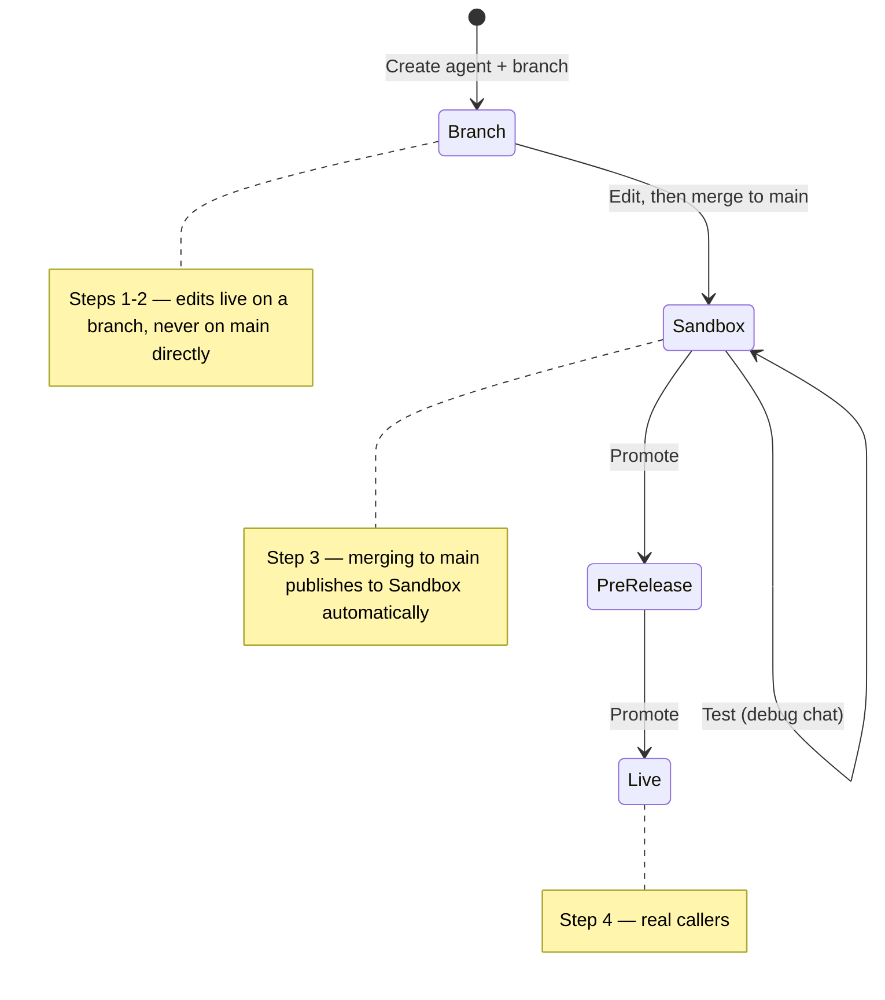

This guide builds an agent from scratch through the API alone — no flow-building in the Agent Studio UI. By the end you'll have created an agent, given it a behavior and a knowledge base topic, held a test conversation with it, and promoted it to production.

Every step below has a **curl** and a **Python** tab. The Python snippets run top to bottom as one script — each reuses variables (`agent_id`, `branch_id`, …) set by the step before — so copy them in order.

For an overview of the API families, see the [API overview](/api-reference/introduction). This page uses the [Agents](/api-reference/agents/introduction) API to build and ship, and the [Debug Chat](/api-reference/debug-chat/introduction) API to test — the same API key and host work for both.

<div style={{
  display: 'grid',
  gridTemplateColumns: 'repeat(auto-fit, minmax(180px, 1fr))',
  gap: '1rem',
  margin: '1.5rem 0 2rem',
}}>
{[
  { icon: 'key', value: '1', label: 'API key needed', color: '#4a7c10', bg: 'linear-gradient(160deg, rgba(74, 124, 16, 0.07), rgba(74, 124, 16, 0.01))', border: 'rgba(74, 124, 16, 0.18)' },
  { icon: 'list-ol', value: '4', label: 'Steps to production', color: '#386dbf', bg: 'linear-gradient(160deg, rgba(56, 109, 191, 0.07), rgba(56, 109, 191, 0.01))', border: 'rgba(56, 109, 191, 0.2)' },
  { icon: 'globe', value: '4', label: 'Regions available', color: '#b45a1e', bg: 'linear-gradient(160deg, rgba(180, 90, 30, 0.08), rgba(180, 90, 30, 0.01))', border: 'rgba(180, 90, 30, 0.2)' },
].map((s) => (
  <div key={s.label} style={{
    display: 'flex',
    alignItems: 'center',
    gap: '0.9rem',
    padding: '1rem 1.2rem',
    borderRadius: '16px',
    border: `1px solid ${s.border}`,
    background: s.bg,
  }}>
    <div style={{
      width: '44px',
      height: '44px',
      borderRadius: '12px',
      background: s.color,
      display: 'flex',
      alignItems: 'center',
      justifyContent: 'center',
      flexShrink: 0,
    }}>
      <Icon icon={s.icon} iconType="solid" size={18} color="#fff" />
    </div>
    <div>
      <div style={{ fontSize: '1.4rem', fontWeight: 700, color: '#1f2937', lineHeight: 1.15 }}>{s.value}</div>
      <div style={{ fontSize: '0.82rem', color: '#6b7280' }}>{s.label}</div>
    </div>
  </div>
))}
</div>

## What you'll build

<CardGroup cols={3}>
  <Card title="1. Create" icon="hammer" href="#step-1-create-an-agent">
    Stand up a new agent with a greeting.
  </Card>
  <Card title="2. Configure" icon="sliders" href="#step-2-configure-it">
    Branch, add a behavior and a knowledge base topic, then merge.
  </Card>
  <Card title="3. Test" icon="flask-vial" href="#step-3-test-it">
    Hold a live conversation with it in Sandbox.
  </Card>
  <Card title="4. Deploy" icon="rocket" href="#step-4-deploy-it">
    Promote through Pre-release into Live traffic.
  </Card>
  <Card title="5. Observe" icon="database" href="#step-5-work-with-the-calls-it-takes">
    Pull back the conversations it has.
  </Card>
</CardGroup>



## Prerequisites

<Steps>
  <Step title="Get access to a PolyAI workspace">
    You build agents inside a PolyAI workspace, so you need access to one first.

    - **Enterprise customers** — PolyAI provisions your workspace during onboarding; your PolyAI representative sets it up and grants you access. Enterprise workspaces are region-specific (US, UK, or EU).
    - **Getting started via the website** — sign up at [poly.ai](https://poly.ai) to create a self-serve workspace, which lives in the Studio region.
  </Step>

  <Step title="Get an API key">
    Create a **workspace-scoped API key** from the **API Keys** tab on your workspace homepage in Agent Studio (see [API keys](/secrets/api-keys)). Copy the value when it's shown — the full key only appears once. The same key authenticates the Agents API and the Data API's debug chat — everything through step 4 of this guide.

    - Step 5 (pulling call data back out) uses the [Conversations v3](/api-reference/conversations/introduction) API, which needs a separate project-scoped key. The [Chat API](/api-reference/chat/introduction) needs its own connector token too. Request either only once you're integrating a real channel or data pipeline — you don't need them for steps 1–4.

    Treat the key like a password. Don't commit it or put it in client-side code.
  </Step>

  <Step title="Find your account ID">
    Open Agent Studio. Your account ID is the first path segment in the URL:

    ```
    https://studio.{region}.poly.ai/{account_id}/{project_id}/agent
    ```

    For example, `https://studio.uk.poly.ai/acme-uk/acme-team-4/agent` → `account_id=acme-uk`.

    <Note>
    **"Account ID" and "Workspace ID" are the same thing.** Agent Studio's UI calls this the **Workspace ID** and shows it in a prefixed form (`ws-xxxxxxxx`). The API parameter is named `accountId` (Agents and Data APIs) or `account_id` (Conversations, Chat, Webhooks, and most other APIs) — same value, different casing convention depending on which API family you're calling. Both the slug form from the URL (`acme-uk`) and the prefixed form (`ws-xxxxxxxx`) work in API calls.
    </Note>
  </Step>

  <Step title="Pick the right base URL">
    The Agents and Data APIs — everything in steps 1–4 of this guide — share one regional host family:

    | Region | Base URL                     |
    | ------ | ----------------------------- |
    | US     | `https://api.us.poly.ai`      |
    | UK     | `https://api.uk.poly.ai`      |
    | EU     | `https://api.eu.poly.ai`      |
    | Studio | `https://api.studio.poly.ai`  |

    <Warning>
    The Conversations v3 API (used in step 5) is on a *different* host — `api.{region}-1.platform.polyai.app`, with a `-1` suffix. Mixing these up is the most common cause of `404`s. See [base URLs](/api-reference/introduction#pick-your-region) for the full table across every API family.
    </Warning>
  </Step>

  <Step title="Set environment variables">
    ```bash
    export POLYAI_API_KEY="your_api_key_here"
    export POLYAI_BASE_URL="https://api.us.poly.ai"
    export POLYAI_ACCOUNT_ID="ws-xxxxxxxx"
    ```

    All examples below assume these are set.
  </Step>
</Steps>

## Step 1: Create an agent

<CodeGroup>

```bash curl
curl -X POST "$POLYAI_BASE_URL/v1/accounts/$POLYAI_ACCOUNT_ID/agents" \
  -H "x-api-key: $POLYAI_API_KEY" \
  -H "Content-Type: application/json" \
  -d '{
    "name": "Support Agent",
    "responseSettings": {
      "greeting": "Hi, thanks for calling Acme Corp. How can I help?"
    }
  }'
```

```python Python
import os
import requests

base_url = os.environ["POLYAI_BASE_URL"]
account_id = os.environ["POLYAI_ACCOUNT_ID"]
headers = {"x-api-key": os.environ["POLYAI_API_KEY"]}

response = requests.post(
    f"{base_url}/v1/accounts/{account_id}/agents",
    headers=headers,
    json={
        "name": "Support Agent",
        "responseSettings": {
            "greeting": "Hi, thanks for calling Acme Corp. How can I help?",
        },
    },
)
response.raise_for_status()
agent_id = response.json()["agentId"]
print(agent_id)
```

</CodeGroup>

**Response**

```json
{
  "accountId": "ws-xxxxxxxx",
  "agentId": "PROJECT-58RP822I",
  "agentName": "Support Agent",
  "createdAt": "2026-07-02T10:00:00.000Z",
  "updatedAt": "2026-07-02T10:00:00.000Z",
  "branchCount": 1
}
```

Save `agentId` — every remaining call in this guide uses it. The agent starts with one branch, `main`.

```bash
export POLYAI_AGENT_ID="PROJECT-58RP822I"  # use the agentId from your response
```

## Step 2: Configure it

You can't edit `main` directly — the API rejects writes to it with `422 Cannot directly update main branch`. Instead, create a **working branch**, make your edits there, then merge it back into `main`. This is the same branch-and-merge model Agent Studio and Studio Assistant use.

**Create a working branch:**

<CodeGroup>

```bash curl
curl -X POST "$POLYAI_BASE_URL/v1/agents/$POLYAI_AGENT_ID/branches" \
  -H "x-api-key: $POLYAI_API_KEY" \
  -H "Content-Type: application/json" \
  -d '{ "branchName": "quickstart" }'
```

```python Python
response = requests.post(
    f"{base_url}/v1/agents/{agent_id}/branches",
    headers=headers,
    json={"branchName": "quickstart"},
)
response.raise_for_status()
branch_id = response.json()["branchId"]
print(branch_id)
```

</CodeGroup>

The response returns the branch's ID — save it, every edit below targets it:

```json
{ "branchId": "BRANCH-F9F1WNN8", "sequenceId": "1" }
```

```bash
export POLYAI_BRANCH_ID="BRANCH-F9F1WNN8"  # use the branchId from your response
```

### Set the behavior

The behavior is the system prompt that governs how the agent responds.

<CodeGroup>

```bash curl
curl -X PATCH "$POLYAI_BASE_URL/v1/agents/$POLYAI_AGENT_ID/branches/$POLYAI_BRANCH_ID/behavior" \
  -H "x-api-key: $POLYAI_API_KEY" \
  -H "Content-Type: application/json" \
  -d '{
    "behavior": "You are a friendly, concise support agent for Acme Corp. Answer questions using the knowledge base. If you cannot help, offer to hand off to a human agent."
  }'
```

```python Python
requests.patch(
    f"{base_url}/v1/agents/{agent_id}/branches/{branch_id}/behavior",
    headers=headers,
    json={
        "behavior": "You are a friendly, concise support agent for Acme Corp. "
        "Answer questions using the knowledge base. If you cannot help, "
        "offer to hand off to a human agent.",
    },
).raise_for_status()
```

</CodeGroup>

### Add a knowledge base topic

Topics are what the agent draws on to answer questions — each one pairs content with example queries that should trigger it.

<CodeGroup>

```bash curl
curl -X POST "$POLYAI_BASE_URL/v1/agents/$POLYAI_AGENT_ID/branches/$POLYAI_BRANCH_ID/knowledge-base/topics" \
  -H "x-api-key: $POLYAI_API_KEY" \
  -H "Content-Type: application/json" \
  -d '{
    "name": "Password reset",
    "content": "Users can reset their password at acme.com/reset. Resets take effect immediately and any active sessions are logged out.",
    "exampleQueries": {
      "queries": ["How do I reset my password?", "I forgot my password"]
    }
  }'
```

```python Python
requests.post(
    f"{base_url}/v1/agents/{agent_id}/branches/{branch_id}/knowledge-base/topics",
    headers=headers,
    json={
        "name": "Password reset",
        "content": "Users can reset their password at acme.com/reset. Resets take "
        "effect immediately and any active sessions are logged out.",
        "exampleQueries": {
            "queries": ["How do I reset my password?", "I forgot my password"],
        },
    },
).raise_for_status()
```

</CodeGroup>

See [Knowledge base](/api-reference/agents/endpoint/knowledge-base/create-knowledge-base-topic) for the full schema, including `actions` and `isActive`.

### Merge the branch into `main`

Merging applies the branch's edits to `main` **and publishes them to Sandbox in one step** — there's no separate publish call.

<CodeGroup>

```bash curl
curl -X POST "$POLYAI_BASE_URL/v1/agents/$POLYAI_AGENT_ID/branches/$POLYAI_BRANCH_ID/merge" \
  -H "x-api-key: $POLYAI_API_KEY" \
  -H "Content-Type: application/json" \
  -d '{ "deploymentMessage": "Initial support agent" }'
```

```python Python
response = requests.post(
    f"{base_url}/v1/agents/{agent_id}/branches/{branch_id}/merge",
    headers=headers,
    json={"deploymentMessage": "Initial support agent"},
)
response.raise_for_status()
print(response.json()["message"])
```

</CodeGroup>

```json
{ "sequence": "2", "message": "Branch merged to main and deployed to sandbox", "testRunIds": [] }
```

## Step 3: Test it

Your merge in step 2 already published to Sandbox, so the agent is live there and ready to talk. Hold a test conversation using the [Debug Chat API](/api-reference/debug-chat/introduction) — it authenticates with the same key and host as the Agents API, so there's no extra credential to request.

<Note>
**Edits reach an environment only when you merge or promote into it.** If debug chat replies with stale behavior, you edited the branch but haven't merged it to `main`. Merge again to push the change into Sandbox.
</Note>

<Tip>
Prefer a UI? Agent Studio has a built-in **Test** panel that talks to a branch directly, no merge required — see [Test your agent](/environments-and-versions/introduction#testing-your-agent).
</Tip>

**Start a session:**

<CodeGroup>

```bash curl
curl -X POST "$POLYAI_BASE_URL/v1/agents/$POLYAI_AGENT_ID/debug-chat" \
  -H "x-api-key: $POLYAI_API_KEY" \
  -H "Content-Type: application/json" \
  -d '{ "clientEnv": "sandbox" }'
```

```python Python
response = requests.post(
    f"{base_url}/v1/agents/{agent_id}/debug-chat",
    headers=headers,
    json={"clientEnv": "sandbox"},
)
response.raise_for_status()
conversation_id = response.json()["conversationId"]
print(response.json()["response"])  # the greeting
```

</CodeGroup>

```json
{
  "conversationId": "AS_CHAT_106b4f9a-2541-4924-9ea1-fe5ced3c1eec",
  "userInput": "",
  "response": "Hi, thanks for calling Acme Corp. How can I help?",
  "metadata": { "citedTopic": "", "retrievedTopics": [], "nodeTrace": [] },
  "conversationEnded": false,
  "delayedResponse": false
}
```

(`metadata` has more fields than shown — trimmed here for readability. The `conversationId` is an `AS_CHAT_…` string; the curl examples below hard-code the one from this response — swap in your own.)

**Send a message** — try the knowledge base topic you just added:

<CodeGroup>

```bash curl
curl -X POST "$POLYAI_BASE_URL/v1/agents/$POLYAI_AGENT_ID/debug-chat/AS_CHAT_106b4f9a-2541-4924-9ea1-fe5ced3c1eec" \
  -H "x-api-key: $POLYAI_API_KEY" \
  -H "Content-Type: application/json" \
  -d '{
    "clientEnv": "sandbox",
    "message": "I forgot my password"
  }'
```

```python Python
response = requests.post(
    f"{base_url}/v1/agents/{agent_id}/debug-chat/{conversation_id}",
    headers=headers,
    json={"clientEnv": "sandbox", "message": "I forgot my password"},
)
response.raise_for_status()
body = response.json()
print(body["response"])
print(body["metadata"]["retrievedTopics"])  # ['Password reset']
```

</CodeGroup>

The agent answers from the topic you added:

```json
{
  "conversationId": "AS_CHAT_106b4f9a-2541-4924-9ea1-fe5ced3c1eec",
  "response": "No problem — you can reset your password at acme.com/reset. It takes effect immediately and any active sessions are logged out.",
  "metadata": { "retrievedTopics": ["Password reset"] },
  "conversationEnded": false
}
```

To confirm the topic was actually used, check `metadata.retrievedTopics` — it lists the knowledge base topics the agent pulled in (`["Password reset"]` here), a more reliable signal than scanning the reply text for `acme.com/reset`. Keep sending messages against the same `conversationId` to continue the conversation, matching `clientEnv` to whichever environment you're checking.

<Note>
Building a real webchat, SMS, or in-app integration instead of a one-off test? Use the [Chat API](/api-reference/chat/introduction) — it's built for driving conversations from an end-user-facing client and requires its own connector token.
</Note>

## Step 4: Deploy it

Sandbox is for testing, not customer traffic. Promote the Sandbox deployment through Pre-release and into Live — that's what real callers hit. See [Environments](/environments-and-versions/introduction) for the full model.

Promotion works on a deployment ID, and the merge in step 2 didn't return one — so fetch the active Sandbox deployment first:

<CodeGroup>

```bash curl
curl -X GET "$POLYAI_BASE_URL/v1/agents/$POLYAI_AGENT_ID/deployments/active" \
  -H "x-api-key: $POLYAI_API_KEY"
```

```python Python
response = requests.get(
    f"{base_url}/v1/agents/{agent_id}/deployments/active",
    headers=headers,
)
response.raise_for_status()
deployment_id = response.json()["activeDeployments"]["sandbox"]["id"]
print(deployment_id)
```

</CodeGroup>

```json
{
  "activeDeployments": {
    "sandbox":     { "id": "019f380c-4235-7ea5-8426-1edf249cd6f3", "environment": "sandbox" },
    "pre-release": null,
    "live":        null
  }
}
```

```bash
export POLYAI_DEPLOYMENT_ID="019f380c-4235-7ea5-8426-1edf249cd6f3"  # activeDeployments.sandbox.id
```

Then promote it up the chain. Each promote returns a **new** deployment under `deployment.id` for the target environment — feed that into the next call:

<CodeGroup>

```bash curl
# sandbox -> pre-release
curl -X POST "$POLYAI_BASE_URL/v1/agents/$POLYAI_AGENT_ID/deployments/$POLYAI_DEPLOYMENT_ID/promote" \
  -H "x-api-key: $POLYAI_API_KEY" \
  -H "Content-Type: application/json" \
  -d '{ "targetEnvironment": "pre-release" }'

# take deployment.id from the response above:
export POLYAI_PRERELEASE_DEPLOYMENT_ID="..."

# pre-release -> live
curl -X POST "$POLYAI_BASE_URL/v1/agents/$POLYAI_AGENT_ID/deployments/$POLYAI_PRERELEASE_DEPLOYMENT_ID/promote" \
  -H "x-api-key: $POLYAI_API_KEY" \
  -H "Content-Type: application/json" \
  -d '{ "targetEnvironment": "live" }'
```

```python Python
# sandbox -> pre-release
response = requests.post(
    f"{base_url}/v1/agents/{agent_id}/deployments/{deployment_id}/promote",
    headers=headers,
    json={"targetEnvironment": "pre-release"},
)
response.raise_for_status()
pre_release_id = response.json()["deployment"]["id"]

# pre-release -> live
requests.post(
    f"{base_url}/v1/agents/{agent_id}/deployments/{pre_release_id}/promote",
    headers=headers,
    json={"targetEnvironment": "live"},
).raise_for_status()
```

</CodeGroup>

Omit `targetEnvironment` and the promote defaults to the next stage in sequence (sandbox → pre-release → live). A Sandbox deployment can also promote straight to `live` — going through Pre-release first is a safety choice, not an API requirement.

Made a mistake? [Roll back](/api-reference/agents/endpoint/deployments/rollback-to-a-previous-deployment) to the previous deployment in any environment.

## Step 5: Work with the calls it takes

Once your agent is live (or you've made test calls), pull the data back with the [Conversations API](/api-reference/conversations/introduction). This uses a different host and a project-scoped key — see [prerequisites](#prerequisites) above.

<Note>
The `project_id` this API expects is the same value as the `agentId` you've used throughout this guide — "Agent" and "Project" are the current and legacy names for the same resource.
</Note>

This is the one step on the `-1.platform.polyai.app` host with its own project-scoped key, so set that key first:

```bash
export POLYAI_CONVERSATIONS_API_KEY="your_conversations_api_key_here"
```

<CodeGroup>

```bash curl
curl -X GET \
  "https://api.us-1.platform.polyai.app/v3/$POLYAI_ACCOUNT_ID/$POLYAI_AGENT_ID/conversations?limit=5" \
  -H "x-api-key: $POLYAI_CONVERSATIONS_API_KEY"
```

```python Python
platform_url = "https://api.us-1.platform.polyai.app"
conversations_headers = {"x-api-key": os.environ["POLYAI_CONVERSATIONS_API_KEY"]}

response = requests.get(
    f"{platform_url}/v3/{account_id}/{agent_id}/conversations",
    headers=conversations_headers,
    params={"limit": 5},
)
response.raise_for_status()
conversations = response.json()["conversations"]
```

</CodeGroup>

This returns a `conversations` array and a `cursor` for pagination. Fetch one by ID to get its full turn-by-turn transcript:

<CodeGroup>

```bash curl
curl -X GET \
  "https://api.us-1.platform.polyai.app/v3/$POLYAI_ACCOUNT_ID/$POLYAI_AGENT_ID/conversations/CONVERSATION_ID" \
  -H "x-api-key: $POLYAI_CONVERSATIONS_API_KEY"
```

```python Python
conversation_id = conversations[0]["id"]
response = requests.get(
    f"{platform_url}/v3/{account_id}/{agent_id}/conversations/{conversation_id}",
    headers=conversations_headers,
)
response.raise_for_status()
transcript = response.json()
```

</CodeGroup>

From here:

<CardGroup cols={2}>
  <Card title="Download call audio" icon="waveform-lines" href="/api-reference/conversations/introduction">
    Voice calls have a recording available on a separate binary endpoint.
  </Card>
  <Card title="Subscribe to webhooks" icon="webhook" href="/api-reference/webhooks/introduction">
    Get a signed POST when a call completes instead of polling for it.
  </Card>
</CardGroup>

## Clean up

Built this agent just to try the API? Delete it when you're done — this removes the agent along with all its branches and deployments, and can't be undone.

<CodeGroup>

```bash curl
curl -X DELETE "$POLYAI_BASE_URL/v1/agents/$POLYAI_AGENT_ID" \
  -H "x-api-key: $POLYAI_API_KEY"
```

```python Python
requests.delete(
    f"{base_url}/v1/agents/{agent_id}",
    headers=headers,
).raise_for_status()
```

</CodeGroup>

A successful delete returns `204 No Content`.

## Troubleshooting

| Symptom                                        | Likely cause                                                                              | Fix                                                                                                  |
| ----------------------------------------------- | ------------------------------------------------------------------------------------------ | ----------------------------------------------------------------------------------------------------- |
| `401 Unauthorized`                             | Missing or wrong `x-api-key`, or a key from the wrong region.                              | Confirm the key was issued for the region in your base URL — see [region mismatches](/api-reference/agents/introduction#authentication). |
| `403 Forbidden`                                | Key lacks permission for this account or agent.                                            | Confirm the key was provisioned for the account ID / agent ID you're using.                          |
| `400` on create agent                          | Missing `responseSettings.greeting`, which is required.                                    | Include a non-empty `greeting` — it's the agent's opening line.                                       |
| `422 Cannot directly update main branch`       | You sent a behavior or knowledge base write to `branches/main`.                             | Create a working branch, make edits on it, then merge to `main` — see step 2. `main` is read-only.    |
| Debug chat replies with the old behavior/topic | You edited a branch but haven't merged it into `main` yet.                                  | Merge the branch again — edits reach Sandbox only once they're merged into `main`.                    |
| `404` on debug-chat message                    | Wrong or expired `conversationId`.                                                          | Start a new session with `POST /debug-chat` and use the returned `conversationId`.                    |
| `409 Deployments already published`            | You called `publish` after a merge, which already deployed to Sandbox.                      | Skip the explicit publish — merging a branch publishes to Sandbox for you. Move on to promote.        |
| `404` on promote                               | Wrong `deploymentId`.                                                                        | Use the `deployment.id` from the most recent publish/promote response, not an old one.                |
| `400` on promote                               | `targetEnvironment` isn't a later stage than the deployment's current one.                   | Sandbox can promote to `pre-release` or `live`; pre-release can only promote to `live`.                |
| `404` on Conversations endpoint (step 5)       | Wrong base URL — usually the build host (`api.us.poly.ai`) instead of the platform host.    | Conversations v3 uses `api.{region}-1.platform.polyai.app`, with the `-1` suffix.                     |
| Empty `conversations` array                    | No calls yet in the time window, or wrong `client_env`.                                     | Place a test call via debug chat, widen the window, or try `client_env=sandbox`.                      |
| `429 Too Many Requests`                        | Rate limit hit.                                                                             | Back off per the `Retry-After` header; use cursor pagination for large pulls.                          |

See [Error codes](/api-reference/error-codes) for the full reference.

## Next steps

<CardGroup cols={3}>
  <Card title="Agents API" icon="hammer" href="/api-reference/agents/introduction">
    Branches, telephony, real-time configs, and variants for multi-site agents.
  </Card>
  <Card title="Chat API" icon="comments" href="/api-reference/chat/introduction">
    Wire a real webchat, web SDK, or SMS integration into a live conversation.
  </Card>
  <Card title="Conversations API" icon="database" href="/api-reference/conversations/introduction">
    Full schema, pagination, and retrieval modes for call data.
  </Card>
  <Card title="Webhooks API" icon="bell" href="/api-reference/webhooks/introduction">
    Event types, retries, and signature verification.
  </Card>
  <Card title="Outbound Calling API" icon="phone-arrow-up-right" href="/api-reference/outbound/introduction">
    Have your new agent place a real call out — needs outbound enabled on the project first.
  </Card>
  <Card title="WebRTC Gateway" icon="microphone" href="/api-reference/webrtc-gateway/introduction">
    Talk to your agent by voice from a browser tab instead of typing.
  </Card>
</CardGroup>
