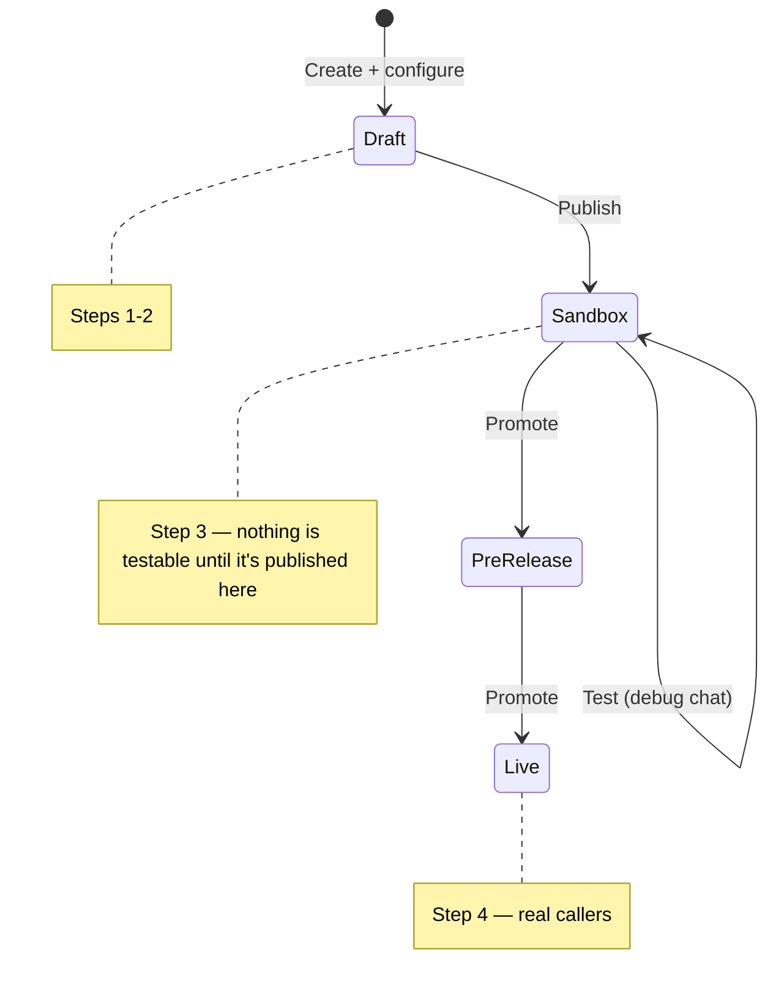

This guide builds an agent from scratch using only the API — no Agent Studio required. By the end you'll have created an agent, given it a behavior and a knowledge base topic, held a test conversation with it, and promoted it to production.

For an overview of the API families, see the [API overview](/api-reference/introduction). This page uses the [Agents](/api-reference/agents/introduction) API to build and ship, and the [Data](/api-reference/data/introduction) API to test — the same API key and host work for both.

<div style={{
  display: 'grid',
  gridTemplateColumns: 'repeat(auto-fit, minmax(180px, 1fr))',
  gap: '1rem',
  margin: '1.5rem 0 2rem',
}}>
{[
  { icon: 'key', value: '1', label: 'API key needed', color: '#4a7c10', bg: 'linear-gradient(160deg, rgba(74, 124, 16, 0.07), rgba(74, 124, 16, 0.01))', border: 'rgba(74, 124, 16, 0.18)' },
  { icon: 'list-ol', value: '4', label: 'Steps to production', color: '#386dbf', bg: 'linear-gradient(160deg, rgba(56, 109, 191, 0.07), rgba(56, 109, 191, 0.01))', border: 'rgba(56, 109, 191, 0.2)' },
  { icon: 'globe', value: '4', label: 'Regions available', color: '#b45a1e', bg: 'linear-gradient(160deg, rgba(180, 90, 30, 0.08), rgba(180, 90, 30, 0.01))', border: 'rgba(180, 90, 30, 0.2)' },
].map((s) => (
  <div key={s.label} style={{
    display: 'flex',
    alignItems: 'center',
    gap: '0.9rem',
    padding: '1rem 1.2rem',
    borderRadius: '16px',
    border: `1px solid ${s.border}`,
    background: s.bg,
  }}>
    <div style={{
      width: '44px',
      height: '44px',
      borderRadius: '12px',
      background: s.color,
      display: 'flex',
      alignItems: 'center',
      justifyContent: 'center',
      flexShrink: 0,
    }}>
      <Icon icon={s.icon} iconType="solid" size={18} color="#fff" />
    </div>
    <div>
      <div style={{ fontSize: '1.4rem', fontWeight: 700, color: '#1f2937', lineHeight: 1.15 }}>{s.value}</div>
      <div style={{ fontSize: '0.82rem', color: '#6b7280' }}>{s.label}</div>
    </div>
  </div>
))}
</div>

## What you'll build

<CardGroup cols={3}>
  <Card title="1. Create" icon="hammer" href="#step-1-create-an-agent">
    Stand up a new agent with a greeting.
  </Card>
  <Card title="2. Configure" icon="sliders" href="#step-2-configure-it">
    Give it a behavior and a knowledge base topic.
  </Card>
  <Card title="3. Test" icon="flask-vial" href="#step-3-test-it">
    Publish to Sandbox and hold a conversation with it.
  </Card>
  <Card title="4. Deploy" icon="rocket" href="#step-4-deploy-it">
    Promote through Pre-release into Live traffic.
  </Card>
  <Card title="5. Observe" icon="database" href="#step-5-work-with-the-calls-it-takes">
    Pull back the conversations it has.
  </Card>
</CardGroup>



## Prerequisites

<Steps>
  <Step title="Get an API key">
    Self-serve API keys aren't available yet — ask your PolyAI representative for a **workspace-scoped API key**. The same key authenticates the Agents API and the Data API's debug chat — everything through step 4 of this guide.

    - Step 5 (pulling call data back out) uses the [Conversations v3](/api-reference/conversations/introduction) API, which needs a separate project-scoped key. The [Chat API](/api-reference/chat/introduction) needs its own connector token too. Request either only once you're integrating a real channel or data pipeline — you don't need them for steps 1–4.

    Treat the key like a password. Don't commit it or put it in client-side code.
  </Step>

  <Step title="Find your account ID">
    Open Agent Studio. Your account ID is the first path segment in the URL:

    ```
    https://studio.{region}.poly.ai/{account_id}/{project_id}/agent
    ```

    For example, `https://studio.uk.poly.ai/acme-uk/acme-team-4/agent` → `account_id=acme-uk`.

    <Note>
    **"Account ID" and "Workspace ID" are the same thing.** Agent Studio's UI calls this the **Workspace ID** and shows it in a prefixed form (`ws-xxxxxxxx`). The API parameter is named `accountId` (Agents and Data APIs) or `account_id` (Conversations, Chat, Webhooks, and most other APIs) — same value, different casing convention depending on which API family you're calling. Both the slug form from the URL (`acme-uk`) and the prefixed form (`ws-xxxxxxxx`) work in API calls.
    </Note>
  </Step>

  <Step title="Pick the right base URL">
    The Agents and Data APIs — everything in steps 1–4 of this guide — share one regional host family:

    | Region | Base URL                     |
    | ------ | ----------------------------- |
    | US     | `https://api.us.poly.ai`      |
    | UK     | `https://api.uk.poly.ai`      |
    | EU     | `https://api.eu.poly.ai`      |
    | Studio | `https://api.studio.poly.ai`  |

    <Warning>
    The Conversations v3 API (used in step 5) is on a *different* host — `api.{region}-1.platform.polyai.app`, with a `-1` suffix. Mixing these up is the most common cause of `404`s. See [base URLs](/api-reference/introduction#base-urls) for the full table across every API family.
    </Warning>
  </Step>

  <Step title="Set environment variables">
    ```bash
    export POLYAI_API_KEY="your_api_key_here"
    export POLYAI_BASE_URL="https://api.us.poly.ai"
    export POLYAI_ACCOUNT_ID="ws-xxxxxxxx"
    ```

    All examples below assume these are set.
  </Step>
</Steps>

## Step 1: Create an agent

<CodeGroup>

```bash curl
curl -X POST "$POLYAI_BASE_URL/v1/accounts/$POLYAI_ACCOUNT_ID/agents" \
  -H "x-api-key: $POLYAI_API_KEY" \
  -H "Content-Type: application/json" \
  -d '{
    "name": "Support Agent",
    "responseSettings": {
      "greeting": "Hi, thanks for calling Acme Corp. How can I help?"
    }
  }'
```

```python Python
import os
import requests

base_url = os.environ["POLYAI_BASE_URL"]
account_id = os.environ["POLYAI_ACCOUNT_ID"]
headers = {"x-api-key": os.environ["POLYAI_API_KEY"]}

response = requests.post(
    f"{base_url}/v1/accounts/{account_id}/agents",
    headers=headers,
    json={
        "name": "Support Agent",
        "responseSettings": {
            "greeting": "Hi, thanks for calling Acme Corp. How can I help?",
        },
    },
)
response.raise_for_status()
agent = response.json()
print(agent["agentId"])
```

</CodeGroup>

**Response**

```json
{
  "accountId": "ws-xxxxxxxx",
  "agentId": "PROJECT-58RP822I",
  "agentName": "Support Agent",
  "createdAt": "2026-07-02T10:00:00.000Z",
  "updatedAt": "2026-07-02T10:00:00.000Z",
  "branchCount": 1
}
```

Save `agentId` — every remaining call in this guide uses it. The agent starts with one branch, `main`.

```bash
export POLYAI_AGENT_ID="PROJECT-58RP822I"  # use the agentId from your response
```

## Step 2: Configure it

### Set the behavior

The behavior is the system prompt that governs how the agent responds.

```bash curl
curl -X PATCH "$POLYAI_BASE_URL/v1/agents/$POLYAI_AGENT_ID/branches/main/behavior" \
  -H "x-api-key: $POLYAI_API_KEY" \
  -H "Content-Type: application/json" \
  -d '{
    "behavior": "You are a friendly, concise support agent for Acme Corp. Answer questions using the knowledge base. If you cannot help, offer to hand off to a human agent."
  }'
```

### Add a knowledge base topic

Topics are what the agent draws on to answer questions — each one pairs content with example queries that should trigger it.

```bash curl
curl -X POST "$POLYAI_BASE_URL/v1/agents/$POLYAI_AGENT_ID/branches/main/knowledge-base/topics" \
  -H "x-api-key: $POLYAI_API_KEY" \
  -H "Content-Type: application/json" \
  -d '{
    "name": "Password reset",
    "content": "Users can reset their password at acme.com/reset. Resets take effect immediately and any active sessions are logged out.",
    "exampleQueries": {
      "queries": ["How do I reset my password?", "I forgot my password"]
    }
  }'
```

See [Knowledge base](/api-reference/agents/endpoint/knowledge-base/create-knowledge-base-topic) for the full schema, including `actions` and `isActive`.

## Step 3: Test it

<Note>
**Publish before you test.** Behavior and knowledge base edits live on the draft until you publish — [changes apply to an environment only once they're promoted to it](/knowledge/faqs/RAG/introduction#why-rag). There's no way to hold a debug-chat conversation against the raw draft over the API, so publishing to Sandbox is the first move here, not an afterthought.
</Note>

**Publish the draft to Sandbox:**

```bash curl
curl -X POST "$POLYAI_BASE_URL/v1/agents/$POLYAI_AGENT_ID/deployments/publish" \
  -H "x-api-key: $POLYAI_API_KEY" \
  -H "Content-Type: application/json" \
  -d '{
    "environment": "sandbox",
    "deploymentMessage": "Initial support agent"
  }'
```

The response's `deployment.id` identifies this deployment — save it as `$DEPLOYMENT_ID`, you'll need it in the next step.

Now hold a test conversation using the Data API's debug chat — it authenticates with the same key and host as the Agents API, so there's no extra credential to request.

<Tip>
Prefer a UI? Agent Studio has a built-in **Test** panel that talks to the draft directly, no publish required — see [Test in Sandbox](/environments-and-versions/introduction#test-in-sandbox).
</Tip>

**Start a session:**

```bash curl
curl -X POST "$POLYAI_BASE_URL/v1/agents/$POLYAI_AGENT_ID/debug-chat" \
  -H "x-api-key: $POLYAI_API_KEY" \
  -H "Content-Type: application/json" \
  -d '{ "clientEnv": "sandbox" }'
```

```json
{
  "conversationId": "CONV-1234567890",
  "userInput": "",
  "response": "Hi, thanks for calling Acme Corp. How can I help?",
  "metadata": { "currentNode": "greeting", "nodeTrace": ["greeting"], "retrievedTopics": [] },
  "conversationEnded": false,
  "delayedResponse": false
}
```

(`metadata` has more fields than shown — trimmed here for readability.)

**Send a message** — try the knowledge base topic you just added:

```bash curl
curl -X POST "$POLYAI_BASE_URL/v1/agents/$POLYAI_AGENT_ID/debug-chat/CONV-1234567890" \
  -H "x-api-key: $POLYAI_API_KEY" \
  -H "Content-Type: application/json" \
  -d '{
    "clientEnv": "sandbox",
    "message": "I forgot my password"
  }'
```

Check `metadata.citedTopic` (and `metadata.retrievedTopics`) in the response rather than eyeballing the reply text — it names the knowledge base topic the agent actually retrieved, which is a more reliable signal that "Password reset" is wired up than scanning for `acme.com/reset` in the wording. Keep sending messages against the same `conversationId` to continue the conversation, matching `clientEnv` to whichever environment you're checking.

<Note>
Building a real webchat, SMS, or in-app integration instead of a one-off test? Use the [Chat API](/api-reference/chat/introduction) — it's built for driving conversations from an end-user-facing client and requires its own connector token.
</Note>

## Step 4: Deploy it

Sandbox is for testing, not customer traffic. Promote the same deployment through Pre-release and into Live — that's what real callers hit. See [Environments](/environments-and-versions/introduction) for the full model.

```bash curl
# sandbox -> pre-release
curl -X POST "$POLYAI_BASE_URL/v1/agents/$POLYAI_AGENT_ID/deployments/$DEPLOYMENT_ID/promote" \
  -H "x-api-key: $POLYAI_API_KEY" \
  -H "Content-Type: application/json" \
  -d '{ "targetEnvironment": "pre-release" }'

# pre-release -> live (use the deployment.id returned above, not $DEPLOYMENT_ID)
curl -X POST "$POLYAI_BASE_URL/v1/agents/$POLYAI_AGENT_ID/deployments/$PRE_RELEASE_DEPLOYMENT_ID/promote" \
  -H "x-api-key: $POLYAI_API_KEY" \
  -H "Content-Type: application/json" \
  -d '{ "targetEnvironment": "live" }'
```

Each promote call returns a new deployment for the target environment — chain the returned `deployment.id` into the next call. A sandbox deployment can promote straight to `live` too (skip the `targetEnvironment` field entirely and it defaults to the next stage in sequence: sandbox → pre-release → live) — going through pre-release first is a safety choice, not an API requirement.

Made a mistake? [Roll back](/api-reference/agents/endpoint/deployments/rollback-to-a-previous-deployment) to the previous deployment in any environment.

## Step 5: Work with the calls it takes

Once your agent is live (or you've made test calls), pull the data back with the [Conversations API](/api-reference/conversations/introduction). This uses a different host and a project-scoped key — see [prerequisites](#prerequisites) above.

<Note>
The `project_id` this API expects is the same value as the `agentId` you've used throughout this guide — "Agent" and "Project" are the current and legacy names for the same resource.
</Note>

```bash curl
curl -X GET \
  "https://api.us-1.platform.polyai.app/v3/$POLYAI_ACCOUNT_ID/$POLYAI_AGENT_ID/conversations?limit=5" \
  -H "x-api-key: $POLYAI_CONVERSATIONS_API_KEY"
```

This returns a `conversations` array and a `cursor` for pagination. Fetch one by ID to get its full turn-by-turn transcript:

```bash curl
curl -X GET \
  "https://api.us-1.platform.polyai.app/v3/$POLYAI_ACCOUNT_ID/$POLYAI_AGENT_ID/conversations/CONVERSATION_ID" \
  -H "x-api-key: $POLYAI_CONVERSATIONS_API_KEY"
```

From here:

<CardGroup cols={2}>
  <Card title="Download call audio" icon="waveform-lines" href="/api-reference/conversations/introduction">
    Voice calls have a recording available on a separate binary endpoint.
  </Card>
  <Card title="Subscribe to webhooks" icon="webhook" href="/api-reference/webhooks/introduction">
    Get a signed POST when a call completes instead of polling for it.
  </Card>
</CardGroup>

## Troubleshooting

| Symptom                                        | Likely cause                                                                              | Fix                                                                                                  |
| ----------------------------------------------- | ------------------------------------------------------------------------------------------ | ----------------------------------------------------------------------------------------------------- |
| `401 Unauthorized`                             | Missing or wrong `x-api-key`, or a key from the wrong region.                              | Confirm the key was issued for the region in your base URL — see [region mismatches](/api-reference/data/introduction#authentication). |
| `403 Forbidden`                                | Key lacks permission for this account or agent.                                            | Confirm the key was provisioned for the account ID / agent ID you're using.                          |
| `400` on create agent                          | Missing `responseSettings.greeting`, which is required.                                    | Include a non-empty `greeting` — it's the agent's opening line.                                       |
| Debug chat replies with the old behavior/topic | You edited the draft but tested against an environment you haven't republished.             | Publish again — edits only take effect in an environment once you publish or promote into it.         |
| `404` on debug-chat message                    | Wrong or expired `conversationId`.                                                          | Start a new session with `POST /debug-chat` and use the returned `conversationId`.                    |
| `409 Conflict` on publish                      | Nothing has changed since the last publish to this environment.                             | Publish is a no-op if the draft is already live there — make an edit first, or move on to promote.    |
| `404` on promote                               | Wrong `deploymentId`.                                                                        | Use the `deployment.id` from the most recent publish/promote response, not an old one.                |
| `400` on promote                               | `targetEnvironment` isn't a later stage than the deployment's current one.                   | Sandbox can promote to `pre-release` or `live`; pre-release can only promote to `live`.                |
| `404` on Conversations endpoint (step 5)       | Wrong base URL — usually the build host (`api.us.poly.ai`) instead of the platform host.    | Conversations v3 uses `api.{region}-1.platform.polyai.app`, with the `-1` suffix.                     |
| Empty `conversations` array                    | No calls yet in the time window, or wrong `client_env`.                                     | Place a test call via debug chat, widen the window, or try `client_env=sandbox`.                      |
| `429 Too Many Requests`                        | Rate limit hit.                                                                             | Back off per the `Retry-After` header; use cursor pagination for large pulls.                          |

See [Error codes](/api-reference/error-codes) for the full reference.

## Next steps

<CardGroup cols={3}>
  <Card title="Agents API" icon="hammer" href="/api-reference/agents/introduction">
    Branches, telephony, real-time configs, and variants for multi-site agents.
  </Card>
  <Card title="Chat API" icon="comments" href="/api-reference/chat/introduction">
    Wire a real webchat, web SDK, or SMS integration into a live conversation.
  </Card>
  <Card title="Conversations API" icon="database" href="/api-reference/conversations/introduction">
    Full schema, pagination, and retrieval modes for call data.
  </Card>
  <Card title="Webhooks API" icon="bell" href="/api-reference/webhooks/introduction">
    Event types, retries, and signature verification.
  </Card>
  <Card title="Outbound Calling API" icon="phone-arrow-up-right" href="/api-reference/outbound/introduction">
    Have your new agent place a real call out — needs outbound enabled on the project first.
  </Card>
  <Card title="WebRTC Gateway" icon="microphone" href="/api-reference/webrtc-gateway/introduction">
    Talk to your agent by voice from a browser tab instead of typing.
  </Card>
</CardGroup>
