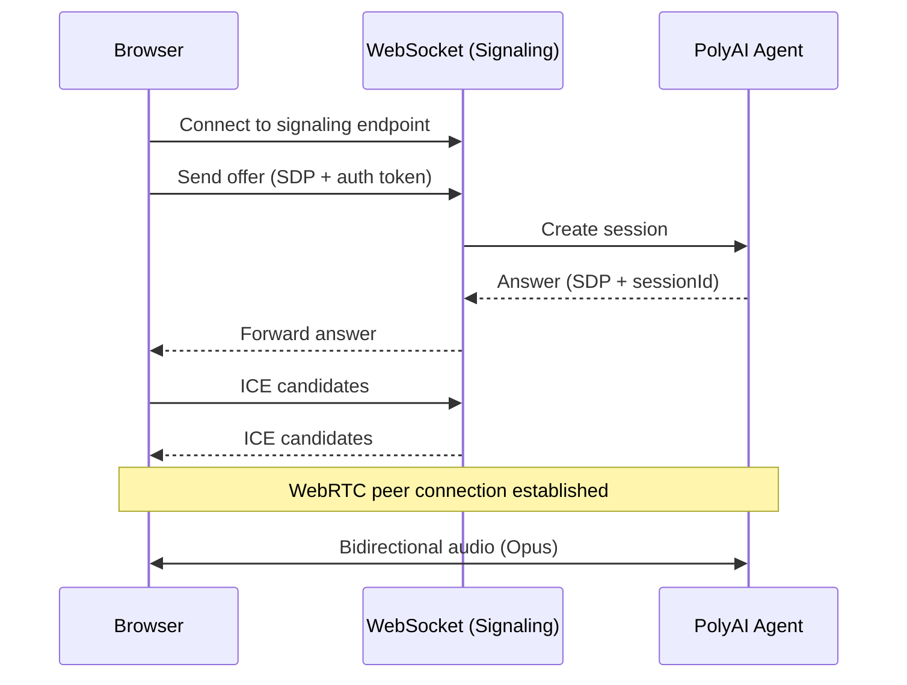

The WebRTC Gateway enables real-time voice communication between a web browser and a PolyAI voice agent, using WebSocket signaling and bidirectional WebRTC audio.

It provides two integration layers:

- [WebSocket](https://developer.mozilla.org/en-US/docs/Web/API/WebSockets_API) signaling for session setup, [SDP](https://datatracker.ietf.org/doc/html/rfc8866) exchange, and [ICE](https://datatracker.ietf.org/doc/html/rfc8445) candidate exchange
- [WebRTC](https://webrtc.org/getting-started/overview) media for bidirectional audio once the connection is established



## Prerequisites

- A WebRTC-capable browser
- Microphone permissions enabled
- A PolyAI authentication token

## Quick start

1. Open a WebSocket connection to the signaling endpoint
2. Create a WebRTC peer connection and collect microphone audio
3. Send an offer message containing SDP and your auth token
4. Receive an answer message containing SDP and a session identifier
5. Exchange ICE candidates until the connection is established
6. Audio flows bidirectionally

## Authentication token

The `authToken` you send in the `offer` message is the same credential used to authenticate SIP traffic — your **connector token** (the value provided by PolyAI for the `X-PolyAi-Auth-Token` SIP header). The gateway accepts two token types:

| Token | Source | When to use |
|-------|--------|-------------|
| **Connector token** | Provisioned by PolyAI per project (same token used on the SIP connector for [Five9](/integrations/voice/sip/five9), [Genesys](/integrations/voice/sip/genesys), and other telephony integrations) | **Recommended for all integrations outside Agent Studio.** Durable across redeploys. |
| **Studio-minted JWT** | Generated automatically by Agent Studio for in-Studio calls | Only when calling from the Agent Studio UI. Goes stale on redeploy, so it isn't suitable for external clients. |

For your own WebRTC client (widgets, native apps, custom browser integrations), use the connector token.

## Signaling endpoint

Signaling URL (WebSocket):

`wss://webrtc-gateway.us-1.platform.polyai.app/api/v1/webrtc/signal`

All signaling messages are JSON objects sent over the WebSocket connection.

## Message structure

All signaling messages follow the same top-level structure.

| Field                  | Required   | Description                                                                  |
|------------------------|------------|------------------------------------------------------------------------------|
| `type`                 | Yes        | Message type: `offer`, `answer`, `ice-candidate`, `error`, `close`           |
| `sessionId`            | Yes        | Empty string when creating a new session                                     |
| `data`                 | No         | Message-specific payload (SDP, ICE candidate, or error)                      |
| `authToken`            | Offer      | Authentication token for the voice agent. Required for every offer, including studio draft and preview calls |
| `mode`                 | No         | Agent mode: `end-to-end` (default), `traditional`, or `echo` (debug only)    |
| `callSid`              | No         | Unique call identifier (camelCase – distinct from the outbound REST API's `call_sid`) |
| `caller`               | No         | Calling number                                                               |
| `callee`               | No         | Called number                                                                |
| `accountId`            | No         | Account identifier                                                           |
| `projectId`            | No         | Project identifier                                                           |
| `variantId`            | No         | Optional variant override                                                    |
| `agentVersionOverride` | No         | Optional `{ artifactVersion, lambdaDeploymentVersion }` to pin a specific agent build |

## Message types

### Offer (client to server)

Starts a new session.
Send with an empty sessionId.

Example message:

```json
{
  "type": "offer",
  "sessionId": "",
  "data": {
    "type": "offer",
    "sdp": "v=0 o=- 4611731400430051336 2 IN IP4 127.0.0.1"
  },
  "authToken": "your-auth-token",
  "callSid": "call-unique-id",
  "caller": "+14155551234",
  "callee": "+14155555678"
}
```

### Answer (server to client)

Sent in response to an offer.
Contains the SDP answer and the assigned sessionId.

```json
{
  "type": "answer",
  "sessionId": "550e8400-e29b-41d4-a716-446655440000",
  "data": {
    "type": "answer",
    "sdp": "v=0 o=- 4611731400430051336 2 IN IP4 192.168.1.1"
  }
}
```

Store the `sessionId` and use it for all subsequent messages.

### ICE candidate (bidirectional)

Sent by both client and server to establish network connectivity.

```json
{
  "type": "ice-candidate",
  "sessionId": "550e8400-e29b-41d4-a716-446655440000",
  "data": {
    "candidate": "candidate:1 1 UDP 2130706431 192.168.1.1 54321 typ host",
    "sdpMid": "0",
    "sdpMLineIndex": 0
  }
}
```

### Close (client to server)

Terminates the session gracefully.

```json
{
  "type": "close",
  "sessionId": "550e8400-e29b-41d4-a716-446655440000"
}
```

### Error (server to client)

Sent when an error occurs.

```json
{
  "type": "error",
  "sessionId": "550e8400-e29b-41d4-a716-446655440000",
  "data": {
    "code": "UNAUTHORIZED",
    "message": "Invalid authentication token"
  }
}
```

Error codes:

| Code | Description |
|------|-------------|
| `UNAUTHORIZED` | Invalid or missing authentication token |
| `INVALID_ARGUMENT` | Request field has an invalid value (for example, an unknown `mode`) |
| `INVALID_MESSAGE` | Malformed or unsupported message format |
| `HANDLER_ERROR` | Error processing the signaling message |
| `MEDIA_BRIDGE_FAILURE` | Failed to establish media connection |
| `AGENT_FAILURE` | Error connecting to the PolyAI agent |

## WebRTC configuration

### Audio codec

The gateway requires Opus audio.

- MIME type: audio/opus
- Sample rate: 48 kHz
- Channels: stereo

### ICE servers

Configure your peer connection with a STUN server.
TURN is recommended for restrictive networks.

Example STUN server:
`stun.l.google.com:19302`

## Browser support

- Chrome 72 or newer
- Firefox 60 or newer
- Safari 14.1 or newer
- Edge 79 or newer

## Troubleshooting

### Unauthorized error

Ensure the authentication token is valid and included in the offer message. Every offer requires an `authToken`, including studio draft and preview calls that pin a specific build with `agentVersionOverride`. Offers without a token are rejected with an `UNAUTHORIZED` error and the message `Auth token required`.

### No audio

- Confirm microphone permissions are granted
- Verify Opus is negotiated successfully

### ICE connection fails

- Corporate firewalls may require TURN
- Ensure UDP traffic is allowed
- Configure TURN over TCP if needed

## Useful links

- [WebRTC overview](https://webrtc.org/getting-started/overview) -- Getting started with WebRTC
- [MDN WebRTC API](https://developer.mozilla.org/en-US/docs/Web/API/WebRTC_API) -- Browser API reference
- [MDN WebSocket API](https://developer.mozilla.org/en-US/docs/Web/API/WebSockets_API) -- WebSocket reference
- [RFC 8866 (SDP)](https://datatracker.ietf.org/doc/html/rfc8866) -- Session Description Protocol specification
- [RFC 8445 (ICE)](https://datatracker.ietf.org/doc/html/rfc8445) -- Interactive Connectivity Establishment specification
