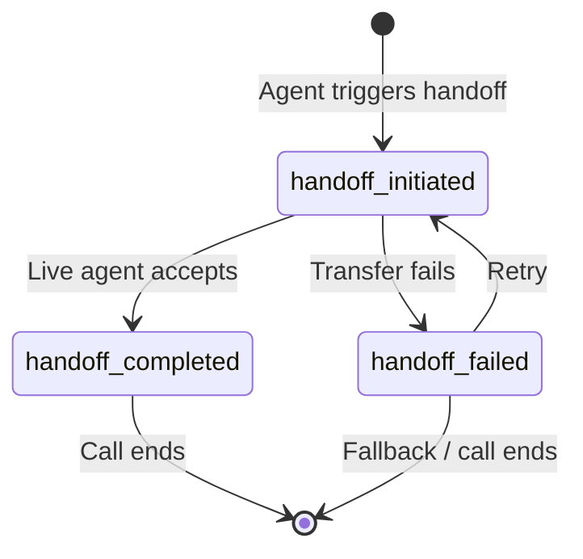

Use the Handoff States API to monitor transitions between automated agents and live agents, retrieve handoff context, and synchronize metadata with downstream systems. This page explains when to use handoff APIs, highlights topic-specific state examples, and provides integration best practices.

For detailed API specifications, refer to the [Handoff API documentation](/api-reference/handoff/introduction).

## Related handoff documentation

- **[Call Handoffs overview](/call-handoff/introduction)** - Configure handoff destinations in the UI
- **[Handoff actions in Managed Topics](/managed-topics/how-to-setup-action/handoff)** - Trigger handoffs from Knowledge topics
- **[Handoff API reference](/api-reference/handoff/introduction)** - Retrieve handoff context programmatically
- **[Twilio handoff integration](/telephony/twilio/how-to-handoff)** - Twilio-specific handoff setup

## When to use handoff states

The **handoff states** API manages live agent transitions during conversations. Use it to:

* Trigger transitions between automated and live agents.

* Retrieve the state of a handoff, such as `handoff_initiated`, `handoff_completed`, or `handoff_failed`, or custom topic-specific states (e.g., `customer_refund` or `complaint_escalation`).

* Synchronize metadata with systems operated by human agents so they have full conversational context.

## Handoff states overview



The **handoff states** API provides key triggers for managing transitions between automated and live agents. These states act as signals indicating the outcome of a handoff process rather than continuously updating during the call.

Some example states you could use include:

| State                     | Description                                                                                             |
| ------------------------- | ------------------------------------------------------------------------------------------------------- |
| `customer_refund`         | The call was escalated to a live agent to process a refund request.                                     |
| `complaint_escalation`    | The call was handed off due to a complaint requiring live agent resolution.                             |
| `successfully_identified` | The system successfully verified the customer's identity before transitioning the call to a live agent. |

Example API response:

```json
{
  "id": "0bba04d7-38b3-4fd3-a1a8-329c34517fc1",
  "shared_id": "acme_inc_sdklfasdklfjasbdfklabs",
  "data": {
    "customer_id": "12345",
    "handoff_reason": "successfully_identified"
  }
}
```

## Accessing handoff state data

Use the [Call Handoffs page](/call-handoff/introduction) to configure handoff destinations in the UI, or the [handoff action in Managed Topics](/managed-topics/how-to-setup-action/handoff) to trigger handoffs from Knowledge topics.

### API endpoint

The **Handoff API** retrieves the current handoff state of a conversation using either:

* **Shared IDs (`shared_id`)**: Used in both the PolyAI and client systems to keep them in sync.

* **PolyAI conversation IDs (`id`)**: Generated automatically by PolyAI for each conversation.

When both IDs are provided, the API prioritizes the `shared_id`.

For full details on parameters, headers, and error codes, refer to the [Handoff API documentation](/api-reference/handoff/introduction).

## Live agent events

In webchat, handoffs are exchanged as a sequence of WebSocket events rather than a single state transition. This section documents the event sequence so you can integrate a live-chat platform with PolyAI.

| Event | Direction | When it fires |
|-------|-----------|---------------|
| `poly_agent_triggered_handoff` | PolyAI → client | The agent decided to escalate (e.g. `conv.call_handoff()` was called or a Managed Topic handoff action ran). |
| `initiate_handoff` | PolyAI → client | The handoff descriptor (destination, reason) is sent to the channel handler. |
| `client_handoff_required` | PolyAI → client | The client (your live-chat platform) should now route the session to a human. Includes `route` for downstream routing. |
| `handoff_queue_status` | Client → PolyAI | Optional. Reports queue position and estimated wait time so the agent can communicate them to the user. |
| `handoff_accepted` | Client → PolyAI | A human has picked up the session. PolyAI stops generating responses. |
| `live_agent_joined` | Client → PolyAI | The human's profile (name, avatar) is attached to the session. |
| `live_agent_typing` / `live_agent_message` | Client → PolyAI | Forwarded so the user sees the human's typing indicator and messages in the same UI. |
| `live_agent_left` | Client → PolyAI | The human has ended their leg of the session. |
| `handoff_failed` / `handoff_timeout` | Client → PolyAI | The transfer could not complete; the agent may retry or fall back. |
| `handoff_termination` | Internal | Closes an active handoff when the session ends. |

These map 1:1 to the event types in PolyAI's webchat protocol. The live agent's name displays in the typing indicator and message bubbles as `<agentName> (Live Agent)` once `live_agent_joined` is received.

For voice handoffs, the equivalent signal is a SIP REFER, INVITE, or BYE — see [Call handoff](/call-handoff/introduction#adding-a-handoff-destination).

## SIP header handoff

Some deployments include handoff metadata in [SIP](https://en.wikipedia.org/wiki/Session_Initiation_Protocol) headers when calls are passed back to the contact center. SIP headers can provide critical context quickly, because they package agent IDs and handoff states into lightweight metadata.

### Considerations

* **Customization**: SIP header metadata varies by deployment. Review your deployment-specific SIP header documentation or contact your PolyAI representative for details on the fields and formats available in your setup.

* **Completeness**: Ensure the SIP headers in your deployment include all context your contact center agents need for handoff handling (e.g., handoff reason, customer ID).

## Best practices

1. **Prioritize shared IDs**: Use `shared_id` for consistency with your internal systems. If both `id` and `shared_id` are provided, the API defaults to the `shared_id`.

2. **Monitor handoff failures**: Track the `handoff_failed` state (or its equivalent in your deployment) to implement automated retries or fallback workflows.

3. **Use topic-specific states**: Implement custom states (e.g., `customer_refund` or `complaint_escalation`) for better tracking and reporting on specific interaction types.

---

## Related pages

<CardGroup cols={3}>
  <Card title="List conversations" icon="list" href="/call-data/conversations-api/list-conversations">
    Retrieve metadata for conversations programmatically.
  </Card>
  <Card title="Studio transcripts" icon="desktop" href="/call-data/studio-transcripts">
    Access detailed transcripts for compliance and analytics.
  </Card>
  <Card title="S3-to-S3 integration" icon="cloud-arrow-up" href="/call-data/s3-to-s3">
    Automate large-scale transcript and metadata transfers.
  </Card>
</CardGroup>
