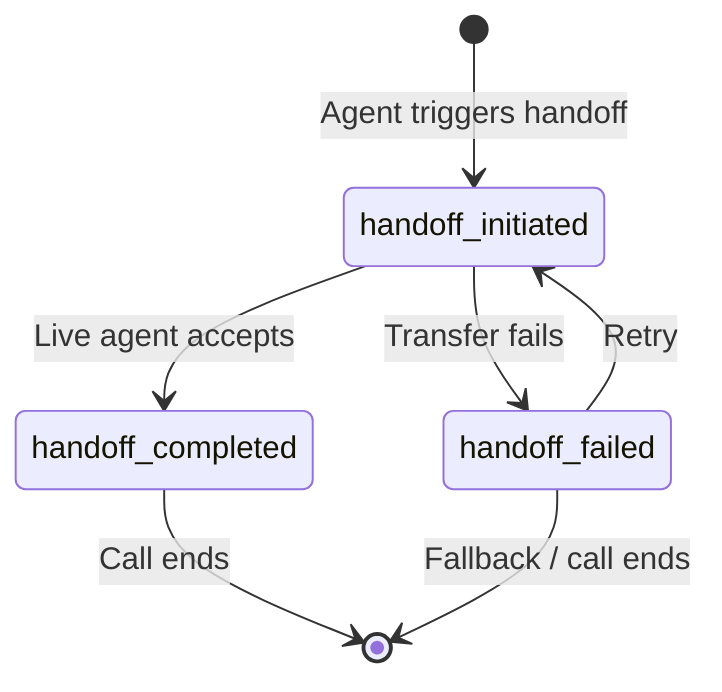

**Handoff states** allow you to monitor and manage transitions between automated agents and live agents. This page explains when to use the handoff-related APIs,
highlights examples of topic-specific states, and provides best practices for integration.

For detailed API specifications, refer to the [Handoff API documentation](/api-reference/handoff/introduction).

## Related handoff documentation

- **[Call Handoffs overview](/call-handoff/introduction)** - Configure handoff destinations in the UI
- **[Handoff actions in Managed Topics](/managed-topics/how-to-setup-action/handoff)** - Trigger handoffs from knowledge base topics
- **[Handoff API reference](/api-reference/handoff/introduction)** - Retrieve handoff context programmatically
- **[Twilio handoff integration](/telephony/twilio/how-to-handoff)** - Twilio-specific handoff setup

## When to use handoff states

The **handoff states** API ensures effective management of live agent transitions during conversations. Use it to:

* Trigger transitions between automated and live agents.

* Retrieve the state of a handoff, such as `handoff_initiated`, `handoff_completed`, or `handoff_failed`, or custom topic-specific states (e.g., `customer_refund` or `complaint_escalation`).

* Synchronize metadata with systems operated by human agents to ensure they have full conversational context.

## Handoff states overview



The **handoff states** API provides key triggers for managing transitions between automated and live agents. These states act as signals indicating the outcome of a handoff process rather than continuously updating during the call.

Some example states you could use include:

| State                     | Description                                                                                             |
| ------------------------- | ------------------------------------------------------------------------------------------------------- |
| `customer_refund`         | The call was escalated to a live agent to process a refund request.                                     |
| `complaint_escalation`    | The call was handed off due to a complaint requiring live agent resolution.                             |
| `successfully_identified` | The system successfully verified the customer's identity before transitioning the call to a live agent. |

Example API response:

```json
{
  "id": "0bba04d7-38b3-4fd3-a1a8-329c34517fc1",
  "shared_id": "acme_inc_sdklfasdklfjasbdfklabs",
  "data": {
    "customer_id": "12345",
    "handoff_reason": "successfully_identified"
  }
}
```

## Accessing handoff state data

Use the [Call Handoffs page](/call-handoff/introduction) to configure handoff destinations in the UI, or the [handoff action in Managed Topics](/managed-topics/how-to-setup-action/handoff) to trigger handoffs from knowledge base topics.

### API endpoint

The **Handoff API** retrieves the current handoff state of a conversation using either:

* **Shared IDs (`shared_id`)**: Used in both the PolyAI and client systems to ensure consistency.

* **PolyAI conversation IDs (`id`)**: Generated automatically by PolyAI for each conversation.

When both IDs are provided, the API prioritizes the `shared_id`.

For full details on parameters, headers, and error codes, refer to the [Handoff API documentation](/api-reference/handoff/introduction).

## SIP header handoff

Some deployments include handoff metadata in [SIP](https://en.wikipedia.org/wiki/Session_Initiation_Protocol) headers when calls are passed back to the contact center. SIP headers can provide critical context quickly, because they package agent IDs and handoff states into lightweight metadata.

### Considerations

* **Customization**: The metadata included in SIP headers may be tailored to your deployment. Verify fields and formats with your engineering team.

* **Best practices**: Ensure that SIP headers are documented thoroughly and include all necessary information for smooth integration.

## Best practices

1. **Prioritize shared IDs**: Use `shared_id` for consistency with your internal systems. If both `id` and `shared_id` are provided, the API defaults to the `shared_id`.

2. **Monitor handoff failures**: Track the `handoff_failed` state (or its equivalent in your deployment) to implement automated retries or fallback workflows.

3. **Use topic-specific states**: Implement custom states (e.g., `customer_refund` or `complaint_escalation`) for better tracking and reporting on specific interaction types.

---

## Related pages

<CardGroup cols={3}>
  <Card title="List conversations" icon="list" href="/call-data/conversations-api/list-conversations">
    Retrieve metadata for conversations programmatically.
  </Card>
  <Card title="Studio transcripts" icon="desktop" href="/call-data/studio-transcripts">
    Access detailed transcripts for compliance and analytics.
  </Card>
  <Card title="S3-to-S3 integration" icon="cloud-arrow-up" href="/call-data/s3-to-s3">
    Automate large-scale transcript and metadata transfers.
  </Card>
</CardGroup>
