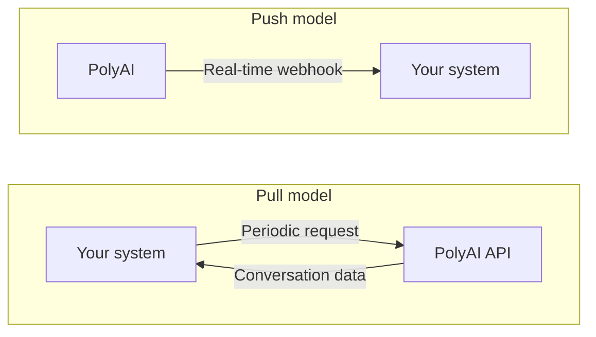

The List Conversations API retrieves conversation transcripts with metadata, timestamps, and states.

For technical details and API specifications, refer to the [Get Conversation API documentation](/api-reference/conversations/v3/endpoint/get-conversation).

## Push and pull

PolyAI supports both **push** and **pull API** models, offering flexible synchronization options:

* **Pull API**: On-demand metadata retrieval through the List Conversations endpoint. Ideal for periodic data collection or workflows where updates are less time-sensitive.

* **Push API**: Automatically sends updates (new conversations or completed interactions) to your system in real time. Best suited for dashboards requiring prompt updates.

<Note>For triggering **instant** communication updates for real-time use cases, like determining where to route a call, it
is recommended to use [handoff states](/call-data/conversations-api/handoff-states).</Note>

### Best practices

1. **Pull**: Use this model for scheduled reporting or when real-time updates are unnecessary.

2. **Push**: Use push updates for real-time synchronization, such as live agent dashboards.

3. Assess your system's requirements to determine whether a push or pull model best aligns with your workflow and data processing needs.

## Integration with other workflows

The **List Conversations API** can fit into a larger data-sharing workflow:

1. [Manual access using the studio](/call-data/studio-transcripts): View richly-detailed conversation transcripts and recordings directly in the PolyAI platform.

2. **End of call metadata retrieval**: Automate metadata syncing after conversations using push or pull APIs.

3. [**Handoff metadata integration**](/call-data/conversations-api/handoff-states): Provide your live customer agent with a quick identifier indicating what kind of call they have just received.
