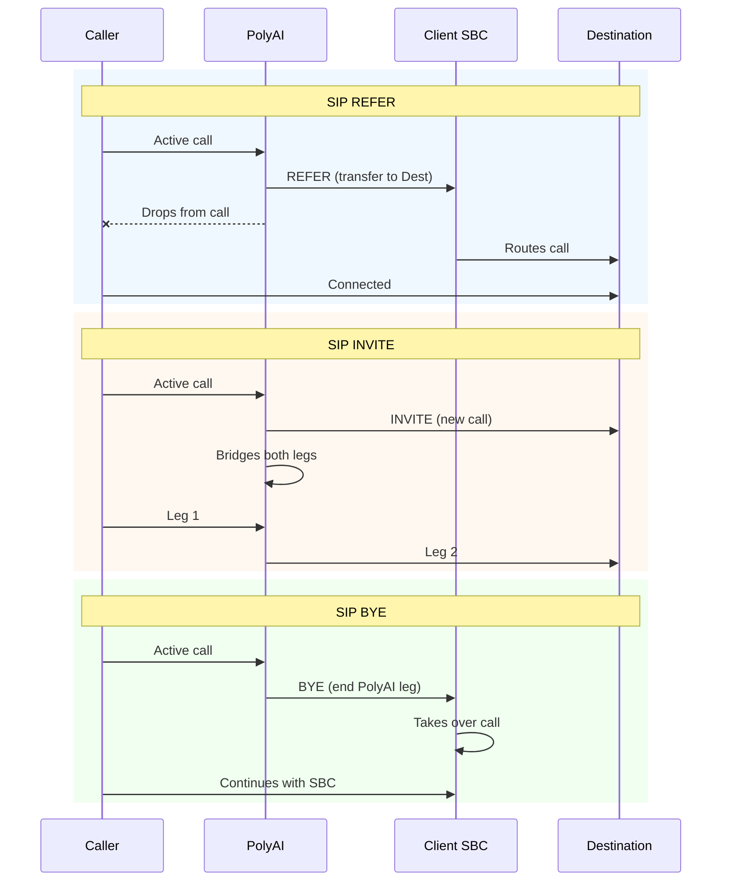

<Frame caption="Call handoff configuration in Agent Studio">
  
</Frame>

<Info>
**Prerequisites:** Understanding of SIP telephony or your contact center's routing setup. UI-based handoff configuration (adding destinations, setting SIP headers) does not require code. The `transfer_call` function path requires Python — see the [comparison table below](#comparison-call-handoff-and-the-transfer_call-function). You can also find this page in the **Developer** tab.
</Info>

Use handoffs when the agent reaches a point where a human needs to take over — billing disputes, complaints, or requests outside the agent's scope. A well-configured handoff routes the caller to the right team with context intact; a missing or misconfigured handoff leaves callers stuck or dropped.

<Note>
**Use Call Handoffs (UI-based) when** you have fixed transfer destinations with straightforward routing. **Use `transfer_call` (code-based) instead** when you need dynamic routing logic, custom SIP headers, or integrations like Zendesk. See the [comparison table below](#comparison-call-handoff-and-the-transfer_call-function) for details.
</Note>

The SIP-based handoff methods described below apply to voice interactions. Webchat handoffs use HTTP-based integrations with your live chat platform. To manage handoff states programmatically, visit the [Handoff API documentation](/api-reference/handoff/introduction).

## Related handoff documentation

- **[Handoff actions in Managed Topics](/managed-topics/how-to-setup-action/handoff)** - Add handoff triggers to Knowledge topics
- **[Handoff States API guide](/call-data/conversations-api/handoff-states)** - Monitor transitions between automated and live agents
- **[Handoff API reference](/api-reference/handoff/introduction)** - Retrieve handoff context for downstream systems

### Adding a handoff destination

To create a new handoff destination:

1. Go to **Build > Call handoffs** in the sidebar.
2. Click **Add Handoff**.
3. Fill in the following details:
   - **Name**: Enter a descriptive name (e.g., "Front desk").
   - **Description**: Add a note about when to use this handoff (e.g., "When the user needs to speak with an operator").
   - **Method**: Choose the SIP method to use for call routing. Options include:
     - **[SIP REFER](https://www.ietf.org/rfc/rfc3515.txt)** (default) – PolyAI specifies a transfer destination to the client <Tooltip tip="This is a network element that manages and secures SIP calls. SBCs handle call routing, security, and interoperability between different VoIP networks.">Session Border Controller</Tooltip> (SBC), then drops from the call.
     - **[SIP INVITE](https://datatracker.ietf.org/doc/html/rfc3261#section-13.3.1)** – PolyAI creates a new call with the destination and acts as a bridge between the client SBC and the destination.
     - **[SIP BYE](https://www.rfc-editor.org/rfc/rfc3261.html)** – PolyAI signals that its call leg is over, allowing the client SBC to take the call back over.

   - **Route**: Specify the destination SIP URI or extension (only applies to SIP INVITE and SIP REFER).
   - **SIP headers**: Add optional [SIP headers](https://www.iana.org/assignments/sip-parameters/sip-parameters.xhtml) to include metadata or routing instructions.

4. Click **Add** to save the destination.

<Frame caption="Adding a new handoff destination">
  
</Frame>

### Configuring SIP headers

SIP headers can be used to send additional metadata when making a handoff. To add SIP headers:

1. Click **Add SIP Header** in the handoff setup modal.
2. Enter a **Header Name** (e.g., `X-Customer-ID`).
   - Custom headers should start with an `X-` prefix.
3. Enter a **Value** (e.g., `abc123`).
4. You can use variables prefixed with `$` in the SIP header values for dynamic data. Example:

   `X-Caller-ID: $caller_id`

5. Repeat as needed for multiple headers.

SIP headers allow for custom integrations with external telephony systems and can help manage call behavior dynamically.

### Managing handoffs

Once a handoff destination is created, it will appear in the list of destinations. You can edit, delete, or update the details as needed.

- **Example**: A customer support agent might have a handoff destination called "Billing Support" to route conversations related to payment issues.

### Best practices for call handoffs

- **Use clear descriptions**: Ensure handoffs are labeled with their intended use to avoid confusion.
- **Test call routing**: Regularly test handoff destinations to verify they are functioning correctly.
- **Optimize SIP headers**: Use headers to pass relevant metadata and improve call handling.

### Handoff reason and utterance

<Accordion title="Handoff reason and utterance" icon="phone">

The built-in **handoff** template and the [`conv.call_handoff()`](/function/classes/conv-object) helper accept two optional, structured fields:

| Field | Purpose | Example |
|-------|---------|---------|
| `reason` | Machine-readable code explaining *why* the call is being escalated (e.g. `policy_violation`, `needs_human`, `no_availability`). Surfaces in Conversation Review and the Conversations API. | `policy_violation` |
| `utterance` | A short message the agent delivers *before* transfer begins (spoken for voice, displayed for webchat). Logged alongside the handoff for QA review. | "Let me transfer you to a specialist who can help." |

<Warning>
When using SIP REFER, the utterance may not play before the transfer completes because the REFER fires at the same time as function execution. If you need the utterance to be spoken reliably before transfer, use SIP INVITE instead.
</Warning>

**Where it shows up**

* **Flows & KB actions** – Selecting **builtin-handoff** displays *Reason* and *Pre-handoff utterance* fields.
* **Functions** – Call [`conv.call_handoff(destination="...", reason="...", utterance="...")`](/function/classes/conv-object) to escalate programmatically.
* **Conversation Review** – Both fields appear in the metadata panel for quick troubleshooting.
* **Conversations API** – Returned inside the `handoff` object for BI dashboards or CRM routing.

**Benefits**

* Removes guesswork when diagnosing handoffs — no more relying on LLM summaries alone.
* Enables fine-grained routing rules in telephony or CRM systems.
* Gives QA teams full visibility into the exact wording customers heard.

</Accordion>

### Using your own Twilio number

If you're bringing your own Twilio phone number to route calls, follow these steps to integrate it as a handoff destination:

1. **Connect your Twilio account**:
   - Ensure your [Twilio account](https://www.twilio.com/login) is set up and you have the necessary credentials ([Account SID](https://help.twilio.com/articles/14726256820123-What-is-a-Twilio-Account-SID-and-where-can-I-find-it-), [Auth Token](https://www.twilio.com/docs/iam/api/authtoken)).
   - Go to **[Configure > Numbers](/telephony/introduction)** in the Agent Studio.
   - Enter your Twilio credentials to connect your account securely.

2. **Assign a Twilio number**:
   - Choose a number from your Twilio account to use for routing calls.
   - If necessary, provision new numbers directly using the Twilio console.

3. **Set up routing in Twilio**:
   - Configure your Twilio number to route calls to your PolyAI agent by setting the **Webhook URL** in your Twilio console. Example:
     - **Voice Webhook URL**: `https://your-polyai-instance-url/voice/call`
   - Make sure your webhook supports **POST** requests and uses the correct authentication methods.

4. **Add the Twilio number as a handoff destination**:
   - In the **Call Handoffs** section, use the Twilio number as the "Extension / Number" field when creating a new destination.
   - Add a description specifying its purpose (e.g., "Route to Twilio-based live agent team").

<Note>
If you are using a US-based Twilio number for SMS, you must [register for A2P 10DLC](https://www.twilio.com/docs/messaging/compliance/a2p-10dlc#who-needs-to-register-for-a2p-10dlc) to comply with regulatory requirements. See the [Twilio handoff guide](/telephony/twilio/how-to-handoff) for more details on Twilio-specific configuration.
</Note>

## Comparison: Call Handoff and the `transfer_call` function

These two methods serve similar purposes — routing the user to another endpoint — but are mutually exclusive and differ in flexibility and implementation.

In the table below, <Icon icon="check" iconType="solid" /> means the feature is supported and **—** means it is not supported.

| Feature                         | `Call Handoff` (UI-based)                          | `transfer_call` (code-based)                          |
|---------------------------------|---------------------------------------------------|--------------------------------------------------------|
| Ease of setup                   | <Icon icon="check" iconType="solid" /> UI form    | — Requires Python editing                              |
| Works in flow builder           | <Icon icon="check" iconType="solid" />            | <Icon icon="check" iconType="solid" />                |
| Works in Function Editor        | —                                                 | <Icon icon="check" iconType="solid" />                |
| Dynamic routing logic           | —                                                 | <Icon icon="check" iconType="solid" /> Full control   |
| Supports custom metrics         | —                                                 | <Icon icon="check" iconType="solid" />                |
| Supports soft-handoff           | —                                                 | <Icon icon="check" iconType="solid" />                |
| Best for static SIP integration | <Icon icon="check" iconType="solid" />            | —                                                      |
| Best for dynamic integrations   | —                                                 | <Icon icon="check" iconType="solid" /> (e.g. Zendesk) |

<Warning>
These two methods **cannot be used together** in the same step. `transfer_call` overrides any configured Call Handoff in the UI. If you use `transfer_call`, keep destination mappings in sync manually — changes in the Call Handoff UI are not reflected in function-based transfers.
</Warning>

The UI-based Call Handoff does not support custom metrics. Use `transfer_call` with [`conv.write_metric()`](/function/classes/conv-object) if you need handoff reason codes for analytics.

### When to use each method

Use `Call Handoff` if:
- You want a quick setup through Agent Studio with minimal code.
- Your routing needs are straightforward and based on static values.

Use `transfer_call` if:
- You need to pass dynamic SIP headers (e.g., customer metadata).
- You want to use soft handoffs or log custom handoff metrics.
- You're integrating with a platform that does not support SIP REFER (e.g. Zendesk).

---

## Related pages

<CardGroup cols={3}>
  <Card title="Handoff States API" icon="right-left" href="/call-data/conversations-api/handoff-states">
    Monitor transitions between automated and live agents.
  </Card>
  <Card title="Handoff API reference" icon="code" href="/api-reference/handoff/introduction">
    Retrieve handoff context programmatically.
  </Card>
  <Card title="Twilio handoff" icon="phone" href="/telephony/twilio/how-to-handoff">
    Twilio-specific handoff configuration.
  </Card>
</CardGroup>
