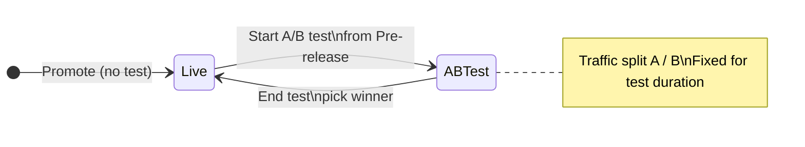

<Note>
**Availability (Beta).** A/B testing is available on US and UK enterprise clusters behind a feature flag. Ask your PolyAI representative to enable it for your project.
</Note>

A/B tests promote a second version to Live alongside the current one and split real caller traffic between them. You compare key metrics in your dashboards before ending the test and promoting a winner to receive 100% of traffic.

Use it for any change where you want evidence before fully rolling out — a new prompt, a reworked flow, a different routing rule, a model swap. Until now every change went to 100% of traffic on promotion; A/B testing gives you a controlled rollout.

## How it works

- The **current Live version** is the **control (A)**. The **version you promote from Pre-release** is the **variant (B)**.
- At test start you set a traffic split between A and B (between 5% / 95% and 95% / 5%, in 5% steps; defaults to 50 / 50).
- Both versions handle real customer traffic. Calls are routed at the start of the conversation and stay on the assigned version for the whole call.
- The split is fixed for the duration of the test. (Mid-test adjustments are on the roadmap.)
- Only one A/B test can be active per project at a time.
- You end the test by picking a winner. The chosen version is promoted to Live and receives 100% of traffic. The losing version stays in its previous environment.

## Before you start

You need:

- An active Live deployment (this becomes the control).
- A version in Pre-release that you want to test against it (this becomes the variant). Get there with the standard [promote flow](/environments-and-versions/introduction#promoting-a-version).
- No other A/B test currently running on the project.
- The `ab_tests` feature flag enabled for the project.

You also need write access to environments. Run a regression pass on the variant against your [simulation testing](/simulation-testing/introduction) before promoting it to Pre-release — A/B testing measures real-world performance, not correctness.

## Start a test

1. Open **Deployments** in the sidebar and go to the **Pre-release** tab.
2. On the Pre-release version you want to test, open the overflow menu (three dots) and select **Run A/B test**.

<Frame caption="Pre-release tab with the version overflow menu open, showing the Run A/B test option alongside Promote to Live, Preview version, Chat with Pre-release, and Compare versions">
  
</Frame>

3. In the **Start A/B test** modal:
   - **Name** — defaults to the current date and time. Override with something you'll recognize in history (for example, `Refund flow rewrite`).
   - **Traffic split** — use the slider to set the split between A (control / current Live) and B (variant / Pre-release). Steps of 5%, from 5/95 to 95/5.
   - Review both version cards to confirm you're testing the right deployments.
4. Tick **Please confirm both versions will start receiving live customer traffic** and click **Start test**.

<Frame caption="Start A/B test modal with a name field, a traffic-split slider defaulting to 50/50, cards for the current Live version (A) and the new Pre-release version (B), and a confirmation checkbox above Cancel and Start test buttons">
  
</Frame>

Both versions now serve live traffic at the configured split. The Environments page groups them together under the test name with **Live A** and **Live B** tags showing each version's traffic share.

<Warning>
**Both versions are live.** Once you start the test, every caller is routed to either A or B and receives a real, production interaction. Don't start a test with a variant you wouldn't be comfortable shipping to all customers if it had to.
</Warning>

## While a test is running

<Frame caption="Pre-release tab in Environments during an active A/B test, with both versions tagged Live A 50% and Live B 50%">
  
</Frame>

- Both versions stay visible on the **Pre-release tab** with their traffic share shown next to each row (for example, *Live A 50%* and *Live B 50%*), and the active test appears as a grouped card on the **Live tab**.
- The **Agent Studio chat and call panels** show a banner: *"A/B test in progress, you may be served either live version."* Either version may answer when you test from inside Studio.
- **Other promotions to Live are blocked** until the test ends — you'll see *"End A/B test before promoting a new version to live"* on the promote action.
- **Rollback** of the control version is also blocked while a test is active. End the test first.
- You can still promote other versions through Sandbox → Pre-release; only the final promotion to Live is gated.

## Track performance

Compare A vs B in your existing dashboards. Both versions write to the same analytics tables, tagged with their deployment version.

- Open **Analytics > Dashboards** (QuickSight).
- Filter by **deployed version** to slice any metric — CSAT, containment, latency, handover rate, function errors, anything you already track.
- Compare the two version IDs side by side over the duration of the test.

<Tip>
**Pick metrics before the test starts.** Decide up front what "winning" means (for example, *containment must be ≥ current Live without increasing average handle time*). Reviewing dashboards after the fact and choosing the metric that looks best is how you ship regressions.
</Tip>

Conversation Review filtering by version is on the roadmap; for now, use dashboard filters or the deployment version on each conversation row.

## End the test

1. On the **Environments** page, click **End A/B test** on the active test group (top-right of the grouped card).
2. In the **End A/B test** modal, select the version you want to keep as Live — either the control (A) or the variant (B).
3. Click **Confirm**.

The chosen version is promoted to Live and receives 100% of traffic immediately. The other version stays in its previous environment (Live becomes Pre-release if the variant won; the variant stays in Pre-release if the control won).

<Note>
**No automated significance testing yet.** You decide when there's enough data to call a winner based on your own thresholds. Statistical comparison is on the roadmap.
</Note>

## History

Ended A/B tests appear in the **Live Version History** section of the Environments page, grouped under the test name with:

- Both versions and their traffic shares at the time the test ran.
- An indicator on the chosen winner.
- The end timestamp.

Expand any past test to view either version's full deployment details or compare it against another version.

## Limits and roadmap

Today:

- One active A/B test per project.
- Traffic split is set at test start and fixed for the test's duration.
- Variant must be promoted from Pre-release.
- No automated significance testing — you read the dashboards and decide.
- Conversation Review can't yet filter by deployment version.

Planned:

- Mid-test split adjustments.
- Conversation Review filtering by version.
- Automated significance testing and statistical comparison.

## Related pages

<CardGroup cols={2}>
  <Card title="The deployment pipeline" icon="layer-group" href="/environments-and-versions/introduction">
    How versions move through Sandbox, Pre-release, and Live.
  </Card>
  <Card title="Compare versions" icon="code-compare" href="/environments-and-versions/diffs">
    Side-by-side diff of any two versions before promoting.
  </Card>
  <Card title="Project history" icon="clock-rotate-left" href="/environments-and-versions/project-history">
    Audit trail of published versions, including A/B test history.
  </Card>
  <Card title="Testing" icon="flask-vial" href="/simulation-testing/introduction">
    Automated regression checks to run before promoting a variant.
  </Card>
</CardGroup>
