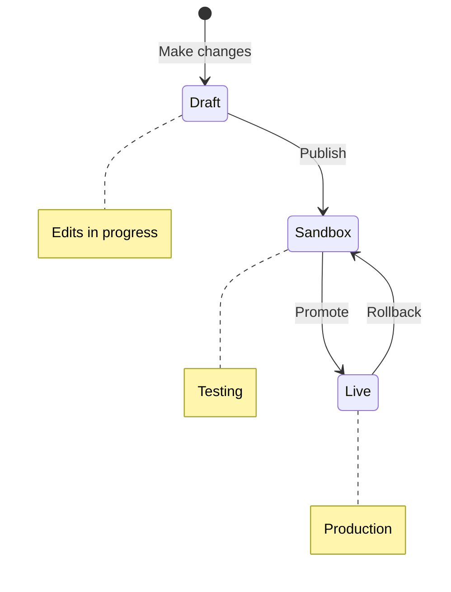
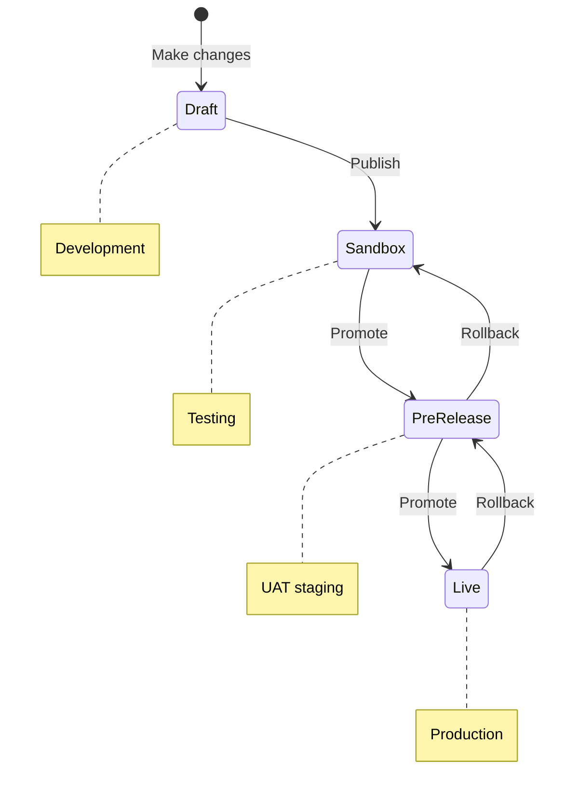

<div className="simplified-only">

Two environments on the Open platform: **Sandbox**, where your changes land for testing, and **Live**, where real callers reach your agent. You publish a version into Sandbox, test it, then promote it to Live when you're happy.



<Warning>
**Publishing isn't the same as going live.** Drafts must be **published** to Sandbox first. They only reach your callers when you **promote** to Live.
</Warning>

## Publish a draft to Sandbox

Whenever you make changes (via Studio Assistant or directly), a draft banner appears at the top of the page with two options:

- **Delete** reverts to the most recent published version.
- **Publish** saves the draft as a version. Add a short description if you want a note for future you.


Once published, the version becomes your active **Sandbox** deployment. Find it under **Deployments** in the sidebar.

## Test in Sandbox

Click **Test** in the top-right of any page to open the Agent Debugging panel. Choose **Call agent** or **Webchat**, pick **Sandbox** from the environment dropdown, and try the scenario you're worried about. Every test call lands in [Conversations](/analytics/conversations/introduction) with a transcript.

If something looks off, the [iterate-after-a-call](/learn/iterate-open-platform) flow walks through fixing it.

## Promote to Live

When the Sandbox version handles real scenarios properly, promote it.

1. Open **Deployments** in the sidebar.
2. In the **Sandbox** tab, click the overflow menu (three dots) next to the version.
3. Select **Promote to Live**.
4. Tick the confirmation box and click **Promote**.


Once it's Live, every new caller (via PolyPhone, the shareable link, or anywhere else you've placed the agent) hits the promoted version immediately.

## Roll back

If a Live version is causing problems, roll back.

1. Open **Deployments > Live** in the sidebar.
2. Open the overflow menu on the version you want to roll back.
3. Click **Rollback**, then confirm.

The previous version becomes Live again. You can promote forward whenever you're ready.

## Compare versions

Side-by-side diffs let you check what changed between two versions before you promote. Open **Deployments** or **Project History**, select a version, and click **Compare**. Sorting is newest-first.


[Tracking changes →](/environments-and-versions/diffs)

## What's not here

Enterprise plans get a third environment, **Pre-release**, that sits between Sandbox and Live for user-acceptance testing. They also get phone-number assignment per environment, the test suite for automated regression runs, and the Agents API for scripting deployments. None of those are on the Open platform; the [Open platform overview](/platform/open-platform) has the full picture.

</div>

<div className="full-only">

Test agent changes before they reach live callers. Draft → Sandbox → Pre-release → Live.

<Note>
**New to environments?** Start with the [Environments tutorial](/learn/guides/get-started/environments) for a hands-on introduction. For detailed workflows and best practices, see [Version management](/learn/maintain/version-management).
</Note>

<Warning>
**Saving is not the same as going live.** Saved changes are drafts. Drafts must be **published** to Sandbox, then **promoted** through Pre-release to Live. Unpublished changes don't appear in any environment.
</Warning>



## Creating a version

A <Tooltip tip="The state between the latest published version and ongoing changes. Drafts become versions upon publishing.">draft</Tooltip> version
is created whenever changes are made to an agent. A draft banner appears at the top of the page, allowing you to:

* **Delete**: Revert to the most recent published version.

* **Publish**: Save the draft as a version, optionally adding a description highlighting changes made and any notes for future
  collaborators.


Once published, the version becomes your active <Tooltip tip="Development environment where users build, change, and test versions of an agent.">Sandbox</Tooltip> deployment
and you can access it from **Deployments > Environments** in the sidebar.


## Promoting a version

Promotion moves a version from one environment to the next. The environments include Sandbox,
<Tooltip tip="A staging environment for user acceptance testing (UAT) before promoting to production.">Pre-release</Tooltip>,
and <Tooltip tip="The production environment. This is where the agent handles live traffic.">Live</Tooltip>.

### Pre-release

Staging environment for user acceptance testing (UAT).

1. Go to **Deployments > Environments** in the sidebar.

2. Click the **Options Menu** next to the desired version.

3. Select **Promote to Pre-release**.

### Live

Production. Changes affect all active calls immediately.

1. Go to the **Pre-release** tab in **Deployments > Environments**.

2. Click the overflow menu (three vertical dots) next to the version.

3. Select **Promote to Live**.

4. Confirm your selection by checking the box and clicking **Promote**.

<Tabs>
  <Tab title="Confirm">
    
  </Tab>

  <Tab title="Complete">
    
  </Tab>
</Tabs>

## Comparing versions and environments

Before promoting changes, you can compare versions across environments using a side-by-side diff view.

1. Go to the **Deployments** section and open **Environments** or **Project History**.

2. Select a version and click **Compare** to view differences between **Sandbox**, **Pre-release**, and **Live**.

3. Versions appear in **reverse chronological order** (newest first) for easier navigation.

For detailed information on tracking changes between versions, see [Tracking changes](/environments-and-versions/diffs).

## Rolling back to a previous version

Roll back to a previous version if needed:

1. Go to **Deployments > Environments** in the sidebar.

2. Select the **Options Menu** for the desired version.

3. Click **Rollback**.

4. Confirm the rollback.

The system confirms when the rollback is complete.

<Tabs>
  <Tab title="Initiate">
    
  </Tab>

  <Tab title="Confirm">
    
  </Tab>
</Tabs>

## Testing your agent

Main page: [Quickstart: test your agent](/get-started/quickstart#test-your-agent)

Test your agent in any environment:

1. Click the **Play Chat** icon in the top-right corner of the screen.

2. Select the environment containing the version you want to test.

## Assigning phone numbers

Each environment can have its own phone number. To assign:

1. Go to **Configure > Numbers** in the sidebar.

Assign phone numbers and SIP headers per version.


<div className="developer-only">

## Automate with the Agents API

The same pipeline is available programmatically, which is useful for wiring deployments into CI or orchestrating releases across many agents.

<AccordionGroup>
  <Accordion title="Deploy via the Agents API" icon="code">
    The [Agents API](/api-reference/agents/introduction) exposes [publish](/api-reference/agents/endpoint/deployments/publish-the-current-draft-to-an-environment), [promote](/api-reference/agents/endpoint/deployments/promote-a-deployment-to-the-next-environment), and [rollback](/api-reference/agents/endpoint/deployments/rollback-to-a-previous-deployment) as the CI-friendly equivalents of the UI actions above.

    <CodeGroup>
    ```bash curl
    # Publish the current draft to sandbox
    curl -X POST https://api.us.poly.ai/v1/agents/AGENT_ID/deployments/publish \
      -H "x-api-key: $POLYAI_API_KEY" \
      -H "Content-Type: application/json" \
      -d '{ "environment": "sandbox" }'

    # Promote a sandbox deployment to pre-release
    curl -X POST https://api.us.poly.ai/v1/agents/AGENT_ID/deployments/DEPLOYMENT_ID/promote \
      -H "x-api-key: $POLYAI_API_KEY"
    ```

    ```python Python
    import os, requests

    BASE = "https://api.us.poly.ai"
    HEADERS = {"x-api-key": os.environ["POLYAI_API_KEY"]}

    # Publish the current draft to sandbox
    resp = requests.post(
        f"{BASE}/v1/agents/{AGENT_ID}/deployments/publish",
        headers=HEADERS,
        json={"environment": "sandbox"},
    )
    deployment_id = resp.json()["id"]

    # Promote to pre-release once sandbox checks pass
    requests.post(
        f"{BASE}/v1/agents/{AGENT_ID}/deployments/{deployment_id}/promote",
        headers=HEADERS,
    )
    ```
    </CodeGroup>
  </Accordion>
</AccordionGroup>

</div>

## Related pages

<CardGroup cols={2}>
  <Card title="Compare versions" icon="code-compare" href="/environments-and-versions/diffs">
    Side-by-side diff of any two versions before promoting.
  </Card>
  <Card title="Project history" icon="clock-rotate-left" href="/environments-and-versions/project-history">
    Audit trail of all published versions and changes.
  </Card>
  <Card title="Test suite" icon="flask-vial" href="/analytics/test-suite/introduction">
    Run regression tests against Draft or Sandbox.
  </Card>
  <Card title="Deployments endpoints" icon="square-terminal" href="/api-reference/agents/endpoint/deployments/publish-the-current-draft-to-an-environment">
    Publish, promote, and rollback from the Agents API.
  </Card>
</CardGroup>

</div>
