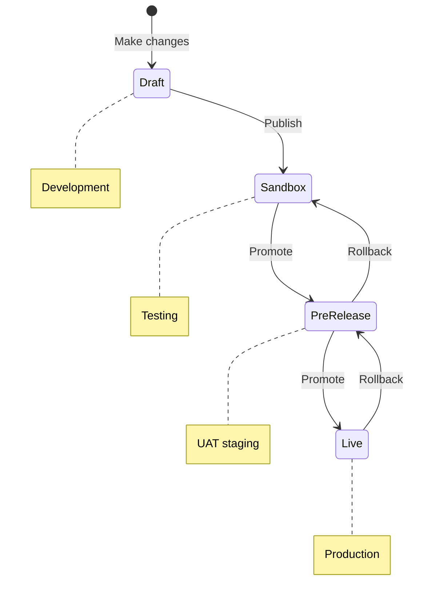

Test agent changes before they reach live callers. Draft → Sandbox → Pre-release → Live.

<Note>
**New to environments?** Start with the [Environments tutorial](/learn/guides/get-started/environments) for a hands-on introduction. For detailed workflows and best practices, see [Version management](/learn/maintain/version-management).
</Note>

<Tip>
**Studio Assistant edits on branches.** Changes from [Studio Assistant](/studio-assistant/introduction) land on a branch off `Main`. Once merged, they flow through this same Draft → Sandbox → Pre-release → Live pipeline. Promotion is always manual.
</Tip>

<Warning>
**Saving is not the same as going live.** Saved changes are drafts. Drafts must be **published** to Sandbox, then **promoted** through Pre-release to Live. Unpublished changes don't appear in any environment.
</Warning>



## Creating a version

A <Tooltip tip="The state between the latest published version and ongoing changes. Drafts become versions upon publishing.">draft</Tooltip> version
is created whenever changes are made to an agent. A draft banner appears at the top of the page, allowing you to:

* **Delete**: Revert to the most recent published version.

* **Publish**: Save the draft as a version, optionally adding a description highlighting changes made and any notes for future
  collaborators.

<Frame caption="Removing a draft from a version line">
  
</Frame>

Once published, the version becomes your active <Tooltip tip="Development environment where users build, change, and test versions of an agent.">Sandbox</Tooltip> deployment
and you can access it from **Deployments** in the sidebar.

<Frame caption="Promoting a version across environments">
  
</Frame>

## Working on branches

Some areas of Agent Studio — such as **Knowledge** and **Tools** — use a git-style branching workflow so you can develop changes in isolation before they reach the shared version line. A **branch selector** dropdown (top-left) lists your branches alongside **Main**; switch branches to work on a set of changes without affecting `Main`.

<Frame caption="Branch selector">
  
</Frame>

When a branch is ready, open the **Merge to main branch** popover, add a commit message describing the change, and select **Merge**. Once merged into `Main`, the changes join the shared version line and can be promoted through the Draft → Sandbox → Pre-release → Live pipeline described below.

<Frame caption="Merge to the main branch">
  
</Frame>

## Promoting a version

Promotion moves a version from one environment to the next. The environments include Sandbox,
<Tooltip tip="A staging environment for user acceptance testing (UAT) before promoting to production.">Pre-release</Tooltip>,
and <Tooltip tip="The production environment. This is where the agent handles live traffic.">Live</Tooltip>.

### Pre-release

Staging environment for user acceptance testing (UAT).

1. Go to **Deployments** in the sidebar.

2. Click the **Options Menu** next to the desired version.

3. Select **Promote to Pre-release**.

### Live

Production. Changes affect all active calls immediately.

1. Go to the **Pre-release** tab in **Deployments**.

2. Click the overflow menu (three vertical dots) next to the version.

3. Select **Promote to Live**.

4. Confirm your selection by checking the box and clicking **Promote**.

<Tabs>
  <Tab title="Confirm">
    <Frame caption="initiate release">
      
    </Frame>
  </Tab>

  <Tab title="Complete">
    <Frame caption="release confirmed and live">
      
    </Frame>
  </Tab>
</Tabs>

## Comparing versions and environments

Before promoting changes, you can compare versions across environments using a side-by-side diff view.

1. Go to the **Deployments** section and open **Environments** or **Project History**.

2. Select a version and click **Compare** to view differences between **Sandbox**, **Pre-release**, and **Live**.

3. Versions appear in **reverse chronological order** (newest first) for easier navigation.

For detailed information on tracking changes between versions, see [Tracking changes](/environments-and-versions/diffs).

## Rolling back to a previous version

Roll back to a previous version if needed:

1. Go to **Deployments** in the sidebar.

2. Select the **Options Menu** for the desired version.

3. Click **Rollback**.

4. Confirm the rollback.

The system confirms when the rollback is complete.

<Tabs>
  <Tab title="Initiate">
    <Frame caption="initiate rollback">
      
    </Frame>
  </Tab>

  <Tab title="Confirm">
    <Frame caption="confirm rollback">
      
    </Frame>
  </Tab>
</Tabs>

## Testing your agent

Main page: [Quickstart: test your agent](/get-started/quickstart#test-your-agent)

Test your agent in any environment:

1. Click the **Play Chat** icon in the top-right corner of the screen.

2. Select the environment containing the version you want to test.

## Assigning phone numbers

Each environment can have its own phone number. To assign:

1. Go to **Voice > Numbers** in the sidebar.

Assign phone numbers and SIP headers per version.

<Frame caption="assign version phone numbers">
  
</Frame>

## Automate with the Agents API

The same pipeline is available programmatically, which is useful for wiring deployments into CI or orchestrating releases across many agents.

<AccordionGroup>
  <Accordion title="Deploy via the Agents API" icon="code">
    The [Agents API](/api-reference/agents/introduction) exposes [publish](/api-reference/agents/endpoint/deployments/publish-the-current-draft-to-an-environment), [promote](/api-reference/agents/endpoint/deployments/promote-a-deployment-to-the-next-environment), and [rollback](/api-reference/agents/endpoint/deployments/rollback-to-a-previous-deployment) as the CI-friendly equivalents of the UI actions above. Note that merging a branch into `main` already publishes to Sandbox, so a standalone `publish` call is only needed when you have an undeployed `main` draft. Both `publish` and `promote` return the resulting deployment under a `deployment` key.

    <CodeGroup>
    ```bash curl
    # Publish the current draft to sandbox
    curl -X POST https://api.us.poly.ai/v1/agents/AGENT_ID/deployments/publish \
      -H "x-api-key: $POLYAI_API_KEY" \
      -H "Content-Type: application/json" \
      -d '{ "environment": "sandbox" }'

    # Promote a sandbox deployment to pre-release
    curl -X POST https://api.us.poly.ai/v1/agents/AGENT_ID/deployments/DEPLOYMENT_ID/promote \
      -H "x-api-key: $POLYAI_API_KEY"
    ```

    ```python Python
    import os, requests

    BASE = "https://api.us.poly.ai"
    HEADERS = {"x-api-key": os.environ["POLYAI_API_KEY"]}

    # Publish the current draft to sandbox
    resp = requests.post(
        f"{BASE}/v1/agents/{AGENT_ID}/deployments/publish",
        headers=HEADERS,
        json={"environment": "sandbox"},
    )
    deployment_id = resp.json()["deployment"]["id"]

    # Promote to pre-release once sandbox checks pass
    requests.post(
        f"{BASE}/v1/agents/{AGENT_ID}/deployments/{deployment_id}/promote",
        headers=HEADERS,
    )
    ```
    </CodeGroup>
  </Accordion>
</AccordionGroup>

## Related pages

<CardGroup cols={2}>
  <Card title="Compare versions" icon="code-compare" href="/environments-and-versions/diffs">
    Side-by-side diff of any two versions before promoting.
  </Card>
  <Card title="Project history" icon="clock-rotate-left" href="/environments-and-versions/project-history">
    Audit trail of all published versions and changes.
  </Card>
  <Card title="Testing" icon="flask-vial" href="/testing/simulation-tests">
    Run regression tests against Draft or Sandbox.
  </Card>
  <Card title="Deployments endpoints" icon="square-terminal" href="/api-reference/agents/endpoint/deployments/publish-the-current-draft-to-an-environment">
    Publish, promote, and rollback from the Agents API.
  </Card>
</CardGroup>
