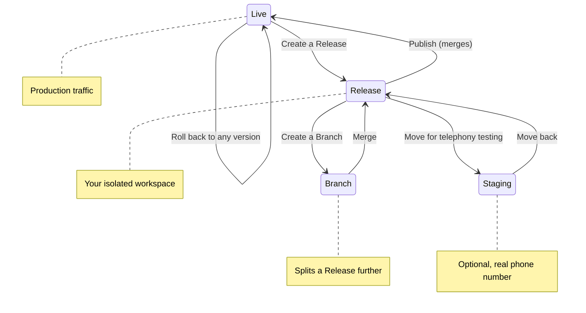

Every project has a **Live** version, the agent actually talking to your customers. You never edit Live directly. Instead you create a **Release**, your own working copy branched off Live, so you start from what is actually running.

```mermaid
stateDiagram-v2
    Live --> Release: Create a Release
    Release --> Branch: Create a Branch
    Branch --> Release: Merge
    Release --> Staging: Move for telephony testing
    Staging --> Release: Move back
    Release --> Live: Publish (merges)
    Live --> Live: Roll back to any version

    note right of Live: Production traffic
    note right of Release: Your isolated workspace
    note right of Branch: Splits a Release further
    note right of Staging: Optional, real phone number
```

## The terms

| Term | What it is |
|---|---|
| **Live** | The environment serving your customers. You never edit it directly. Publishing merges changes onto it, and each publish creates a new version in its history. You can roll back to any previous Live version. |
| **Release** | An isolated workspace, branched off Live. Publishing merges it back onto Live. |
| **Branch** | An isolated workspace, branched from a Release. It only ever merges back into its parent Release. |
| **Draft** | The environment where every Release and Branch lives while you work on it. It has no telephony or API connections, so nothing you build here can reach a real system. |
| **Staging** | An optional environment where you can test any Release with a real phone number and staging API connections, one Release at a time. |
| **Out of sync** | Your workspace is behind its parent. Pull the parent's changes in before you can merge. |

## How it works

A Release is a safe place to work. Releases and Branches all live in Draft, which has no API or telephony connections, so nothing you build can reach a real system. Your Release saves as you go and you can test it in the app at any time. If you need a real phone number and staging API connections, move it to Staging. When it is ready, you publish. Your Release merges onto Live and becomes the newest version in Live's history.

<Note>
**Publishing merges, it does not replace.** If Live has moved on since you created your Release, perhaps because a colleague published first, your Release is marked **Out of sync**. Syncing pulls the latest changes from Live into your Release. If you have both touched the same thing, a conflict screen lets you decide which version to keep. Nothing is silently lost.
</Note>

A Release can be split further. Create as many Branches from a Release as you need, and each Branch is an isolated workspace that only ever merges back into its parent Release. Branches keep the same sync rules with their Release that Releases keep with Live. If someone publishes a Release while its Branches are still open, that work is not lost. The open Branches move to sit directly under Live and become Releases in their own right.

Publishing does not have to be a leap of faith. If anything goes wrong, Live rolls back to any previous version in one step.

## Make a small change

The everyday case: a knowledge update, a settings change, a prompt tweak.

<Steps>
  <Step title="Create a Release from Live">
    It branches off the current Live version, so you start from what is actually running.
  </Step>
  <Step title="Make your change">
    It saves as you go.
  </Step>
  <Step title="Test it">
    Run [simulation tests](/testing/simulation-tests) on the Release, or talk to the agent yourself over an in-app call or chat.
  </Step>
  <Step title="Publish">
    The changes in your Release merge onto Live and become the newest version in Live's history.
  </Step>
</Steps>

Nothing else rides along with your change, and nobody else's work is touched.

## Test in Staging

Use Staging when in-app testing is not enough, for example when you want to test with a real phone number and staging API connections. Any Release can move into Staging, though only one can be there at a time.

<Steps>
  <Step title="Create your Release and make the change">
    Exactly as above.
  </Step>
  <Step title="Move the Release to Staging">
    Then call the number.
  </Step>
  <Step title="Publish when you are happy">
    Staging is optional. A Release can publish straight to Live once you have tested it.
  </Step>
</Steps>

## Work on an update with several people

For a feature several people build together and ship as one.

<Steps>
  <Step title="Create a single shared Release">
    One Release for the whole piece of work.
  </Step>
  <Step title="Each person creates a Branch">
    Every Branch comes off that shared Release.
  </Step>
  <Step title="Test each Branch">
    Run tests on a Branch to check its changes in isolation before merging.
  </Step>
  <Step title="Merge each Branch back">
    Merge into the parent Release as each piece is finished.
  </Step>
  <Step title="Test the Release, then publish">
    Test all the changes together, then publish. Everything lands on Live at once.
  </Step>
</Steps>

If the work can ship independently, skip Branches. Each person creates their own Release and publishes on their own schedule. Nobody queues behind anyone. While one team spends weeks building a new flow in their Release, a colleague can open a small Release of their own, update the knowledge base, and publish the same day without touching the team's work.

<Warning>
Releases cannot merge into each other. Each one publishes to Live on its own.
</Warning>

## Handle an out of sync workspace

This happens whenever a colleague merges to the parent before you do.

<Steps>
  <Step title="Your workspace is marked Out of sync">
    This is expected, not an error.
  </Step>
  <Step title="Sync">
    This pulls the latest changes from the parent into your workspace.
  </Step>
  <Step title="Resolve any conflicts">
    If you have both edited the same thing, a conflict resolution screen asks which version to keep.
  </Step>
  <Step title="Test, then merge">
    Check the merged result before you merge or publish.
  </Step>
</Steps>

The same sync rules apply between a Release and Live, and between a Branch and its parent Release.

## Roll back Live

<Steps>
  <Step title="Open Live's version history">
    Every publish is a version there.
  </Step>
  <Step title="Select a previous version and roll back">
    Live returns to that version in one step.
  </Step>
</Steps>

Because publishing merges rather than replaces, a rollback cannot be silently undone by someone else's publish.

## When someone publishes while your Branches are open

Nothing is lost. Any Branch still open at that point moves to sit directly under Live and becomes a Release in its own right. Carry on working, then publish it like any other Release.

## Compare before you publish

You can compare any two versions side by side to confirm only your intended change is present. See [Compare versions](/environments-and-versions/diffs).

## Related pages

<CardGroup cols={2}>
  <Card title="Compare versions" icon="code-compare" href="/environments-and-versions/diffs">
    Side-by-side diff of any two versions before you publish.
  </Card>
  <Card title="Version management" icon="clock-rotate-left" href="/learn/maintain/version-management">
    Everyday workflows, hotfixes and rollback practice.
  </Card>
  <Card title="Testing" icon="flask-vial" href="/testing/simulation-tests">
    Run tests on any Release or Branch before it merges anywhere.
  </Card>
  <Card title="Environments and testing FAQ" icon="circle-question" href="/troubleshoot/faq-environments">
    Common questions about Draft, Staging and Live.
  </Card>
</CardGroup>
