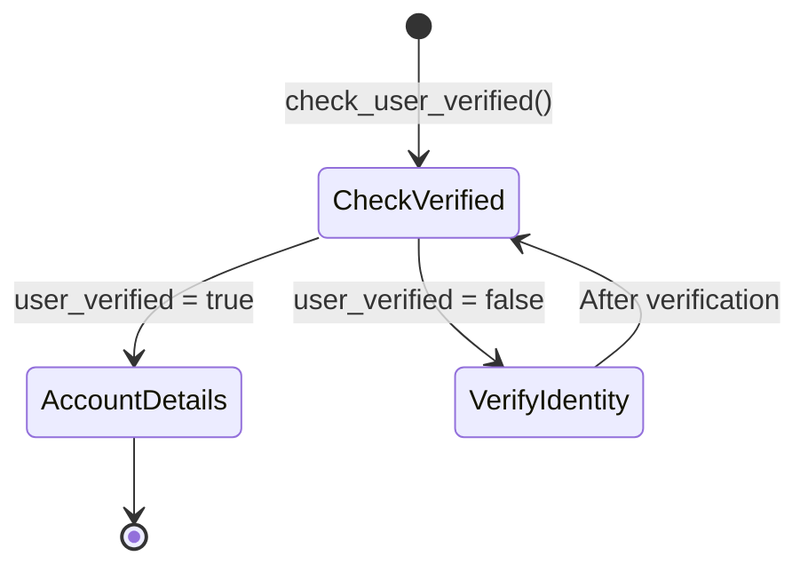

<Info>
**Prerequisites:** Familiarity with Python and [Flows](/flows/introduction). This page covers writing code to control flow routing.
</Info>

A transition function is any function that contains `flow.goto_step()` or `conv.goto_flow()`. Transition functions control how your agent moves between steps within a flow — or between flows entirely.

- **`flow.goto_step()`** moves the agent to another step in the current flow. This must be a **flow function** (scoped to the flow).
- **`conv.goto_flow()`** moves the agent to a different flow. This can be called from a flow function **or** a [global function](/function/introduction).

Transition functions should not be confused with [global functions](/function/introduction), which are shared across [flows](/flows/introduction), [global rules](/agent-settings/rules), and [Knowledge topics](/managed-topics/introduction).

## Recognising transition vs global functions in the UI

Global functions are distinguished in flow steps by the function symbol <Icon icon="function" iconType="solid" />. You can edit them from the flow editor, but changes apply everywhere the function is used in Agent Studio.


Global functions also have profile items in the functions tab.


Transition functions (flow-scoped) only appear in the **Flow Functions** modal — they do not show up in the functions tab.

## Viewing and managing flow functions

To view and manage transition functions, click the **<Icon icon="arrow-progress" iconType="solid" /> Flow functions** button in the bottom-right corner of the Flow Editor. This opens a searchable modal showing all flow functions associated with the current flow.


You can manage transition functions in two ways:

- **From a step** — open the step's context menu and select an existing transition or create a new one.
- **From the Flow Functions modal** — view, rename, delete, or connect transitions to steps.

<Tip>Duplicating a transition auto-generates a unique name. You can then update the logic or connect it to different steps.</Tip>

## Creating a transition function

1. **Connect two steps** — if no transition exists, linking two steps prompts you to create one.
2. **Name your transition** — you'll be asked to name the new function. Use a [retrospective, intent-based name](#naming-functions).
3. **Handle name conflicts** — if the name is already in use, the UI shows an error. Rename before proceeding.
4. **View usage references** — after creation, the UI shows how many times the function is referenced in prompts.


## `flow.goto_step()` signature

```python
flow.goto_step("step_name")
flow.goto_step("step_name", "condition_name")
```

- **`step_name`** (required) — the name of the target step, exactly as it appears in the Flow Editor. This is **case-sensitive**.
- **`condition_name`** (optional) — a label for the transition edge. In [Function steps](/flows/no-code/introduction), this label appears on the edge in the visual editor and can help with readability, but routing is determined by your code, not the label.

## Example: conditional transition logic

A transition function typically checks state and moves to the appropriate step:



```python
def check_user_verified(conv: Conversation, flow: Flow):
    if conv.state.user_verified:
        flow.goto_step("Account details")
        return
    flow.goto_step("Verify identity")
    return
```

## Switching to a different flow with `conv.goto_flow()`

Use `conv.goto_flow()` when the conversation needs to leave the current flow entirely — for example, to start an identity verification or escalation flow.

```python
def check_verification(conv: Conversation, flow: Flow):
    attempts = conv.state.verification_attempts or 0
    if not conv.state.is_verified:
        attempts += 1
        conv.state.verification_attempts = attempts
        if attempts >= 3:
            conv.goto_flow("Identity Verification")
            return
        flow.goto_step("Retry verification")
        return
    flow.goto_step("Continue booking")
    return
```

See [triggering flows](/flows/triggering-flows) for more on `conv.goto_flow()`.

## Naming functions

Function names directly shape LLM behaviour. Use **retrospective, intent-based names** that describe what just happened or what was resolved — not where the flow is going next.

- <Icon icon="check" iconType="solid" /> Good: `last_name_given`, `phone_number_collected`, `reservation_confirmed`
- <Icon icon="check" iconType="solid" /> Also good: `save_postcode`, `check_availability`
- <Icon icon="ban" iconType="solid" /> Avoid: `goto_next_step`, `continue_flow`, `go_to_collect_phone_number`

Retrospective names anchor the LLM's reasoning around what the user accomplished, which produces more natural responses. Forward-looking names like `start_confirmation` can cause the model to narrate its own flow logic ("Okay, moving on to confirmation now").

<Note>
Some teams use past-tense verbs for transition functions (`phone_number_given`) and present-tense for global functions (`get_status_of_order`). Pick a convention and keep it consistent across your project.
</Note>

## Common mistakes

<Tabs>
<Tab title="Avoid">
Never chain multiple function calls in a single step. This increases the failure rate and makes flow behaviour unpredictable.
```python
save_user_input()
check_availability()
flow.goto_step("Next")
```
</Tab>
<Tab title="Instead, use">
Consolidate step logic into one function wherever possible.
```python
def save_and_check(conv: Conversation, flow: Flow, value: str):
    conv.state.value = value
    if check_availability(value):
        flow.goto_step("Confirm booking")
        return
    flow.goto_step("Unavailable")
    return
```
</Tab>
</Tabs>

## Best practices

- Always use `return` immediately after `flow.goto_step()` or `conv.goto_flow()`. Omitting it can lead to unexpected behaviour — only the **last** `goto_step()` call in a function is executed.
- Keep transition functions focused — one decision, one outcome.
- Transition functions are only visible to the LLM if referenced in the current step's prompt.
- Use them to encapsulate branching logic and control step sequencing — not to generate agent responses.
- If your transition function needs to trigger user-facing output, return a message string **instead of** calling `goto_step()`. These are two separate patterns — don't mix them in the same code path.

<Warning>
**Debugging silent transition failures**

If a transition seems to do nothing, the most common cause is a step name mismatch. Because `flow.goto_step()` is **case-sensitive**, `"CollectName"` and `"collectname"` are different targets. A mismatched name fails silently — there is no error message.

To diagnose:
- Open the **Flow Functions** modal and check the exact step name spelling.
- Look for trailing spaces or special characters in step names.
- Use `flow.current_step` in your function to log the current step name for debugging.

When you rename a step in the Flow Editor, Agent Studio automatically updates `flow.goto_step()` and `conv.goto_flow()` references across the project. However, always verify after renaming — especially if you have step names referenced in strings or variables that the auto-rename may not catch.
</Warning>

## Related reading

- [Flow object](/flows/object) — `goto_step()` and `current_step` reference
- [Conversation object](/function/classes/conv-object) — `goto_flow()` and `exit_flow()` reference
- [Triggering flows](/flows/triggering-flows) — all the ways to start a flow
- [No-code flows](/flows/no-code/introduction) — Default steps vs Function steps
