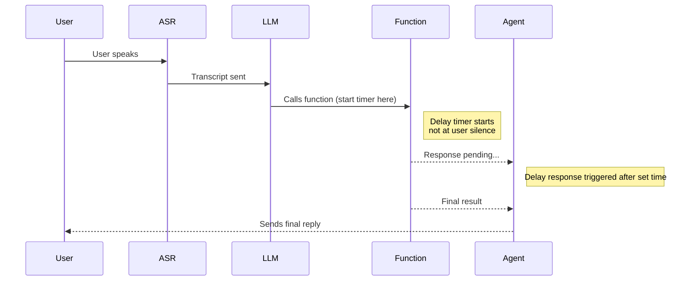

Use the **Delay control** panel to improve the user experience when a function takes longer than expected. Inserting transition utterances while a function is still processing prevents long silences and helps interactions feel more natural and responsive.

## Key benefits

* **Keep users engaged:** Provide real-time feedback rather than leaving users waiting in silence.
* **Fully configurable timing:** Control when and how often delay responses play.
* **Supports multiple utterances:** Define a sequence of responses to use as interim messages.
* **Works across different function types:** Available for global and flow functions (not supported on start or end functions).

## Important timing behavior

<Tip>
Delay timing does **not** begin from when the user stops speaking. It starts when the **function begins executing** — which can happen seconds later due to LLM, ASR, or model routing latency.
</Tip>

This means that if you set a delay of `1s`, filler utterances may not begin until several seconds after silence, depending on system load and model timing.

<Note>
When setting delays, consider the **full turn latency** — not just the time your function takes to respond. For LLM-heavy flows, use shorter delays like `0–0.5s` or include immediate filler lines directly in the step prompt.
</Note>

## How it works

1. **Define delay responses**

   * Create a list of phrases the agent can say while waiting for a function to complete.
   * These might include confirmations, status updates, or even sound effects like 'keyboard typing.'

2. **Configure delay timing**

   * Set the initial delay (in seconds) after function execution begins.
   * Define the interval between each subsequent utterance.

3. **Specify utterance length**

   * For sound-based responses (e.g., typing noises), specify the expected duration to pace playback accurately.

## Example scenario

A restaurant booking function takes several seconds to confirm availability:

1. The user asks for a table.
2. The agent immediately says: *"Let me check availability for you."*
3. After 0.5s, it plays: *"Just a moment, I'm still checking..."*
4. After another 2s, it plays: *"Thanks for waiting!"*
5. Once complete, the agent returns: *"Your table is booked!"*

## Creating a new delay control phrase

* Go to the **Functions** tab and select a function.
* Open the **Delay control** panel.
* Add one or more delay responses.
* Set the initial delay and interval.
* Optionally, specify the length of sound-based utterances.
* Save changes and test in the chat panel to preview the delay behavior.

<Tip>
You can reference state variables inside delay responses using the `$` symbol.
For example:
`Still checking availability at $branch_name...`
The agent will substitute the value automatically.
</Tip>

## Best practices

* Keep filler utterances brief and natural — a mix of phrases like “Still working on it...” or “\[typing]” helps maintain trust.
* Avoid overly repetitive or robotic phrasing.
* Use delay control sparingly: if your function is fast (under 1 second), it might not need filler responses at all.
* For very slow flows, consider adding initial speech directly in the step prompt and letting the delay control handle the fallback.

<Note>
This feature is ideal for **API-based functions** and **LLM utility functions** that experience irregular latency.
It's **not** suitable for conversational steps where the function is near-instant or where multiple branches could be chosen.
</Note>

## Timeline diagram

