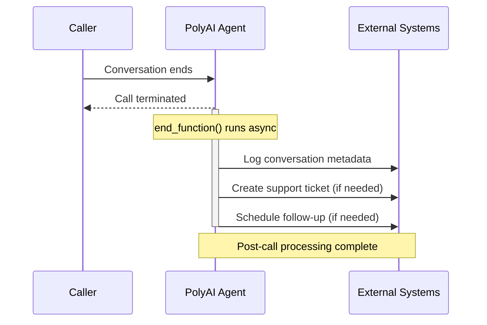

The **End function** is executed at the conclusion of a conversation, enabling final data processing, cleanup, and integration tasks. It runs asynchronously, meaning it does not delay the end of the call but ensures that any necessary post-conversation operations are completed.



## Key features and functionality

1. **Asynchronous execution**: Runs after the conversation ends, so it does not delay the call.

2. **Post-conversation data handling**: Captures and processes important details from the conversation for reporting, logging, or integration.

3. **External integrations**: Call APIs, create tickets, or trigger follow-up workflows from the end function.

## Use cases

The **End function**:

### 1. Logs conversation metadata

* Save key conversation details, such as duration, topic, or sentiment analysis, to a database or CRM.

* **Example use case**: Track customer service interactions for reporting and performance analysis.

### 2. Triggers workflows

* Start processes like creating support tickets, sending confirmation emails, or updating account records.

* **Example use case**: Automatically notify the sales team about potential leads from the conversation.

### 3. Schedules follow-ups

* Prepare reminders, SMS notifications, or callbacks for unresolved queries.

* **Example use case**: Send a confirmation SMS after booking an appointment or a callback request.

## Implementation example

Below is a Python implementation of the **End function**:

```python
def end_function(conv: Conversation):
    # Log metadata
    metadata = {
        "conversation_id": conv.id,
        "duration": conv.duration,
        "topic": conv.state.get("last_topic", "Unknown"),
        "sentiment": conv.state.get("sentiment", "Neutral"),
    }
    log_to_crm(metadata)

    # Trigger external API
    if conv.state.get("support_needed"):
        create_support_ticket(conv.state.user_id, metadata)

    # Schedule follow-up if necessary
    if conv.state.get("follow_up_required"):
        schedule_follow_up(conv.state.user_id, conv.state.follow_up_time)

    return "End function executed successfully."
```

## Best practices for end function design

<Warning>
Errors in the end function do not surface to the caller (the call is already over), but they can silently break downstream workflows. Always implement robust error handling with try/except blocks and fallback logic.
</Warning>

1. **Efficient execution**:

   * Design the function to complete quickly to avoid slowing down post-conversation processes.

2. **Error handling**:

   * Ensure errors during execution do not disrupt downstream workflows.

   * Implement fallback mechanisms for failed API calls or missing data.

3. **Data consistency**:

   * Validate and sanitize data collected during the conversation before processing or logging it.

4. **Relevance**:

   * Include only necessary post-conversation tasks to maintain efficiency and focus.

## Examples: Enhancing post-conversation workflows

### Data logging for analytics

Capture details like customer sentiment, topics discussed, and the resolution status for reporting and analytics.

**Example:**

* "Logged: Customer expressed interest in our premium plan and showed positive sentiment."

### Automatic follow-ups

Send reminders, confirmation messages, or escalation notices to keep the customer informed.

**Example:**

* "An email has been sent confirming your booking for January 10th."

### Task automation

Streamline processes by triggering external workflows or integrations.

**Example:**

* "Support ticket created: Issue with account login noted during the conversation."

### CRM updates

Ensure customer records are up to date with the latest interaction details.
