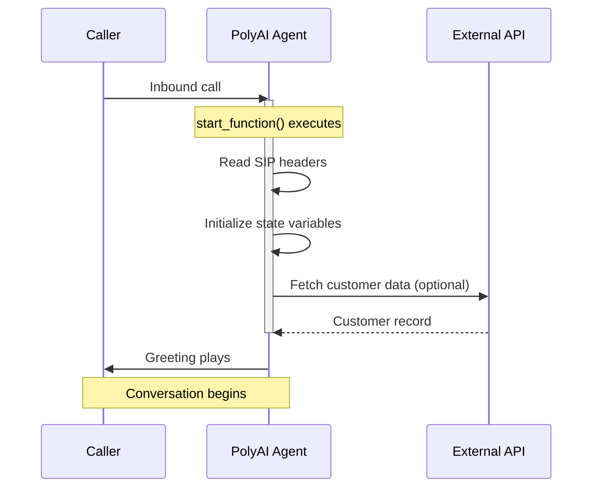

The **Start function** runs when a conversation begins, before the greeting plays. Use it to initialize conversation state, read SIP headers, or make API calls.



<Warning>
The start function is **synchronous** — it must complete before the greeting plays. If it times out, the greeting may not play correctly, and the conversation may enter an unexpected state. Keep start function execution fast to avoid issues.

**For outbound agents**: if the recipient answers and hangs up before the start function completes, the function may be skipped entirely. Design your outbound start functions to handle this gracefully.
</Warning>

<Note>
[Delay control](/function/delay-control) (filler utterances) is **not supported** on start functions. If your start function has variable latency, the only mitigation is to keep it fast or move slow operations into a flow step.
</Note>

### When to use the start function vs. a flow step

Not every API call belongs in the start function. Use this decision framework:

| Scenario | Where to place it |
|----------|------------------|
| Data needed **before** the greeting (e.g. caller lookup for a personalized greeting) | Start function |
| Fast, reliable API (&lt;1s response time) | Start function — reduces mid-conversation latency |
| Slow or unreliable API (external CRM, third-party lookup) | First [flow step](/flows/introduction) — protects the greeting |
| Data only needed mid-conversation | Flow step |

If an API call is not strictly needed before the greeting, move it to the first step of your flow to avoid timeout risk.

## Key features

- **Synchronous execution**: Completes before the greeting plays
- **Context preparation**: Stores data for use throughout the conversation

## Use cases

The **Start function** can:

### 1. Detect channel type

* Use [`conv.channel_type`](/function/classes/conv-object#channel_type) to determine whether the conversation is voice, webchat, or another channel — then branch accordingly.

* Example use case: Disable call transfers for webchat sessions, set a different persona, or inject channel-specific prompts.

### 2. Read connection metadata

* Capture metadata about the user's connection — SIP headers for voice, URL parameters or session data for webchat.

* Example use case: Determine the hotel site or business branch based on telephony headers (voice) or URL parameters (webchat).

### 3. Retrieve date and time

* Initialize state with the current date, time, or day of the week for timestamping or scheduling logic.

* Example use case: Preload available time slots for scheduling queries or confirm user-requested dates.

### 4. Make API calls

* Fetch external data such as user preferences, account information, or customer records.

* Example use case: Retrieve and preload personalized data to enhance the conversation's responsiveness and user experience.

### 5. Set the active variant

* Use [`conv.set_variant()`](/function/classes/conv-object#set_variant) to route the conversation to a specific [variant](/variant-management/introduction) based on SIP headers, callee number, or other metadata.

* This is the standard way to configure multi-site agents — the variant determines which location-specific attributes (phone numbers, addresses, hours) the agent uses throughout the conversation.

* Example use case: Read the dialled number from `conv.callee_number` and map it to a hotel branch or store location.

### 6. Detect language and branch

* Read a language header or parameter and configure the agent accordingly — set the variant, choose a language-specific TTS voice, or store language-specific prompt rules in state.

* Example use case: Read an `X-Language` SIP header, call `conv.set_variant()` to load the correct language variant, and set the TTS voice for that language.

### 7. Read outbound call metadata

* For outbound agents, read lead data or campaign metadata from SIP headers injected by the calling platform.

* Example use case: Preload a customer's name, account number, or campaign context before the agent speaks.

### 8. Read integration attributes

* Access [`conv.integration_attributes`](/function/classes/conv-object#integration_attributes) to read metadata passed from external integrations (e.g. DNIs pooling, Chat API).

<Note>
`conv.integration_attributes` can only be read in the start function. Extract any values you need and store them in `conv.state` for use later in the conversation.
</Note>

### 9. Configure a TTS provider

* Set the TTS provider in the start function. Supported providers include [Cartesia](https://docs.cartesia.ai/api-reference/tts/tts), [PlayHT](https://docs.play.ht/reference/api-getting-started), and [Rime](https://docs.rime.ai/api-reference/voices).

* See the [voice configuration](/voice/voice-configuration) and [function classes](/function/classes) documentation for more details.

## Implementation example

Below is a Python implementation of the **Start function**:

```python
import datetime as dt

def start_function(conv: Conversation):
    # Retrieve the current date and time
    now = dt.datetime.now()
    conv.state.current_date = now.strftime("%A %d-%m-%Y")
    conv.state.current_weekday = now.strftime("%A")
    conv.state.current_time = now.strftime("%H:%M")

    # Initialize state variables
    conv.state.available_times = None
    conv.state.user_bookings = None

    # Store the caller's phone number
    conv.state.phone_number = conv.caller_number

    # Detect channel type for multi-channel agents
    conv.state.is_voice = conv.channel_type == "VOICE"

    # Set variant based on dialled number (multi-site routing)
    site_map = {
        "+441234567890": "london",
        "+442345678901": "new_york",
    }
    site = site_map.get(conv.callee_number, "default")
    conv.set_variant(site)

    # Store integration attributes (only available in start function)
    if conv.integration_attributes:
        conv.state.shared_id = conv.integration_attributes.get("shared_id")

    # Return an empty string to indicate successful execution
    return str()
```

## Return values

The start function supports the same [return values](/function/return-values) as other functions. The most common patterns are:

### Empty string (default)

Return `str()` when the start function only needs to set up state. The agent greeting defined in the Agent settings will play as normal.

```python
return str()
```

### Dynamic greeting

Return an `utterance` to override the default greeting with a dynamically generated message. This is useful when the greeting depends on data fetched during the start function (e.g. the caller's name or site-specific wording).

```python
return {
    "utterance": f"Welcome to {conv.variant.site_name}. How can I help you today?"
}
```

<Warning>
Returning an `utterance` from the start function overrides the Agent Greeting field. If you use both, test carefully to ensure the correct greeting plays.
</Warning>

### Listen configuration

Return a `listen` object to configure ASR behaviour for the first turn.

```python
return {
    "utterance": "Welcome. Please say or enter your account number.",
    "listen": {
        "asr": {
            "timeout": 15
        }
    }
}
```

See [return values](/function/return-values) for the full list of supported return types.

## Best practices

1. **Keep it fast**: The start function blocks the greeting. Target under 1 second total execution time. Move slow or unreliable API calls to a [flow step](/flows/introduction).

2. **Never hardcode credentials**: Use [`conv.utils.get_secret()`](/secrets/introduction) for all API keys, tokens, and passwords. Hardcoded credentials in function code are a security risk and may be exposed in logs or version history.

   ```python
   api_key = conv.utils.get_secret("my_api_key")
   ```

3. **Error handling**:

   * Handle missing or malformed data and avoid runtime errors.

   * Provide fallbacks for incomplete or invalid information (like missing SIP headers or unavailable APIs).

4. **State initialization**:

   * Predefine and initialize all state variables needed for the conversation to avoid undefined behaviors.

   * Extract `conv.integration_attributes` here — they are only available in the start function.

5. **Contextual relevance**:

   * Only include setup steps that are directly relevant to the conversation's purpose.

   * Avoid overloading the start function with unnecessary logic.

## Common patterns

<AccordionGroup>
  <Accordion title="Multi-site variant routing">
    The most common advanced use of the start function is routing to a [variant](/variant-management/introduction) based on the dialled number, SIP headers, or other metadata. This is how multi-site agents (hotels, restaurant chains, retail) determine which location's content to use.

    ```python
    def start_function(conv: Conversation):
        phone_numbers = {
            "+441234567890": "London",
            "+442345678901": "New York",
        }
        conv.set_variant(phone_numbers.get(conv.callee_number, "default"))
        return str()
    ```

    **Full article:** [Variant management](/variant-management/introduction)
  </Accordion>

  <Accordion title="Language detection and branching">
    Read a language code from SIP headers or integration data, set the appropriate variant, and configure a language-specific TTS voice.

    ```python
    def start_function(conv: Conversation):
        language = conv.sip_headers.get("X-Language", "en")
        conv.set_variant(language)

        if language == "es":
            conv.voice = Voice(provider="cartesia", ...)
        return str()
    ```
  </Accordion>

  <Accordion title="Channel-type branching">
    Use `conv.channel_type` to disable voice-only features (like call transfers) for webchat, or to inject channel-specific prompts.

    ```python
    def start_function(conv: Conversation):
        conv.state.is_voice = conv.channel_type == "VOICE"
        if not conv.state.is_voice:
            conv.state.transfers_enabled = False
        return str()
    ```
  </Accordion>

  <Accordion title="Multi-voice configuration">
    The start function is where you configure which TTS voice the agent uses for a given call. This is required when running multiple voices across variants or channels, because the Voice page UI may not expose all available providers.

    **Full article:** [Multi-voice](/voice/multi-voice)
  </Accordion>

  <Accordion title="Dynamic user identification">
    Use `conv.caller_number` or metadata from an API call to personalize the greeting or preload account context.
  </Accordion>

  <Accordion title="Preloading context">
    Make a fast API call to fetch scheduling information, past bookings, or account details so the agent has context from the first turn.
  </Accordion>
</AccordionGroup>
