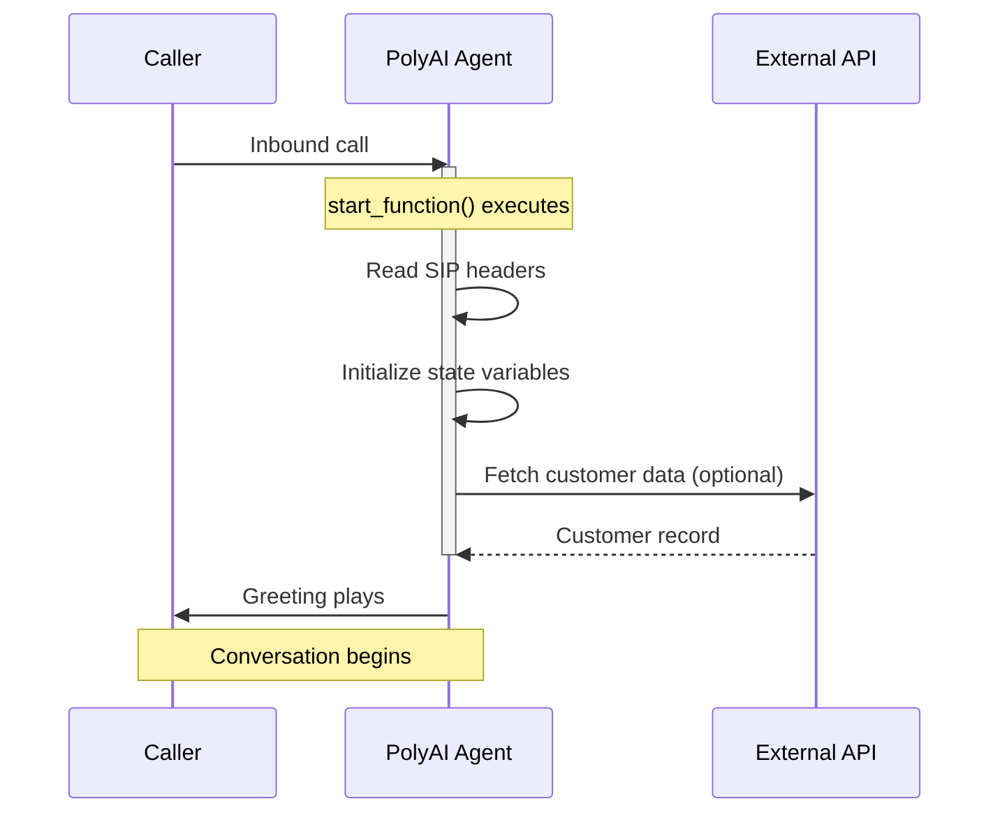

The **Start function** runs when a conversation begins, before the greeting plays. Use it to initialize conversation state, read SIP headers, or make API calls.



<Warning>
The start function is **synchronous** — it must complete before the greeting plays. If it times out, the greeting may fail entirely — callers can hear raw variable names (e.g. `$greeting_msg`) or experience broken state for the rest of the call.

If an API call is not strictly needed before the greeting, move it to the first step of your [flow](/flows/introduction) instead.
</Warning>

<Note>
[Delay control](/function/delay-control) (filler utterances) is **not supported** on start functions. If your start function has variable latency, the only mitigation is to keep it fast or move slow operations into a flow step.
</Note>

## Key features

- **Synchronous execution**: Completes before the greeting plays
- **Context preparation**: Stores data for use throughout the conversation

## Use cases

The **Start function** can:

### 1. Detect channel type

* Use [`conv.channel_type`](/function/classes/conv-object#channel_type) to determine whether the conversation is voice, webchat, or another channel — then branch accordingly.

* Example use case: Disable call transfers for webchat sessions, set a different persona, or inject channel-specific prompts.

### 2. Read connection metadata

* Capture metadata about the user's connection — SIP headers for voice, URL parameters or session data for webchat.

* Example use case: Determine the hotel site or business branch based on telephony headers (voice) or URL parameters (webchat).

### 3. Retrieve date and time

* Initialize state with the current date, time, or day of the week for timestamping or scheduling logic.

* Example use case: Preload available time slots for scheduling queries or confirm user-requested dates.

### 4. Make API calls

* Fetch external data such as user preferences, account information, or customer records.

* Example use case: Retrieve and preload personalized data to enhance the conversation's responsiveness and user experience.

### 5. Read outbound call metadata

* For outbound agents, read lead data or campaign metadata from SIP headers injected by the calling platform.

* Example use case: Preload a customer's name, account number, or campaign context before the agent speaks.

### 6. Configure a TTS provider

* Set the TTS provider in the start function. Supported providers include [Cartesia](https://docs.cartesia.ai/api-reference/tts/tts), [PlayHT](https://docs.play.ht/reference/api-getting-started), and [Rime](https://docs.rime.ai/api-reference/voices).

* See the [voice configuration](/voice/voice-configuration) and [function classes](/function/classes) documentation for more details.

## Implementation example

Below is a Python implementation of the **Start function**:

```python
import datetime as dt

def start_function(conv: Conversation):
    # Retrieve the current date and time
    now = dt.datetime.now()
    conv.state.current_date = now.strftime("%A %d-%m-%Y")
    conv.state.current_weekday = now.strftime("%A")
    conv.state.current_time = now.strftime("%H:%M")

    # Initialize state variables
    conv.state.available_times = None
    conv.state.user_bookings = None

    # Store the caller's phone number
    conv.state.phone_number = conv.caller_number

    # Detect channel type for multi-channel agents
    conv.state.is_voice = conv.channel_type == "VOICE"

    # Return an empty string to indicate successful execution
    return str()
```

<Note>
The start function should return an empty string (`str()`) on success. This is a required convention — returning other values may affect agent behaviour.
</Note>

## Best practices for start function design

1. **Efficient execution**: Ensure the function completes quickly to minimize delays in starting the conversation.

2. **Error handling**:

   * Handle missing or malformed data and avoid runtime errors.

   * Provide fallbacks for incomplete or invalid information (like missing SIP headers).

3. **State initialization**:

   * Predefine and initialize all state variables needed for the conversation to avoid undefined behaviors.

4. **Contextual relevance**:

   * Only include setup steps that are directly relevant to the conversation's purpose.

   * Avoid overloading the Start function with unnecessary logic.

## Examples: Adding context and personalization

Use the Start function to personalize conversations with user data from SIP headers (voice), URL parameters (webchat), API calls, or stored [Variables](/function/variables).

### Multi-voice configuration

The start function is where you configure which TTS voice the agent uses for a given call. This is required when running multiple voices across variants or channels, because the Voice page UI may not expose all available providers.

**Full article:** [Multi-voice](/voice/multi-voice)

### Dynamic user identification

Use information like the user's phone number (voice), session data (webchat), or metadata to greet them personally and acknowledge their history with your business.

**Example:**

* "Hello, John! Thank you for calling. How can we assist you today?"

* "Hi! It looks like you're calling about your recent order. Would you like to discuss that today?"

### Personalized recommendations

Make an API call to reference user preferences or interaction history to suggest products, services, or solutions tailored to the user's needs.

**Example:**

* "Based on your recent purchases, we think you might like our new line of wireless headphones!"

* "I see you've been interested in our premium package. Would you like to learn more about its benefits?"

### Preloading relevant context

Prepare scheduling information or past bookings to streamline conversations and save time for the user.

**Example:**

* "Your last appointment was on January 3rd. Would you like to book another one?"

* "I see there's an available time slot tomorrow at 2 PM. Should I reserve that for you?"

### Customized support based on account details

Retrieve account-specific information, such as subscription plans or recent activity, to provide targeted assistance.

**Example:**

* "It looks like you're on our Gold Membership plan. Let me share some exclusive offers with you."

* "I see you recently opened a support ticket. Would you like an update on its status?"
