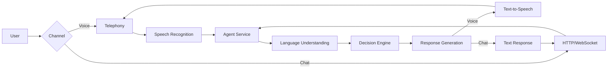

This page provides a high-level overview of how PolyAI's conversational AI system works. Understanding this architecture helps you design more effective agents and troubleshoot issues.

## How conversations flow

When a user connects to your PolyAI agent, the conversation passes through several key stages. The exact path depends on the channel—voice (telephony), webchat, or SMS.

### 1. Connection layer

The connection layer handles how users reach your agent. For voice, this is telephony; for webchat, it's HTTP/WebSocket connections. PolyAI's infrastructure supports automatic failover across all channels.

#### Voice (Telephony)

**Architecture highlights:**

- **Kamilio load balancer**: Distributes incoming calls across multiple media servers for optimal performance
- **Multiple Asterisk media servers**: Redundant media processing ensures continuous service availability
- **Automatic failover**: If a primary service experiences issues, calls are automatically routed to secondary services
- **Contact center transfer**: Automatic transfer back to your contact center if the PolyAI service goes down, ensuring zero dropped calls
- **Enterprise reliability**: Designed for high-volume, mission-critical voice applications

**Supported telephony providers:**

- Twilio
- Amazon Connect
- SIP-based systems
- Custom telephony integrations

#### Webchat

For webchat interactions, users connect via HTTP/WebSocket:

- **Instant connection**: No telephony latency—conversations begin immediately
- **Persistent sessions**: Maintains conversation state across page reloads
- **Customizable widget**: Embed directly in your website or application

See also: [Webchat integration](/webchat/introduction)

#### SMS

SMS interactions are handled through integrated messaging providers, allowing agents to send and receive text messages.

See also: [SMS integration](/sms/introduction), [Voice integrations](/integrations/voice/introduction)

### 2. Input processing

How user input reaches the agent depends on the channel:

- **Voice**: Speech is converted to text using automatic speech recognition (ASR)
- **Webchat/SMS**: Text input is received directly—no ASR needed

#### Speech recognition (ASR) — Voice only

For voice interactions, the user's speech is converted to text using automatic speech recognition (ASR). PolyAI's platform integrates with multiple ASR providers to ensure reliability, accuracy, and flexibility across different use cases and languages.

**Supported ASR providers:**

- [Google Cloud Speech-to-Text](https://cloud.google.com/speech-to-text/docs)
- [Amazon Transcribe](https://docs.aws.amazon.com/transcribe/)
- [Microsoft Azure Speech Services](https://learn.microsoft.com/en-us/azure/ai-services/speech-service/)
- [Deepgram](https://developers.deepgram.com/docs/introduction)
- Custom ASR integrations

The platform automatically routes requests to the optimal provider based on language, domain, and availability. This multi-provider approach ensures enterprise-grade reliability with automatic fallback if a primary service experiences issues.

**Key capabilities:**

- Multiple languages and accents
- Industry-specific vocabulary
- Real-time transcription with low latency
- ASR biasing and keyphrase boosting for domain-specific terms
- Automatic provider failover for high availability

See also: [ASR](/glossary/introduction#asr-automatic-speech-recognition), [ASR biasing](/glossary/introduction#asr-biasing), [Global ASR configuration](/learn/guides/advanced/global-asr)

### 3. Agent service

The agent service is the core of the system, powered by PolyAI's language model-native architecture. It receives the transcribed user input and coordinates:

- **Language understanding**: Uses large language models (LLMs) to interpret what the user said, their intent, and extract entities in a conversational, context-aware manner
- **Decision making (Policy engine)**: Determines the appropriate response based on your configured [Managed Topics](/managed-topics/introduction), [flows](/flows/introduction), and [rules](/agent-settings/rules) by executing nodes in priority order
- **Knowledge retrieval**: Leverages RAG (Retrieval-Augmented Generation) to pull relevant information from both tabs of the [Knowledge](/managed-topics/introduction) area — [Managed Topics](/managed-topics/introduction) and [Connected](/connected-knowledge/introduction)
- **Action execution**: Triggers any necessary [function calls](/function/introduction) or API integrations
- **Context management**: Maintains dialogue context and turn history throughout the conversation

The language model-native approach enables more natural, flexible conversations compared to traditional intent-based NLU systems, allowing the agent to understand nuanced requests and maintain context across complex multi-turn dialogues.

See also: [Language model](/glossary/introduction#llm-large-language-model), [Policy engine](/glossary/introduction#policy-engine), [Node](/glossary/introduction#node), [RAG](/glossary/introduction#rag-retrieval-augmented-generation)

### 4. Response generation

Based on the decision engine's output, the system generates an appropriate response using your agent's configured voice, tone, and knowledge. This may involve:

- Retrieving relevant information using RAG (Retrieval-Augmented Generation)
- Applying global rules and response control filters
- Generating contextually appropriate responses via the language model

See also: [RAG](/glossary/introduction#rag-retrieval-augmented-generation), [Language model](/glossary/introduction#llm-large-language-model), [Response control](/glossary/introduction#response-control)

### 5. Response delivery

How responses reach the user depends on the channel:

- **Voice**: Text is converted to speech using TTS and streamed to the user
- **Webchat/SMS**: Text responses are delivered directly

#### Text-to-speech (TTS) — Voice only

For voice interactions, the generated response is converted to natural-sounding speech and played back to the user. PolyAI integrates with multiple TTS providers to deliver high-quality, natural-sounding voices across languages and use cases.

**Supported TTS providers:**

- [Google Cloud Text-to-Speech](https://cloud.google.com/text-to-speech/docs)
- [Amazon Polly](https://docs.aws.amazon.com/polly/)
- [Microsoft Azure Speech Services](https://learn.microsoft.com/en-us/azure/ai-services/speech-service/)
- [ElevenLabs](https://elevenlabs.io/docs)
- Custom TTS integrations

**Audio management and caching:**

PolyAI's audio management system optimizes user experience and reduces latency through intelligent caching:

- **Audio cache**: Frequently used phrases (greetings, confirmations, transfer messages) are cached for instant playback, reducing latency and ensuring consistency
- **Cache requirements**: Audio is cached when the same utterance is generated at least twice within a 24-hour window
- **Regeneration control**: Edit cached audio directly in Agent Studio to adjust stability, clarity, and pronunciation
- **UX optimization**: Fine-tune voice quality for critical phrases without regenerating audio on every call

**Additional capabilities:**

- [SSML](https://www.w3.org/TR/speech-synthesis/) markup for fine-grained control over pronunciation, pauses, and emphasis
- Custom pronunciations using [IPA](https://www.internationalphoneticassociation.org/content/ipa-chart) notation
- Multiple voice options and custom voice cloning
- Real-time audio streaming for low-latency responses

See also: [TTS](/glossary/introduction#tts-text-to-speech), [SSML](/glossary/introduction#ssml-speech-synthesis-markup-language), [Pronunciations](/glossary/introduction#pronunciations), [Audio Management](/learn/guides/advanced/audio-management)

## Data storage and synchronization

During and after a conversation, PolyAI captures, stores, and synchronizes several types of data to support analytics, compliance, and operational workflows.

### Data types and retention

| Data type | Purpose | Nature | Retention |
|-----------|---------|--------|-----------|
| Dialogue context | Tracks the full dialogue history, state variables, and turn data for the current call | Real-time, in-memory during call | Duration of call |
| Turn data | Stores individual exchanges (user input, agent response, intents, entities) for analytics and review | Structured conversation logs | Configurable |
| Conversation metadata | Records conversation-level information (duration, variant, environment, handoff state) | Structured metadata | Configurable |
| Audio recordings | Full call recordings for quality assurance and compliance | Audio files (WAV/MP3) | Configurable |
| Transcripts | Complete text transcripts of conversations | Structured text | Configurable |
| Metrics and events | Records events for reporting and dashboards | Time-series data | Configurable |

### Data synchronization and access

PolyAI provides multiple methods to access and synchronize conversation data with your systems:

- **[Studio transcripts](/call-data/studio-transcripts)**: Review transcripts and recordings directly in the PolyAI platform
- **[Conversations API](/call-data/conversations-api/list-conversations)**: Programmatically retrieve conversation metadata, transcripts, and recordings
- **[AWS S3 integration](/call-data/s3-to-s3)**: Automatically sync call data to your AWS S3 bucket for long-term storage and compliance
- **[Handoff metadata](/api-reference/handoff/introduction)**: Share real-time conversation state with live agents during transfers

All data handling follows enterprise security standards and can be configured to meet compliance requirements such as HIPAA, GDPR, and PCI-DSS.

See also: [Dialogue context](/glossary/introduction#dialogue-context), [Turn](/glossary/introduction#turn), [Conversation metadata](/glossary/introduction#conversation-metadata), [Call data documentation](/call-data/introduction)

## Key components you configure

As a builder in Agent Studio, you control how the agent behaves through:

- **[Knowledge](/managed-topics/introduction)**: The Knowledge area under Build contains two tabs:
  - **[Managed Topics](/managed-topics/introduction)**: Curated knowledge with fine-grained control over utterances and actions. Use for structured, stable information that requires precise agent behavior. Can trigger functions, flows, and other agentic actions.
  - **[Connected](/connected-knowledge/introduction)**: Fast integration of external knowledge sources (URLs, files, Zendesk, Gladly, ServiceNow). Ideal for FAQ-style content and large volumes of continuously updated information. Cannot trigger actions or flows.
- **[Flows](/flows/introduction)**: Structured conversation paths for complex tasks
- **[Functions](/function/introduction)**: Custom logic and external integrations
- **[Rules](/agent-settings/rules)**: Global behavior constraints
- **[Voice settings](/voice/introduction)**: How the agent sounds

### Managed Topics tab vs. Connected tab

Both tabs within the Knowledge area expose information to your agent, but serve different purposes:

| Capability | Managed Topics tab | Connected tab |
|------------|-------------------|---------------|
| Trigger actions, functions, flows, SMS | Yes | No |
| Precise control over agent responses | Yes | No |
| Auto-sync from external sources | No | Yes |
| Best for stable, structured info | Yes | -- |
| Best for frequently updated FAQ content | -- | Yes |
| Fine-grained behavior control | Yes | No |

**Supported Connected knowledge integrations:**
- Zendesk
- Gladly
- ServiceNow
- Salesforce _(planned)_
- Notion _(planned)_

If both tabs contain conflicting information, **Managed Topics always takes priority**.

See also: [Managed Topics overview](/managed-topics/introduction), [Connected knowledge overview](/connected-knowledge/introduction)

## Processing a single turn

Each turn in a conversation follows this sequence:

<Steps>
  <Step title="Receive input">
    The system receives user input—speech is transcribed using ASR (voice), or text is received directly (webchat/SMS).
  </Step>
  <Step title="Understand intent">
    The language model analyzes what the user wants and extracts entities in a context-aware manner.
  </Step>
  <Step title="Retrieve knowledge">
    Relevant information is fetched from both tabs of the Knowledge area (Managed Topics and Connected) using RAG (Retrieval-Augmented Generation).
  </Step>
  <Step title="Execute logic">
    The policy engine evaluates nodes and any active flows or functions are executed.
  </Step>
  <Step title="Generate response">
    The language model composes a response based on all available context, applying global rules and response control filters.
  </Step>
  <Step title="Deliver response">
    The response is delivered to the user—synthesized to speech via TTS (voice) or sent as text (webchat/SMS).
  </Step>
</Steps>

See also: [Turn](/glossary/introduction#turn), [Policy engine](/glossary/introduction#policy-engine)

## Related resources

<CardGroup cols={2}>
  <Card title="Glossary" icon="book" href="/glossary/introduction">
    Definitions of key terms used throughout the platform.
  </Card>
  <Card title="Getting started" icon="rocket" href="/get-started/quickstart">
    Build your first agent step by step.
  </Card>
  <Card title="Integrations" icon="plug" href="/integrations/introduction">
    Explore available platform integrations.
  </Card>
  <Card title="Call data" icon="database" href="/call-data/introduction">
    Learn about data storage and synchronization options.
  </Card>
</CardGroup>
