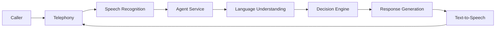

This page provides a high-level overview of how PolyAI's conversational AI system works. Understanding this architecture helps you design more effective agents and troubleshoot issues.

## How conversations flow

When a caller connects to your PolyAI agent, the conversation passes through several key stages:

### 1. Telephony layer

The telephony layer handles the phone connection between the caller and your agent. PolyAI's enterprise-ready telephony infrastructure is built for reliability, scalability, and seamless failover.

**Architecture highlights:**

- **Kamilio load balancer**: Distributes incoming calls across multiple media servers for optimal performance
- **Multiple Asterisk media servers**: Redundant media processing ensures continuous service availability
- **Automatic failover**: If a primary service experiences issues, calls are automatically routed to secondary services
- **Contact center transfer**: Automatic transfer back to your contact center if the PolyAI service goes down, ensuring zero dropped calls
- **Enterprise reliability**: Designed for high-volume, mission-critical voice applications

**Supported telephony providers:**

- Twilio
- Amazon Connect
- SIP-based systems
- Custom telephony integrations

This multi-layered approach ensures your voice agents remain available and responsive even during peak traffic or service disruptions.

See also: [Voice integrations](/integrations/voice/introduction)

### 2. Speech recognition (ASR)

The caller's speech is converted to text using automatic speech recognition (ASR). PolyAI's platform integrates with multiple ASR providers to ensure reliability, accuracy, and flexibility across different use cases and languages.

**Supported ASR providers:**

- Google Cloud Speech-to-Text
- Amazon Transcribe
- Microsoft Azure Speech Services
- Deepgram
- Custom ASR integrations

The platform automatically routes requests to the optimal provider based on language, domain, and availability. This multi-provider approach ensures enterprise-grade reliability with automatic fallback if a primary service experiences issues.

**Key capabilities:**

- Multiple languages and accents
- Industry-specific vocabulary
- Real-time transcription with low latency
- ASR biasing and keyphrase boosting for domain-specific terms
- Automatic provider failover for high availability

See also: [ASR](/glossary/introduction#asr-automatic-speech-recognition), [ASR biasing](/glossary/introduction#asr-biasing), [Global ASR configuration](/learn/guides/advanced/global-asr)

### 3. Agent service

The agent service is the core of the system, powered by PolyAI's LLM-native architecture. It receives the transcribed user input and coordinates:

- **Language understanding**: Uses large language models (LLMs) to interpret what the user said, their intent, and extract entities in a conversational, context-aware manner
- **Decision making (Policy engine)**: Determines the appropriate response based on your configured [Managed Topics](/managed-topics/introduction), [flows](/flows/introduction), and [rules](/agent-settings/rules) by executing nodes in priority order
- **Knowledge retrieval**: Leverages RAG (Retrieval-Augmented Generation) to pull relevant information from both [Managed Topics](/managed-topics/introduction) and [Connected Knowledge](/connected-knowledge/introduction) sources
- **Action execution**: Triggers any necessary [function calls](/function/introduction) or API integrations
- **Context management**: Maintains dialogue context and turn history throughout the conversation

The LLM-native approach enables more natural, flexible conversations compared to traditional intent-based NLU systems, allowing the agent to understand nuanced requests and maintain context across complex multi-turn dialogues.

See also: [LLM](/glossary/introduction#llm-large-language-model), [Policy engine](/glossary/introduction#policy-engine), [Node](/glossary/introduction#node), [RAG](/glossary/introduction#rag-retrieval-augmented-generation)

### 4. Response generation

Based on the decision engine's output, the system generates an appropriate response using your agent's configured voice, tone, and knowledge. This may involve:

- Retrieving relevant information using RAG (Retrieval-Augmented Generation)
- Applying global rules and response control filters
- Generating contextually appropriate responses via the LLM

See also: [RAG](/glossary/introduction#rag-retrieval-augmented-generation), [LLM](/glossary/introduction#llm-large-language-model), [Response control](/glossary/introduction#response-control)

### 5. Text-to-speech (TTS)

The generated response is converted to natural-sounding speech and played back to the caller. PolyAI integrates with multiple TTS providers to deliver high-quality, natural-sounding voices across languages and use cases.

**Supported TTS providers:**

- Google Cloud Text-to-Speech
- Amazon Polly
- Microsoft Azure Speech Services
- ElevenLabs
- Custom TTS integrations

**Audio management and caching:**

PolyAI's audio management system optimizes user experience and reduces latency through intelligent caching:

- **Audio cache**: Frequently used phrases (greetings, confirmations, transfer messages) are cached for instant playback, reducing latency and ensuring consistency
- **Cache requirements**: Audio is cached when the same utterance is generated at least twice within a 24-hour window
- **Regeneration control**: Edit cached audio directly in Agent Studio to adjust stability, clarity, and pronunciation
- **UX optimization**: Fine-tune voice quality for critical phrases without regenerating audio on every call

**Additional capabilities:**

- SSML markup for fine-grained control over pronunciation, pauses, and emphasis
- Custom pronunciations using IPA notation
- Multiple voice options and custom voice cloning
- Real-time audio streaming for low-latency responses

See also: [TTS](/glossary/introduction#tts-text-to-speech), [SSML](/glossary/introduction#ssml-speech-synthesis-markup-language), [Pronunciations](/glossary/introduction#pronunciations), [Audio Management](/learn/guides/advanced/audio-management)

## Data storage

During a conversation, PolyAI maintains several types of data:

| Data type | Purpose | Retention |
|-----------|---------|-----------|
| Dialogue context | Tracks the full dialogue history, state variables, and turn data for the current call | Duration of call |
| Turn data | Stores individual exchanges (user input, agent response, intents, entities) for analytics and review | Configurable |
| Conversation metadata | Records conversation-level information (duration, variant, environment) | Configurable |
| Metrics | Records events for reporting and dashboards | Configurable |

See also: [Dialogue context](/glossary/introduction#dialogue-context), [Turn](/glossary/introduction#turn), [Conversation metadata](/glossary/introduction#conversation-metadata)

## Key components you configure

As a builder in Agent Studio, you control how the agent behaves through:

- **[Managed Topics](/managed-topics/introduction)**: Information the agent uses to answer questions
- **[Flows](/flows/introduction)**: Structured conversation paths for complex tasks
- **[Functions](/function/introduction)**: Custom logic and external integrations
- **[Rules](/agent-settings/rules)**: Global behavior constraints
- **[Voice settings](/voice/introduction)**: How the agent sounds

## Processing a single turn

Each turn in a conversation follows this sequence:

<Steps>
  <Step title="Receive input">
    The system captures and transcribes the caller's speech using ASR.
  </Step>
  <Step title="Understand intent">
    The NLU component analyzes what the caller wants and extracts entities.
  </Step>
  <Step title="Retrieve knowledge">
    Relevant information is fetched from your Managed Topics using RAG (Retrieval-Augmented Generation) via the Ragdoll service.
  </Step>
  <Step title="Execute logic">
    The policy engine evaluates nodes and any active flows or functions are executed.
  </Step>
  <Step title="Generate response">
    The LLM composes a response based on all available context, applying global rules and response control filters.
  </Step>
  <Step title="Deliver response">
    The response is synthesized to speech via TTS and played to the caller.
  </Step>
</Steps>

See also: [Turn](/glossary/introduction#turn), [Policy engine](/glossary/introduction#policy-engine)

## Related resources

<CardGroup cols={2}>
  <Card title="Glossary" icon="book" href="/glossary/introduction">
    Definitions of key terms used throughout the platform.
  </Card>
  <Card title="Getting started" icon="rocket" href="/get-started/quickstart">
    Build your first agent step by step.
  </Card>
</CardGroup>
