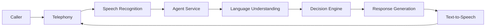

This page provides a high-level overview of how PolyAI's conversational AI system works. Understanding this architecture helps you design more effective agents and troubleshoot issues.

## How conversations flow

When a caller connects to your PolyAI agent, the conversation passes through several key stages:

### 1. Telephony layer

The telephony layer handles the phone connection between the caller and your agent. PolyAI supports multiple telephony providers including Twilio, Amazon Connect, and SIP-based systems.

### 2. Speech recognition (ASR)

The caller's speech is converted to text using automatic speech recognition (ASR). PolyAI uses advanced models optimized for conversational accuracy, with support for:

- Multiple languages and accents
- Industry-specific vocabulary
- Real-time transcription
- ASR biasing and keyphrase boosting for domain-specific terms

See also: [ASR](/glossary/introduction#asr-automatic-speech-recognition), [ASR biasing](/glossary/introduction#asr-biasing)

### 3. Agent service

The agent service is the core of the system. It receives the transcribed user input and coordinates:

- **Language understanding**: Interprets what the user said and their intent
- **Decision making**: Determines the appropriate response based on your configured Managed Topics, flows, and rules
- **Action execution**: Triggers any necessary function calls or API integrations

### 4. Response generation

Based on the decision engine's output, the system generates an appropriate response using your agent's configured voice, tone, and knowledge.

### 5. Text-to-speech

The generated response is converted to natural-sounding speech and played back to the caller.

## Data storage

During a conversation, PolyAI maintains several types of data:

| Data type | Purpose | Retention |
|-----------|---------|-----------|
| Conversation context | Tracks the full dialogue history for the current call | Duration of call |
| Turn data | Stores individual exchanges for analytics and review | Configurable |
| Metrics | Records events for reporting and dashboards | Configurable |

## Key components you configure

As a builder in Agent Studio, you control how the agent behaves through:

- **[Managed Topics](/managed-topics/introduction)**: Information the agent uses to answer questions
- **[Flows](/flows/introduction)**: Structured conversation paths for complex tasks
- **[Functions](/function/introduction)**: Custom logic and external integrations
- **[Rules](/agent-settings/rules)**: Global behavior constraints
- **[Voice settings](/voice/introduction)**: How the agent sounds

## Processing a single turn

Each turn in a conversation follows this sequence:

<Steps>
  <Step title="Receive input">
    The system captures and transcribes the caller's speech.
  </Step>
  <Step title="Understand intent">
    The language understanding component analyzes what the caller wants.
  </Step>
  <Step title="Retrieve knowledge">
    Relevant information is fetched from your Managed Topics using RAG (Retrieval-Augmented Generation).
  </Step>
  <Step title="Execute logic">
    Any active flows or functions are evaluated and executed.
  </Step>
  <Step title="Generate response">
    The system composes a response based on all available context.
  </Step>
  <Step title="Deliver response">
    The response is synthesized to speech and played to the caller.
  </Step>
</Steps>

## Related resources

<CardGroup cols={2}>
  <Card title="Glossary" icon="book" href="/glossary/introduction">
    Definitions of key terms used throughout the platform.
  </Card>
  <Card title="Getting started" icon="rocket" href="/get-started/quickstart">
    Build your first agent step by step.
  </Card>
</CardGroup>
