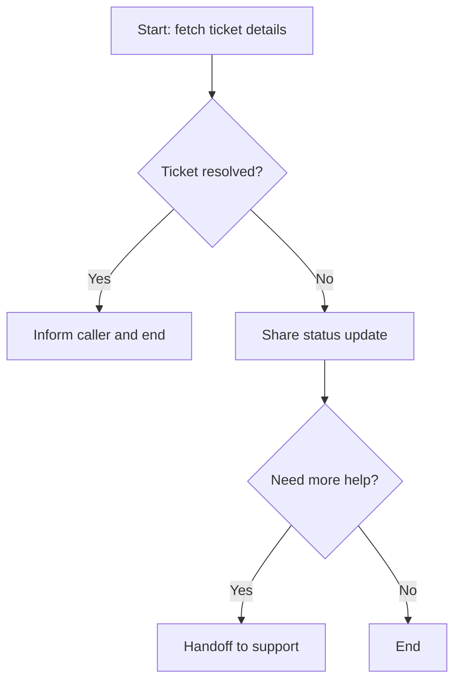

By the end of this guide, your agent will route callers dynamically — checking a CRM or backend API at the start of each call, then branching into the right flow, handoff, or topic based on the response.

## What you will build

An agent that:
1. Looks up the caller in your CRM at call start
2. Routes VIP callers directly to a dedicated team
3. Routes callers with open tickets into a ticket-status flow
4. Lets managers toggle routing rules without code changes via configuration builder

| Feature | PolyAI capability | Reference |
|---|---|---|
| Caller lookup at call start | Start function + `conv.api` | [Start function](/tools/start-function), [conv.api](/tools/classes/conv-api) |
| Conditional flow entry | `conv.goto_flow()` | [Triggering flows](/flows/triggering-flows) |
| Conditional handoff | `handoff` return value | [Call handoff](/call-handoff/introduction), [Return values](/tools/return-values) |
| Manager-controlled toggles | Configuration builder | [Configuration builder](/configuration-builder/introduction) |

## Prerequisites

- A PolyAI agent with [environments](/environments-and-versions/introduction) configured
- A CRM or backend API that accepts a phone number and returns caller context
- The API configured in **Configure > APIs** (see [conv.api setup](/tools/classes/conv-api))
- Python familiarity

## Step 1: Configure your API

Go to **Configure > APIs** and add your CRM API:

| Field | Value |
|---|---|
| API name | `crm_api` |
| Base URL (Sandbox) | `https://api-staging.example.com` |
| Base URL (Live) | `https://api.example.com` |
| Auth type | Bearer token |

Add an operation:

| Field | Value |
|---|---|
| Operation name | `lookup_caller` |
| Method | GET |
| Resource | `/customers/{phone_number}` |

The environment-specific base URL means your function code works identically in Sandbox, Pre-release, and Live — no branching required. See [environment awareness](/tools/classes/conv-api#environment-awareness).

## Step 2: Write the routing function

Go to **Build > Tools** and create a start function called `route_caller`:

```python
def route_caller(conv: Conversation):
    """Look up the caller and route based on their profile."""
    if not conv.caller_number:
        return  # webchat or unknown — use default behavior

    response = conv.api.crm_api.lookup_caller(
        phone_number=conv.caller_number
    )

    if response.status_code == 404:
        conv.log.info("New caller — no CRM record")
        return  # default behavior, no special routing

    if response.status_code >= 500:
        conv.log.error("CRM API error", status=response.status_code)
        return  # fail open — don't block the call

    caller = response.json()
    conv.state.caller_name = caller.get("name", "")
    conv.state.caller_tier = caller.get("tier", "standard")
    conv.state.open_ticket_id = caller.get("open_ticket_id")

    # Route VIP callers to dedicated team
    if caller.get("tier") == "vip":
        conv.log.info("VIP caller — routing to dedicated team")
        return {
            "utterance": f"Welcome back, {caller['name']}. Let me connect you with your dedicated support team.",
            "handoff": {
                "type": "VIP_SUPPORT",
                "reason": "VIP_CALLER",
                "refer": {"phone_number": "VIP_SUPPORT_NUMBER"}
            }
        }

    # Route callers with open tickets into the ticket status flow
    if caller.get("open_ticket_id"):
        conv.log.info(f"Open ticket: {caller['open_ticket_id']}")
        conv.goto_flow("Ticket status")
        return
```

Set this as your start function in **Build > Tools > Start function**.

### Error handling

The function follows a "fail open" pattern — if the CRM is unavailable, the agent proceeds normally instead of blocking the caller. Always check for server errors before routing:

```python
if response.status_code >= 500:
    conv.log.error("CRM unavailable", status=response.status_code)
    return  # proceed with default behavior
```

## Step 3: Build the ticket status flow

Go to **Build > Flows** and create a flow called `Ticket status`:



**Start step prompt:**
```text
The caller has an open support ticket (ID: {{open_ticket_id}}). 
Look up the ticket status and share it with the caller.
If their name is available, greet them by name: {{caller_name}}.
```

**Transition function:**
```python
def fetch_ticket(conv: Conversation, flow: Flow):
    response = conv.api.crm_api.get_ticket(
        ticket_id=conv.state.open_ticket_id
    )

    if response.status_code == 200:
        ticket = response.json()
        conv.state.ticket_status = ticket["status"]
        conv.state.ticket_summary = ticket["summary"]

        if ticket["status"] == "resolved":
            flow.goto_step("Resolved")
        else:
            flow.goto_step("Share status")
    else:
        flow.goto_step("Share status")
    return
```

## Step 4: Add manager-controlled routing toggles

Use [configuration builder](/configuration-builder/introduction) to let managers control routing without code changes.

### Define the schema

Go to **Build > Configuration Builder > Schema** and add:

```json
{
  "title": "Routing settings",
  "type": "object",
  "properties": {
    "vip_routing_enabled": {
      "type": "boolean",
      "title": "VIP routing",
      "description": "Route VIP callers to dedicated team",
      "default": true
    },
    "ticket_flow_enabled": {
      "type": "boolean",
      "title": "Ticket status flow",
      "description": "Route callers with open tickets to the status flow",
      "default": true
    },
    "fallback_destination": {
      "type": "string",
      "title": "Fallback handoff destination",
      "description": "Where to route callers when the CRM is unavailable",
      "default": "GENERAL_SUPPORT"
    }
  }
}
```

### Read config in your function

Update the start function to check runtime configuration:

```python
def route_caller(conv: Conversation):
    config = conv.real_time_config

    if not conv.caller_number:
        return

    response = conv.api.crm_api.lookup_caller(
        phone_number=conv.caller_number
    )

    if response.status_code >= 500:
        conv.log.error("CRM unavailable", status=response.status_code)
        if config.get("fallback_destination"):
            return {
                "utterance": "Let me connect you with our support team.",
                "handoff": {
                    "type": config["fallback_destination"],
                    "reason": "CRM_UNAVAILABLE",
                    "refer": {"phone_number": config["fallback_destination"]}
                }
            }
        return

    if response.status_code == 404:
        return

    caller = response.json()
    conv.state.caller_name = caller.get("name", "")

    # Check VIP routing toggle
    if caller.get("tier") == "vip" and config.get("vip_routing_enabled", True):
        return {
            "utterance": f"Welcome back, {caller['name']}. Connecting you now.",
            "handoff": {
                "type": "VIP_SUPPORT",
                "reason": "VIP_CALLER",
                "refer": {"phone_number": "VIP_SUPPORT_NUMBER"}
            }
        }

    # Check ticket flow toggle
    if caller.get("open_ticket_id") and config.get("ticket_flow_enabled", True):
        conv.state.open_ticket_id = caller["open_ticket_id"]
        conv.goto_flow("Ticket status")
        return
```

Managers can now enable or disable VIP routing and ticket flows from the **Configuration Builder > Data** tab — no publish required. Changes take effect immediately.

<Warning>
Configuration builder data changes are live instantly within each environment. Test in Sandbox first before changing Live values. See [configuration builder](/configuration-builder/introduction) for details.
</Warning>

## Sample call transcripts

<Tabs>
  <Tab title="VIP caller">
    ```text
    [Start function runs → CRM returns tier: "vip", name: "Sarah Chen"]
    Agent: Welcome back, Sarah. Connecting you now.
    [Call transfers to VIP_SUPPORT with reason VIP_CALLER]
    ```
  </Tab>
  <Tab title="Caller with open ticket">
    ```text
    [Start function runs → CRM returns open_ticket_id: "TK-4821"]
    Agent: Hi there, how can I help today?
    [Agent enters Ticket Status flow → fetches ticket TK-4821]
    Agent: I can see you have an open ticket about your billing query. 
           It's currently being reviewed by our team — the last update 
           was yesterday. Would you like me to connect you with someone 
           for a faster resolution?
    Caller: Yes please.
    Agent: Connecting you now.
    [Handoff to support team]
    ```
  </Tab>
  <Tab title="New caller">
    ```text
    [Start function runs → CRM returns 404]
    Agent: Thanks for calling. How can I help you today?
    Caller: I'd like to check on a delivery.
    [Default managed topics handle the request — no special routing]
    ```
  </Tab>
</Tabs>

## Test the routing

| Scenario | How to test | Expected behavior |
|---|---|---|
| VIP caller | Call from a number with a VIP CRM record | Immediate handoff to VIP team |
| Caller with open ticket | Call from a number with an open ticket | Enters ticket status flow |
| New caller | Call from an unknown number | Default agent behavior |
| CRM unavailable | Disable CRM in Sandbox API config | Fail open or route to fallback |
| Toggle disabled | Turn off VIP routing in Configuration Builder | VIP callers get default behavior |

## Related pages

<CardGroup cols={2}>
  <Card title="conv.api reference" icon="code" href="/tools/classes/conv-api">
    Calling external APIs from functions
  </Card>
  <Card title="Triggering flows" icon="diagram-project" href="/flows/triggering-flows">
    Starting flows from functions and topics
  </Card>
  <Card title="Call handoff" icon="phone-arrow-right" href="/call-handoff/introduction">
    Configure handoff destinations
  </Card>
  <Card title="Configuration builder" icon="gear" href="/configuration-builder/introduction">
    Manager-controlled settings without code changes
  </Card>
</CardGroup>
