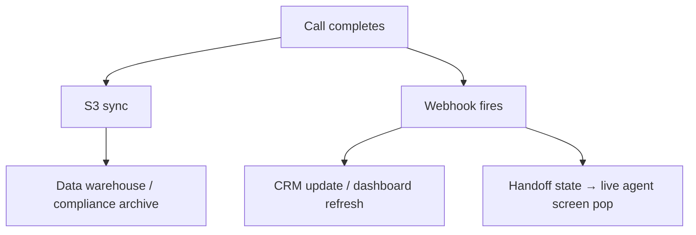

By the end of this guide, you will have call transcripts, recordings, and metadata flowing from PolyAI into your data warehouse — either through automated S3 sync for bulk storage or the Conversations API for real-time integration.

## What you will build

| Requirement | Solution | Reference |
|---|---|---|
| Bulk archival of recordings and transcripts | AWS S3 sync | [S3 integration](/call-data/s3-to-s3) |
| Real-time metadata retrieval | Conversations API v3 (pull) | [List conversations](/call-data/conversations-api/list-conversations) |
| Live dashboard updates | Webhooks (push) | [Webhooks API](/api-reference/webhooks/introduction) |
| End-of-call routing context | Handoff states | [Handoff states](/call-data/conversations-api/handoff-states) |

## Choose your export method

<Tabs>
  <Tab title="S3 sync (bulk)">
    Best for compliance archival, ML pipelines, and high-volume analytics.

    **What gets synced:** transcripts (JSON), audio recordings (WAV/MP3), and metadata (JSON) — automatically after each call.

    **Setup:**

    <Steps>
      <Step title="Contact PolyAI">
        Reach out to your account manager to discuss data transfer requirements.
      </Step>
      <Step title="Provide S3 bucket details">
        Share your AWS account ID, target S3 bucket ARN, and preferred region.
      </Step>
      <Step title="Configure IAM policies">
        Apply the IAM policy template PolyAI provides to grant write access to your bucket.
      </Step>
      <Step title="Test and validate">
        PolyAI runs test transfers. Verify the data format and file structure.
      </Step>
      <Step title="Go live">
        Enable continuous sync for your production environment.
      </Step>
    </Steps>

    Once live, every call in your production environment is automatically synced to your bucket. No code required on your side after initial setup.
  </Tab>
  <Tab title="Conversations API (real-time)">
    Best for CRM integration, real-time dashboards, and triggered workflows.

    **Pull model** — your system periodically requests data:

    ```mermaid
    flowchart LR
        A[Your system] -->|Periodic request| B[PolyAI API]
        B -->|Conversation data| A
    ```

    **Push model** — PolyAI sends updates to your webhook:

    ```mermaid
    flowchart LR
        C[PolyAI] -->|Real-time webhook| D[Your system]
    ```

    ### Set up pull-based retrieval

    Use the [Conversations API v3](/api-reference/conversations/v3/endpoint/get-conversations) to retrieve conversations programmatically. Each response includes:
    - Full transcript with turn-level detail
    - All `conv.state` variables set during the call
    - Duration, environment, variant, and handoff state

    **API key setup:** Generate an API key in **Configure > API Keys** (see [API keys](/secrets/api-keys)).

    ### Set up push-based webhooks

    Go to **Configure > APIs** and create a webhook endpoint using the [Webhooks API](/api-reference/webhooks/introduction):

    1. Register your endpoint URL
    2. Configure which events to receive (conversation completed, handoff triggered)
    3. Store the signing secret to verify webhook payloads

    See [create webhook endpoint](/api-reference/webhooks/endpoint/create-webhook-endpoint) for the full API reference.
  </Tab>
</Tabs>

## Combine methods for a complete pipeline

For most enterprise deployments, use both methods together:



- **S3 sync** handles bulk storage and compliance — recordings, full transcripts, metadata
- **Webhooks** trigger immediate actions — CRM ticket creation, dashboard refresh, handoff context delivery
- **Pull API** fills gaps for ad-hoc queries or backfills

## Accessing call data in Agent Studio

You can also review individual calls directly in the platform:

- **Conversation Review** — go to **Analytics > Conversations** to browse transcripts, listen to recordings, and annotate calls. See [conversation review](/analytics/conversations/review).
- **Studio transcripts** — view richly-detailed transcripts with tool call visibility. See [studio transcripts](/call-data/studio-transcripts).

## Related pages

<CardGroup cols={2}>
  <Card title="S3 integration" icon="hard-drive" href="/call-data/s3-to-s3">
    Full setup guide for AWS S3 sync
  </Card>
  <Card title="Conversations API v3" icon="code" href="/api-reference/conversations/v3/endpoint/get-conversations">
    API reference for retrieving conversation data
  </Card>
  <Card title="Webhooks API" icon="webhook" href="/api-reference/webhooks/introduction">
    Set up real-time event notifications
  </Card>
  <Card title="Handoff states" icon="phone-arrow-right" href="/call-data/conversations-api/handoff-states">
    Retrieve end-of-call routing context
  </Card>
</CardGroup>
