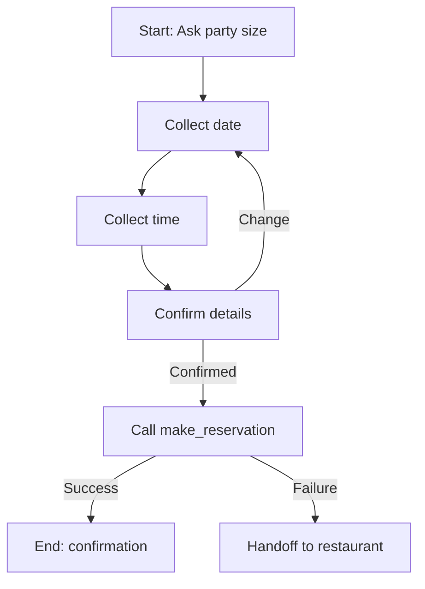

By the end of this guide, you will have a hotel reservations agent that answers guest questions, books tables through OpenTable, collects reservation details via a flow, and hands off to the front desk when needed.

## What you will build

| Feature | PolyAI capability | Reference |
|---|---|---|
| Answer FAQs (hours, parking, amenities) | Managed topics | [Managed topics](/managed-topics/introduction) |
| Book a restaurant table | OpenTable integration via `conv.api` | [OpenTable](/integrations/opentable), [conv.api](/tools/classes/conv-api) |
| Collect guest details step-by-step | Flows with ASR biasing | [Flows](/flows/introduction), [ASR biasing](/flows/asr-biasing) |
| Transfer to front desk | Call handoff | [Call handoff](/call-handoff/introduction) |

## Prerequisites

- A PolyAI agent with at least one [environment](/environments-and-versions/introduction) set up
- An [OpenTable](https://www.opentable.com/restaurant-solutions/) account (Core or Pro)
- Your OpenTable `client_id` and `client_secret` stored in [Secrets](/secrets/introduction)

## Step 1: Create FAQ topics

Go to **Build > Knowledge > Managed Topics** and create topics for common guest questions. Each topic needs a name, sample questions, and content.

**Example topic: `hotel_check_in_times`**

| Field | Value |
|---|---|
| Topic name | `hotel_check_in_times` |
| Sample questions | "What time is check-in?", "When can I check in?", "Check-in time?", "What's the earliest I can arrive?" |
| Content | "Check-in is from 3 p.m. and checkout is at 11 a.m. If you need early check-in or late checkout, I can connect you with the front desk." |

Create similar topics for:
- `hotel_parking` — parking availability and pricing
- `hotel_amenities` — pool, gym, spa hours
- `hotel_wifi` — network name and password

<Tip>
Keep topic names specific to a single intent. `hotel_check_in_times` is better than `hotel_info` — see [managed topics best practices](/managed-topics/introduction) for why retrieval depends on specificity.
</Tip>

## Step 2: Set up the OpenTable API

### Configure the API in Agent Studio

Go to **Configure > APIs** and add a new API:

| Field | Value |
|---|---|
| API name | `opentable_api` |
| Base URL (Sandbox) | `https://oauth-pp.opentable.com` |
| Base URL (Live) | `https://oauth.opentable.com` |
| Auth type | OAuth 2.0 Client Credentials |

Add two operations:

1. **`get_token`** — `POST /api/v2/oauth/token?grant_type=client_credentials`
2. **`create_booking`** — `POST /inhouse/v1/booking/{rid}/reservations`

### Store credentials in secrets

Go to **Configure > Secrets** and add your OpenTable `client_id` and `client_secret`. Reference them in your function with `conv.env`:

```python
client_id = conv.env["OPENTABLE_CLIENT_ID"]
client_secret = conv.env["OPENTABLE_CLIENT_SECRET"]
```

See [Secrets](/secrets/how-to-setup) for setup instructions.

### Write the booking function

Go to **Build > Tools** and create a function called `make_reservation`:

```python
import base64

def make_reservation(conv: Conversation, party_size: int, date: str, time: str):
    """
    Book a restaurant table via OpenTable.
    Args:
        party_size: Number of guests
        date: Date in YYYY-MM-DD format
        time: Time in HH:MM format
    """
    # Get access token
    client_id = conv.env["OPENTABLE_CLIENT_ID"]
    client_secret = conv.env["OPENTABLE_CLIENT_SECRET"]
    auth_string = f"{client_id}:{client_secret}"
    encoded_auth = base64.b64encode(auth_string.encode()).decode()

    token_response = conv.api.opentable_api.get_token(
        headers={"Authorization": f"Basic {encoded_auth}"}
    )

    if token_response.status_code != 200:
        conv.log.error("Token request failed", status=token_response.status_code)
        return {"utterance": "I'm having trouble connecting to the booking system right now. Let me transfer you to someone who can help."}

    access_token = token_response.json()["access_token"]

    # Make the booking
    booking_response = conv.api.opentable_api.create_booking(
        rid=conv.state.restaurant_id,
        headers={"Authorization": f"Bearer {access_token}"},
        json={
            "first_name": conv.state.guest_first_name,
            "last_name": conv.state.guest_last_name,
            "phone": {"number": conv.caller_number, "country_code": "US"},
            "party_size": party_size,
            "date_time": f"{date}T{time}:00"
        }
    )

    if booking_response.status_code == 200:
        data = booking_response.json()
        return {"utterance": f"You're all set — table for {party_size} on {date} at {time}."}
    else:
        conv.log.error("Booking failed", status=booking_response.status_code)
        return {"utterance": "I wasn't able to complete that booking. Let me connect you with the restaurant directly."}
```

## Step 3: Build a reservation flow

Go to **Build > Flows** and create a flow called `restaurant_reservation`. This collects the details your booking function needs.

### Flow structure



### Start step: collect party size

**Prompt:**
```text
Ask how many guests will be dining. Once you have a number, call save_party_size.
```

**Transition function:**
```python
def save_party_size(conv: Conversation, flow: Flow, party_size: int):
    conv.state.party_size = party_size
    flow.goto_step("Collect date")
    return
```

### Middle step: collect date

**Prompt:**
```text
Ask what date they'd like to book. The user will say a date — extract it and 
convert to YYYY-MM-DD format before calling save_date.
```

Enable **ASR biasing** for **Date** on this step.

**Transition function:**
```python
def save_date(conv: Conversation, flow: Flow, date: str):
    conv.state.reservation_date = date
    flow.goto_step("Collect time")
    return
```

### Confirmation step

**Prompt:**
```text
Confirm the booking: {{party_size}} guests on {{reservation_date}} at 
{{reservation_time}}. If the caller confirms, call confirm_booking. 
If they want to change something, call restart_booking.
```

**Few-shot examples:**
```text
User: That sounds right.
Agent: I'm booking that now.

User: Actually, can we do 7 instead of 6?
Agent: No problem — how many guests were you thinking?
```

## Step 4: Trigger the flow from a topic

Create a managed topic called `restaurant_booking_request`:

| Field | Value |
|---|---|
| Topic name | `restaurant_booking_request` |
| Sample questions | "I'd like to book a table", "Can I make a dinner reservation?", "Reserve a table for tonight", "Book restaurant" |
| Content | "I can help with that." |
| Actions | Type `/Flow` and select `restaurant_reservation` |

See [triggering flows](/flows/triggering-flows) for details on the `/Flow` shortcut.

## Step 5: Add a handoff fallback

Go to **Configure > Call Handoffs** and add a destination:

| Field | Value |
|---|---|
| Name | `front_desk` |
| SIP method | REFER |
| Route | Your front desk SIP URI |

Then add a managed topic `request_human_agent`:

| Field | Value |
|---|---|
| Topic name | `request_human_agent` |
| Sample questions | "Can I speak to someone?", "Transfer me", "I want a real person", "Get me the front desk" |
| Content | (leave empty) |
| Actions | `Immediately call {{front_desk}} to transfer the call.` |

## Test and promote

1. **Sandbox** — test each topic individually, then run through the full booking flow
2. **Pre-release** — test with a real phone number and end-to-end OpenTable calls (use the QA endpoint)
3. **Live** — promote once all paths (success, failure, handoff) are verified

## Related pages

<CardGroup cols={2}>
  <Card title="OpenTable integration" icon="utensils" href="/integrations/opentable">
    Full OpenTable setup and authorization reference
  </Card>
  <Card title="Flows overview" icon="diagram-project" href="/flows/introduction">
    How flows work — steps, prompts, and transitions
  </Card>
  <Card title="conv.api reference" icon="code" href="/tools/classes/conv-api">
    Calling APIs from functions with automatic environment handling
  </Card>
  <Card title="Call handoff" icon="phone-arrow-right" href="/call-handoff/introduction">
    Configure handoff destinations and SIP routing
  </Card>
</CardGroup>
