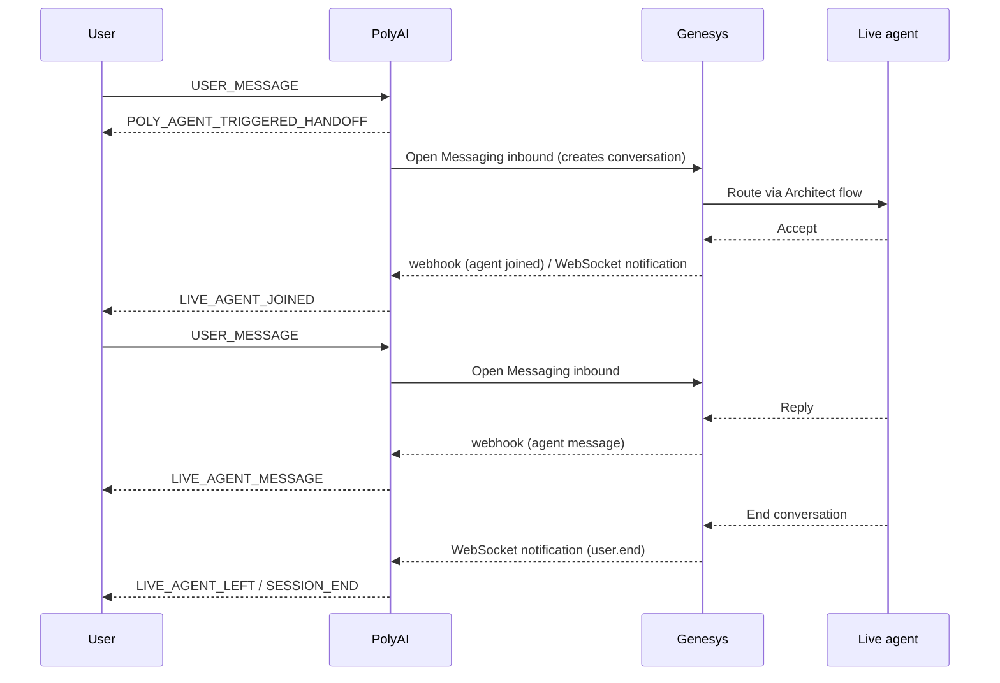

Hand off live chat sessions from your PolyAI agent to a human agent in Genesys Cloud. The integration uses the Genesys Cloud [Open Messaging](https://developer.genesys.cloud/commdigital/digital/openmessaging/) platform and works alongside your existing PolyAI [webchat widget](/widgets/configure) or any client built on the [Messaging API](/api-reference/messaging/introduction).

<Note>
This page covers **chat** handoff. For voice handoffs to Genesys Cloud (SIP, BYOC), see [Genesys voice integration](/integrations/voice/sip/genesys).
</Note>

## How it works

When your PolyAI agent decides to escalate, the conversation is routed into a Genesys Open Messaging integration and queued to a live agent through your Architect inbound message flow. User messages, agent replies, and lifecycle events (agent joined, agent left, customer ended) flow bidirectionally for the rest of the session.



Three transport channels are used together:

| Direction | Transport | Purpose |
|-----------|-----------|---------|
| PolyAI → Genesys | REST (Open Messaging inbound API) | Send user messages into Genesys |
| Genesys → PolyAI | Webhook | Deliver agent messages and typing indicators |
| Genesys → PolyAI | WebSocket notification channel | Deliver lifecycle events (agent joined, agent left, customer ended) |

The user-facing event flow on your client is unchanged — you still consume the same handoff events documented in [Messaging API → Handoff to live agent](/api-reference/messaging/handoff).

## Prerequisites

- A Genesys Cloud organization with **Open Messaging** enabled.
- Admin access to create OAuth clients, integrations, and Architect message flows.
- A PolyAI project with the [webchat channel](/webchat/chat-configuration) configured.

## Set up Genesys Cloud

### 1. Create an OAuth client

In Genesys Cloud, go to **Admin → Integrations → OAuth** and create a client with the **Client Credentials** grant type. Assign a role that includes the following permissions:

| Permission | Used for |
|-----------|----------|
| `conversation:message:create` | Sending user messages into Genesys |
| `conversation:message:receive` | Receiving agent message events |
| `messaging:integration:view` | Resolving the Open Messaging integration |
| `conversation:communication:disconnect` | Ending the conversation when the user leaves |
| `analytics:conversationDetail:view` | Subscribing to lifecycle notification topics |

Note the **Client ID** and **Client Secret** — you'll provide them to PolyAI in the next step.

### 2. Create an Open Messaging integration

Go to **Admin → Message → Platforms** and add an **Open Messaging** integration.

- Set the **Outbound Notification Webhook URL** to the PolyAI webhook endpoint for your project:

  ```
  https://<your-polyai-region>/handoff/webhooks/genesys/{account_id}/{project_id}/{client_env}/events
  ```

  Your PolyAI representative will provide the exact base URL and the values for `account_id`, `project_id`, and `client_env` (`sandbox`, `pre-release`, or `live`).

- Set the **Webhook Signature Secret Token** to a value you generate. You'll provide the same value to PolyAI as `webhook_secret`. PolyAI validates each webhook using a base64-encoded HMAC SHA256 signature.

Note the **Integration ID** that Genesys assigns after creating the integration.

### 3. Route to an agent queue

Build (or update) an [Architect inbound message flow](https://help.mypurecloud.com/articles/about-architect-flows/) that routes incoming Open Messaging conversations to the agent queue you want to receive handoffs. Attach the flow to the integration.

## Configure the integration in PolyAI

Provide the following credentials to PolyAI for each environment (`sandbox`, `pre-release`, `live`). These are stored encrypted and looked up per tenant at runtime.

| Field | Description |
|-------|-------------|
| `client_id` | OAuth client ID from step 1 |
| `client_secret` | OAuth client secret from step 1 |
| `region` | Genesys Cloud API region host (for example, `usw2.pure.cloud` or `mypurecloud.com`) |
| `integration_id` | Open Messaging integration ID from step 2 |
| `webhook_secret` | The signature secret token you set on the Open Messaging integration |

Credentials can be managed through the messaging handoff integrations API:

```http
PUT /v1/accounts/{account_id}/projects/{project_id}/messaging-handoff-integrations/genesys/{client_env}
Content-Type: application/json

{
  "_version": 2,
  "_assignments": {
    "__default__": "default"
  },
  "_credential_sets": {
    "default": {
      "live": {
        "client_id": "...",
        "client_secret": "...",
        "region": "usw2.pure.cloud",
        "integration_id": "...",
        "webhook_secret": "..."
      }
    }
  }
}
```

Use `sandbox` or `pre-release` for non-production environments. PolyAI's webhook endpoint is per-tenant — credentials configured for one environment are only used when serving traffic for that environment.

## Trigger handoff from your agent

Configure when the agent escalates the same way you would for any chat handoff:

- A [Managed Topic handoff action](/managed-topics/how-to-setup-action/handoff)
- A [flow handoff step](/flows/no-code/advanced-steps)
- A function call to `conv.call_handoff(destination="...")`

Set the handoff `destination` to the Genesys destination configured for your project. Pass any context the live agent needs in the `data` field — see [Handoff context handover](/call-handoff/introduction#handoff-context-handover) for the recommended fields (`customer_id`, `reason`, verification status, and so on).

## Client-side behavior

No client changes are required. Once the handoff is wired up, your widget or [Messaging API](/api-reference/messaging/introduction) client receives the standard events:

| Event | Triggered by |
|-------|--------------|
| `POLY_AGENT_TRIGGERED_HANDOFF` | The PolyAI agent decided to escalate |
| `LIVE_AGENT_JOINED` | A Genesys agent accepted the conversation |
| `LIVE_AGENT_TYPING` | Genesys agent started typing |
| `LIVE_AGENT_MESSAGE` | Genesys agent sent a message |
| `LIVE_AGENT_LEFT` | The agent disconnected the conversation in Genesys |
| `SESSION_END` | Either side ended the session |

If the user ends the session first (`USER_END_SESSION`), PolyAI disconnects the customer participant in Genesys so the conversation closes cleanly on both sides.

## Limits and operational notes

- **Notification channels per OAuth client:** 20. PolyAI uses one channel per Genesys tenant per worker, so most tenants are well below this limit.
- **Topic subscriptions per channel:** 1,000. Each active handoff consumes three subscriptions (`user.start`, `user.end`, `customer.end`).
- **Webhook signatures:** PolyAI prefers base64-encoded HMAC SHA256 (the Genesys default) and falls back to hex.
- **Failover:** If the WebSocket notification channel drops, PolyAI reconnects with exponential backoff (1s base, 30s cap, 10 retries) and resubscribes to in-flight conversations.

## Related pages

<CardGroup cols={2}>
  <Card title="Messaging API: handoff" href="/api-reference/messaging/handoff" icon="right-left">
    Client-side event flow for live agent handoffs.
  </Card>
  <Card title="Handoff context handover" href="/call-handoff/introduction#handoff-context-handover" icon="circle-info">
    What context to pass to the live agent.
  </Card>
  <Card title="Genesys voice integration" href="/integrations/voice/sip/genesys" icon="headset">
    Connect Genesys Cloud over SIP for voice.
  </Card>
  <Card title="Chat configuration" href="/webchat/chat-configuration" icon="gear">
    Configure the webchat channel.
  </Card>
</CardGroup>
