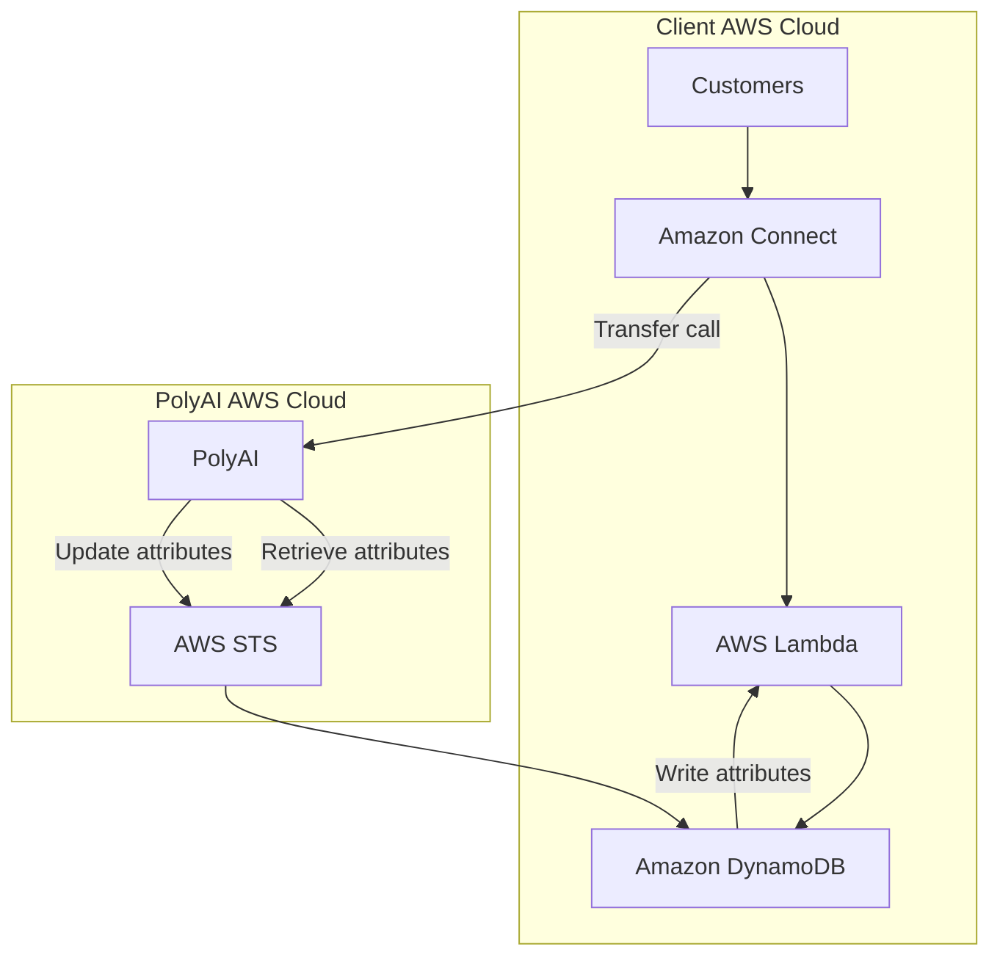

## Flow Overview

1. **Inbound Call Handling**
   - Customer calls are routed via [Amazon Connect](https://aws.amazon.com/connect/), AWS’s cloud-based contact center service.

2. **Event Processing**
   - [AWS Lambda](https://aws.amazon.com/lambda/) processes the incoming call data and writes call attributes to [Amazon DynamoDB](https://aws.amazon.com/dynamodb/), a fast, flexible NoSQL database.

3. **PolyAI Processing**
   - PolyAI retrieves call attributes securely using [AWS STS](https://aws.amazon.com/iam/features/manage-credentials/), enabling temporary, secure access to the client's cloud resources.
   - Attributes are updated during the call lifecycle and stored back in DynamoDB.

