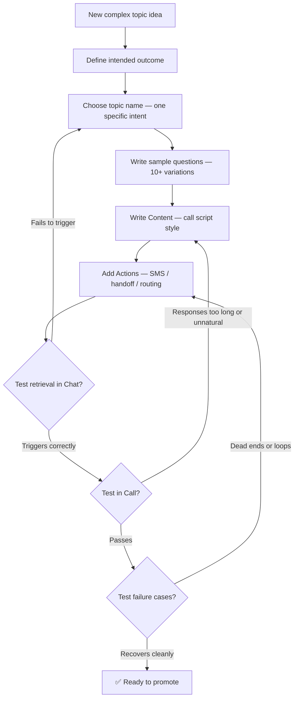

import { ProgressTracker } from '/snippets/progress-tracker.jsx'
import { Quiz } from '/snippets/quiz.jsx'

<Info>
  **Level 2 — Lesson 1 of 8** — Build multi-turn flows with [SMS](/managed-topics/how-to-setup-action/send-sms), [handoffs](/managed-topics/how-to-setup-action/handoff), and conditional logic.
</Info>

<Note>
  **Reading the action notation in this lesson:**
  This lesson references functions like `start_sms_flow` and `transfer_call`. You'll learn how to create and wire these in [Lesson 2: Using functions](/learn/guides/advanced/using-functions) and [Lesson 3: Return values](/learn/guides/advanced/function-return-values).

  For now, read them as named actions:
  - `start_sms_flow` with `sms_id="bill_request"` → sends an SMS using the template called "bill_request"
  - `transfer_call` with `transfer_reason="BILLING"` → transfers the caller to a human agent for billing

  Focus on the topic patterns and when each applies. The implementation details come next.
</Note>

Some [Managed Topics](/managed-topics/introduction) need to guide a decision, send a text, or route the conversation. This lesson covers reliable patterns for topics that retrieve correctly, behave in Chat and Call, and recover from unexpected responses.

## What makes a Managed Topic complex?

A topic is considered complex if it does more than return static information.

<CardGroup cols={3}>
  <Card title="Actions" icon="bolt">
    Triggers SMS, transfers, or routing
  </Card>
  <Card title="Options" icon="list-check">
    Presents choices and waits for user selection
  </Card>
  <Card title="Clarification" icon="question">
    Asks questions before acting
  </Card>
</CardGroup>

<Note>
  In the UI, complex topics almost always use both **Content** and **Actions**, and often rely on **functions** to control what happens next.
</Note>

## Topic creation flow



## Before you write anything

Answer these first:
- What is the intended outcome? (e.g., user receives SMS link, or gets transferred)
- What happens if the user says no?
- What happens if the user gives an unexpected answer?

## An example workflow for complex topics

### Step 1: Retrieval

If a topic doesn't retrieve reliably, nothing else matters. Retrieval depends most on three things, in this order:

1. Topic name
2. Sample questions
3. Content

Most early failures are derived from retrieval.

#### Topic naming matters more than you think

The topic name is one of the strongest signals used to decide *which* content to surface. A good name should represent **one specific user intent**, for example:

`bill_request_previous_stay`

Why this works:
- It represents a single, concrete intent.
- It distinguishes between similar scenarios (previous stay vs current or future).
- It mirrors how the system classifies the request.
- It reduces collisions with any other billing topics you may add as your Managed Topics grow.

Here are some bad examples:

- `billing`
- `help_with_bill`
- `misc_billing`

These fail because they are too broad. They force the system to guess, increase the chance of the wrong topic being selected, and become harder to maintain as you add more billing flows.

### Step 2: Write sample questions like real users

Think of sample questions as training data.

For complex topics, aim for variety. Include:

- Direct commands
- Polite requests
- Incomplete phrasing
- Synonyms and alternate terminology
- Call-style filler language

For example, for a billing topic:

- Can you send me my invoice
- I stayed last week and need a receipt
- Text me my bill
- I need a folio from my last stay
- Uh I need billing help

### Step 3: Write Content like a call script

Content should sound natural when spoken out loud.

As a rule, it should:

- Lead with what happens next
- Ask one clear question
- Be short enough to say in a single breath

Avoid explanations unless they are strictly necessary for the decision the user is being asked to make.

## Check your understanding

<Quiz questions={[
  {
    q: "A caller asks 'Can you send me my bill?' but the agent responds with a generic FAQ answer instead of offering SMS. What is the most likely cause?",
    options: [
      "The SMS integration is disabled",
      "The complex topic's retrieval failed — check the topic name and sample questions",
      "The caller didn't say 'please'",
      "Response Controls are blocking the SMS offer",
    ],
    correct: 1,
    explanation: "If the complex topic never triggers, the agent falls back to simpler matches. Always lock retrieval first — the topic name and sample questions are the primary signals.",
  }
]} />

## Core complex patterns (with examples)

The patterns below cover most real-world use cases. You can copy them directly and adapt the wording.

### Pattern 1: Offer SMS with fallback to handoff

**Use when**
- The user needs a link, form, or written instructions.

**Topic name**
`bill_request_previous_stay`

**Content**
```text
The easiest way to get a bill from a previous stay is online.
I can send you a text with the link if you'd like.
Would you like me to send that now, or would you rather speak to someone?
```

**Actions**
```text
- If user agrees → `start_sms_flow` with `sms_id="bill_request"`
- If user declines → offer or trigger handoff to billing
- If SMS fails → transfer automatically
```

**Why this works**
- Consent is explicit
- Only two options are presented
- There is a clear fallback

### Pattern 2: Conditional SMS (user chooses)

**Use when**
- Multiple follow-ups are possible.

**Topic name**
`promotions_current`

**Content**
```text
I can send you details about this week's promotion.

Would you like information about today's offer,
upcoming events, or loyalty rewards?
```

**Actions**
```text
- If "today" → `start_sms_flow` with `sms_id="promo_today"`
- If "events" → `start_sms_flow` with `sms_id="promo_events"`
- If "rewards" → `start_sms_flow` with `sms_id="promo_rewards"`
```
Handle loose answers such as "the first one" or "events please".

### Pattern 3: Direct handoff (no agent reply)

**Use when**
- The agent should not attempt to resolve the request.

**Topic name**
`out_of_scope_spanish`

**Content**
(leave empty)

**Actions**
- Immediately call `transfer_call` with `transfer_reason="SPANISH"`

This avoids unnecessary turns and makes ownership explicit.

### Pattern 4: Answer, then offer handoff

**Use when**
- The agent can answer, but escalation may still be useful.

**Topic name**
`late_checkout`

**Content**
> Standard checkout is at 11 a.m.
>
> If you need to check out later than that, I can connect you with the front desk to see what's available. Would you like me to do that?

**Actions**
- If yes → handoff to front desk
- If no → end politely

### Pattern 5: Clarify, then route

**Use when**
- The intent is genuinely ambiguous.

**Topic name**
`reservation_change`

**Content**
> Are you looking to change an existing reservation, or make a new one?

**Actions**
- If "change" → route to reservation modification
- If "new" → route to booking flow

Rules:
- Ask one question only
- Do not stack clarifications
- Complete the flow immediately after the answer

### Pattern 6: Info + action hybrid

**Use when**
- The user needs context and a next step.

**Topic name**
`lifeline_program`

**Content**
> Lifeline is a government-sponsored program that provides qualifying customers with discounted phone or broadband service.
>
> I can text you more details, or connect you with a specialist. Which would you prefer?

**Actions**
- SMS → `start_sms_flow`
- Handoff → `transfer_call`

### Pattern 7: Info-only (still complex in practice)

**Use when**
- The information is static but sensitive or high-impact.

**Topic name**
`housekeeping_hours`

**Content**
> Housekeeping is available daily from 9 a.m. to 5 p.m.
>
> If you need service outside those hours, I can connect you with the front desk.

**Actions**
- No automatic action
- Offer handoff only if asked

## Creating a complex topic in the UI

<Steps>
  <Step title="Go to Build → Knowledge">
    Click **+ Add topic** to create a new Managed Topic.
  </Step>
  <Step title="Set the topic name">
    Use a specific, single-intent name (e.g., `bill_request_previous_stay`).
  </Step>
  <Step title="Add sample questions">
    Write 10+ variations of how a real user would phrase this request.
  </Step>
  <Step title="Write Content">
    In the **Content** field, write the agent's response in call-script style — short, spoken-friendly, ending with one clear question.
  </Step>
  <Step title="Add Actions">
    Below Content, click **Add action**. Configure each branch:
    - Select the function to call (e.g., `start_sms_flow`, `transfer_call`)
    - Set the condition (e.g., "If user agrees", "If user declines")
    - Add fallback actions for error cases
  </Step>
  <Step title="Test retrieval">
    Open Chat and ask several phrasings. Confirm the correct topic triggers before testing in Call.
  </Step>
</Steps>

## Writing content that works in Call

**Do**
- Use short sentences
- End with a single question
- Make one decision per turn

**Don't**
- Use paragraphs
- Include internal notes
- Ask multiple questions at once

## Action design rules

- One primary outcome per turn
- Explicit consent before SMS
- A safe fallback for silence or confusion
- Prefer clarity over clever branching

## Check your understanding

<Quiz questions={[
  {
    q: "What is the most critical step when building a complex topic?",
    options: [
      "Writing detailed content in the answer field",
      "Adding multiple action branches",
      "Making retrieval work reliably",
      "Setting up SMS flows before other actions",
    ],
    correct: 2,
    explanation: "If a topic doesn't trigger correctly, nothing else matters — the best content and actions in the world are useless if the topic is never reached.",
  }
]} />

## Verification checklist

**Retrieval**
- Topic triggers with at least 10 phrasing variations

**Chat**
- Consent is respected
- No looping

**Call**
- Responses are listenable
- Users can interrupt naturally
- No dead ends

**Failure cases**
- Unexpected answers recover cleanly
- SMS failures route correctly

## Common pitfalls

1. Overloading a topic with multiple intents
2. Writing perfect answers but weak retrieval
3. Delaying Call testing

Fix: lock retrieval first, keep topics single-purpose, test messy phrasing early.

## Try it yourself

<Steps>
  <Step title="Challenge: Write a 'bill request' complex topic">
    Write a complete complex topic for a hotel guest requesting a bill from a previous stay. Use Pattern 1 (SMS with fallback to handoff).

    Include:
    1. Topic name
    2. Four sample questions
    3. Content (2–3 sentences, call-script style)
    4. Actions (3 branches: agree to SMS, decline SMS, SMS fails)

    <Accordion title="Hint">
      The topic name should describe one specific scenario (not just "billing"). Content should lead with what happens next and end with one clear question. Actions should cover the "yes", "no", and "error" paths.
    </Accordion>

    <Accordion title="Example solution">
      **Topic name:** `bill_request_previous_stay`

      **Sample questions:**
      - can you send me my bill from last week
      - I need a receipt from my last stay
      - text me my invoice
      - how do I get a folio for my previous visit

      **Content:**
      ```text
      The easiest way to get your bill is online.
      I can send you a text with the link — would you like me to do that,
      or would you prefer to speak with someone at the front desk?
      ```

      **Actions:**
      - If user agrees → `start_sms_flow` with `sms_id="bill_request"`
      - If user declines → transfer to front desk
      - If SMS fails → transfer automatically
    </Accordion>
  </Step>
</Steps>

## Check your understanding

<Quiz questions={[
  {
    q: "Which pattern should you use when the agent can answer but escalation may still be useful?",
    options: [
      "Pattern 1: Answer only, no handoff",
      "Pattern 2: Escalate immediately without answering",
      "Pattern 3: Ask the user before answering",
      "Pattern 4: Answer, then offer handoff",
    ],
    correct: 3,
    explanation: "Pattern 4 answers first, then offers a transfer — rather than escalating immediately or withholding information. It gives users what they need while keeping escalation available.",
  }
]} />


<CardGroup cols={2}>
  <Card title="← Back to PolyAcademy" icon="arrow-left" href="/learn/guides/introduction">
    Level overview
  </Card>
  <Card title="Next: Using functions →" icon="arrow-right" href="/learn/guides/advanced/using-functions">
    Lesson 2 of 8
  </Card>
</CardGroup>

<ProgressTracker lessonKey="l2-1-complex-topics" lessonNum={1} totalLessons={8} level="Level 2" />
