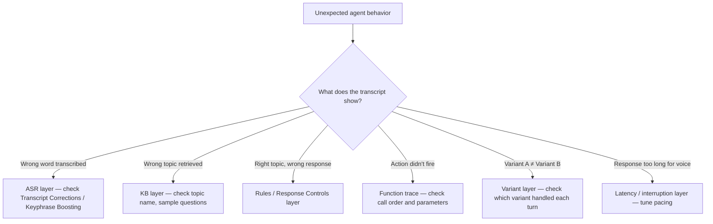

import { ProgressTracker } from '/snippets/progress-tracker.jsx'
import { Quiz } from '/snippets/quiz.jsx'

<Info>
  **Level 2 — Lesson 8 of 8** — Master advanced diagnostics to understand exactly why your agent behaves the way it does.
</Info>

At this stage, use [Conversation Review](/analytics/conversations/review) to answer questions like:

> Why did Variant A behave differently from Variant B?
>
> Was this failure caused by ASR, retrieval, rules, response control, or phrasing?
>
> Why did the agent *not* call a function it was allowed to call?

If you can't point to a specific system layer and say *"this is where the decision was made"*, the agent isn't under control yet.

## Beyond the transcript

At Level 1, the transcript was enough. At Level 2, the transcript is only the **symptom**. Real work happens in [diagnosis](/analytics/conversations/diagnosis) layers, function traces, variant attribution, and latency signals. Review with toggles on.

## Tracing a problem to its source

## Check your understanding

<Quiz questions={[
  {
    q: "An agent answers a billing question correctly, but you notice the function trace shows no call to `start_sms_flow` even though the topic is configured to offer SMS. What are the most likely causes?",
    options: [
      "The SMS integration is down",
      "A missing action branch in the KB, a Response Control interrupting output, or a rules conflict",
      "The caller's phone number is invalid",
      "The variant doesn't support SMS",
    ],
    correct: 1,
    explanation: "When the agent says the right thing but doesn't execute the expected action, the issue is usually structural: a missing action branch, a Response Control halting output before the function fires, or a rules conflict preventing execution.",
  }
]} />

## Advanced use of the Conversations table

Before opening individual conversations, shape the table itself.

Add these columns:
- **Variant**
- **Environment**
- **Function call**
- **Handoff reason**
- **Duration**

Use this to:
- Compare variants side by side
- Spot regressions after promotion
- Identify behavior that only occurs in Live

> Example:
> Calls with Variant = B have longer durations and more handoffs.
>
> This is a signal before you even open a transcript.

## Comparative review patterns

At Level 2, you should rarely inspect a single conversation in isolation.

Common patterns:
- Same intent, different variants
- Same KB topic, different phrasing
- Same user request across Chat and Call
- Same flow before and after a KB change

Conversation Review supports this by exposing **environment, variant, and function data together**.

## Diagnosis layers (deep use)

Toggle diagnosis layers selectively. Each answers a different class of question.

### Topic citations (advanced)

At this level, topic citations are not just about *correct vs incorrect*.

Use them to detect:
- Topic competition
- Overly generic topic names
- Sample question leakage across intents

> Example:
> Three topics are cited repeatedly for "late checkout":
> - late_checkout
> - checkout_policy
> - general_stay_questions
>
> This indicates retrieval ambiguity. The fix is structural, not textual.

### Function calls (advanced)

Function traces show **what the agent committed to doing**, not just what it said.

Inspect:
- Call order
- Conditional execution
- Parameters passed
- Calls that *should* have happened but didn't

> Example:
> The agent asks for SMS consent but never calls `start_sms_flow`.
>
> This usually indicates:
> - A missing action branch in the KB
> - A response control interrupting output
> - A rules conflict preventing execution

### Flows and steps

Flows expose **decision paths**.

Use them when:
- Multiple conditions exist
- Behavior depends on prior turns
- The agent appears to "jump" topics

> Example:
> A billing question enters a reservation flow.
>
> This is often caused by:
> - Early entity capture
> - Over-eager routing rules
> - Poorly scoped flow entry conditions

### Variants

Variants let you attribute behavior to configuration, not chance.

Use this layer to:
- Confirm A/B test intent
- Validate rollout sequencing
- Identify variant-specific failures

> Example:
> Variant A answers directly.
> Variant B always clarifies first.
>
> Conversation Review lets you confirm this per turn, not anecdotally.

### Entities

Entities are where ASR, NLU, and logic meet.

Inspect entities to:
- Confirm values were actually captured
- Detect silent failures (nulls)
- Spot hallucinated structure

> Example:
> User says "tomorrow morning"
>
> Entity captured: date = today
>
> This is not a KB issue — it's extraction or phrasing.

### Turn latency and interruptions

These layers reveal **experience quality**, not correctness.

Use them to:
- Identify responses that are too long for voice
- Detect places users consistently interrupt
- Tune pacing and verbosity

> Example:
> High interruption rate during policy explanations usually means the response is technically correct but poorly shaped for audio.

## Audio analysis (calls)

At Level 2, audio review is not optional.

Use split audio to:
- Isolate ASR failures
- Hear barge-in timing
- Compare spoken length vs transcript length

This often explains why "perfectly fine" text responses fail in voice.

## Annotations as a system, not notes

At this stage, annotations should be **patterned**, not occasional.

Use them to:
- Track recurring KB gaps
- Justify ASR tuning
- Support decisions to split or retire topics

> Example:
> Five "Missing topic" annotations around refunds in one day is enough evidence to create a dedicated refund topic.

Annotations turn subjective impressions into actionable signals.

## Check your understanding

<Quiz questions={[
  {
    q: "The agent gave a wrong answer. You read the transcript but can't see why. What should you check next?",
    options: [
      "Re-read the transcript — you must have missed something",
      "The function trace, topic citations, and diagnosis layers — the transcript shows symptoms, not root causes",
      "The agent's personality field — it may be overriding the response",
      "The voice settings — audio issues can cause transcript inaccuracies",
    ],
    correct: 1,
    explanation: "The transcript shows what happened, not why. At Level 2, root cause analysis uses diagnosis layers: function traces to see what fired, topic citations to see what triggered, and variant data to see what context was applied.",
  }
]} />

## What good looks like

A strong review session ends with **specific changes**, not general feelings:

> Split topic X into two intents. Remove sample question Y. Add response control to suppress filler.

You can say what changed, where, and why that layer is responsible.

## Readiness standard

Before treating an agent as stable:
- You can trace any response back to configuration
- You can distinguish ASR, KB, rules, and variant causes
- You can predict how a change affects behavior
- You can verify impact in Conversation Review

## Try it yourself

<Steps>
  <Step title="Challenge: Investigate a variant discrepancy">
    Looking at your Conversations table, you notice that Variant A has a 40% handoff rate and Variant B has a 15% handoff rate — for the same types of customer queries.

    Describe your investigation:
    1. What is your first hypothesis?
    2. Which diagnosis layers would you check first?
    3. What specific data would confirm or rule out each hypothesis?

    <Accordion title="Hint">
      Think systematically: what could cause two variants to behave differently for the same query? Consider: variant-specific fields, KB topic overrides, response controls, and function logic.
    </Accordion>

    <Accordion title="Example solution">
      1. **First hypothesis:** Variant A has a handoff action wired to trigger more broadly — perhaps its SMS flow fails more often, or its fallback routing is more aggressive.

      2. **Layers to check first:**
         - **Function traces** — compare whether `transfer_call` is being called after different triggers in A vs B
         - **Variant fields** — check if A has different escalation language or action overrides
         - **Topic citations** — confirm the same KB topics are being retrieved for both variants

      3. **Confirming data:**
         - If function traces show `transfer_call` firing after different events → KB action branch issue
         - If topic citations differ between A and B → variant-specific KB override or sample question difference
         - If function traces are identical → check variant fields for different routing thresholds or transfer conditions
    </Accordion>
  </Step>
</Steps>

## Check your understanding

<Quiz questions={[
  {
    q: "Variant A has a 40% handoff rate and Variant B has 15% — for the same query types. What should you check first?",
    options: [
      "The greeting text in each variant",
      "Function traces, variant fields, and topic citations to find where the two configurations diverge",
      "Whether Variant A has fewer sample questions",
      "The call duration for each variant",
    ],
    correct: 1,
    explanation: "When two variants behave differently for the same queries, compare function traces (are different actions firing?), variant fields (are escalation thresholds different?), and topic citations (are the same topics being retrieved?).",
  }
]} />

## Metrics and dashboards

Beyond individual conversation review, you can use metrics and [dashboards](/analytics/dashboards/introduction) to identify patterns across many conversations.

### Filtering conversations

The **Conversations** page supports filtering by both built-in and custom metrics. Built-in metrics include environment, call duration, variant, and handoff reason. Custom metrics are values you log from your functions — for example, `cancel_initiated`, `id_v_successful`, or the brand the user asked about.

**Useful filter combinations:**
- **All handoffs** — filter by handoff reason "has any value" to see every transferred call
- **Specific handoff reason** — filter by a reason like "speak_to_agent" to find deflection opportunities
- **Custom metric** — filter by `cancel_initiated` to review all cancellation flows

### QA metrics

The QA metric identifies which knowledge base topic the agent used to answer each query:

- **Raven (voice)** — the LLM determines the QA metric directly by matching its response to the most relevant topic. This is accurate because the LLM has full context.
- **GPT-based agents (chat)** — the system encodes the user utterance, finds the closest topics by embedding similarity, generates a response, then matches the response back to topics. This can be less accurate when responses blend multiple topics.

### Using dashboards for improvement

A well-built dashboard tracks your key metrics (containment, transfer rate, call duration, authentication success) over time. Focus on:

1. **Containment trends** — are your improvements actually moving the number?
2. **Top queries** — what are users asking about most? Are there unhandled intents?
3. **Handoff reasons** — which reasons have the highest volume? Can you add flows or topics to reduce transfers?

For example, if "make an order" is a top query with high transfer rate, building an order troubleshooting flow could directly improve containment.

<CardGroup cols={2}>
  <Card title="← Previous: Variants" icon="arrow-left" href="/learn/guides/advanced/variants">
    Lesson 7 of 8
  </Card>
  <Card title="Level 2 complete →" icon="trophy" href="/learn/guides/advanced/finished">
    Recap and next steps
  </Card>
</CardGroup>

<ProgressTracker lessonKey="l2-8-conv-review" lessonNum={8} totalLessons={8} level="Level 2" />
