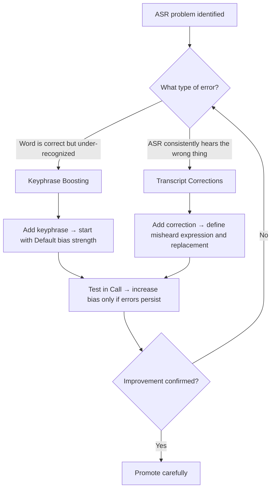

import { ProgressTracker } from '/snippets/progress-tracker.jsx'
import { Quiz } from '/snippets/quiz.jsx'

<Info>
  **Level 2 — Lesson 6 of 8** — Configure speech recognition to reduce misrecognition and improve routing.
</Info>

[ASR](/speech-recognition/introduction) determines what the agent *hears*. Every downstream system depends on it: retrieval, routing, response control, handoff logic. Small transcription errors here silently break otherwise well-designed agents. Global ASR is where you correct systematic listening problems at the source.

## What Global ASR is for

<CardGroup cols={2}>
  <Card title="Reduce clarifications" icon="comment-question">
    Minimize unnecessary clarification questions
  </Card>
  <Card title="Improve routing" icon="route">
    Increase routing accuracy for calls
  </Card>
  <Card title="Stabilize retrieval" icon="database">
    Improve Knowledge topic selection for spoken queries
  </Card>
  <Card title="Fix transcription" icon="spell-check">
    Correct recurring transcription errors at the source
  </Card>
</CardGroup>

<Note>
  It is not a substitute for good KB design or clear agent behavior rules. Think of it as sharpening the agent's ears, not teaching it new facts.
</Note>

## Which tool to use

## Two essential tools

<Tabs>
  <Tab title="Keyphrase Boosting">
    Keyphrase Boosting biases the ASR model toward recognising specific words or phrases more reliably.

    ### When to use it

    <AccordionGroup>
      <Accordion title="Use cases" icon="lightbulb">
        - A word is important for routing or actions
        - Misrecognition causes the agent to take the wrong path
        - Users consistently repeat themselves for the same term
      </Accordion>

      <Accordion title="Typical candidates" icon="list">
        **Department names:**
        - "front desk"
        - "billing"
        - "room reservations"

        **Product or service names:**
        - "bell desk"
        - "late checkout"

        **Action-critical verbs:**
        - "cancel"
        - "confirm"
      </Accordion>
    </AccordionGroup>

    ### How to configure

    <Steps>
      <Step title="Add the keyphrase">
        Enter it exactly as you want it recognized
      </Step>
      <Step title="Set bias strength">
        Start with Default bias strength
      </Step>
      <Step title="Adjust if needed">
        Increase toward Maximum only if errors persist
      </Step>
    </Steps>

    <Warning>
      **Important guidance:**
      - Bias strength is cumulative. Over-biasing many terms can degrade overall accuracy
      - Avoid boosting generic words like "room" unless they are routing-critical
      - Prefer multi-word phrases over single words when possible
      - **Example:** If callers asking for the "bell desk" are frequently routed incorrectly, boost "bell desk" rather than boosting "desk"
    </Warning>
  </Tab>

  <Tab title="Transcript Corrections">
    Transcript Corrections rewrite text after transcription, mapping common errors to the intended phrase.

    ### When to use it

    <AccordionGroup>
      <Accordion title="Use cases" icon="lightbulb">
        - ASR consistently hears the same wrong thing
        - Accents or homophones cause predictable errors
        - Brand or proper names are repeatedly mangled
      </Accordion>

      <Accordion title="Typical examples" icon="list">
        **Homophones:**
        - "copper" → "hopper"

        **Accent-driven substitutions:**
        - "reef fund" → "refund"

        **Brand names:**
        - "Hopper Consumer" → "Hopper"
      </Accordion>
    </AccordionGroup>

    ### How to configure

    <Steps>
      <Step title="Choose match type">
        Select substring or regex
      </Step>
      <Step title="Define misheard expression">
        Enter what ASR incorrectly transcribes
      </Step>
      <Step title="Define correction">
        Enter the intended replacement text
      </Step>
    </Steps>

    <Warning>
      **Important guidance:**
      - Prefer narrow matches over broad regex
      - Avoid corrections that could unintentionally rewrite unrelated phrases
      - If unsure, test in Sandbox with real call audio before promoting
      - **Example:** If "cancel" is sometimes transcribed as "council," add a correction rather than increasing bias on "cancel" alone
    </Warning>
  </Tab>
</Tabs>

## Check your understanding

<Quiz questions={[
  {
    q: "A caller says 'I need to cancel my booking' but the agent hears 'I need to council my booking' and routes to the wrong topic. Should you use Keyphrase Boosting or Transcript Corrections?",
    options: [
      "Keyphrase Boosting — increase bias on 'cancel'",
      "Transcript Corrections — map 'council' to 'cancel'",
      "Both — boost 'cancel' and correct 'council' simultaneously",
      "Neither — this is a Managed Topic naming issue",
    ],
    correct: 1,
    explanation: "ASR is consistently mishearing 'cancel' as 'council' — this is a predictable substitution error. Transcript Corrections rewrite after transcription and are the right tool for this pattern.",
  }
]} />

## A practical workflow

<Steps>
  <Step title="Review recent calls">
    Look for calls where:
    - The agent asked for repetition
    - The wrong KB topic was selected
    - Routing or handoff failed unexpectedly
  </Step>

  <Step title="Identify the problem">
    Find the specific word or phrase that failed
  </Step>

  <Step title="Choose your tool">
    Decide:
    - **Boost** if the word is correct but under-recognized
    - **Correct** if the word is consistently misheard as something else
  </Step>

  <Step title="Apply minimal change">
    Make the smallest possible adjustment
  </Step>

  <Step title="Test in Call">
    Verify the improvement
  </Step>

  <Step title="Promote carefully">
    Only promote after confirming improvement
  </Step>
</Steps>

## Common mistakes

<Warning>
  **Avoid these pitfalls:**
  - Boosting everything "just in case"
  - Using Transcript Corrections to fix KB design problems
  - Applying maximum bias globally without testing
  - Forgetting that local (flow-level) ASR settings override global ones
</Warning>

## Check your understanding

<Quiz questions={[
  {
    q: "When should you use Transcript Corrections instead of Keyphrase Boosting?",
    options: [
      "When a word is under-recognized but correctly transcribed",
      "When ASR consistently mishears one specific thing as another",
      "When overall transcription quality is low across all words",
      "When you need multi-language support",
    ],
    correct: 1,
    explanation: "Keyphrase Boosting improves recognition of words that are correct but under-weighted. Transcript Corrections rewrite after transcription — for consistent mishear patterns like \"refund\" being transcribed as \"reef fund\".",
  }
]} />

## Verification checklist

<Check>
  You're done when:
  - Previously misheard phrases are transcribed correctly
  - The agent asks fewer clarification questions for known terms
  - Routing and KB selection stabilise in live call testing
  - Behavior remains consistent after promotion between environments

  Global ASR tuning is iterative. Small, deliberate adjustments here pay off more than large rewrites elsewhere.
</Check>

## Try it yourself

<Steps>
  <Step title="Challenge: Diagnose and configure an ASR fix">
    A caller says "I'd like a refund" but ASR consistently transcribes it as "I'd like a reef fund". The `refund_request` topic therefore never triggers.

    Answer:
    1. Should you use Keyphrase Boosting or Transcript Corrections — and why?
    2. Write the full configuration.

    <Accordion title="Hint">
      Ask yourself: is ASR hearing the right word but recognising it poorly, or is it consistently mishearing one thing as another?
    </Accordion>

    <Accordion title="Example solution">
      1. **Transcript Corrections** — because ASR is consistently mishearing "refund" as "reef fund". This is a predictable substitution error, not an under-recognition problem.

      2. **Configuration:**
         - **Match type:** Substring
         - **Misheard expression:** `reef fund`
         - **Correction:** `refund`
    </Accordion>
  </Step>
</Steps>

## Check your understanding

<Quiz questions={[
  {
    q: "What is the main risk of boosting too many keyphrases?",
    options: [
      "Keyphrases stop working after 30 days",
      "Bias strength is cumulative and can degrade overall ASR accuracy",
      "It causes noticeable latency spikes",
      "Boosted words are excluded from Transcript Corrections",
    ],
    correct: 1,
    explanation: "Bias strength is cumulative — boosting too many terms can degrade overall ASR accuracy. Always start with Default bias and increase only if errors persist.",
  }
]} />

<ProgressTracker lessonKey="l2-4-global-asr" lessonNum={4} totalLessons={8} level="Level 2" />
