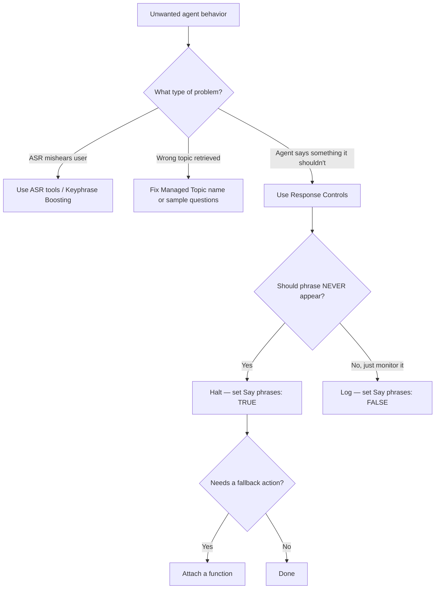

import { ProgressTracker } from '/snippets/progress-tracker.jsx'
import { Quiz } from '/snippets/quiz.jsx'

<Info>
  **Level 2 — Lesson 2 of 6** — Master response controls to regulate agent output and enforce tone.
</Info>

Response Controls regulate the agent's *own output*. They run **after** the model generates text and before anything is spoken or sent to the user.

They are one of the most powerful tools for improving tone, safety, and conversational flow — and one of the easiest to misuse if patterns are too broad.

## What Response Controls are

Response Controls are **string- or regex-based rules** that inspect the agent's generated response.

<CardGroup cols={2}>
  <Card title="Halt responses" icon="octagon">
    Prevent specific phrases from being spoken
  </Card>
  <Card title="Trigger routing" icon="route">
    Activate corrective or fallback behavior
  </Card>
  <Card title="Log patterns" icon="chart-line">
    Track unwanted patterns for analysis
  </Card>
  <Card title="Enforce tone" icon="palette">
    Maintain brand voice consistency
  </Card>
</CardGroup>

<Note>
  They are not about what the *user* says — they are about what the *agent* says.
</Note>

## Which tool to use for which problem

## When to use Response Controls

Use Response Controls when you want to fix or prevent:

<Tabs>
  <Tab title="Redundant preambles">
    **Examples:**
    - "Let me check that for you…"
    - "Please hold while I look into this…"
  </Tab>

  <Tab title="Looping behavior">
    **Examples:**
    - Repeating the greeting mid-call
    - Restarting the conversation after silence
  </Tab>

  <Tab title="Off-brand phrasing">
    **Examples:**
    - Overly apologetic language
    - Internal system explanations
  </Tab>

  <Tab title="Unsafe output">
    **Examples:**
    - Speculation
    - Policy invention
    - Meta commentary about limitations
  </Tab>
</Tabs>

<Tip>
  - If the issue is about *recognition*, use ASR tools
  - If the issue is about *retrieval*, fix the Managed Topics
  - If the issue is about *how the agent speaks*, use Response Controls
</Tip>

## How Response Controls work

<Steps>
  <Step title="LLM generates response">
    The model creates text based on context and prompts
  </Step>
  <Step title="Response Controls scan output">
    Regex patterns are evaluated against the generated text
  </Step>
  <Step title="Action taken if matched">
    - The response may be halted
    - A function may be triggered
    - The event may be logged for analytics
  </Step>
</Steps>

<Note>
  Controls are evaluated in real time and apply consistently across Chat and Call.
</Note>

## Check your understanding

<Quiz questions={[
  {
    q: "Your agent keeps saying 'Let me check that for you' before every response, creating awkward pauses in voice calls. Which tool should you use to fix this?",
    options: [
      "Managed Topic sample questions",
      "Keyphrase Boosting in Global ASR",
      "A Response Control with Say phrases set to TRUE",
      "A Transcript Correction rule",
    ],
    correct: 2,
    explanation: "This is an agent output problem — the agent is generating filler phrasing. A Response Control with 'Say phrases: TRUE' will halt the unwanted phrase before it reaches the user.",
  }
]} />

## Core fields

Each Response Control includes:

<AccordionGroup>
  <Accordion title="ID" icon="fingerprint">
    A short, descriptive identifier used for tracking and debugging.
  </Accordion>

  <Accordion title="Description" icon="file-lines">
    Optional, but strongly recommended. Explains *why* the rule exists.
  </Accordion>

  <Accordion title="Regular Expression" icon="code">
    The exact pattern that will be matched against agent output.
  </Accordion>

  <Accordion title="Say phrases (Boolean)" icon="toggle-on">
    - **ON**: matching output is stopped
    - **OFF**: matching output is logged but allowed
  </Accordion>

  <Accordion title="Function (optional)" icon="function">
    A fallback action to run when the phrase is detected.
  </Accordion>
</AccordionGroup>

## Best practices

<CardGroup cols={2}>
  <Card title="Start narrow" icon="crosshairs">
    Broad patterns are hard to debug and can suppress valid responses.

    ❌ `.*sorry.*`

    ✅ `\b(sorry for the inconvenience|apologies for the delay)\b`
  </Card>

  <Card title="Target symptoms" icon="bullseye">
    Encode *specific phrases* you have observed, not abstract concepts.

    ❌ "Prevent the agent from being verbose"

    ✅ `\b(let me explain how|to give you some background)\b`
  </Card>

  <Card title="Prefer halting" icon="hand">
    If a phrase should *never* appear, halt it rather than replacing it.
  </Card>

  <Card title="Test thoroughly" icon="vial">
    Verify in both Chat and Call to catch unnatural truncation.
  </Card>
</CardGroup>

## Common use cases

<Tabs>
  <Tab title="Removing preambles">
    LLMs often add filler before answering or executing actions.

    **Example unwanted output:**
    "Let me check that for you. Please hold…"

    **Suggested control:**
    - **ID:** `flow_redundancy_cutoff`
    - **Regex:** `\b(let me check|please hold|one moment while I)\b`
    - **Say phrases:** TRUE

    **Result:** The agent proceeds directly to the answer or action.
  </Tab>

  <Tab title="Preventing greeting loops">
    Sometimes the agent restarts the conversation mid-call.

    **Example unwanted output:**
    "Thank you for calling Hopper…"

    **Suggested control:**
    - **ID:** `greet_loop`
    - **Regex:** `(thank you for calling|you have reached|hi thanks for calling)`
    - **Say phrases:** TRUE

    <Tip>
      Optional: attach a function that routes to a recovery flow instead of restarting.
    </Tip>
  </Tab>

  <Tab title="Blocking dead ends">
    Agents sometimes respond with unhelpful refusals instead of routing.

    **Example unwanted output:**
    "I don't have information about that."

    **Suggested control:**
    - **ID:** `default_no_info`
    - **Regex:** `I don't have (any|specific)? information`
    - **Say phrases:** TRUE
    - **Function:** `prompt_OOS_Check`

    **Result:** Instead of dead-ending, the agent routes to out-of-scope handling.
  </Tab>

  <Tab title="Brand tone enforcement">
    Prevent phrasing that violates brand voice.

    **Example unwanted output:**
    "Unfortunately, I'm unable to…"

    **Suggested control:**
    - **ID:** `tone_softener`
    - **Regex:** `\b(unfortunately|sadly|regret to inform)\b`
    - **Say phrases:** TRUE

    **Result:** Forces the agent to rephrase without negative framing.
  </Tab>
</Tabs>

## Logging-only controls

Not all controls need to halt output. You can use Response Controls purely for **monitoring**.

<AccordionGroup>
  <Accordion title="Example: tracking hedging language" icon="chart-mixed">
    - **ID:** `hedge_language_monitor`
    - **Regex:** `\b(might|maybe|possibly)\b`
    - **Say phrases:** FALSE

    This allows you to analyze uncertainty trends without disrupting users.
  </Accordion>
</AccordionGroup>

## Testing and verification

After adding or updating a Response Control:

<Steps>
  <Step title="Test in Chat">
    - Confirm the phrase no longer appears
    - Ensure the response still completes cleanly
  </Step>

  <Step title="Test in Call">
    - Listen for unnatural truncation
    - Ensure turn-taking still feels natural
  </Step>

  <Step title="Review Conversation logs">
    - Check whether the rule is triggering too often
    - Look for false positives
  </Step>
</Steps>

## Common mistakes

<Warning>
  **Avoid these pitfalls:**
  - Using overly broad regex patterns
  - Blocking phrases that appear in legitimate answers
  - Using Response Controls to fix retrieval problems
  - Forgetting to test in voice after chat validation
</Warning>

## Check your understanding

<Quiz questions={[
  {
    q: "What do Response Controls regulate?",
    options: [
      "What the user is allowed to say",
      "How ASR processes audio input",
      "The agent's own generated output",
      "Which Managed Topics can be triggered",
    ],
    correct: 2,
    explanation: "Response Controls run after the LLM generates a response, before it's spoken or sent. They regulate the agent's own output — not what the user says or how speech is transcribed.",
  }
]} />

## Pronunciations (related but separate)

<CardGroup cols={2}>
  <Card title="Response Controls" icon="shield-halved">
    Affect *what* is said
  </Card>
  <Card title="Pronunciations" icon="volume">
    Affect *how* it is spoken
  </Card>
</CardGroup>

Use **Pronunciations** when:
- Names are mispronounced
- Numbers need pacing
- Domain terms require IPA or SSML guidance

<Note>
  Do not use Response Controls to solve pronunciation issues.
</Note>

## Summary

Response Controls are a surgical tool.

<CardGroup cols={2}>
  <Card title="Used well" icon="circle-check">
    - Eliminate friction
    - Enforce tone
    - Prevent loops and dead ends
  </Card>
  <Card title="Used poorly" icon="circle-xmark">
    - Suppress valid responses
    - Create silent failures
    - Obscure deeper configuration issues
  </Card>
</CardGroup>

<Tip>
  Treat them as the final layer of polish — not the first fix.
</Tip>

## Try it yourself

<Steps>
  <Step title="Challenge: Write a response control">
    You notice the agent frequently says "Let me look into that for you" before answering — which creates an awkward pause in voice calls.

    Write the full Response Control configuration:
    1. ID
    2. Description
    3. Regex
    4. Say phrases setting

    <Accordion title="Hint">
      Write the regex to match the specific phrase you observed, not a broad pattern. Start as narrow as possible — you can always widen it if needed.
    </Accordion>

    <Accordion title="Example solution">
      - **ID:** `filler_preamble_cutoff`
      - **Description:** Prevents the agent from saying "Let me look into that for you" before responding — this creates latency and sounds unnatural in voice.
      - **Regex:** `\blet me (look into|check) that for you\b`
      - **Say phrases:** TRUE
    </Accordion>
  </Step>
</Steps>

## Check your understanding

<Quiz questions={[
  {
    q: "What's the difference between Halt and Log in Response Controls?",
    options: [
      "Halt monitors the phrase; Log blocks it",
      "Both do the same thing but at different latency costs",
      "Halt blocks the response; Log lets it through while tracking it",
      "Halt applies globally; Log applies per conversation",
    ],
    correct: 2,
    explanation: "If a phrase should never appear, Halt it — the response is blocked before reaching the user. Logging lets the phrase through while recording it, which is useful for monitoring but not for enforcement.",
  }
]} />

<ProgressTracker lessonKey="l2-2-response-control" lessonNum={2} totalLessons={10} level="Level 2" />
