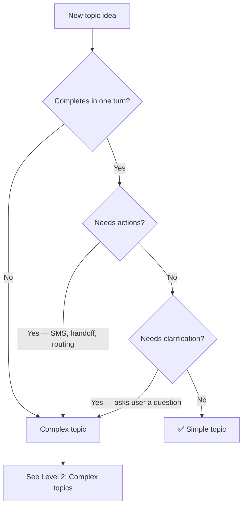

import { ProgressTracker } from '/snippets/progress-tracker'

<Info>
  **Lesson 3 of 6** — Create a simple FAQ-style Managed Topic.
</Info>

{/* VIDEO PLACEHOLDER — record a 2–5 min walkthrough of adding a simple topic and replace VIDEO_ID below */}
<iframe
  width="100%"
  height="400"
  src="https://www.youtube.com/embed/VIDEO_ID"
  title="Add a simple topic walkthrough"
  frameBorder="0"
  allow="accelerometer; autoplay; clipboard-write; encrypted-media; gyroscope; picture-in-picture"
  allowFullScreen
/>

A simple topic answers one question in one turn with no actions or follow-ups.


## What "simple" means

<Tabs>
  <Tab title="✅ Simple topics">
    - Completes in **one turn**
    - Requires **no clarification**
    - Triggers **no actions**
    - Works the same way in **Chat and Call**
  </Tab>

  <Tab title="❌ Not simple">
    - Combine multiple questions
    - Requires multiple intents
    - Offer SMS, handoff, or routing
    - Ask the user a follow-up question
  </Tab>
</Tabs>

<Note>
  If a topic needs any of those features, it should be implemented as a [complex topic](/learn/guides/advanced/add-complex-kb-topic) instead. These will be covered in more detail in **level 2** of the PolyAcademy.
</Note>

## Is your idea a simple or complex topic?

Use this decision tree before writing anything:



## Before you start: define your intent

Answer these questions before creating the topic:

- What is the exact question being answered?
- Can a human answer it in one short response?
- Can users reasonably phrase this question in several different ways?

If the topic answers more than one question, split it.

**Example: single intent**
- "What time do you close?"

**Example: multiple intents**
- "What time do you close and do you have holiday hours?"

These should be two separate topics.

### Step 1: Choose a precise topic name

The topic name is the strongest signal for retrieval.

Good topic names:
- Describe one intent
- Are specific, not general
- Use `snake_case`

**Examples**
- `closing_time`
- `parking_cost`
- `pet_policy`

Avoid names that are broad or vague.

**Avoid**
- `info`
- `general`
- `shop_questions`
- `misc`

### Step 2: Write sample questions

Sample questions teach the retriever how users phrase requests.

Add **up to 20** variations that reflect real speech. Include:
- Short questions
- Polite phrasing
- Informal or incomplete phrasing
- Call-style filler words

**Example: `closing_time` sample questions**
- what time is closing
- closing time
- when do we have to leave
- when do you shut
- what time do we need to be out by
- uh what's the closing time

Avoid:
- Repeating the same sentence with small wording changes
- Writing marketing-style language
- Including answers

### Step 3: Write the Content response

The Content field is the agent's full response.

It should be:
- Short
- Direct
- Easy to understand when spoken
- Complete on its own

Use this structure:
1. State the answer clearly
2. Optionally mention one next step
3. Stop

**Example: `closing_time` content**
```text
We open at 9am. Closing time is at 6 p.m.

If you'd like to hire the store for a late event, I can help with that.
```

This works because:
- The answer comes first
- The response ends cleanly
- No action is triggered

Avoid:
- Explanations or justification
- Policy language
- Multiple offers or options

**Avoid**
```text
Closing time is at 6 p.m., which allows our cleaning team to prepare the store for the next day.
```

This reads well on a page but performs poorly.

### Step 4: For now, leave Actions empty

For a simple Managed Topic:
- Do not add Actions
- Do not reference functions
- Do not trigger handoff or SMS

If an action is required, the topic is no longer simple and should be rewritten as a [complex topic](/learn/guides/advanced/add-complex-kb-topic).

## Common simple Managed Topic patterns

<AccordionGroup>
  <Accordion title="Static information" icon="clock">
    **Topic name:** `opening_hours`

    **Content:**
    ```text
    We are open daily from 7 a.m. to 6 p.m.
    ```
  </Accordion>

  <Accordion title="Policy statement" icon="shield-check">
    **Topic name:** `pet_policy`

    **Content:**
    ```text
    Guide dogs and other service animals are allowed in the store. Other pets are not allowed.
    ```
  </Accordion>

  <Accordion title="Location information" icon="location-dot">
    **Topic name:** `parking_location`

    **Content:**
    ```text
    Parking is available in the structure beneath the mall entrance.
    ```
  </Accordion>

  <Accordion title="Price reference" icon="dollar-sign">
    **Topic name:** `parking_cost`

    **Content:**
    ```text
    Self-parking is free on weekdays and $5 an hour on weekends between 9am and 5pm.
    ```
  </Accordion>
</AccordionGroup>

## Verification

### Test in Chat

Ask the question using:
- Exact phrasing
- Informal phrasing
- Polite phrasing
- Abrupt phrasing

Confirm:
- The same topic triggers every time
- The response does not change
- No follow-up question is asked

Live, in the test panel, look for the **topic citations** to confirm which topic was recalled by the agent.


### Test in Call

Ask the same question out loud, including hesitation or filler words.

Confirm:
- Speech is transcribed correctly
- The response sounds natural when spoken
- The agent does not over-explain

In **conversation review**, make sure topic citations are enabled:


## Final checklist

Before moving on, confirm:

- The topic answers exactly one question
- Sample questions reflect real user phrasing
- Content is short and speakable
- Actions are empty
- The topic behaves the same in Chat and Call

---

## Try it yourself

<Steps>
  <Step title="Challenge: Write a pet_policy topic">
    Write a complete simple topic for a store that allows only service animals.

    Include:
    1. Topic name (snake_case)
    2. Five sample questions
    3. Content (one to two sentences)

    <Accordion title="Hint">
      The topic name should describe exactly one intent. Sample questions should reflect how real users speak — including informal and spoken phrasing. Content should be speakable and complete in one or two sentences.
    </Accordion>

    <Accordion title="Example solution">
      **Topic name:** `pet_policy`

      **Sample questions:**
      - are pets allowed
      - can I bring my dog
      - do you allow animals
      - is my cat allowed inside
      - what's your policy on pets

      **Content:**
      ```text
      Service animals are welcome in the store. Other pets are not allowed inside.
      ```
    </Accordion>
  </Step>
</Steps>

---

## Knowledge check

{/* TALLY_QUIZ_PLACEHOLDER — Lesson L1-3: Add a simple topic
Replace this block with your Tally embed once forms are created:
<iframe
  src="https://tally.so/embed/FORM_ID"
  width="100%"
  height="500"
  frameBorder="0"
  title="Knowledge check: Add a simple topic"
/>
*/}

<AccordionGroup>
  <Accordion title="Q1: What is the strongest signal for topic retrieval?">
    **Answer:** The **topic name**. It should describe exactly one intent, be specific (not generic), and use `snake_case`.
  </Accordion>
  <Accordion title="Q2: Should a simple topic include Actions?">
    **Answer:** No. If an action is required (SMS, handoff, routing), the topic is no longer simple and should be rewritten as a complex topic.
  </Accordion>
</AccordionGroup>

---

<ProgressTracker lessonKey="l1-3-add-topic" lessonNum={3} totalLessons={6} level="Level 1" />
