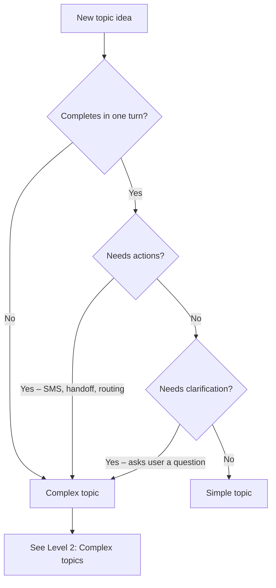

import { ProgressTracker } from '/snippets/progress-tracker.jsx'
import { Quiz } from '/snippets/quiz.jsx'
import { FillBlank } from '/snippets/fill-blank.jsx'
import { LessonMeta } from '/snippets/lesson-meta.jsx'

<Info>
  **Lesson 3 of 6** – Time to teach your agent something useful. You'll create a simple topic that answers one question – like "what time do you close?" – in both Chat and Call.
</Info>

<LessonMeta level={1} difficulty="Beginner" time="10 min" />

A [Managed Topic](/managed-topics/introduction) is how your agent learns to answer questions. In this lesson, you'll create the simplest kind: one question, one answer, no follow-ups.


## What "simple" means

<Tabs>
  <Tab title="Simple topics">
    - Completes in **one turn**
    - Requires **no clarification**
    - Triggers **no actions**
    - Works the same way in **Chat and Call**
  </Tab>

  <Tab title="Not simple">
    - Combine multiple questions
    - Requires multiple intents
    - Offer SMS, handoff, or routing
    - Ask the user a follow-up question
  </Tab>
</Tabs>

<Note>
  If a topic needs any of those features, it should be implemented as a [complex topic](/learn/guides/advanced/add-complex-kb-topic) instead. These will be covered in more detail in **Level 2: Advanced** of the PolyAcademy.
</Note>

## Is your idea a simple or complex topic?

Use this decision tree before writing anything:



## Check your understanding

<Quiz questions={[
  {
    q: "What defines a simple Managed Topic?",
    options: [
      "It uses at least one action like SMS or handoff",
      "It asks the user a follow-up question to clarify intent",
      "It completes in one turn, needs no actions, and requires no clarification",
      "It combines multiple related questions into a single response",
    ],
    correct: 2,
    explanation: "A simple Managed Topic completes in one turn, triggers no actions (no SMS, handoff, or routing), and requires no clarification from the user.",
  }
]} />

## Before you start: define your intent

Answer these questions before creating the topic:

- What is the exact question being answered?
- Can a human answer it in one short response?
- Can users reasonably phrase this question in several different ways?

If the topic answers more than one question, split it.

**Example: single intent**
- "What time do you close?"

**Example: multiple intents**
- "What time do you close and do you have holiday hours?"

These should be two separate topics.

### Step 1: Choose a precise topic name

The topic name is the strongest signal for retrieval.

Good topic names:
- Describe one intent
- Are specific, not general
- Use `snake_case`

**Examples**
- `closing_time`
- `parking_cost`
- `pet_policy`

Avoid names that are broad or vague.

**Avoid**
- `info`
- `general`
- `shop_questions`
- `misc`

### Step 2: Write sample questions

Sample questions teach the retriever how users phrase requests. As a baseline, aim for **at least 3** sample questions per topic. If the topic is broad or users phrase it in many different ways, include more – up to 20.

Add variations that reflect real speech. Include:
- Short questions
- Polite phrasing
- Informal or incomplete phrasing
- Call-style filler words
- Different sentence lengths

**Example: `closing_time` sample questions**
- what time is closing
- closing time
- when do we have to leave
- when do you shut
- what time do we need to be out by
- uh what's the closing time

<Tip>
  Focus on **variety in language and structure**, not slight rewordings. Think about the different ways real users might describe the same issue – whether they are confused, specific, vague, or using non-standard terminology.
</Tip>

Avoid:
- Repeating the same sentence with small wording changes
- Writing marketing-style language
- Including answers

### How retrieval works

The retriever compares the user's utterance to the topic **Name**, **Sample questions**, and **Content** to find the closest semantic matches. The top matches are then sent to the LLM, which makes the final decision on which topic to use.

These signals are not weighted equally. The **topic name** is the strongest retrieval signal, followed by **sample questions**, then **content**. This means a precise topic name has more impact on retrieval than a large number of sample questions.

Because the **Name** is shown to the retriever, it should be semantically close to the intent. A vague name like `general_behavior-payment` may trigger on any payment-related utterance instead of only the specific payment issue you intended.

### Step 3: Write the Content response

The Content field is the agent's full response.

It should be:
- Short
- Direct
- Easy to understand when spoken
- Complete on its own

Use this structure:
1. State the answer clearly
2. Optionally mention one next step
3. Stop

**Example: `closing_time` content**
```text
We open at 9am. Closing time is at 6 p.m.

If you'd like to hire the store for a late event, I can help with that.
```

This works because:
- The answer comes first
- The response ends cleanly
- No action is triggered

Avoid:
- Explanations or justification
- Policy language
- Multiple offers or options

**Avoid**
```text
Closing time is at 6 p.m., which allows our cleaning team to prepare the store for the next day.
```

This reads well on a page but performs poorly.

### Step 4: For now, leave Actions empty

For a simple Managed Topic:
- Do not add Actions
- Do not reference functions
- Do not trigger handoff or SMS

If an action is required, the topic is no longer simple and should be rewritten as a [complex topic](/learn/guides/advanced/add-complex-kb-topic).

## Common simple Managed Topic patterns

<AccordionGroup>
  <Accordion title="Static information" icon="clock">
    **Topic name:** `opening_hours`

    **Content:**
    ```text
    We are open daily from 7 a.m. to 6 p.m.
    ```
  </Accordion>

  <Accordion title="Policy statement" icon="shield-check">
    **Topic name:** `pet_policy`

    **Content:**
    ```text
    Guide dogs and other service animals are allowed in the store. Other pets are not allowed.
    ```
  </Accordion>

  <Accordion title="Location information" icon="location-dot">
    **Topic name:** `parking_location`

    **Content:**
    ```text
    Parking is available in the structure beneath the mall entrance.
    ```
  </Accordion>

  <Accordion title="Price reference" icon="dollar-sign">
    **Topic name:** `parking_cost`

    **Content:**
    ```text
    Self-parking is free on weekdays and $5 an hour on weekends between 9am and 5pm.
    ```
  </Accordion>
</AccordionGroup>

## Check your understanding

<Quiz questions={[
  {
    q: "What is the strongest signal for Managed Topic retrieval?",
    options: [
      "The sample questions list",
      "The topic content or answer text",
      "The topic name",
      "The topic description field",
    ],
    correct: 2,
    explanation: "The topic name is the strongest signal – it should describe exactly one intent, be specific rather than generic, and use snake_case. Sample questions come second, then content.",
  }
]} />

## Verification

### Test in Chat

Ask the question using:
- Exact phrasing
- Informal phrasing
- Polite phrasing
- Abrupt phrasing

Confirm:
- The same topic triggers every time
- The response does not change
- No follow-up question is asked

Live, in the test panel, look for the **topic citations** to confirm which topic was recalled by the agent.


### Test in Call

Ask the same question out loud, including hesitation or filler words.

Confirm:
- Speech is transcribed correctly
- The response sounds natural when spoken
- The agent does not over-explain

In **conversation review**, make sure topic citations are enabled:


## Final checklist

Before moving on, confirm:

- The topic answers exactly one question
- Sample questions reflect real user phrasing
- Content is short and speakable
- Actions are empty
- The topic behaves the same in Chat and Call

## Try it yourself

<Steps>
  <Step title="Challenge: Write a pet_policy topic">
    Write a complete simple topic for a store that allows only service animals.

    Include:
    1. Topic name (snake_case)
    2. Five sample questions
    3. Content (one to two sentences)

    <Accordion title="Hint">
      The topic name should describe exactly one intent. Sample questions should reflect how real users speak – including informal and spoken phrasing. Content should be speakable and complete in one or two sentences.
    </Accordion>

    <Accordion title="Example solution">
      **Topic name:** `pet_policy`

      **Sample questions:**
      - are pets allowed
      - can I bring my dog
      - do you allow animals
      - is my cat allowed inside
      - what's your policy on pets

      **Content:**
      ```text
      Service animals are welcome in the store. Other pets are not allowed inside.
      ```
    </Accordion>
  </Step>
</Steps>

## Check your understanding

<Quiz questions={[
  {
    q: "Should a simple Managed Topic include Actions?",
    options: [
      "Yes – always add at least one action as a fallback",
      "Only if the user explicitly requests it",
      "Yes – SMS and handoff actions are always safe to include",
      "No – if an action is needed, the topic is no longer simple",
    ],
    correct: 3,
    explanation: "If an action is required (SMS, handoff, routing), the topic is no longer simple and should be rewritten as a complex topic.",
  }
]} />

<FillBlank
  prompt='A Managed Topic that answers one question in one turn, requires no clarification, and triggers no actions is called a _____ topic.'
  answer={["simple", "Simple"]}
  hint="The opposite of complex — it's the most straightforward kind."
  explanation="Simple topics complete in one turn with no follow-up questions or actions. As soon as a topic needs SMS, a handoff, routing, or clarification from the user, it becomes a complex topic — covered in Level 2."
/>

## Go deeper

Want the full reference for Managed Topics? These pages cover everything – including the more complex topics you'll learn in Level 2:

<CardGroup cols={2}>
  <Card title="Managed Topics" icon="book-open" href="/managed-topics/introduction">
    Complete reference for creating and managing knowledge topics
  </Card>
  <Card title="Level 2: Complex topics" icon="graduation-cap" href="/learn/guides/advanced/add-complex-kb-topic">
    Multi-turn topics with actions, SMS, and handoffs (coming in Level 2)
  </Card>
</CardGroup>

---

<CardGroup cols={2}>
  <Card title="← Previous: Edit agent behavior" icon="arrow-left" href="/learn/guides/get-started/edit-agent-behavior">
    Lesson 2 of 6
  </Card>
  <Card title="Next: Edit voice settings →" icon="arrow-right" href="/learn/guides/get-started/edit-voice-settings">
    Lesson 4 – choose how your agent sounds
  </Card>
</CardGroup>

<ProgressTracker lessonKey="l1-3-add-topic" lessonNum={3} totalLessons={6} level="Level 1" />
