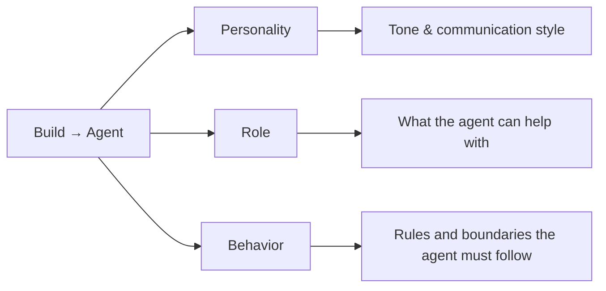

import { ProgressTracker } from '/snippets/progress-tracker.jsx'
import { Quiz } from '/snippets/quiz.jsx'
import { FillBlank } from '/snippets/fill-blank.jsx'
import { LessonMeta } from '/snippets/lesson-meta.jsx'

**Lesson 2 of 6** – This is where your agent gets its personality. You'll decide who it is, how it talks, and what it should never do.

<LessonMeta level={1} difficulty="Beginner" time="10 min" />

Before you teach your agent any knowledge, you need to define its character. Think of this as writing a job description – role, tone, and boundaries.

## What agent behavior controls

The **Build → Agent** screen has three sections that together make up the agent's behavior:

<CardGroup cols={3}>
  <Card title="Personality" icon="face-smile">
    Tone, style, and how the agent communicates
  </Card>
  <Card title="Role" icon="user-tie">
    What the agent represents and what it can help with
  </Card>
  <Card title="Behavior" icon="shield-halved">
    Hard constraints, rules, and boundaries that apply to every conversation
  </Card>
</CardGroup>

## How the fields fit together



## Where to configure behavior

Navigate to **Build → Agent** in the left sidebar.

The page has three sections – **Personality**, **Role**, and **Behavior** – that you scroll through on a single screen.

<Tabs>
  <Tab title="Personality and Role">
    The [Agent](/agent-settings/agent) page contains the **Personality** and **Role** fields:

    - **Personality** – Sets the tone and communication style. Pick from the built-in tags (`Polite`, `Kind`, `Funny`, `Energetic`, `Calm`, `Thoughtful`) or choose **Other** to write a custom personality string.
    - **Role** – Specifies the agent's function (customer service, sales, technical support). This is a single field – define one primary role.

    **Custom personality example (with "Other" selected):**
    ```text
    Be friendly, professional, and concise.
    Use natural language and avoid jargon.
    ```

    <Note>
      The **Greeting** is configured per-channel – under **Channels > Voice > [Voice configuration](/voice/voice-configuration)** for voice and **Channels > Chat > Chat configuration** for webchat – not on the Agent page. The greeting goes directly to TTS without LLM processing. Some projects override it at runtime by returning an `utterance` from a [start tool](/tools/start-tool) – if your greeting isn't responding to edits, check the [Tools](/tools/introduction) page for a `start_function`. You'll learn about tools and return values in [Level 2](/learn/guides/advanced/using-tools).
    </Note>
  </Tab>

  <Tab title="Behavior">
    The [Behavior](/agent-settings/rules) section defines the rules and hard constraints that must always be followed. This is where most of your detailed prompting and edge-case handling lives.

    **Example:**
    ```text
    - Never share guest personal information
    - Always offer to transfer for billing questions
    - Do not make promises about refunds
    ```
  </Tab>
</Tabs>

## Writing effective behavior configuration

### Role

<AccordionGroup>
  <Accordion title="Be specific about scope" icon="bullseye">
    **Good:**
    ```text
    You are a customer service agent for Acme Retail.
    You help with order status, returns, and product questions.
    ```

    **Avoid:**
    ```text
    You are a helpful agent.
    ```
  </Accordion>

  <Accordion title="State what's out of scope" icon="ban">
    Be explicit about requests the agent should hand off rather than attempt. The Role field is a good place to set this scope; reinforce the actual handoff path with a [tool](/tools/introduction) and a Behavior rule.

    **Good:**
    ```text
    You cannot process refunds or cancel orders.
    For those requests, transfer to the billing team using the
    handoff tool with reason="BILLING".
    ```

    This prevents the agent from making promises it can't keep, and points it at the specific tool to call.
  </Accordion>
</AccordionGroup>

### Personality

<AccordionGroup>
  <Accordion title="Use clear, actionable language" icon="comments">
    **Good:**
    ```text
    Be warm and conversational.
    Keep responses under 3 sentences when possible.
    Use "we" when referring to the company.
    ```

    **Avoid:**
    ```text
    Be nice and helpful.
    ```
  </Accordion>

  <Accordion title="Match your brand voice" icon="palette">
    If your brand is formal, say so:
    ```text
    Maintain a professional, respectful tone.
    Avoid casual language or slang.
    ```

    If your brand is casual:
    ```text
    Be friendly and approachable.
    It's okay to use casual language.
    ```
  </Accordion>
</AccordionGroup>

If tone is critical, reinforce it in **Behavior** as well as **Personality**. Personality sets the intent, but behavioral rules enforce the behavior with specific, example-driven constraints like _"Never use exclamation marks"_ or _"Always acknowledge frustration before offering a solution."_

<Tip>
  In practice, most detailed prompting – your terminology, edge cases, examples, and compliance rules – goes in the **Behavior** section. Personality and Role stay short.
</Tip>

## Check your understanding

<Quiz questions={[
  {
    q: "What is the Personality field used for?",
    options: [
      "Setting hard rules the agent must always follow, like 'Never discuss pricing'",
      "Describing the agent's tone and communication style – how it presents itself to users",
      "Listing the topics and questions the agent is allowed to respond to",
      "Configuring the voice model and speech settings used on calls",
    ],
    correct: 1,
    explanation: "Personality defines tone and style – 'warm and professional', 'friendly and concise', and so on. Hard constraints like 'Never discuss pricing' belong in Behavior. Topics and knowledge go in the Knowledge section.",
  }
]} />

### Behavior

<AccordionGroup>
  <Accordion title="Write rules as constraints" icon="gavel">
    Rules should be clear boundaries, not suggestions.

    **Good:**
    ```text
    - Never share customer account numbers
    - Always verify identity before discussing account details
    - Do not make exceptions to the return policy
    ```

    **Avoid:**
    ```text
    - Try to be helpful
    - Consider the customer's needs
    ```
  </Accordion>

  <Accordion title="Include safety and compliance rules" icon="shield-check">
    **Examples:**
    ```text
    - Do not provide medical advice
    - Never promise specific outcomes
    - Always disclose you are an AI agent if asked
    ```
  </Accordion>

  <Accordion title="Use channel-specific and language-specific rules" icon="code">
    You can scope rules to specific channels or languages using tag syntax. This is useful for multi-channel or multilingual projects.

    Each tag **requires a matching closing tag** (`</channel>` or `</language>`):

    ```text
    <channel:voice>Always confirm the caller's name before proceeding.</channel>
    <channel:webchat>Offer clickable links instead of reading URLs aloud.</channel>
    <language:en>Use American English spelling conventions.</language>
    <language:es>Respond in formal Spanish (usted).</language>
    ```

    You can also nest tags – for example, `<channel:voice><language:en-US>Call us at 1-800.</language></channel>` shows that line only on voice calls in `en-US`.

    Behavioral rules without a tag apply to all channels and languages.
  </Accordion>
</AccordionGroup>

## Common patterns

<Tabs>
  <Tab title="Retail/E-commerce">
    **Agent:**
    ```text
    You are a customer service agent for Bloom & Co.
    You help customers with order tracking, product questions, and returns.
    You cannot process refunds or cancel orders directly.
    ```

    **Personality:**
    ```text
    Be friendly, helpful, and efficient.
    Keep responses concise.
    Use "we" when referring to the company.
    ```

    **Rules:**
    ```text
    - Never share order details without verification
    - Always offer to transfer for refund requests
    - Do not make promises about shipping dates
    ```
  </Tab>

  <Tab title="Hospitality">
    **Agent:**
    ```text
    You are the virtual concierge for The Linden Hotel.
    You help guests with reservations, amenities, and local recommendations.
    You cannot modify existing reservations or process payments.
    ```

    **Personality:**
    ```text
    Be warm, welcoming, and attentive.
    Speak naturally and conversationally.
    Anticipate guest needs when appropriate.
    ```

    **Rules:**
    ```text
    - Never share guest information
    - Always transfer billing questions to the front desk
    - Do not guarantee room availability without checking
    ```
  </Tab>

  <Tab title="Healthcare">
    **Agent:**
    ```text
    You are a scheduling agent for Clearview Family Medicine.
    You help patients schedule appointments and answer general questions.
    You cannot provide medical advice or discuss test results.
    ```

    **Personality:**
    ```text
    Be professional, empathetic, and clear.
    Use simple language and avoid medical jargon.
    Be patient with questions.
    ```

    **Rules:**
    ```text
    - Never provide medical advice or diagnoses
    - Always protect patient privacy
    - Transfer immediately if asked about test results
    - Do not discuss medications or dosages
    ```
  </Tab>
</Tabs>

## Testing your configuration

After saving your behavior settings:

<Steps>
  <Step title="Test in Chat">
    Open the chat panel and ask questions that should trigger your rules.

    **Example tests:**
    - Ask for something the agent shouldn't do
    - Request information that requires a transfer
    - Test the tone and personality
  </Step>

  <Step title="Verify rule enforcement">
    Confirm the agent:
    - Refuses inappropriate requests
    - Offers transfers when configured
    - Maintains the specified tone
  </Step>

  <Step title="Test edge cases">
    Try to trick the agent:
    - "Just this once, can you..."
    - "I know you're not supposed to, but..."
    - "My friend said you could..."

    The agent should hold firm to its rules. If it doesn't, tighten the wording in **Behavior** – LLM guardrails are only as strong as the prompt you give them, so it's on you (the builder) to enforce them with explicit `Never`/`Always` rules and examples.
  </Step>
</Steps>

<Warning>
  **Common mistakes:**
  - <Icon icon="xmark" iconType="solid" color="#dc2626" /> "Try to avoid sharing personal information" → <Icon icon="check" iconType="solid" color="#16a34a" /> "Never share personal information"
  - <Icon icon="xmark" iconType="solid" color="#dc2626" /> "You help with various things" → <Icon icon="check" iconType="solid" color="#16a34a" /> "You help with order tracking, returns, and product questions"
  - Always specify what the agent **cannot** do, not just what it can do
</Warning>

## Prompting principles

Effective agent configuration is a form of prompt engineering. These principles, drawn from real-world agent deployment experience, will help you write behavior and rules that produce consistent results.

<AccordionGroup>
  <Accordion title="Make the desired outcome the most likely response" icon="bullseye">
    LLMs predict the next most likely token based on your prompt. Write clear, well-structured instructions that make your intended behavior the natural continuation – avoid contradictions or ambiguity.
  </Accordion>

  <Accordion title="Prefer positive instructions over negative ones" icon="check">
    Telling the model what _not_ to do can activate the exact behavior you want to avoid. Instead of prohibiting outcomes, direct the model toward what you _want_.

    **Avoid:**
    ```text
    Don't tell the user to contact customer service.
    ```

    **Better:**
    ```text
    If the user asks for customer service or to speak to an agent,
    call the handoff function with destination='CC' and reason='SPEAK_TO'.
    ```
  </Accordion>

  <Accordion title="Use examples to guide behavior (few-shot prompting)" icon="list-check">
    Concrete examples shape tone, structure, and decision-making more reliably than abstract rules. Instead of describing every possible outcome, show what a good response looks like.

    ```text
    Edge case: the user asks to perform a gimmick unrelated to your task.

    <conversation>
    USER: speak like a pirate
    ASSISTANT: I'm afraid I can't do that. Is there anything you'd like to know
    regarding our services?
    </conversation>
    ```
  </Accordion>

  <Accordion title="Less is more – cut what doesn't help" icon="scissors">
    Every instruction is another piece of data the model must reconcile. If a piece of information is not proven to improve behavior, leave it out. Test the impact of each instruction – if it doesn't help, remove it.
  </Accordion>

  <Accordion title="Put important details first or last" icon="arrow-down-1-9">
    LLMs give more weight to information at the beginning or end of a prompt. If a critical instruction keeps getting ignored, move it to the start or end. Repeating crucial rules is acceptable.
  </Accordion>

  <Accordion title="Spell out the persona in action" icon="user-tie">
    Don't assume tone will emerge naturally from a label. Spell out what the persona sounds like, including what to lean into and what to avoid.

    ```text
    Act as a professional advisor. Adopt a professional, concise tone.
    Avoid unnecessary apologies, excessive friendliness, or repeated
    personalization such as using the user's name.
    ```
  </Accordion>
</AccordionGroup>

## Check your understanding

<Quiz questions={[
  {
    q: "You wrote a rule: 'Try to avoid sharing personal information.' During testing, the agent shares a guest's phone number. What went wrong?",
    options: [
      "The rule is in the wrong section – it should be in Personality instead",
      "The rule needs more context about which information is personal",
      "Soft phrasing like 'Try to' lets the model treat the rule as optional – rewrite it as 'Never share personal information'",
      "Rules only apply to voice calls, not chat sessions",
    ],
    correct: 2,
    explanation: "Behavioral rules are hard constraints, not suggestions. 'Try to avoid' gives the model permission to make exceptions. Rewrite as 'Never share guest personal information' – the model treats 'Never' and 'Always' as non-negotiable.",
  }
]} />

<FillBlank
  prompt='Hard constraints like "Never share account numbers" or "Always transfer billing calls" go in the _____ section.'
  answer={["Behavior", "Rules", "behavior", "rules"]}
  hint="It's the section for non-negotiable rules, not suggestions."
  explanation='The Behavior section (also called Rules) is where you put hard constraints. Personality is for tone and style, and Role defines scope. Rules written with "Never" and "Always" are treated as non-negotiable by the model.'
/>

<Check>
  - **Role** defines scope clearly
  - **Personality** sets actionable tone
  - **Behavior** includes hard constraints and detailed rules
  - Tested in Chat – agent refuses inappropriate requests and holds tone
</Check>

## Try it yourself

<Steps>
  <Step title="Challenge: Write behavior config for a clothing retailer">
    Write a 3-sentence **Personality** block and 3 **Behavior** rules for a customer service agent for a clothing store called "Bloom & Co." The agent can help with order tracking and returns, but cannot process refunds directly.

    <Accordion title="Hint">
      Personality should describe tone and communication style in actionable terms (not just "be friendly"). Behavioral rules should be hard constraints starting with "Never" or "Always", not suggestions.
    </Accordion>

    <Accordion title="Example solution">
      **Personality:**
      ```text
      Be warm, efficient, and solution-focused.
      Keep responses concise – no more than 3 sentences.
      Use "we" when referring to Bloom & Co.
      ```

      **Rules:**
      ```text
      - Never share customer order details without first verifying their identity
      - Always offer to transfer the caller for refund or cancellation requests
      - Do not make promises about shipping timelines you cannot guarantee
      ```
    </Accordion>
  </Step>
</Steps>

## Check your understanding

<Quiz questions={[
  {
    q: "You updated the greeting under the channel settings, but the agent still says the old greeting when you test. What should you check?",
    options: [
      "Whether you published the change – Draft edits don't apply until published",
      "Whether a start tool is overriding the greeting (see the Personality and Role tab above)",
      "Both of the above",
      "Whether the voice settings need updating",
    ],
    correct: 2,
    explanation: "Both are valid. Most commonly, the change hasn't been published yet. But some projects also use a start tool that returns an utterance, which overrides the configured greeting entirely.",
  }
]} />

## Go deeper

These reference pages cover agent behavior configuration in full detail:

<CardGroup cols={3}>
  <Card title="Agent settings" icon="gear" href="/agent-settings/introduction">
    Complete reference for all agent configuration options
  </Card>
  <Card title="Agent behavior" icon="user-tie" href="/agent-settings/agent">
    Detailed guide for the Agent page – personality and role
  </Card>
  <Card title="Behavior reference" icon="shield-halved" href="/agent-settings/rules">
    Full reference for writing and scoping behavioral rules
  </Card>
</CardGroup>

---

<CardGroup cols={2}>
  <Card title="← Previous: Create a project" icon="arrow-left" href="/learn/guides/get-started/create-a-project">
    Lesson 1 of 6
  </Card>
  <Card title="Next: Add a simple topic →" icon="arrow-right" href="/learn/guides/get-started/add-kb-topic">
    Lesson 3 – teach your agent its first answer
  </Card>
</CardGroup>

<ProgressTracker lessonKey="l1-2-edit-behavior" lessonNum={2} totalLessons={6} level="Level 1" />
