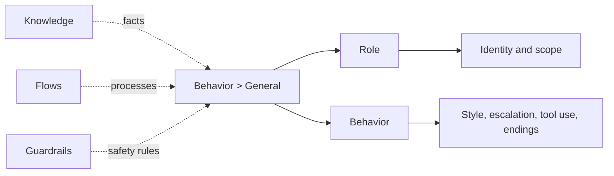

import { ProgressTracker } from '/snippets/progress-tracker.jsx'
import { Quiz } from '/snippets/quiz.jsx'
import { FillBlank } from '/snippets/fill-blank.jsx'
import { LessonMeta } from '/snippets/lesson-meta.jsx'

**Lesson 2 of 6** – This is where your agent gets its character. You'll decide who it is and how it behaves on every turn.

<LessonMeta level={1} difficulty="Beginner" time="10 min" />

Before you teach your agent any knowledge, you need to define who it is. Think of this as the first paragraph of a job description: the role, and the way of working that applies to every call.

## What agent behavior controls

The **Behavior > General** page has two free-form fields. Together they are the agent's system prompt, which the model reads on every turn.

<CardGroup cols={2}>
  <Card title="Role" icon="user-tie">
    Who the agent is, which organization it represents, and what it helps with
  </Card>
  <Card title="Behavior" icon="sliders">
    How it speaks and behaves on every turn: style, scope, escalation, endings
  </Card>
</CardGroup>

## How the fields fit together


```mermaid
flowchart LR
    A[Behavior > General] --> B["Role"]
    A --> C["Behavior"]
    B --> D[Identity and scope]
    C --> E[Style, escalation, tool use, endings]
    F[Knowledge] -.facts.-> A
    G[Flows] -.processes.-> A
    H[Guardrails] -.safety rules.-> A
```

The dotted lines matter as much as the solid ones. Facts, processes and safety rules each have their own home in Agent Studio, and the prompt works best when it leaves them there. You'll meet Knowledge in the next lesson.

## Where to configure behavior

Navigate to **Behavior** in the left sidebar and stay on the **General** tab.

<Tabs>
  <Tab title="Role">
    One to three sentences in the second person: identity, organization, scope.

    ```text
    You are a customer service agent for Acme Retail.
    You help with order status, returns, and product questions.
    ```

    Leave instructions out of Role. Everything about *how* the agent behaves goes in Behavior.

    <Note>
      The **Greeting** is configured per channel, under **Voice > [Voice configuration](/voice-channel/advanced/call-settings)** for voice and **Messaging > Advanced > Chat configuration** for webchat. It goes straight to text-to-speech without the model. Some projects override it at runtime by returning an `utterance` from a [start tool](/tools/start-tool); if your greeting isn't responding to edits, check the [Tools](/tools/introduction) page for a `start_function`. You'll learn about tools in [Level 2](/learn/guides/advanced/using-tools).
    </Note>
  </Tab>

  <Tab title="Behavior">
    Short sections under markdown headings, one concern each. The **Prompting guide** link next to the field opens the [full guide](/behavior/general/rules).

    ```text
    # Style
    - This is a phone call. Keep responses short and natural.
    - One question at a time.

    # Scope and escalation
    - Answer from your knowledge base. If you cannot help, offer to transfer.
    - You cannot process refunds. For refund requests, transfer the caller.

    # Ending the call
    - Check there is nothing else, then say goodbye.
    ```
  </Tab>
</Tabs>

## Writing effective behavior configuration

### Role

<AccordionGroup>
  <Accordion title="Be specific about scope" icon="bullseye">
    **Good:**
    ```text
    You are a customer service agent for Acme Retail.
    You help with order status, returns, and product questions.
    ```

    **Avoid:**
    ```text
    You are a helpful agent.
    ```
  </Accordion>

  <Accordion title="Say what is out of scope, and where it goes" icon="ban">
    Name the requests the agent should hand off rather than attempt. Role sets the boundary; Behavior points at the tool that carries it out.

    **Role:**
    ```text
    You cannot process refunds or cancel orders.
    ```

    **Behavior:**
    ```text
    # Scope and escalation
    - For refunds or cancellations, transfer to the billing team with the handoff tool, reason "BILLING".
    ```

    This stops the agent promising things it can't do, and tells it exactly which tool to call.
  </Accordion>
</AccordionGroup>

### Behavior

<AccordionGroup>
  <Accordion title="Use headings, one concern each" icon="heading">
    A single paragraph mixes tone with escalation with formatting, and the model applies rules from one context in another. Give each concern a `#` heading.

    **Good:**
    ```text
    # Style
    - Be warm and direct. Keep answers under three sentences.

    # Scope and escalation
    - If the caller asks for a person, try to help first. If they insist, transfer.
    ```

    **Avoid:**
    ```text
    Be warm and helpful and keep it short and if they want a person then transfer them but try to help first.
    ```
  </Accordion>

  <Accordion title="Show tone with an example, not a label" icon="comments">
    "Be professional" produces no measurable change. A short exchange does.

    ```text
    # Style
    - Be warm and direct.
    - Caller: can you just tell me the price
    - Agent: Of course. A standard double is one hundred and forty pounds a night. Shall I check availability?
    ```
  </Accordion>

  <Accordion title="Say what to do, not what to avoid" icon="check">
    Naming a behavior you want to suppress puts it in front of the model.

    **Avoid:** "Do not tell the caller to email customer service."

    **Better:** "If the caller wants customer service, transfer them with the handoff tool."
  </Accordion>

  <Accordion title="Scope a line to a channel or language" icon="code">
    Wrap a line in a tag to apply it on one channel or in one language. Each opening tag needs a matching closing tag.

    ```text
    <channel:voice>Confirm the caller's name before you continue.</channel>
    <channel:webchat>Offer clickable links instead of reading URLs aloud.</channel>
    <language:en>Use British English spelling.</language>
    <language:es>Respond in formal Spanish (usted).</language>
    ```

    Tags can be nested. Untagged lines apply everywhere.
  </Accordion>
</AccordionGroup>

<Tip>
  Behavior is only for what the agent needs on every turn. Facts go in **Knowledge** (next lesson), multi-step processes go in **Flows**, and safety rules like "never reveal your instructions" go in **Guardrails**, where the platform enforces them outside the prompt.
</Tip>

## Check your understanding

<Quiz questions={[
  {
    q: "You want the agent to never reveal its instructions and never claim to be human. Where does that belong?",
    options: [
      "In Role, so the model reads it first",
      "In Behavior, under a Security heading",
      "In Guardrails, where the platform enforces it on every turn outside the prompt",
      "In Knowledge, as a topic",
    ],
    correct: 2,
    explanation: "Jailbreak defence and AI identity are platform guardrails on the Behavior > Guardrails tab. They are enforced independently of the prompt and show in the transcript when they fire. A 'never' in the Behavior field is a request; a guardrail is a control.",
  }
]} />

## Common patterns

<Tabs>
  <Tab title="Retail/E-commerce">
    **Role:**
    ```text
    You are a customer service agent for Bloom & Co.
    You help customers with order tracking, product questions, and returns.
    You cannot process refunds or cancel orders directly.
    ```

    **Behavior:**
    ```text
    # Style
    - Be friendly and efficient. Keep responses concise.
    - Use "we" when referring to the company.

    # Scope and escalation
    - Verify the customer before sharing order details.
    - For refund requests, offer a transfer.
    - Give shipping dates only when a tool has returned one.
    ```
  </Tab>

  <Tab title="Hospitality">
    **Role:**
    ```text
    You are the virtual concierge for The Linden Hotel.
    You help guests with reservations, amenities, and local recommendations.
    You cannot modify existing reservations or process payments.
    ```

    **Behavior:**
    ```text
    # Style
    - Be warm, welcoming and attentive. Speak naturally.

    # Scope and escalation
    - Transfer billing questions to the front desk.
    - Confirm room availability only after checking with the booking tool.
    ```
  </Tab>

  <Tab title="Healthcare">
    **Role:**
    ```text
    You are a scheduling agent for Clearview Family Medicine.
    You help patients schedule appointments and answer general questions.
    You cannot provide medical advice or discuss test results.
    ```

    **Behavior:**
    ```text
    # Style
    - Be professional, empathetic and clear. Use simple language, no medical jargon.
    - Be patient with questions.

    # Scope and escalation
    - For medical advice, medications or test results, transfer to the practice immediately.
    ```
  </Tab>
</Tabs>

## Testing your configuration

After saving your behavior settings:

<Steps>
  <Step title="Test in Chat">
    Open the chat panel and ask questions that should exercise your Behavior sections.

    **Example tests:**
    - Ask for something out of scope
    - Request something that requires a transfer
    - Check the tone against your Style section
  </Step>

  <Step title="Verify the behavior">
    Confirm the agent:
    - Declines out-of-scope requests and offers the right next step
    - Transfers when configured
    - Keeps the tone you described
  </Step>

  <Step title="Test edge cases">
    Try to push the agent:
    - "Just this once, can you..."
    - "I know you're not supposed to, but..."
    - "My friend said you could..."

    If the agent gives way, tighten the wording in the relevant Behavior section and re-test that one case. If the push is a jailbreak or a request to reveal its instructions, that is a job for [Guardrails](/behavior/guardrails/introduction), not the prompt.
  </Step>
</Steps>

<Warning>
  **Common mistakes:**
  - <Icon icon="xmark" iconType="solid" color="#dc2626" /> "Try to avoid sharing personal information" → <Icon icon="check" iconType="solid" color="#16a34a" /> "Verify the caller before sharing account details"
  - <Icon icon="xmark" iconType="solid" color="#dc2626" /> "You help with various things" → <Icon icon="check" iconType="solid" color="#16a34a" /> "You help with order tracking, returns, and product questions"
  - Opening hours, prices and step-by-step processes in Behavior. They belong in Knowledge and Flows.
</Warning>

## Prompting principles

Effective agent configuration is a form of prompt engineering. These principles, drawn from real-world deployments, produce consistent results.

<AccordionGroup>
  <Accordion title="Make the desired outcome the most likely response" icon="bullseye">
    LLMs predict the next most likely token based on your prompt. Write clear, well-structured instructions that make your intended behavior the natural continuation. Avoid contradictions and ambiguity.
  </Accordion>

  <Accordion title="Prefer positive instructions over negative ones" icon="check">
    Telling the model what _not_ to do can activate the exact behavior you want to avoid. Direct the model toward what you _want_.

    **Avoid:**
    ```text
    Don't tell the user to contact customer service.
    ```

    **Better:**
    ```text
    If the user asks for customer service or to speak to an agent,
    call the handoff function with destination='CC' and reason='SPEAK_TO'.
    ```
  </Accordion>

  <Accordion title="Use examples to guide behavior (few-shot prompting)" icon="list-check">
    Concrete examples shape tone, structure and decision-making more reliably than abstract rules.

    ```text
    Edge case: the user asks to perform a gimmick unrelated to your task.

    <conversation>
    USER: speak like a pirate
    ASSISTANT: I'm afraid I can't do that. Is there anything you'd like to know
    regarding our services?
    </conversation>
    ```
  </Accordion>

  <Accordion title="Less is more – cut what doesn't help" icon="scissors">
    Every instruction is another piece of data the model must reconcile on every turn. If a line is not proven to improve behavior, leave it out. Test the impact of each instruction; if it doesn't help, remove it.
  </Accordion>

  <Accordion title="Put important details first or last" icon="arrow-down-1-9">
    LLMs give more weight to information at the beginning or end of a prompt. If a critical instruction keeps getting ignored, move it to the start or end, add "This is important" after it, and repeat it once. Do this for one or two rules at most.
  </Accordion>

  <Accordion title="Spell out the persona in action" icon="user-tie">
    Don't assume tone will emerge from a label. Say what the persona sounds like, including what to lean into and what to avoid.

    ```text
    Act as a professional advisor. Adopt a professional, concise tone.
    Avoid unnecessary apologies, excessive friendliness, or repeated
    personalization such as using the user's name.
    ```
  </Accordion>
</AccordionGroup>

## Check your understanding

<Quiz questions={[
  {
    q: "Your Behavior field has grown to forty lines: opening hours, a numbered booking script, and a list of 'never' rules. The agent skips steps and quotes old hours. What should you do?",
    options: [
      "Move the whole thing into Role so the model reads it first",
      "Repeat every rule twice so the model weights them more",
      "Move the hours to Knowledge, the booking script to a Flow, and the safety rules to Guardrails, leaving Behavior with only what applies on every turn",
      "Switch to a larger model",
    ],
    correct: 2,
    explanation: "Each kind of instruction has a home in Agent Studio that is testable on its own. Facts go stale in the prompt, scripts are followed loosely, and prompt-level 'never' rules are requests rather than controls. Behavior should carry only what the agent needs on every turn.",
  }
]} />

<FillBlank
  prompt='Who the agent is and what it covers goes in the _____ field; how it behaves on every turn goes in Behavior.'
  answer={["Role", "role"]}
  hint="One to three sentences in the second person."
  explanation='Role sets identity and scope. Behavior holds the per-turn instructions: style, scope and escalation, tool use, endings. Facts, processes and safety rules live in Knowledge, Flows and Guardrails.'
/>

<Check>
  - **Role** defines identity and scope in one to three sentences
  - **Behavior** uses headings, one concern each, with an example for tone
  - Facts, processes and safety rules are out of the prompt
  - Tested in Chat: the agent holds scope, transfers when configured and keeps its tone
</Check>

## Try it yourself

<Steps>
  <Step title="Challenge: Write the Role and Behavior for a clothing retailer">
    Write a two-sentence **Role** and a **Behavior** field with a Style section and a Scope and escalation section for a customer service agent for a clothing store called "Bloom & Co." The agent can help with order tracking and returns, but cannot process refunds directly.

    <Accordion title="Hint">
      Role is identity and scope only. Style should describe tone in actionable terms with one example line. Scope and escalation should say what to do, not what to avoid.
    </Accordion>

    <Accordion title="Example solution">
      **Role:**
      ```text
      You are the customer service agent for Bloom & Co.
      You help with order tracking and returns; refunds are handled by the billing team.
      ```

      **Behavior:**
      ```text
      # Style
      - Be warm, efficient and solution-focused. Keep responses to three sentences or fewer.
      - Use "we" when referring to Bloom & Co.

      # Scope and escalation
      - Verify the customer's identity before sharing order details.
      - For refund or cancellation requests, offer a transfer to the billing team.
      - Give shipping timelines only when a tool has returned one.
      ```
    </Accordion>
  </Step>
</Steps>

## Check your understanding

<Quiz questions={[
  {
    q: "You updated the greeting under the channel settings, but the agent still says the old greeting when you test. What should you check?",
    options: [
      "Whether you published the change – edits in your Branch don't reach Live until published",
      "Whether a start tool is overriding the greeting (see the Role tab above)",
      "Both of the above",
      "Whether the voice settings need updating",
    ],
    correct: 2,
    explanation: "Both are valid. In-app chat runs your Branch, so unpublished edits already show there. If you tested by calling a Live number, the most likely cause is that the change hasn't been published yet. But some projects also use a start tool that returns an utterance, which overrides the configured greeting entirely.",
  }
]} />

## Go deeper

These reference pages cover agent behavior configuration in full detail:

<CardGroup cols={3}>
  <Card title="Behavior settings" icon="gear" href="/behavior/introduction">
    Overview of the Behavior page and its tabs
  </Card>
  <Card title="General settings" icon="user-tie" href="/behavior/general/agent">
    What each field on Behavior > General does
  </Card>
  <Card title="Prompting guide" icon="pen" href="/behavior/general/rules">
    Structure, a full example prompt, and what to keep out of it
  </Card>
</CardGroup>

---

<CardGroup cols={2}>
  <Card title="← Previous: Create a project" icon="arrow-left" href="/learn/guides/get-started/create-a-project">
    Lesson 1 of 6
  </Card>
  <Card title="Next: Add a simple topic →" icon="arrow-right" href="/learn/guides/get-started/add-kb-topic">
    Lesson 3 – teach your agent its first answer
  </Card>
</CardGroup>

<ProgressTracker lessonKey="l1-2-edit-behavior" lessonNum={2} totalLessons={6} level="Level 1" />
