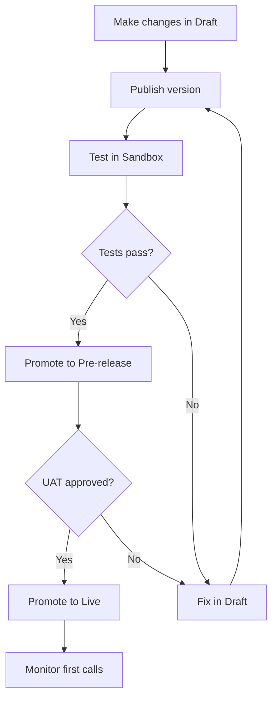

import { ProgressTracker } from '/snippets/progress-tracker'
import { Quiz } from '/snippets/quiz'

<Info>
  **Lesson 5 of 6** — Test and promote changes safely: Sandbox → Pre-release → Live. For detailed workflows, see [Version management](/learn/maintain/version-management). For reference, see [Environments and versions](/environments-and-versions/introduction).
</Info>

{/* VIDEO PLACEHOLDER — record a 2–5 min walkthrough of publishing and promoting versions and replace VIDEO_ID below */}
<iframe
  width="100%"
  height="400"
  src="https://www.youtube.com/embed/VIDEO_ID"
  title="Environments and versions walkthrough"
  frameBorder="0"
  allow="accelerometer; autoplay; clipboard-write; encrypted-media; gyroscope; picture-in-picture"
  allowFullScreen
/>

Each environment runs a published version. Draft changes apply only after publishing and promoting.

## How environments work

<Note>
  Think of environments as **checkpoints**, not branches.
</Note>

<CardGroup cols={3}>
  <Card title="Draft" icon="pencil">
    Your working state. Changes exist only for you.
  </Card>
  <Card title="Published version" icon="camera">
    A snapshot of the agent at a moment in time.
  </Card>
  <Card title="Environment" icon="server">
    A place where a specific version is running and can receive traffic.
  </Card>
</CardGroup>

<Warning>
  Multiple environments can point to the same version, but **only one version per environment** is active at any time.
</Warning>

## The full promotion flow

## The Environments page

This page shows every published version of your agent and where it is currently deployed.

<AccordionGroup>
  <Accordion title="What you'll see" icon="list">
    - Version name or description
    - Author and timestamp
    - Which environments it's active in (Sandbox / Pre-release / Live)
    - An overflow menu for actions
  </Accordion>

  <Accordion title="Key actions" icon="ellipsis-vertical">
    - **Preview version** – load the agent exactly as that version behaves
    - **Compare versions** – open a side-by-side diff
    - **Rollback to this version** – immediately restore a previous state
  </Accordion>
</AccordionGroup>

## Environment types

<Tabs>
  <Tab title="Sandbox" icon="flask">
    Sandbox is your **development and testing environment**.

    **Use Sandbox for:**
    - Writing or editing KB topics
    - Adjusting rules and behaviour
    - Changing voice settings
    - Wiring or modifying actions, SMS, or handoffs

    <AccordionGroup>
      <Accordion title="Best practices" icon="circle-check">
        - Confirm you are in **Sandbox** before editing
        - Publish frequently with short, descriptive notes
        - Test after every meaningful change

        **Example publish note:**
        "Clarified late checkout KB and added SMS consent language"
      </Accordion>

      <Accordion title="Verification" icon="magnifying-glass">
        - Chat testing reflects your latest changes
        - Test calls hit Sandbox numbers, not Live numbers
        - Conversation Review shows the Sandbox environment tag
      </Accordion>
    </AccordionGroup>
  </Tab>

  <Tab title="Pre-release" icon="vial">
    Pre-release is your **staging / UAT environment**.

    It should be treated as:
    - Stable
    - Reviewable
    - Close to production

    **Use Pre-release for:**
    - Final review and approval
    - QA review
    - Final voice and pacing checks
    - Regression testing

    <AccordionGroup>
      <Accordion title="Best practices" icon="circle-check">
        - Promote to Pre-release only after Sandbox tests pass
        - Re-run your full smoke test:
          - Simple FAQ
          - Multiturn FAQ
          - SMS offer
          - Handoff
          - Out-of-scope refusal
        - Review Conversation Review data again

        **Example UAT checklist:**
        - Does the agent still ask for SMS consent?
        - Are handoff reasons correct?
        - Does voice sound identical to Sandbox?
      </Accordion>

      <Accordion title="Verification" icon="magnifying-glass">
        - No unexpected KB topics are triggered
        - No new hallucinations appear
        - Behaviour matches expectations across channels
      </Accordion>
    </AccordionGroup>
  </Tab>

  <Tab title="Live" icon="signal-stream">
    Live is **production**. Real users are here.

    **Rules for Live:**
    - Never edit directly
    - Never "just test something quickly"
    - Always know exactly what version is live

    <AccordionGroup>
      <Accordion title="Best practices" icon="circle-check">
        - Promote to Live only from Pre-release
        - Confirm promotion explicitly in the dialog
        - Monitor first calls after release

        **Example safe release habit:**
        Promote → make one test call → open Conversation Review → confirm behaviour → continue monitoring
      </Accordion>
    </AccordionGroup>
  </Tab>
</Tabs>

## Publishing and promotion flow

<Steps>
  <Step title="Make changes">
    Work in Draft mode
  </Step>
  <Step title="Publish">
    Click **Publish** and add a clear description
  </Step>
  <Step title="Version appears in Sandbox">
    Test thoroughly in Sandbox environment
  </Step>
  <Step title="Promote to Pre-release">
    Move to staging for QA review
  </Step>
  <Step title="Test and review">
    Complete full regression testing
  </Step>
  <Step title="Promote to Live">
    Deploy to production
  </Step>
</Steps>

<Warning>
  Nothing skips steps. If it does, something is wrong.
</Warning>

## Comparing versions

The **Compare versions** view is your primary safety tool.

<CardGroup cols={2}>
  <Card title="What it shows" icon="code-compare">
    - Added KB topics
    - Modified content
    - Removed actions
    - Function wiring changes
    - Sample question edits
  </Card>
  <Card title="When to use it" icon="shield-check">
    Before every promotion to verify all changes are intentional
  </Card>
</CardGroup>

<Tip>
  **Example comparison insight:**
  - Late checkout KB text changed
  - New SMS action added
  - No rule or voice changes

  If you can't explain every change in the diff, don't promote.
</Tip>

## Rollbacks

Rollbacks are instant and safe.

<AccordionGroup>
  <Accordion title="When to use rollback" icon="clock-rotate-left">
    - A KB topic misfires
    - Voice sounds wrong
    - Handoffs spike unexpectedly
    - A release introduces confusion
  </Accordion>

  <Accordion title="How to rollback" icon="list-ol">
    1. Select a known-good version
    2. Click rollback
    3. Confirm rollback
    4. Verify with a live test call

    <Note>
      Rollback restores behaviour immediately without deleting newer versions.
    </Note>
  </Accordion>
</AccordionGroup>

## Phone numbers and environments

Each environment can have its own phone number.

<CardGroup cols={3}>
  <Card title="Sandbox number" icon="flask">
    Internal testing only
  </Card>
  <Card title="Pre-release number" icon="vial">
    QA and acceptance testing
  </Card>
  <Card title="Live number" icon="phone">
    Public traffic
  </Card>
</CardGroup>

<Tip>
  This prevents accidental testing on production users.
</Tip>

## Common mistakes

<Warning>
  **Avoid these pitfalls:**
  - Editing while in Live without noticing
  - Forgetting to publish before testing
  - Assuming KB edits propagate automatically
  - Skipping version comparison
  - Using vague publish notes like "updates"
</Warning>

## Verification checklist

<Check>
  You understand environments when:
  - You can say which version is live without checking
  - You know how to roll back in under a minute
  - You can explain what changed between two versions
  - You never feel tempted to "just tweak production"

  If environments feel slow, that usually means they're doing their job.
</Check>

---

## Try it yourself

<Steps>
  <Step title="Challenge: Pre-release checklist">
    You've made three changes in Sandbox: updated the pet policy topic, added a new SMS offer for late checkout, and changed the agent voice stability from 0.6 to 0.8.

    List **at least 4 specific tests** you would run before promoting to Pre-release.

    <Accordion title="Hint">
      Think about each change you made and what could have broken. Also consider: what tests should always run, regardless of what changed?
    </Accordion>

    <Accordion title="Example solution">
      1. **Test pet policy topic** — ask "are dogs allowed?" in both Chat and Call; confirm the correct topic triggers.
      2. **Test SMS consent flow** — ask "can you text me the late checkout info?" and confirm the agent asks for consent before sending.
      3. **Make a test call** — listen for the voice stability change; confirm the agent sounds more consistent and no audio artifacts were introduced.
      4. **Run a full smoke test** — test a simple FAQ, out-of-scope refusal, and a handoff to confirm nothing regressed from your other changes.
      5. **Compare versions** — open the diff and confirm the three changes are the only ones present.
    </Accordion>
  </Step>
</Steps>

---

## Knowledge check

<Quiz questions={[
  {
    q: "What does clicking 'Publish' do?",
    options: [
      "Pushes the agent live immediately",
      "Sends the agent to Pre-release for QA",
      "Creates a snapshot (version) of the agent",
      "Notifies your team of pending changes",
    ],
    correct: 2,
    explanation: "Publish creates a snapshot (version) of the agent at that moment. It does not push to Live — you still need to promote the version to an environment separately.",
  },
  {
    q: "Which environment should receive real user traffic?",
    options: [
      "Sandbox",
      "Pre-release",
      "Live",
      "It doesn't matter — all environments are equivalent",
    ],
    correct: 2,
    explanation: "Live is the only environment for real user traffic. Sandbox is for development; Pre-release is for QA and UAT. Neither should receive live callers.",
  }
]} />

---

<ProgressTracker lessonKey="l1-5-environments" lessonNum={5} totalLessons={6} level="Level 1" />
