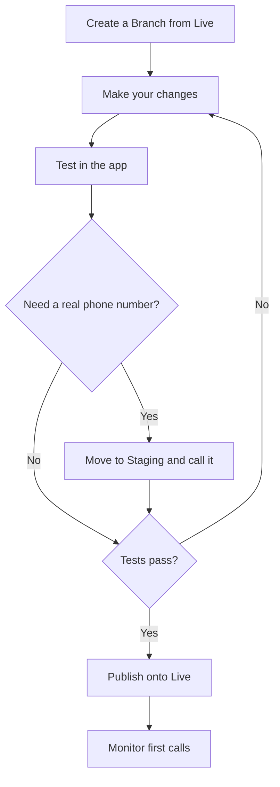

import { ProgressTracker } from '/snippets/progress-tracker.jsx'
import { Quiz } from '/snippets/quiz.jsx'
import { FillBlank } from '/snippets/fill-blank.jsx'
import { Challenge } from '/snippets/challenge.jsx'
import { LessonMeta } from '/snippets/lesson-meta.jsx'

**Lesson 5 of 6** – Before your agent goes live, you need to understand how deployments work. This is how you test safely – so changes never reach real users until you're ready.

<LessonMeta level={1} difficulty="Beginner" time="15 min" />

Every project has a **Live** version, the agent actually talking to your customers. You never edit Live directly. Instead you work in a **Branch**, your own isolated copy branched off Live, and publish it back when it's ready.

## How it works

<CardGroup cols={3}>
  <Card title="Live" icon="signal-stream">
    Production. The version handling real traffic. Never edited directly.
  </Card>
  <Card title="Branch" icon="code-branch">
    Your isolated copy of the agent, branched off Live. Publishing merges it back.
  </Card>
  <Card title="Sub-branch" icon="code-merge">
    Splits a Branch further, so several people can share one piece of work.
  </Card>
</CardGroup>

Branches and Sub-branches live in the **Sandbox** environment, which has no telephony or API connections, so nothing you build can reach a real system. When you want to test with a real phone number and API connections, move your Branch into **Staging**.

## The flow

```mermaid
flowchart TD
    A[Create a Branch from Live] --> B[Make your changes]
    B --> C[Test in the app]
    C --> D{Need a real phone number?}
    D -->|Yes| E[Move to Staging and call it]
    D -->|No| F{Tests pass?}
    E --> F
    F -->|Yes| G[Publish onto Live]
    F -->|No| B
    G --> H[Monitor first calls]
```

Publishing **merges** your Branch onto Live and creates a new version in Live's history. It never replaces Live outright, so nobody's work gets silently overwritten.

## Check your understanding

<Quiz questions={[
  {
    q: "A colleague publishes their Branch while you are still working in yours. What happens to your Branch?",
    options: [
      "It is deleted, and you have to start again",
      "It publishes automatically alongside theirs",
      "It is marked Out of sync – you sync to pull in Live's latest changes before you can publish",
      "Nothing – your Branch will silently overwrite theirs when you publish",
    ],
    correct: 2,
    explanation: "When Live moves on, your Branch is marked Out of sync. Syncing pulls the latest changes from Live into your Branch, and if you have both touched the same thing, a conflict screen lets you decide which version to keep. Nothing is lost on either side.",
  }
]} />

<FillBlank
  prompt='Publishing a Branch does not replace Live. It _____ your changes onto Live, creating a new version in its history.'
  answer={["merges", "merge", "Merges"]}
  hint="It is the same word you would use for combining two branches of work."
  explanation="Publishing merges the Branch onto Live. Only genuine differences raise a conflict, and every publish becomes a version you can roll back to."
/>

## The environments

<Tabs>
  <Tab title="Sandbox" icon="flask">
    Sandbox is where every Branch and Sub-branch lives while you work on it.

    **Use a Branch in Sandbox for:**
    - Writing or editing KB topics
    - Adjusting rules and behavior
    - Changing voice settings
    - Wiring or modifying actions, SMS, or handoffs

    <AccordionGroup>
      <Accordion title="Best practices" icon="circle-check">
        - Check the navigation bar so you know which Branch or Sub-branch you are in
        - Test after every meaningful change – your work saves as you go
        - Keep each Branch focused on one piece of work
      </Accordion>

      <Accordion title="Verification" icon="magnifying-glass">
        - In-app chat and call testing reflects your latest changes
        - Nothing in Sandbox can reach a real phone number or API
      </Accordion>
    </AccordionGroup>
  </Tab>

  <Tab title="Staging" icon="vial">
    Staging is **optional**. Use it when in-app testing is not enough.

    **Use Staging for:**
    - Testing with a real phone number
    - Testing against API connections
    - Final voice and pacing checks over a real call

    <AccordionGroup>
      <Accordion title="Best practices" icon="circle-check">
        - Move a Branch into Staging once its in-app tests pass
        - Only one Branch can be in Staging at a time
        - Re-run your key tests over a real call:
          - Simple FAQ (Chat and Call)
          - Voice and greeting
          - Out-of-scope refusal
          - Any topics or actions you've added
      </Accordion>

      <Accordion title="Verification" icon="magnifying-glass">
        - The staging number reaches your Branch, not Live
        - No unexpected KB topics are triggered
        - Behavior matches what you saw in Sandbox
      </Accordion>
    </AccordionGroup>
  </Tab>

  <Tab title="Live" icon="signal-stream">
    Live is **production**. Real users are here.

    **Rules for Live:**
    - Never edit directly – create a Branch instead
    - Always know exactly what version is live
    - Every publish is a version you can roll back to

    <AccordionGroup>
      <Accordion title="Best practices" icon="circle-check">
        - Test a Branch before publishing it
        - Confirm the publish explicitly in the dialog
        - Monitor first calls after publishing

        **Example safe publishing habit:**
        Publish → make one test call → open Conversation Review → confirm behavior → continue monitoring
      </Accordion>
    </AccordionGroup>
  </Tab>
</Tabs>

## Working with others

Two ways to work in parallel:

<CardGroup cols={2}>
  <Card title="Ship together" icon="people-group">
    Share one Branch and give each person a **Sub-branch**. Merge each Sub-branch back as it finishes, test the Branch as a whole, then publish. Everything lands on Live at once.
  </Card>
  <Card title="Ship independently" icon="person-running">
    Each person opens their own Branch and publishes on their own schedule. Branches never merge into each other; each one publishes to Live on its own.
  </Card>
</CardGroup>

Nobody queues behind anyone. While one team spends weeks on a new flow in their Branch, a colleague can open a small Branch, update the knowledge base, and publish the same day.

## Comparing versions

The **Compare versions** view is your primary safety tool.

<CardGroup cols={2}>
  <Card title="What it shows" icon="code-compare">
    - Added KB topics
    - Modified content
    - Removed actions
    - Function wiring changes
    - Sample question edits
  </Card>
  <Card title="When to use it" icon="shield-check">
    Before every publish, to verify all changes are intentional
  </Card>
</CardGroup>

If you can't explain every change in the diff, don't publish.

## Rollbacks

Rollbacks are instant and safe.

<AccordionGroup>
  <Accordion title="When to roll back" icon="clock-rotate-left">
    - A KB topic misfires
    - Voice sounds wrong
    - Handoffs spike unexpectedly
    - A publish introduces confusion
  </Accordion>

  <Accordion title="How to roll back" icon="list-ol">
    1. Open Live's version history – every publish is a version there
    2. Select a known-good version and click rollback
    3. Confirm
    4. Verify with a live test call

    Rollback restores behavior immediately without deleting newer versions, and because publishing merges rather than replaces, nobody else's publish can silently undo it.
  </Accordion>
</AccordionGroup>

## Common mistakes

<Warning>
  **Avoid these pitfalls:**
  - Making a quick change without noticing which Branch you are in
  - Leaving a Branch out of sync and letting conflicts pile up
  - Skipping version comparison before publishing
  - Testing in Sandbox when the behavior depends on a real phone call – use Staging
</Warning>

## Check your understanding

<Quiz questions={[
  {
    q: "You need to make a hotfix while your team has a half-finished feature in a shared Branch. What do you do?",
    options: [
      "Add the fix to the team's Branch and publish everything together",
      "Edit Live directly – it's only a small change",
      "Create your own Branch from Live, make the fix, test it, and publish it on its own",
      "Wait for the team to finish their feature first",
    ],
    correct: 2,
    explanation: "Branches are isolated. Your hotfix Branch branches off Live and merges straight back, so nothing from the team's half-finished work rides along, and their Branch is untouched.",
  }
]} />

## Verification checklist

<Check>
  You understand deployments when:
  - You can say which version is live without checking
  - You know how to roll back in under a minute
  - You can explain what changed between two versions
  - You never feel tempted to "just tweak production"
</Check>

<Challenge
  scenario="Your agent is live. The helpdesk reports that since last night's publish, the agent incorrectly tells callers that refunds take 3 days when the real policy is 5 business days. The latest version in Live's history is version 22; version 21 was working correctly. What do you do first, and why?"
  hints={[
    "You have a way to restore correct behavior immediately, without building or testing anything new.",
    "Live's version history shows every published version.",
    "Restoring speed matters more than perfection right now. You can fix the root cause in a Branch afterward."
  ]}
  solution="Roll back to version 21 immediately. Open Live's version history, select version 21, click rollback, and confirm. Make one test call to verify the correct refund policy is stated. Then create a Branch from Live, fix the content error, test it, and publish as normal. Rollbacks are safe and instant — always prefer them over publishing a rushed fix under pressure."
/>

## Try it yourself

<Steps>
  <Step title="Challenge: pre-publish checklist">
    You've made three changes in your Branch: updated the pet policy topic, added a new SMS offer for late checkout, and changed the agent voice stability from 0.6 to 0.8.

    List **at least 4 specific tests** you would run before publishing.

    <Accordion title="Hint">
      Think about each change you made and what could have broken. Also consider: what tests should always run, regardless of what changed?
    </Accordion>

    <Accordion title="Example solution">
      1. **Test pet policy topic** – ask "are dogs allowed?" in both Chat and Call; confirm the correct topic triggers.
      2. **Test SMS consent flow** – ask "can you text me the late checkout info?" and confirm the agent asks for consent before sending.
      3. **Make a test call from Staging** – listen for the voice stability change over a real call; confirm no audio artifacts were introduced.
      4. **Run a regression test** – test a simple FAQ, out-of-scope refusal, and a handoff to confirm nothing regressed.
      5. **Compare versions** – open the diff and confirm the three changes are the only ones present.
    </Accordion>
  </Step>
</Steps>

## Check your understanding

<Quiz questions={[
  {
    q: "Which environment should receive real user traffic?",
    options: [
      "Sandbox – it always has the latest changes",
      "Staging – it has a real phone number, so it's safe for real users",
      "Live",
      "Either Staging or Live – the difference is just a naming convention",
    ],
    correct: 2,
    explanation: "Only Live receives real user traffic. Sandbox is for building and in-app testing; Staging is for testing with a real phone number and API connections before you publish.",
  }
]} />

## Go deeper

The Deployments reference covers the model in full, along with version diffs and everyday workflows:

<CardGroup cols={3}>
  <Card title="Deployments reference" icon="server" href="/environments-and-versions/introduction">
    How Live, Branches, Sub-branches and Staging fit together
  </Card>
  <Card title="Version diffs" icon="code-compare" href="/environments-and-versions/diffs">
    How to compare versions side-by-side before publishing
  </Card>
  <Card title="Version management" icon="clock-rotate-left" href="/learn/maintain/version-management">
    Best practices for maintaining versions in a live project
  </Card>
</CardGroup>

---

<CardGroup cols={2}>
  <Card title="← Previous: Edit voice settings" icon="arrow-left" href="/learn/guides/get-started/edit-voice-settings">
    Lesson 4 of 6
  </Card>
  <Card title="Next: Conversation reviews →" icon="arrow-right" href="/learn/guides/get-started/conv-review">
    Lesson 6 – see what your agent actually did
  </Card>
</CardGroup>

<ProgressTracker lessonKey="l1-5-environments" lessonNum={5} totalLessons={6} level="Level 1" />
