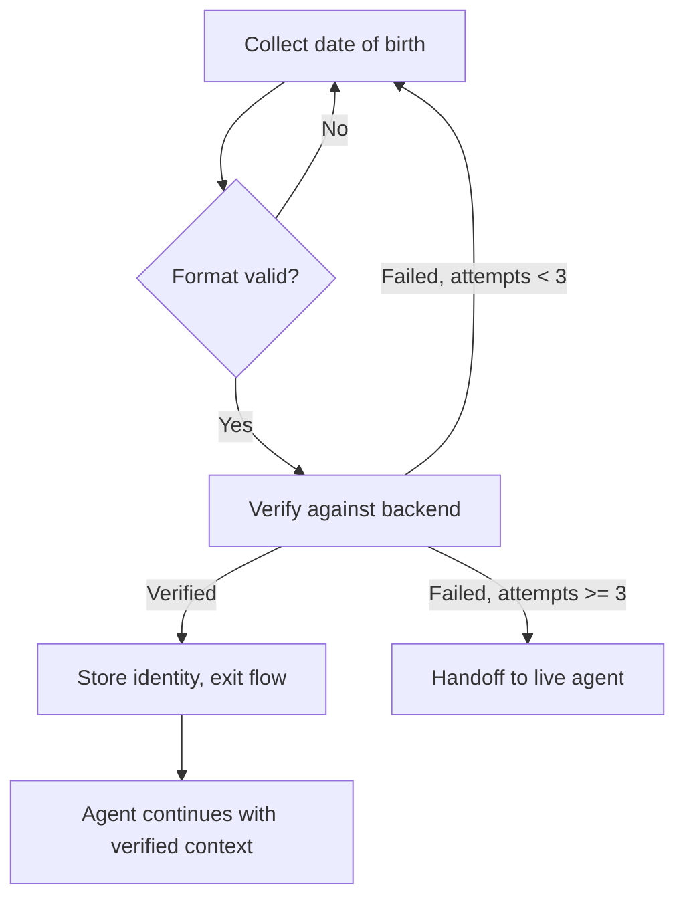

import { Quiz } from '/snippets/quiz.jsx'
import { LessonMeta } from '/snippets/lesson-meta.jsx'

<LessonMeta level={2} difficulty="Intermediate" time="10 min" />

Many voice agents need to confirm who they're speaking to before sharing account data, processing requests, or completing transactions. This recipe shows how to collect an identifier, verify it against your backend, and gate the rest of the conversation on the result.

## When to use this

Use this pattern when:
- The agent handles personal account data (balances, orders, medical records)
- Compliance or security policy requires identity verification before proceeding
- You want to personalize the conversation based on confirmed identity

## The complete pattern

### Step 1 – Collect the identifier

```python
def collect_identifier(conv, flow, date_of_birth: str) -> str:
    # Lightweight format check before hitting the API
    import re
    if not re.match(r"^\d{2}/\d{2}/\d{4}$", date_of_birth):
        return "That doesn't look like a valid date. Ask the caller for their date of birth in DD/MM/YYYY format."

    conv.state["dob_input"] = date_of_birth
    flow.goto_step("verify_identity")
    return f"Date of birth received: {date_of_birth}."
```

**Step prompt:** "Ask the caller for their date of birth in DD/MM/YYYY format. Once they provide it, call `collect_identifier`."

### Step 2 – Verify against the backend

```python
def verify_identity(conv, flow) -> dict:
    dob = conv.state.get("dob_input")
    caller_number = conv.state.get("caller_ani")  # Set by telephony integration if available

    result = lookup_account(caller_number=caller_number, dob=dob)

    if result.get("verified"):
        # Store account data for the rest of the conversation
        conv.state["account_id"] = result["account_id"]
        conv.state["caller_name"] = result.get("name", "")
        conv.state["identity_verified"] = True
        flow.exit_flow()
        return {"content": f"Identity verified. Account holder: {result.get('name')}. Proceed with account queries."}

    attempts = conv.state.get("identity_attempts", 0) + 1
    conv.state["identity_attempts"] = attempts

    if attempts >= 3:
        return {
            "utterance": "I wasn't able to verify your identity. For your security, I'll connect you with our team directly.",
            "handoff": True,
        }

    flow.goto_step("collect_identifier")
    return {"content": f"Verification failed (attempt {attempts} of 3). Ask the caller to try again."}
```

## Full flow



## Using verified identity downstream

After verification, other functions can check `conv.state.get("identity_verified")` before returning sensitive data:

```python
def get_account_balance(conv) -> str:
    if not conv.state.get("identity_verified"):
        return "Identity has not been verified. Do not share account information. Ask the caller to verify their identity first."

    account_id = conv.state.get("account_id")
    balance = fetch_balance(account_id)
    return f"Account balance: £{balance:.2f}."
```

<Tip>
  Use a consistent `identity_verified` flag pattern across all functions that touch sensitive data. This makes it easy to audit which functions are gated and which are not.
</Tip>

## Key decisions

<AccordionGroup>
  <Accordion title="Why format-check before hitting the API?" icon="shield-halved">
    A format check in `collect_identifier` catches obvious transcription errors (missing digits, wrong separator) before you make an API call that will fail anyway. It also gives the caller a more specific error message — "That doesn't look like a valid date" rather than a generic "verification failed."
  </Accordion>
  <Accordion title="Why store caller_name after verification?" icon="user">
    Storing the verified caller's name in `conv.state` lets the agent personalise subsequent responses — "Great, I can see your account, Aaron" — without making a second API call. Only store what you'll use.
  </Accordion>
  <Accordion title="Why not use utterance for the failure messages?" icon="comment">
    For retry messages, returning `content` lets the LLM rephrase the request naturally ("Sorry, that didn't match — could you try your date of birth again?"). Using a hard-coded utterance would make every retry sound identical.
  </Accordion>
</AccordionGroup>

## Check your understanding

<Quiz questions={[
  {
    q: "A function that returns account balance checks `conv.state.get('identity_verified')` before proceeding. Why not rely on the flow to guarantee this?",
    options: [
      "Flows don't have access to conv.state",
      "It's a defensive guard — functions can be called outside of flows, and explicit checks prevent accidental data exposure",
      "The LLM can call any function at any time, ignoring flow step order",
      "It makes the function faster by skipping the API call",
    ],
    correct: 1,
    explanation: "Functions can be referenced in the Behavior field or topics, not just flows. A function that returns sensitive data should verify the precondition itself rather than trusting that it will only ever be called from a verified flow step.",
  }
]} />

---

<CardGroup cols={2}>
  <Card title="← Retry with handoff" icon="arrow-left" href="/learn/recipes/retry-with-handoff">
    Previous recipe
  </Card>
  <Card title="Intent-based routing →" icon="arrow-right" href="/learn/recipes/smart-routing">
    Next recipe
  </Card>
</CardGroup>
