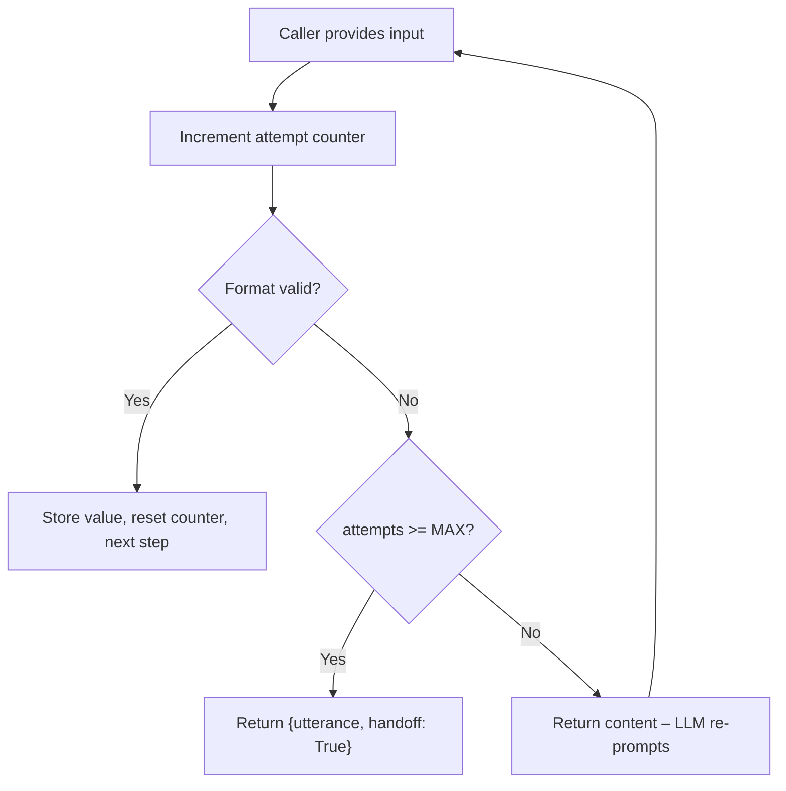

import { Quiz } from '/snippets/quiz.jsx'
import { LessonMeta } from '/snippets/lesson-meta.jsx'

<LessonMeta level={2} difficulty="Intermediate" time="10 min" />

When collection fails repeatedly — wrong format, no match in the database, ambiguous input — you need a reliable escalation path. This recipe uses a counter in `conv.state` to enforce a hard retry limit and hand off after N failures.

## When to use this

Use this pattern when:
- A client SLA specifies maximum retry attempts (e.g., "hand off after 3 failures")
- The flow collects high-stakes data where LLM-led retries are not predictable enough
- Compliance requires that callers always reach a human if automation fails

## The complete pattern

```python
MAX_ATTEMPTS = 3

def collect_account_number(conv, flow, account_number: str) -> dict:
    attempts = conv.state.get("account_attempts", 0) + 1
    conv.state["account_attempts"] = attempts

    # Validate format: 8 digits
    if not account_number.isdigit() or len(account_number) != 8:
        if attempts >= MAX_ATTEMPTS:
            return {
                "utterance": "I'm sorry, I'm having trouble with that account number. Let me connect you with someone who can help.",
                "handoff": True,
            }
        # Return content so the LLM re-prompts naturally
        return {
            "content": f"Account number invalid (attempt {attempts} of {MAX_ATTEMPTS}). Ask the user to repeat their 8-digit account number."
        }

    # Validation passed
    conv.state["account_number"] = account_number
    conv.state["account_attempts"] = 0  # Reset for next use
    flow.goto_step("verify_account")
    return {"content": f"Account number {account_number} collected."}
```

## How the counter works



<Warning>
  The counter is incremented **before** validation, not after. This ensures that even if something unexpected happens, the counter still advances and the caller is never trapped in an infinite loop.
</Warning>

## Resetting the counter

Reset `conv.state["account_attempts"]` to `0` after a successful collection. This matters if the same flow is used for multiple collection steps — you don't want attempt count from Step 1 bleeding into Step 2.

## Separating the utterance from the function

For the handoff message, consider passing the utterance as a **parameter** so the LLM can generate a contextually appropriate goodbye, while the handoff itself is deterministic:

```python
def escalate(conv, flow, utterance: str) -> dict:
    """
    Call this when retries are exhausted or the user requests a human.
    The LLM generates the utterance; the handoff is guaranteed.
    """
    return {
        "utterance": utterance,
        "handoff": True,
    }
```

**Step prompt:** "If the user requests a live agent or retries are exhausted, call `escalate` with an appropriate transition message."

## Key decisions

<AccordionGroup>
  <Accordion title="Why use content instead of utterance for re-prompts?" icon="comment">
    Returning `content` lets the LLM re-phrase the request naturally each time. Returning a hard-coded `utterance` would make every re-prompt sound identical, which feels robotic after the first failure.
  </Accordion>
  <Accordion title="Why MAX_ATTEMPTS = 3?" icon="list-ol">
    Three attempts is a common SLA default. Adjust to match your client's requirements. Store it as a constant at the top of the file so it's easy to find and change.
  </Accordion>
  <Accordion title="Why reset the counter on success?" icon="arrow-rotate-left">
    If the same validation function is reused in multiple parts of the flow (or if the flow is called again in the same session), you don't want previous failures counting against new attempts.
  </Accordion>
</AccordionGroup>

## Check your understanding

<Quiz questions={[
  {
    q: "The counter is incremented before validation, not after. Why?",
    options: [
      "It makes the math simpler",
      "It ensures the counter always advances, preventing infinite loops even if the validation logic has a bug",
      "It allows the counter to be reset on the next successful attempt",
      "The LLM requires the counter to be set before it can generate a response",
    ],
    correct: 1,
    explanation: "Incrementing before validation is a safety measure. If validation throws an unexpected error or the function returns early, the counter still advances. This guarantees the caller can never be trapped in an infinite loop due to a code path the developer didn't anticipate.",
  }
]} />

---

<CardGroup cols={2}>
  <Card title="← SMS confirmation" icon="arrow-left" href="/learn/recipes/sms-confirmation">
    Previous recipe
  </Card>
  <Card title="Caller ID validation →" icon="arrow-right" href="/learn/recipes/caller-id-validation">
    Next recipe
  </Card>
</CardGroup>
