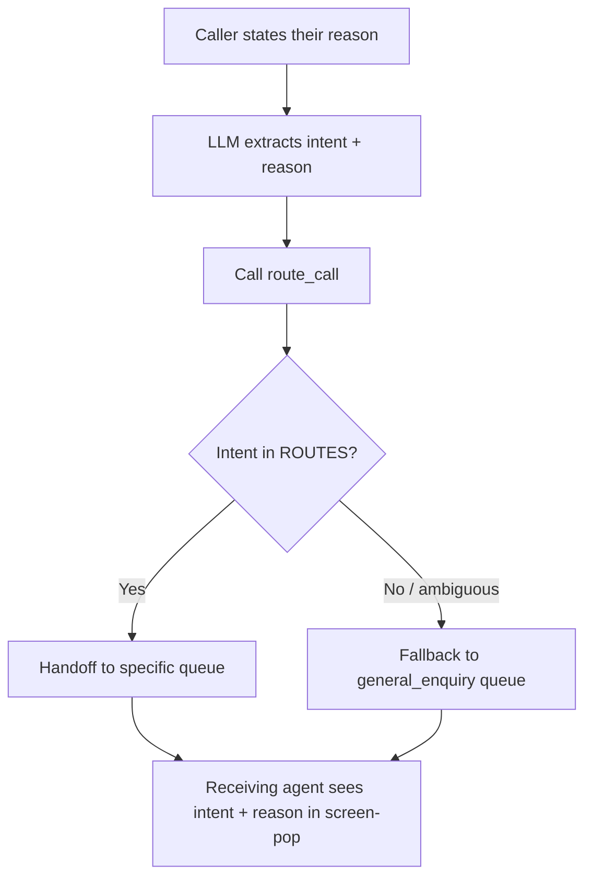

import { Quiz } from '/snippets/quiz.jsx'
import { LessonMeta } from '/snippets/lesson-meta.jsx'

<LessonMeta level={2} difficulty="Intermediate" time="10 min" />

Instead of playing an IVR menu ("Press 1 for billing, press 2 for support"), this recipe lets the caller state their need in natural language and routes them based on what they said. The LLM extracts intent; the function handles the routing deterministically.

## When to use this

Use this pattern when:
- Replacing a traditional IVR or phone tree
- You have multiple specialist queues and want to route callers correctly first time
- You want to capture the caller's intent in `conv.state` to brief the receiving agent

## The complete pattern

```python
# Define valid destinations and their queue identifiers
ROUTES = {
    "billing": "BILLING_QUEUE",
    "technical_support": "TECH_QUEUE",
    "cancellation": "RETENTION_QUEUE",
    "general_enquiry": "GENERAL_QUEUE",
}

def route_call(conv, intent: str, reason: str) -> dict:
    """
    Route the caller based on their stated intent.

    Parameters:
    - intent: One of 'billing', 'technical_support', 'cancellation', 'general_enquiry'
    - reason: A brief summary of what the caller said (used to brief the receiving agent)
    """
    queue = ROUTES.get(intent)

    if not queue:
        # Unknown intent — route to general rather than failing
        queue = ROUTES["general_enquiry"]

    # Store context so the receiving agent's screen-pop has it
    conv.state["routing_intent"] = intent
    conv.state["routing_reason"] = reason

    return {
        "utterance": f"I'll connect you with the right team now. Just one moment.",
        "handoff": queue,
    }
```

**Behavior field reference:**

```text
@route_call

When the caller states their reason for calling, call `route_call` with:
- intent: the most appropriate category ('billing', 'technical_support', 'cancellation', 'general_enquiry')
- reason: a one-sentence summary of what they said

Do not ask clarifying questions unless it is genuinely impossible to determine the intent.
```

## Routing flow



## Briefing the receiving agent

The `routing_reason` stored in `conv.state` can be passed to your CTI or CRM via a webhook on call transfer. This means the agent answering the call already knows why the caller is calling — reducing "Can you tell me again what you need?" moments.

```python
def get_routing_context(conv) -> str:
    """Utility for the receiving-agent screen-pop webhook."""
    intent = conv.state.get("routing_intent", "unknown")
    reason = conv.state.get("routing_reason", "No reason captured.")
    return f"Routing intent: {intent}. Caller said: {reason}"
```

## Handling caller corrections

Callers sometimes change their mind or correct the LLM's initial interpretation. Make the routing function re-callable by not using `flow.goto_step()` — stay in the current context so the LLM can re-route if the caller says "actually, it's a billing question":

```python
def route_call(conv, intent: str, reason: str) -> dict:
    # Same function, no flow step — allows correction before transfer
    queue = ROUTES.get(intent, ROUTES["general_enquiry"])
    return {
        "utterance": f"Connecting you to {intent.replace('_', ' ')} now.",
        "handoff": queue,
    }
```

<Tip>
  Add a brief confirmation before transferring if the caller's intent is ambiguous: "Just to confirm — I'm connecting you with billing. Is that right?" The LLM can handle this naturally if you include it as an instruction in the step prompt or Behavior field.
</Tip>

## Key decisions

<AccordionGroup>
  <Accordion title="Why pass `reason` as a parameter?" icon="comment-dots">
    The LLM captures the caller's exact words (paraphrased) in `reason`. This is more useful than just `intent` because it gives the receiving agent context about *why* the caller chose this queue — not just which queue they were sent to.
  </Accordion>
  <Accordion title="Why fall back to general_enquiry instead of failing?" icon="shield-halved">
    An unknown intent should never cause the call to fail or loop. Routing to general ensures the caller always reaches a human who can handle any edge case.
  </Accordion>
  <Accordion title="Why use utterance + handoff together?" icon="code">
    Using `utterance` gives the caller a natural transition message before the transfer. Without it, the call transfers silently, which feels like a dropped call.
  </Accordion>
</AccordionGroup>

## Check your understanding

<Quiz questions={[
  {
    q: "The Behavior field says 'Do not ask clarifying questions unless it is genuinely impossible to determine the intent.' Why?",
    options: [
      "Clarifying questions slow down routing and add latency to the call",
      "Callers have already stated their reason — asking again is redundant and frustrating",
      "The LLM cannot process clarifying question responses",
      "Clarifying questions are not supported in routing functions",
    ],
    correct: 1,
    explanation: "Most callers state their reason clearly in their opening message. Asking a clarifying question when the intent is already clear adds friction and makes the agent feel less capable than a human receptionist. Only ask when the intent is genuinely ambiguous.",
  }
]} />

---

<CardGroup cols={2}>
  <Card title="← Caller ID validation" icon="arrow-left" href="/learn/recipes/caller-id-validation">
    Previous recipe
  </Card>
  <Card title="Back to Recipes" icon="flask-conical" href="/learn/recipes/introduction">
    All recipes
  </Card>
</CardGroup>
