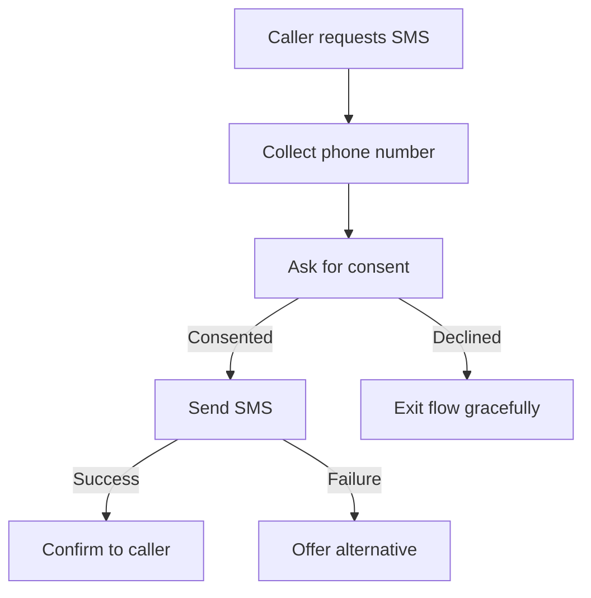

import { Quiz } from '/snippets/quiz.jsx'
import { LessonMeta } from '/snippets/lesson-meta.jsx'

<LessonMeta level={2} difficulty="Intermediate" time="10 min" />

This recipe covers the complete SMS consent-and-send pattern: confirm the number, ask for consent, send the message, and confirm delivery — all without the agent making promises it can't keep.

## When to use this

Use this pattern when:
- You need to send a follow-up (link, confirmation, summary) after a call interaction
- Compliance or brand requirements mean you must collect explicit consent before sending
- You want a hard confirmation step so the agent never sends SMS without the user agreeing

## The complete pattern

### Step 1 – Collect the phone number

```python
def collect_phone_number(conv, flow, phone_number: str) -> str:
    # Store the number; validation happens in the next step
    conv.state["sms_phone"] = phone_number
    flow.goto_step("confirm_consent")
    return f"Phone number {phone_number} noted."
```

**Step prompt:** "Ask the caller for the phone number they'd like the message sent to. Once they provide it, call `collect_phone_number`."

### Step 2 – Ask for consent

```python
def record_consent(conv, flow, consented: bool) -> str:
    if consented:
        conv.state["sms_consent"] = True
        flow.goto_step("send_sms")
        return "Consent given."
    else:
        # Respect the refusal and exit the flow gracefully
        flow.exit_flow()
        return "The caller declined SMS. Do not attempt to send."
```

**Step prompt:** "Ask the caller to confirm they consent to receiving an SMS at the number they provided. Call `record_consent` with `consented=True` if they agree, `consented=False` if they decline."

<Warning>
  Never send an SMS if `consented` is `False`. If the model calls `record_consent(consented=False)`, exit the flow — do not loop back to ask again.
</Warning>

### Step 3 – Send and confirm

```python
import requests

def send_confirmation_sms(conv, flow) -> dict:
    phone = conv.state.get("sms_phone")
    consent = conv.state.get("sms_consent")

    if not consent:
        # Defensive check — should not reach here without consent
        flow.exit_flow()
        return {"content": "No consent on record. SMS not sent."}

    # Replace with your real SMS provider call
    response = requests.post(
        "https://your-sms-provider.com/send",
        json={"to": phone, "body": "Here's the information you requested: ..."},
        timeout=5,
    )

    if response.status_code == 200:
        flow.exit_flow()
        return {"content": f"SMS sent successfully to {phone}."}
    else:
        return {"content": f"SMS delivery failed (status {response.status_code}). Tell the caller there was a problem and offer to try again or provide the information verbally."}
```

**Step prompt:** "The caller has consented. Call `send_confirmation_sms` to send the message and confirm delivery."

## Flow structure



## Key decisions

<AccordionGroup>
  <Accordion title="Why store state between steps?" icon="database">
    Each flow step runs in a separate LLM request. The phone number collected in Step 1 must be stored in `conv.state` to be accessible in Step 3 — the LLM does not carry it forward automatically.
  </Accordion>
  <Accordion title="Why exit the flow on decline?" icon="door-open">
    If the caller declines consent, `flow.exit_flow()` returns control to the LLM, which can continue the conversation naturally. Do not loop back to the consent step — that would feel coercive.
  </Accordion>
  <Accordion title="Why check consent again in Step 3?" icon="shield-check">
    The defensive consent check in `send_confirmation_sms` ensures you never send an SMS even if the flow logic has a bug or is called out of order. Treat it as a safety net.
  </Accordion>
</AccordionGroup>

## Check your understanding

<Quiz questions={[
  {
    q: "Why does `send_confirmation_sms` check `conv.state.get('sms_consent')` even though consent was already checked in `record_consent`?",
    options: [
      "It's required by the SMS provider API",
      "It's a defensive check — if the flow is ever called out of order, no SMS is sent without consent",
      "The LLM forgets state between steps, so it must be re-checked",
      "It triggers a second consent request for compliance logging",
    ],
    correct: 1,
    explanation: "The check in `send_confirmation_sms` is a defensive guard — it protects against the function being called out of sequence or by a bug in the flow. `conv.state` persists correctly between steps, but checking critical flags before taking irreversible actions is good practice.",
  }
]} />

---

<CardGroup cols={2}>
  <Card title="← Back to Recipes" icon="arrow-left" href="/learn/recipes/introduction">
    All recipes
  </Card>
  <Card title="Retry with handoff →" icon="arrow-right" href="/learn/recipes/retry-with-handoff">
    Next recipe
  </Card>
</CardGroup>
