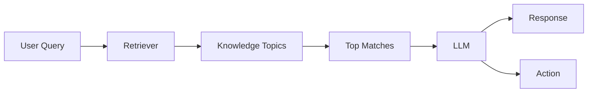

This page explains how your agent finds the right topic to answer a caller's question. You do not need to configure RAG directly — it works automatically based on how you structure your [Managed Topics](/managed-topics/introduction) and [Connected Knowledge](/connected-knowledge/introduction).

## What is RAG?

Retrieval-Augmented Generation (RAG) is a technique where the system first searches a knowledge base for relevant content, then feeds that content to a language model to generate an accurate response.

## Components of RAG

1. **Retrieval component**: Searches the knowledge for relevant information based on the input query.
2. **Augmentation**: Uses retrieved information to enhance the original query with additional context.
3. **Generation component**: Generates responses using a language model, integrating both the query and retrieved information.

## How RAG works in Agent Studio

PolyAI uses RAG to match user queries to Knowledge topics and generate contextual responses. Here is how it works in Agent Studio:

1. **Query processing**: When a caller provides a query, the RAG framework is initiated.
2. **Retrieval**: The retriever component searches the structured knowledge base to find matching topics. The knowledge is organized to optimize retrieval performance and ensure precise matches.
3. **Generation**: The language model (LLM) uses the retrieved information to decide on the content to present to the caller, ensuring responses are relevant and context-aware.

<Tip>
Write clear, specific topic names and realistic sample questions for best results. These are key signals the retriever uses to find the right match. You can add up to **20** sample questions per topic — more questions help the retriever find the right match.
</Tip>

## Managed Topic structure for RAG

Each Managed Topic is structured for effective retrieval. A topic includes:

- **Topic name**: The FAQ name or category of the information.
- **Sample Questions**: Example queries that callers might use. These help RAG understand user intent and improve matching accuracy.
- **Content**: The information you want the agent to provide to users.
- **Action**: Specific actions triggered by the query, such as calling a function, initiating a workflow, or handing off to a human agent.

## Why RAG?

You do not need to retrain a model when you update your Knowledge. RAG retrieves from the current Knowledge at query time, so updates are available as soon as they are [promoted to the target environment](/environments-and-versions/introduction).

<Note>
Behavior may vary depending on your agent's configuration. For example, agents using the real-time (speech-to-speech) model may trigger retrieval differently than standard voice agents. For multilingual agents, see [multilingual configuration](/agent-settings/multilingual) for guidance on setting up Knowledge topics across languages.
</Note>