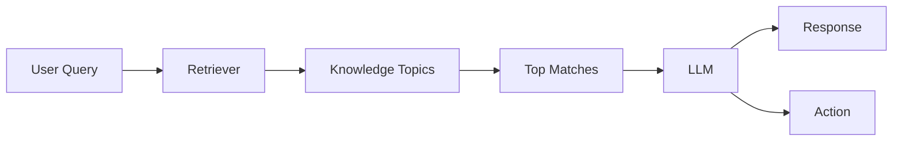

## What is RAG?

Retrieval-Augmented Generation (RAG) combines retrieval and generation to find relevant topics and generate contextual responses.

## Components of RAG

1. **Retrieval component**: Searches the knowledge for relevant information based on the input query.
2. **Augmentation**: Uses retrieved information to enhance the original query with additional context.
3. **Generation component**: Generates responses using a language model, integrating both the query and retrieved information.

## How RAG powers our voice bots

PolyAI uses RAG to match user queries to Knowledge topics and generate contextual responses. Here is how it works in Agent Studio:

1. **Query processing**: When a caller provides a query, the RAG framework is initiated.
2. **Retrieval**: RAG acts as a retriever, searching our structured knowledge to find matching topics. The knowledge is organized to optimize RAG's performance and ensure precise matches.
3. **Generation**: The language model (LLM) uses the retrieved information to decide on the content to present to the caller, ensuring responses are relevant and context-aware.

<Tip>
Write clear, specific topic names and realistic sample questions for best results. These are key signals the retriever uses to find the right match.
</Tip>

<Note>
You can add up to **20** sample questions per topic. More questions help the retriever find the right match, but only a subset are passed into the LLM context at query time. Write your most representative questions first.
</Note>

## Managed Topic structure for RAG

Our Managed Topics are designed to maximize the effectiveness of RAG. Each topic includes the following components:

- **Topic name**: The FAQ name or category of the information.
- **Sample Questions**: Example queries that callers might use. These help RAG understand user intent and improve matching accuracy.
- **Content**: The information we want the LLM to provide to users.
- **Action**: Specific actions triggered by the query, such as calling a function, initiating a workflow, or handing off to a human agent.

## Why RAG?

You do not need to retrain a model when you update your Knowledge. RAG retrieves from the current Knowledge at query time, so updates are available as soon as they are [promoted to the target environment](/environments-and-versions/introduction).

<Note>
Behaviour may vary depending on your agent's configuration. For example, agents using the real-time (speech-to-speech) model may trigger retrieval differently than standard voice agents.
</Note>

<Note>
For multilingual agents, see [multilingual configuration](/agent-settings/multilingual) for guidance on setting up Knowledge topics across languages.
</Note>