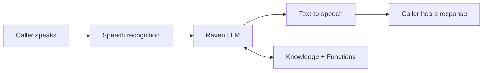

PolyAI builds and runs the entire voice AI stack — from speech recognition to response generation to voice synthesis. This page explains what happens during a conversation and why a vertically integrated approach produces better enterprise outcomes than stitching together third-party providers.

## The voice pipeline

Every voice conversation passes through five stages. PolyAI controls each one, optimizing for end-to-end latency rather than per-component cost.

| Stage | What happens | Latency target |
|---|---|---|
| **Speech recognition (ASR)** | Audio is transcribed to text using multi-provider ASR with automatic failover | Real-time streaming |
| **Turn detection** | The system detects when the caller has finished speaking, distinguishing pauses from turn completion | Sub-200ms decision |
| **Raven LLM** | Understands intent, retrieves knowledge, executes functions, generates response | Sub-300ms |
| **Text-to-speech (TTS)** | Response text is synthesized to natural speech using multi-provider TTS | Streaming (first audio chunk under 200ms) |
| **Audio delivery** | Synthesized speech is streamed back to the caller | Real-time |

Total time from caller finishing their sentence to hearing the agent's response: **typically under 1 second**.

## Raven: PolyAI's proprietary LLM

Raven is PolyAI's purpose-built language model for voice conversations. It is not a wrapper around a third-party LLM — it is a proprietary model trained specifically for real-time spoken dialogue.

### Why a purpose-built model matters

| Capability | Raven (purpose-built) | Generic LLM providers |
|---|---|---|
| **Latency** | Sub-300ms end-to-end | Varies by provider, typically 500ms-2s |
| **Language support** | 24+ languages with native performance | Depends on provider model |
| **Voice-optimized responses** | Trained for spoken dialogue — natural length, pacing, and phrasing | Trained for text — often too verbose or formal for voice |
| **Hallucination control** | Constrained by managed topics and retrieval pipeline | Varies by provider and prompt engineering |
| **Enterprise reliability** | Single provider, SLA-backed | Multi-provider dependency chain |

### What Raven handles

On each turn, Raven performs:

1. **Intent understanding** — interprets the caller's message in the context of the full conversation history
2. **Knowledge retrieval** — fetches relevant information from [managed topics](/managed-topics/introduction) and [connected knowledge](/connected-knowledge/introduction) using RAG
3. **Function execution** — triggers [functions](/tools/introduction) when API calls or business logic are needed
4. **Flow navigation** — follows [flow](/flows/introduction) logic and transitions between steps
5. **Response generation** — composes a response that follows your [rules](/agent-settings/rules), tone, and knowledge base

All of this happens within the sub-300ms latency window.

For model details and training data, see [Raven](/agent-settings/raven) and [training data](/legal/training-data).

## Real-time voice processing

Voice conversations require capabilities that text-based AI does not. PolyAI handles these natively:

### Turn detection (endpointing)

The system detects when a caller has finished speaking and is waiting for a response. This is harder than it sounds — a pause mid-sentence ("I'd like to book... um... for Saturday") should not trigger a response, but a pause after a complete thought should.

PolyAI uses a fusion of audio signals and text analysis to make this decision in real time, minimizing both premature responses and unnecessary delays.

### Interruption handling (barge-in)

When a caller speaks over the agent, the system must decide: is this a genuine interruption ("Actually, never mind — transfer me") or a backchannel affirmation ("Yeah", "Uh-huh", "Right")?

PolyAI distinguishes between the two. True interruptions stop the agent and process the new input. Backchannels are acknowledged without interrupting the response.

### Background noise filtering

Real-world calls include noise — TVs, cars, other conversations. PolyAI's audio processing filters background noise so the speech recognition model receives clean input.

### Audio caching

Frequently used phrases (greetings, confirmations, transfer messages) are cached after the first generation. Cached audio plays back instantly on subsequent calls, reducing latency and ensuring consistency. See [audio management](/learn/guides/advanced/audio-management) for details.

## Two-tier knowledge architecture

PolyAI's knowledge system has two tiers, each optimized for different content types. This is architecturally richer than single-tier knowledge bases that treat all content equally.

<Columns cols={2}>
  <Card title="Managed topics" icon="book">
    **For structured, curated knowledge**

    - You control every answer
    - Can trigger [actions](/managed-topics/how-to-setup-action/introduction): functions, flows, SMS, handoffs
    - Weighted retrieval using topic names and sample questions
    - Always takes priority over Connected Knowledge
  </Card>
  <Card title="Connected knowledge" icon="plug">
    **For large, frequently updated content**

    - Auto-syncs from [Zendesk](/integrations/zendesk), [Gladly](/integrations/gladly), URLs, files
    - Supports 20+ file types
    - Ideal for FAQ-heavy content
    - Cannot trigger actions or flows
  </Card>
</Columns>

When both tiers contain relevant information, **managed topics always take priority**. This gives you precise control over critical answers while still leveraging large external knowledge bases.

See [managed topics](/managed-topics/introduction) and [connected knowledge](/connected-knowledge/introduction) for setup.

## Enterprise infrastructure

### Multi-provider resilience

PolyAI integrates with multiple providers at every layer (ASR, TTS) with automatic failover. If one provider is slow or unavailable, the platform routes to the next available provider with no interruption to the caller.

### Regional deployment

Deploy in the region closest to your users and compliance requirements:

| Region | Deployment |
|---|---|
| US | United States infrastructure |
| UK | United Kingdom infrastructure |
| EU West | European Union infrastructure |

### Telephony failover

If the PolyAI service experiences an outage, calls automatically transfer back to your contact center. This is built into the telephony layer — no configuration required.

### Supported telephony providers

Twilio, Amazon Connect, Genesys, Five9, NICE, Dialpad, and SIP-based systems. See [integrations](/integrations/introduction) for the full list.

## Related pages

<CardGroup cols={2}>
  <Card title="Architecture overview" icon="sitemap" href="/glossary/architecture">
    Detailed pipeline stages, data flow, and component reference
  </Card>
  <Card title="Raven" icon="brain" href="/agent-settings/raven">
    Model configuration and language support
  </Card>
  <Card title="Security and privacy" icon="shield-halved" href="/security/introduction">
    Compliance certifications, data handling, and procurement artefacts
  </Card>
  <Card title="Platform overview" icon="rocket" href="/platform/introduction">
    Three surfaces for building agents — Studio, ADK, and APIs
  </Card>
</CardGroup>
