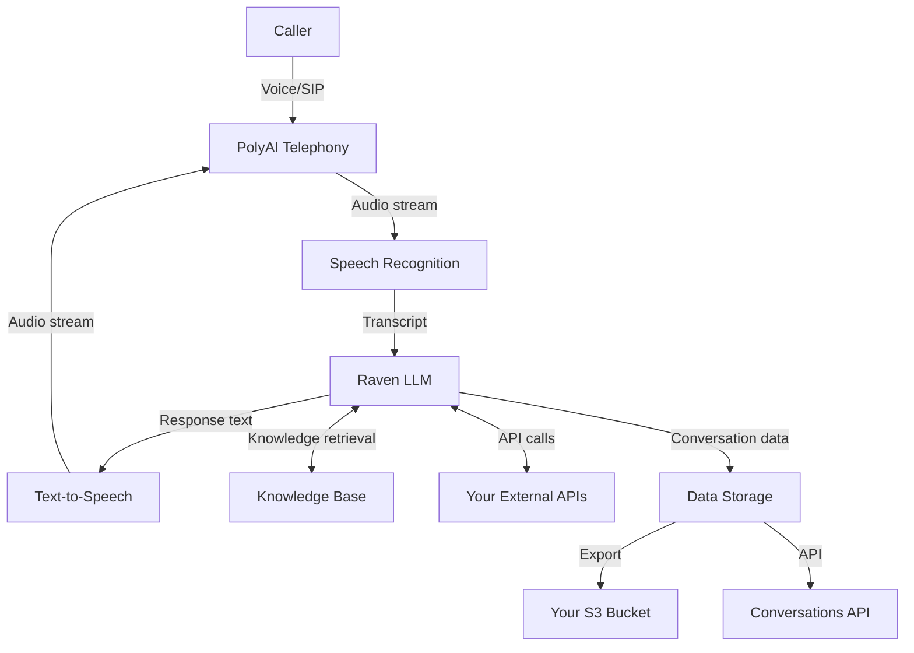

PolyAI is built for enterprise voice AI deployments where data security, regulatory compliance, and operational trust are non-negotiable. This section documents the standards we meet, how data flows through the platform, and what artefacts are available for your procurement and security teams.

## Certifications and standards

| Standard | Status | Scope |
|---|---|---|
| **ISO 27001** | Certified | Information security management system (ISMS) |
| **SOC 2 Type II** | Achieved | Security, availability, processing integrity, confidentiality, privacy |
| **HIPAA** | Supported | Protected health information handling (with BAA) |
| **PCI-DSS** | Supported | Payment card data security |
| **GDPR** | Compliant | EU personal data protection |
| **Cyber Essentials Plus** | Certified | UK NCSC cyber threat protection |

<Tip>
Contact your PolyAI account manager to request certification reports, a Business Associate Agreement (BAA), or a Data Processing Agreement (DPA).
</Tip>

## Data flow

The following diagram shows how data flows through the PolyAI platform during a voice call:

| Component | Data processed | Encryption |
|---|---|---|
| Telephony layer | Audio streams | TLS/SRTP in transit |
| Speech recognition | Audio → text | Encrypted in transit |
| Raven LLM | Transcript + context | Encrypted in transit and at rest |
| Text-to-speech | Response text → audio | Encrypted in transit |
| Data storage | Transcripts, recordings, metadata | Encrypted at rest (AES-256) |

## Data retention

Data retention is configurable per deployment. By default:

- **Transcripts and metadata** — retained for the duration of your contract, configurable on request
- **Audio recordings** — retained for the duration of your contract, configurable on request
- **Real-time conversation context** — held in memory for the duration of the call only

You can configure automatic export to your own infrastructure using the [S3 integration](/call-data/s3-to-s3) for long-term compliance archival.

## What artefacts can you request?

Enterprise procurement teams typically need the following. Contact your PolyAI account manager for any of these:

| Document | Description |
|---|---|
| **SOC 2 Type II report** | Independent auditor's report covering security controls |
| **ISO 27001 certificate** | Current certification from an accredited body |
| **Business Associate Agreement (BAA)** | Required for HIPAA-covered entities |
| **Data Processing Agreement (DPA)** | Required for GDPR compliance |
| **Penetration test summary** | Results from the most recent third-party penetration test |
| **Security questionnaire** | Pre-filled SIG Lite or CAIQ available on request |
| **Architecture and data flow diagram** | Detailed infrastructure diagram for your security review |

## Related pages

<CardGroup cols={2}>
  <Card title="GDPR" icon="shield-halved" href="/security/gdpr">
    How PolyAI meets GDPR requirements for EU personal data
  </Card>
  <Card title="HIPAA" icon="hospital" href="/security/hipaa">
    Protected health information handling and BAA availability
  </Card>
  <Card title="Data handling" icon="database" href="/security/data-handling">
    What data PolyAI processes, where it's stored, and how to control it
  </Card>
  <Card title="Compliance certifications" icon="certificate" href="/legal/compliance">
    Full list of certifications and standards
  </Card>
</CardGroup>
