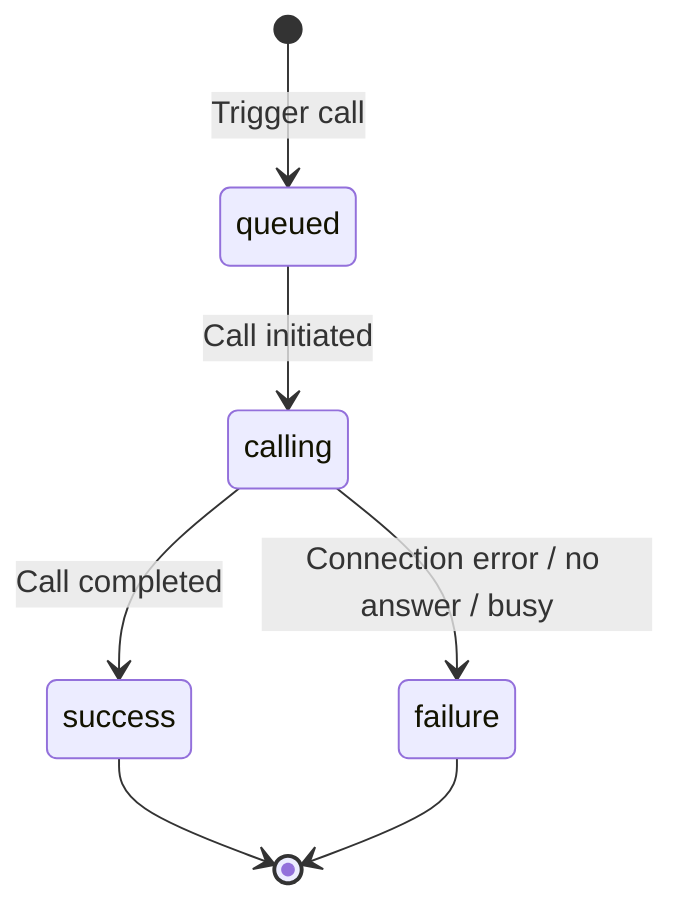

PolyAI supports outbound calling for appointment reminders, follow-ups, and automated notifications.

## Prerequisites

- An active PolyAI project
- Outbound calling enabled (contact your PolyAI representative)
- A phone number configured for outbound calls

<Note>Outbound calling requires configuration by PolyAI. Contact your account manager or PolyAI representative to enable this feature.</Note>

## Outbound calling methods

<CardGroup cols={2}>
  <Card title="Outbound Calling API" icon="code" href="/api-reference/outbound/introduction">
    Programmatically trigger calls via REST API
  </Card>
  <Card title="SIP integration" icon="phone-volume" href="/integrations/voice/sip/custom-sip">
    Route outbound calls through your SIP infrastructure
  </Card>
</CardGroup>

## Using the Outbound Calling API

The [Outbound Calling API](/api-reference/outbound/introduction) lets you programmatically trigger calls and monitor their status:

- **Appointment reminders** - Call customers before scheduled appointments
- **Follow-up calls** - Re-engage customers after specific events
- **Notifications** - Deliver time-sensitive information via voice
- **Campaigns** - Run proactive outreach at scale

### Quick start

1. Obtain your authentication token from your PolyAI representative
2. Use the base URL provided for your project by PolyAI:
   - US: `https://api.us-1.platform.polyai.app`
   - UK: `https://api.uk-1.platform.polyai.app`
   - EUW: `https://api.euw-1.platform.polyai.app`

3. Trigger a call:

```bash
curl -X POST https://api.us-1.platform.polyai.app/v1/outbound-calling/trigger \
  -H "X-PolyAi-Auth-Token: YOUR_AUTH_TOKEN" \
  -H "Content-Type: application/json" \
  -d '{
    "to_number": "+14155551234",
    "metadata": {
      "customer_name": "John",
      "appointment_time": "2:00 PM"
    }
  }'
```

4. Monitor call status using the returned `callSid`:

<Warning>
Call status data is retained for approximately **2 hours** after the call ends. Poll and store status data before it expires if you need it longer.
</Warning>

```bash
curl -X GET "https://api.us-1.platform.polyai.app/v1/outbound-calling/{callSid}/status" \
  -H "X-PolyAi-Auth-Token: YOUR_AUTH_TOKEN"
```

For complete API documentation, see the [Outbound Calling API reference](/api-reference/outbound/introduction).

## SIP-based outbound calling

If your telephony setup uses SIP, you can route outbound calls through your existing infrastructure instead of using the API. This is a good option if you already have a SIP-based contact center and want to keep routing under your control.

SIP-based outbound calling allows:

- Custom SIP header injection for the outbound leg
- Integration with your contact center platform
- Routing through your preferred carrier

When using custom SIP handoffs, you can specify the outbound endpoint in your function:

```python
return {
    "handoff": True,
    "outbound_caller_id": conv.caller_number,
    "outbound_endpoint": "YOUR_OUTBOUND_ENDPOINT_NAME"
}
```

For detailed SIP configuration, see the [Custom SIP integration guide](/integrations/voice/sip/custom-sip).

## Twilio-based outbound calling

<Note>Twilio-based outbound calling requires configuration by PolyAI. Contact your PolyAI representative to set this up for your project.</Note>

If you're integrated with Twilio, outbound calls can be routed through your Twilio account. This leverages your existing Twilio infrastructure and phone numbers.

## Recipient detection

Outbound calls need to determine who — or what — answered before the conversation begins. This is handled by a **custom detection flow** that you build as the first step of your outbound project. It is not an out-of-the-box feature — it requires flow logic designed by your project team.

On the first turn, the agent classifies the recipient into one of several categories. Typical classifications include:

- **Human** — a live person answered; proceed to the greeting and main conversation
- **IVR** — an automated phone system answered; navigate menus via DTMF or hold
- **Voicemail** — a voicemail system answered; leave a message or hang up
- **Number not in service** — the number is disconnected; end the call
- **Operator** — a switchboard operator answered

The exact categories and how the agent decides between them are defined in the detection step's prompt and classification function — they are fully customizable per project.

### How recipient detection works

Detection runs on the first step of the outbound flow. A typical implementation uses:

1. **A classification function** — the step prompt instructs the LLM to evaluate the first thing the recipient says and call a function (e.g. `call_answered_by`) with the detected category. The LLM uses the audio transcript to determine whether the response sounds like a human greeting, an IVR menu, a voicemail recording, or an out-of-service message.

2. **Barge-in enabled** on the detection step — voicemail greetings and IVR prompts do not wait for the agent to finish speaking, so barge-in prevents the agent from talking over them.

3. **Smart VAD disabled** on the detection step — this avoids cutting off long IVR welcome messages before all menu options are read.

4. **A specialized ASR model** — many projects use the `voicemail` ASR model on the detection step to improve transcription accuracy for pre-recorded messages and low-quality TTS voices.

These are configured via [power user settings](/agent-settings/model-use) (experimental JSON). For example:

```json
{
  "asr": {
    "flow_overrides": {
      "detect_answer": {
        "model": "voicemail",
        "provider": "default"
      }
    }
  },
  "barge_in": {
    "flow_overrides": {
      "detect_answer": {
        "is_enabled": false,
        "steps": {
          "Detect Answer": {
            "is_enabled": true
          }
        }
      }
    }
  },
  "smart_vad": {
    "flow_overrides": {
      "detect_answer": {
        "is_enabled": false
      }
    }
  }
}
```

Once the recipient is classified, the agent routes to the appropriate path — for example, entering an IVR traversal flow, leaving a voicemail, or starting the main conversation.

### Voicemail actions

Depending on project requirements, the agent can:

- **Leave a voicemail** — deliver a scripted or dynamic message after the beep
- **Hang up** — end the call immediately if voicemail is not in scope
- **Retry later** — exit with a status code so the calling system can schedule a retry

<Note>
Recipient detection is a project-level flow pattern, not a toggle you can enable in settings. Work with your project team to design the detection step, classification function, and routing logic. See [Call handoffs](/call-handoff/introduction#voicemail-detection) for how voicemail detection differs in inbound scenarios.
</Note>

## IVR traversal

When the agent detects it has reached an IVR, it can navigate the phone menu to reach a human representative or collect information from the IVR itself. IVR traversal is a **custom flow pattern** — you design the navigation logic, DTMF functions, and hold behavior as part of your outbound project.

<Warning>
IVR traversal is not a built-in platform feature. It requires custom flow design specific to your use case. Work with your project team to implement the patterns described here.
</Warning>

### How it works

A typical IVR traversal flow involves three capabilities:

1. **DTMF output** — the agent sends keypad tones to select IVR menu options (e.g. "Press 1 for sales"). This is done via a function that returns the digit on the DTMF channel:

```python
def output_dtmf(conv: Conversation, output: str):
    """
    Output DTMF tones to navigate a phone menu.
    Args:
        output: the string to output in DTMF (e.g. "1", "2", "1234")
    """
    return {
        "utterance": output,
        "utterance_channel": "DTMF"
    }
```

2. **Wait on hold** — after selecting an option, the agent may need to wait on hold for a human to answer. A wait function outputs an empty utterance and transitions to a dedicated "Wait on Hold" step:

```python
def wait_on_hold(conv: Conversation, turn: int):
    """
    Wait on hold when waiting to connect to a human via an IVR.
    Args:
        turn: counter of times you have called the function (no limit)
    """
    return {
        "utterance": "",
        "transition": {
            "goto_flow": "traverse_ivr",
            "goto_step": "Wait on Hold"
        }
    }
```

3. **Escape hatch** — if the agent gets stuck in the wrong branch of the IVR, it should have a way to give up gracefully (e.g. end the call with a retry status code).

### IVR traversal prompt example

The step prompt instructs the LLM how to navigate:

```markdown
## Navigate to human

Using the functions below, navigate to a live representative from the IVR:
- `output_dtmf` to press a number or enter a character sequence
- `wait_on_hold` to wait on hold for a human to answer

If a live representative answers, call `call_answered_by('business_employee')`.

### Rules
- **DO NOT** talk to an IVR unless it explicitly instructs you to say something.
  If the IVR asks you to press a number, use `output_dtmf` only.
- Do not ask follow-up questions or narrate your actions.
- If there is no option for a representative, try saying "Representative".
- If you are stuck, call `end_call('ivr_navigation_fail')` to end the call.
```

### ASR and VAD configuration for IVR

When navigating an IVR, you typically want to:

- **Extend the VAD timeout** — IVR messages can be long; you do not want to cut them off. A `vad_end` of 1600ms or higher is common for IVR traversal steps.
- **Reduce the VAD timeout on hold** — when waiting for a human, you want fast detection once someone picks up. A `vad_end` of 500ms is typical for the "Wait on Hold" step.
- **Use the voicemail ASR model** — IVRs often use low-quality TTS that general ASR models struggle with.

```json
{
  "vad": {
    "flow_overrides": {
      "traverse_ivr": {
        "vad_end": 1600,
        "steps": {
          "Wait on Hold": {
            "vad_end": 500
          }
        }
      }
    }
  }
}
```

### Known challenges

- **Looping IVRs** — some phone trees loop back to the main menu. Include an escape hatch in your flow so the agent can end the call and retry later rather than getting stuck.
- **Speech vs. DTMF confusion** — some IVRs accept speech ("say 'agent'") while others only accept keypresses. You may need helper functions that determine the correct output channel per menu option.
- **Long hold times** — the agent needs a silence prompt that keeps it waiting rather than speaking. Configure `max_silence_count` to a high value (e.g. 1000) to prevent the agent from timing out on hold.

For DTMF configuration details, see [DTMF](/flows/dtmf).

## Best practices

- **Validate phone numbers** - Use E.164 format (e.g., `+14155551234`)
- **Respect time zones** - Schedule calls during appropriate hours for the recipient
- **Handle failures** - Implement retry logic with exponential backoff
- **Pass context via metadata** - Include customer information to personalize conversations
- **Monitor outcomes** - Track delivery status for optimization

## Call status tracking

When using the API, you can track call progress through these statuses:

| Status | Description |
| ------ | ----------- |
| `queued` | Call has been queued for processing |
| `calling` | Call is being placed to the destination |
| `success` | Call completed successfully |
| `failure` | Call failed to connect or was not answered |



## Next steps

<CardGroup cols={2}>
  <Card title="API reference" icon="book" href="/api-reference/outbound/introduction">
    Complete API documentation
  </Card>
  <Card title="Trigger a call" icon="play" href="/api-reference/outbound/endpoint/trigger-call">
    API endpoint to initiate calls
  </Card>
  <Card title="Check call status" icon="magnifying-glass" href="/api-reference/outbound/endpoint/get-call-status">
    Monitor call progress
  </Card>
  <Card title="SIP integration" icon="network-wired" href="/integrations/voice/sip/custom-sip">
    Configure SIP-based calling
  </Card>
</CardGroup>
