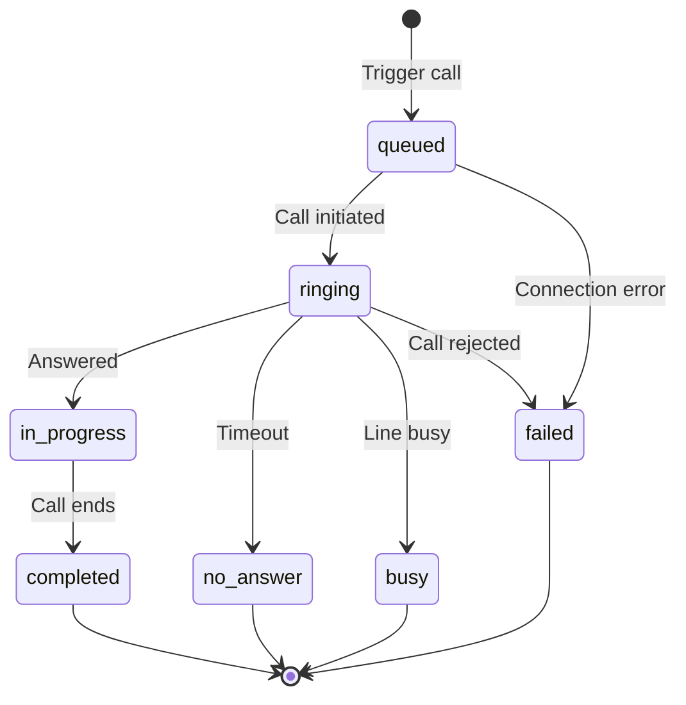

PolyAI supports outbound calling for appointment reminders, follow-ups, and automated notifications.

## Prerequisites

- An active PolyAI project
- Outbound calling enabled (contact your PolyAI representative)
- A phone number configured for outbound calls

<Note>Outbound calling requires configuration by PolyAI. Contact your account manager or [support@poly.ai](mailto:support@poly.ai) to enable this feature.</Note>

## Outbound calling methods

<CardGroup cols={2}>
  <Card title="Outbound Calling API" icon="code" href="/api-reference/outbound/introduction">
    Start calls automatically using the API
  </Card>
  <Card title="SIP integration" icon="phone-volume" href="/integrations/voice/sip/custom-sip">
    Route outbound calls through your SIP infrastructure
  </Card>
</CardGroup>

## Using the Outbound Calling API

The [Outbound Calling API](/api-reference/outbound/introduction) lets you programmatically trigger calls and monitor their status:

- **Appointment reminders** - Call customers before scheduled appointments
- **Follow-up calls** - Re-engage customers after specific events
- **Notifications** - Deliver time-sensitive information via voice
- **Campaigns** - Run proactive outreach at scale

### Quick start

1. Obtain your connector authentication token from your PolyAI representative
2. Use the regional API endpoint matching your deployment:
   - US: `https://api.us-1.platform.polyai.app`
   - UK: `https://api.uk-1.platform.polyai.app`
   - EUW: `https://api.euw-1.platform.polyai.app`

3. Trigger a call:

```bash
curl -X POST https://api.us-1.platform.polyai.app/api/v1/{account_id}/{project_id}/outbound-call/trigger \
  -H "X-CONNECTOR-ID: YOUR_CONNECTOR_ID" \
  -H "Content-Type: application/json" \
  -d '{
    "phone_number": "+14155551234",
    "metadata": {
      "customer_name": "John",
      "appointment_time": "2:00 PM"
    }
  }'
```

4. Monitor call status using the returned `conversation_id`:

<Warning>
Call status data is retained for approximately **2 hours** after the call ends. Poll and store status data before it expires if you need it longer.
</Warning>

```bash
curl -X GET "https://api.us-1.platform.polyai.app/api/v1/{account_id}/{project_id}/outbound-call/status/{conversation_id}" \
  -H "X-CONNECTOR-ID: YOUR_CONNECTOR_ID"
```

For complete API documentation, see the [Outbound Calling API reference](/api-reference/outbound/introduction).

## SIP-based outbound calling

If you're using a SIP integration, you can configure outbound calls through your existing telephony infrastructure. This method allows:

- Custom routing information added to outgoing calls
- Integration with your contact center platform
- Routing through your preferred carrier

When using custom SIP handoffs, you can specify the outbound endpoint in your function:

```python
return {
    "handoff": True,
    "outbound_caller_id": conv.caller_number,
    "outbound_endpoint": "YOUR_OUTBOUND_ENDPOINT_NAME"
}
```

For detailed SIP configuration, see the [Custom SIP integration guide](/integrations/voice/sip/custom-sip).

## Twilio-based outbound calling

If you're integrated with Twilio, outbound calls can be routed through your Twilio account. This leverages your existing Twilio infrastructure and phone numbers.

Contact your PolyAI representative to configure Twilio-based outbound calling for your project.

## Best practices

- **Validate phone numbers** - Use international format with country code (e.g., `+14155551234`)
- **Respect time zones** - Schedule calls during appropriate hours for the recipient
- **Handle failures** - Set up automatic retries with increasing wait times between attempts
- **Include customer details using metadata** - Include customer information to personalize conversations
- **Monitor outcomes** - Track delivery status for optimization

## Call status tracking

When using the API, you can track call progress through these statuses:

| Status | Description |
| ------ | ----------- |
| `queued` | Call queued for processing |
| `ringing` | Call is ringing |
| `in-progress` | Call is active |
| `completed` | Call ended successfully |
| `failed` | Call failed to connect |
| `no-answer` | Call was not answered |
| `busy` | Destination was busy |



## Next steps

<CardGroup cols={2}>
  <Card title="API reference" icon="book" href="/api-reference/outbound/introduction">
    Complete API documentation
  </Card>
  <Card title="Trigger a call" icon="play" href="/api-reference/outbound/endpoint/trigger-call">
    API endpoint to initiate calls
  </Card>
  <Card title="Check call status" icon="magnifying-glass" href="/api-reference/outbound/endpoint/get-call-status">
    Monitor call progress
  </Card>
  <Card title="SIP integration" icon="network-wired" href="/integrations/voice/sip/custom-sip">
    Configure SIP-based calling
  </Card>
</CardGroup>
