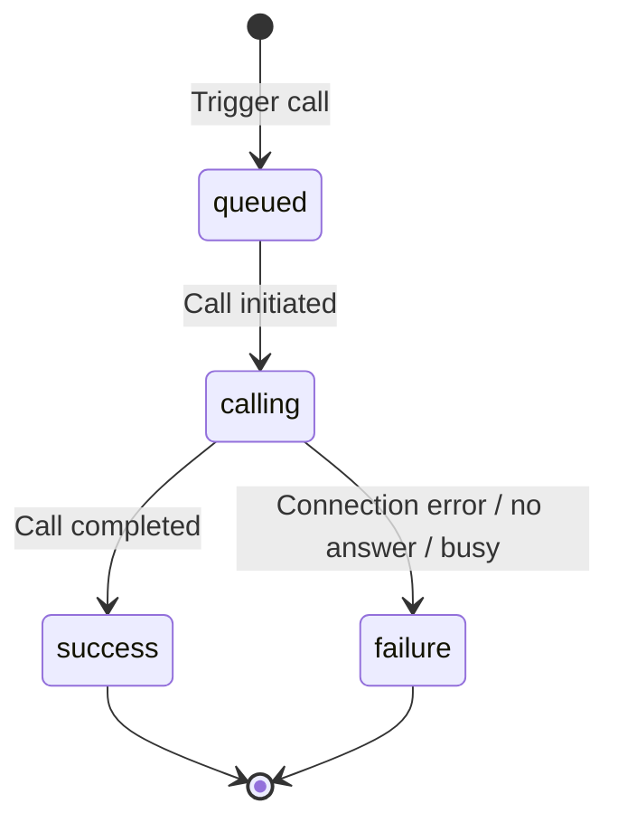

PolyAI supports outbound calling for appointment reminders, follow-ups, and automated notifications.

## Prerequisites

- An active PolyAI project
- Outbound calling enabled (contact your PolyAI representative)
- A phone number configured for outbound calls

**Outbound calling requires configuration by PolyAI.** Contact your account manager or PolyAI representative to enable this feature.

## Outbound calling methods

<CardGroup cols={2}>
  <Card title="Outbound Calling API" icon="code" href="/api-reference/outbound/introduction">
    Programmatically trigger calls via REST API
  </Card>
  <Card title="SIP integration" icon="phone-volume" href="/integrations/voice/sip/custom-sip">
    Route outbound calls through your SIP infrastructure
  </Card>
</CardGroup>

## Using the Outbound Calling API

The [Outbound Calling API](/api-reference/outbound/introduction) lets you programmatically trigger calls and monitor their status:

- **Appointment reminders** - Call customers before scheduled appointments
- **Follow-up calls** - Re-engage customers after specific events
- **Notifications** - Deliver time-sensitive information via voice
- **Campaigns** - Run proactive outreach at scale

### Quick start

1. Obtain your authentication token from your PolyAI representative
2. Use the base URL provided for your project by PolyAI:
   - US: `https://api.us-1.platform.polyai.app`
   - UK: `https://api.uk-1.platform.polyai.app`
   - EUW: `https://api.euw-1.platform.polyai.app`

3. Trigger a call:

```bash
curl -X POST https://api.us-1.platform.polyai.app/v1/outbound-calling/trigger \
  -H "X-PolyAi-Auth-Token: YOUR_AUTH_TOKEN" \
  -H "Content-Type: application/json" \
  -d '{
    "to_number": "+14155551234",
    "metadata": {
      "customer_name": "John",
      "appointment_time": "2:00 PM"
    }
  }'
```

4. Monitor call status using the returned `callSid`:

<Warning>
Call status data is retained for approximately **2 hours** after the call ends. Poll and store status data before it expires if you need it longer.
</Warning>

```bash
curl -X GET "https://api.us-1.platform.polyai.app/v1/outbound-calling/{callSid}/status" \
  -H "X-PolyAi-Auth-Token: YOUR_AUTH_TOKEN"
```

For complete API documentation, see the [Outbound Calling API reference](/api-reference/outbound/introduction).

## SIP-based outbound calling

If your telephony setup uses SIP, you can route outbound calls through your existing infrastructure instead of using the API. This is a good option if you already have a SIP-based contact center and want to keep routing under your control.

SIP-based outbound calling allows:

- Custom SIP header injection for the outbound leg
- Integration with your contact center platform
- Routing through your preferred carrier

When using custom SIP handoffs, you can specify the outbound endpoint in your function:

```python
return {
    "handoff": True,
    "outbound_caller_id": conv.caller_number,
    "outbound_endpoint": "YOUR_OUTBOUND_ENDPOINT_NAME"
}
```

For detailed SIP configuration, see the [Custom SIP integration guide](/integrations/voice/sip/custom-sip).

## Twilio-based outbound calling

**Twilio-based outbound calling requires configuration by PolyAI.** Contact your PolyAI representative to set this up for your project.

If you're integrated with Twilio, outbound calls can be routed through your Twilio account. This uses your existing Twilio infrastructure and phone numbers.

## Recipient detection

Outbound calls need to determine who – or what – answered before the conversation begins. This is handled by a **custom detection flow** that you build as the first step of your outbound project. It is not an out-of-the-box feature – it requires flow logic designed by your project team.

On the first turn, the agent classifies the recipient into one of several categories. Typical classifications include:

- **Human** – a live person answered; proceed to the greeting and main conversation
- **IVR** – an automated phone system answered; navigate menus via DTMF or hold
- **Voicemail** – a voicemail system answered; leave a message or hang up
- **Number not in service** – the number is disconnected; end the call
- **Operator** – a switchboard operator answered

The exact categories and how the agent decides between them are defined in the detection step's prompt and classification function – they are fully customizable per project.

### How recipient detection works

Detection runs on the first step of the outbound flow. A typical implementation involves:

1. **A classification function** – the step prompt instructs the agent to evaluate what the recipient says on the first turn and classify it (e.g. human greeting, IVR menu, voicemail recording, or out-of-service message). The agent calls a function with the detected category, which routes to the appropriate path.

2. **Barge-in enabled** on the detection step – voicemail greetings and IVR prompts do not wait for the agent to finish speaking, so barge-in prevents the agent from talking over them.

3. **Speech recognition tuning** – detection steps often use specialized ASR settings to improve transcription accuracy for pre-recorded messages and low-quality automated voices. Your PolyAI team can configure these settings for your project.

Once the recipient is classified, the agent routes to the appropriate path – for example, entering an IVR traversal flow, leaving a voicemail, or starting the main conversation.

### Voicemail actions

Depending on project requirements, the agent can:

- **Leave a voicemail** – deliver a scripted or dynamic message after the beep
- **Hang up** – end the call immediately if voicemail is not in scope
- **Retry later** – exit with a status code so the calling system can schedule a retry

Recipient detection is a project-level flow pattern, not a toggle you can enable in settings. Work with your project team to design the detection step, classification function, and routing logic. See [Call handoffs](/call-handoff/introduction#voicemail-detection) for how voicemail detection differs in inbound scenarios.

## IVR traversal

When the agent detects it has reached an IVR, it can navigate the phone menu to reach a human representative or collect information from the IVR itself (e.g. hours of operation from a pre-recorded message).

**IVR traversal is not a built-in platform feature.** It requires custom flow design specific to your use case. Work with your PolyAI team to implement IVR navigation for your project.

### How it works

A typical IVR traversal flow uses three capabilities:

- **DTMF output** – the agent sends keypad tones to select IVR menu options (e.g. "Press 1 for sales"). See [DTMF](/flows/dtmf) for configuration details.
- **Wait on hold** – after selecting an option, the agent waits for a human to answer. The flow includes a dedicated hold step where the agent stays silent until someone picks up.
- **Escape hatch** – if the agent gets stuck in the wrong branch of the IVR, it ends the call gracefully so the system can retry later.

The agent transcribes the IVR menu, determines which option to select, and sends the appropriate DTMF tone or spoken response. If the IVR transfers to a hold queue, the agent waits silently until a human answers.

### Design considerations

- **Looping IVRs** – some phone trees loop back to the main menu. Always include an escape path so the agent can end the call and retry rather than getting stuck in a loop.
- **Speech vs. DTMF** – some IVRs accept spoken commands ("say 'agent'") while others only accept keypresses. Your flow may need to handle both output channels depending on the menu instructions.
- **Long hold times** – the agent must stay silent while on hold and respond quickly when a human picks up. Your PolyAI team can tune speech recognition and silence settings for hold scenarios.
- **Low-quality audio** – IVRs often use automated voices that are harder to transcribe. Specialized speech recognition settings can improve accuracy on these steps.

## Best practices

- **Validate phone numbers** - Use E.164 format (e.g., `+14155551234`)
- **Respect time zones** - Schedule calls during appropriate hours for the recipient
- **Handle failures** - Implement retry logic with exponential backoff
- **Pass context via metadata** - Include customer information to personalize conversations
- **Monitor outcomes** - Track delivery status for optimization

## Call status tracking

When using the API, you can track call progress through these statuses:

| Status | Description |
| ------ | ----------- |
| `queued` | Call has been queued for processing |
| `calling` | Call is being placed to the destination |
| `success` | Call completed successfully |
| `failure` | Call failed to connect or was not answered |



## Related pages

<CardGroup cols={2}>
  <Card title="API reference" icon="book" href="/api-reference/outbound/introduction">
    Complete API documentation and examples
  </Card>
  <Card title="Trigger a call" icon="play" href="/api-reference/outbound/endpoint/trigger-call">
    API endpoint to initiate calls
  </Card>
  <Card title="Check call status" icon="magnifying-glass" href="/api-reference/outbound/endpoint/get-call-status">
    Monitor call progress and retrieve results
  </Card>
  <Card title="SIP integration" icon="network-wired" href="/integrations/voice/sip/custom-sip">
    Configure SIP-based calling through your infrastructure
  </Card>
</CardGroup>
